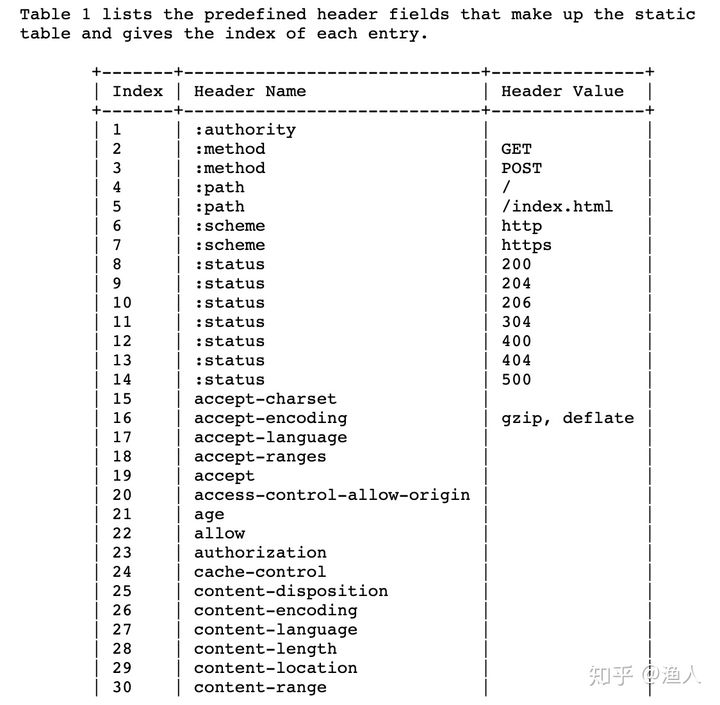

## Protobuf3 语法指南

https://colobu.com/2017/03/16/Protobuf3-language-guide/


## gRPC
准确来说gRPC设计上是分层的，底层支持不同的协议，目前gRPC支持：
- gRPC over HTTP2: 大多数情况.
- gRPC web

gGRPC把元数据放到HTTP/2 Headers里，请求参数序列化之后放到 DATA frame里。


### gRPC开发 概述

gRPC开发分三步：
1. 编写`.proto`文件，生成指定语言源代码。

    服务接口定义:
      - 消息类型: 是服务端和客户端数据交换的数据结构.
        - 字段
          - 类型
          - 索引值: 在同一个消息定义中, 不能为两个字段设置相同的索引值.
      - 服务类型: 是暴露给客户端的远程方法集合.
        - 方法
          - 类型
          - 输入参数
          - 输出参数

    生成代码:
    ```
    $ protoc --go_out=. --go_opt=paths=source_relative \
    --go-grpc_out=. --go-grpc_opt=paths=source_relative \
    helloworld/helloworld.proto

    ```
2. 编写服务端骨架(skelon)代码
3. 编写客户端存根(stub)代码

### gRPC 与分布式系统

https://zhuanlan.zhihu.com/p/344914169

### grpc 服务四种通信模式
1. Unary RPC: 一元 rpc, 类似于 请求-响应 模型
2. Server streaming RPC: 服务端 流
    ```
    stream.SetHeader()
    stream.SendHeader()
    
    stream.SetTrailer()

    stream.SendMsg()
    stream.SendAndClose()
    
    stream.RecvMsg()
    stream.Recv()
    stream.Context()
    
    ```
3. Client streaming RPC: 客户端 流
    ```

    stream.CloseSend()
    stream.CloseAndRecv()

    stream.Context()

    stream.Header()
    stream.RecvMsg()

    stream.Trailer()

    stream.Send()
    stream.SendMsg()

    ```

4. Bidirectional streaming RPC: 双向流

流式 RPC 是在客户端和服务器两端以一种类似的方式实现的。

### grpc metadata 注入
- https://github.com/grpc/grpc-go/blob/master/Documentation/grpc-metadata.md
- https://help.aliyun.com/document_detail/187131.html?spm=a2c4g.11186623.6.657.52d161a2OlTb42
- https://help.aliyun.com/document_detail/187135.html?spm=a2c4g.11186623.6.661.48ce47efIyO7Vo
- https://blog.csdn.net/hjxzb/article/details/88980186
- https://github.com/grpc/grpc-go/blob/master/examples/features/metadata/client/main.go
- https://github.com/grpc/grpc-go/blob/master/examples/features/metadata/server/main.go
- https://stackoverflow.com/questions/42116642/how-to-read-metadata-in-grpc-on-the-server-side-golang-example

### grpc tcpdump 和 wireshark 抓包
参考: https://grpc.io/blog/wireshark/

1. 抓包
    ```
    $ tcpdump -i lo0 host 127.0.0.1 and tcp port 10000 -w route.pcap
    ```
2. 使用 wireshark 打开抓取的包, 并配置分析 grpc 协议
    - 打开 抓取的 tcp 包
    - 配置 proto buffer 加载路径: peferences --> protocol --> protoBuffer --> ProtoBuf search path , 选在 protobuf 所在路径, 并选中 `load all files`
    - 根据抓包的端口, 选中一个 grpc 的包, 然后, 右键 --> Decode AS --> 选择正确的 端口, 然后再 current 一栏选择 http2 协议, 
    - ok , 可以分析 grpc 抓包数据了.


Stream ID，如果是 client 创建的 stream，ID 就是奇数，如果是 server 创建的，ID 就是偶数。I

用 protobuf 定义的服务接口可以通过 protoc 的代码生成扩展简单地映射成 GRPC ，以下定义了所用的映射：
- 路径 : `/ 服务名 / {方法名}`
- 服务名 : `?( {proto 包名} "." ) {服务名}`
- 消息类型 : `{全路径 proto 消息名}`
- 内容类型 : `"application/grpc+proto"`


为HTTP/2协议定义了两个版本：`h2` 和 `h2c`:
- h2版本的协议是建立在**TLS层**之上的HTTP/2协议，这个标志被用在TLS应用层协议协商（TLS-ALPN）域和任何其它的TLS之上的HTTP/2协议。
- h2c版本是建立在**明文的TCP**之上的HTTP/2协议，这个标志被用在HTTP/1.1的升级协议头域和其它任何直接在TCP层之上的HTTP/2协议。

链接行为:
- `Magic`: 帧的主要作用是建立 HTTP/2 请求的前言。在 HTTP/2 中，要求两端都要发送一个连接前言，作为对所使用协议的最终确认，并确定 HTTP/2 连接的初始设置，客户端和服务端各自发送不同的连接前言
- `SETTINGS`: 主要作用是设置这一个连接的参数，作用域是整个连接而并非单一的流
- `HEADERS`: 主要作用是存储和传播 HTTP 的标头信息。
- `DATA`: 主要作用是装填主体信息，是数据帧。
- `WINDOW_UPDATE`: 管理和流的窗口控制。通常情况下打开一个连接后，服务器和客户端会立即交换 SETTINGS 帧来确定流控制窗口的大小。默认情况下，该大小设置为约 65 KB，但可通过发出一个 WINDOW_UPDATE 帧为流控制设置不同的大小。
- `PING/PONG`: 主要作用是判断当前连接是否仍然可用，也常用于计算往返时间。其实也就是 PING/PONG，大家对此应该很熟。


## HTTP2


- HTTP/1 里的 header 对应 HTTP/2 里的 HEADERS frame
- HTTP/1 里的 payload 对应 HTTP/2 里的 DATA frame

HTTP2 协议优点:
- HTTP/2 是一个公开的标准
- HTTP/2 是一个经过实践检验的标准: 先有实践再有标准
- HTTP/2 天然支持物联网、手机、浏览器
- 基于HTTP/2 多语言客户端实现容易
- HTTP/2支持Stream和流控
    HTTP/2里的Stream还可以设置优先级
- 基于HTTP/2 在Gateway/Proxy很容易支持: 如 nginx/envoy 都支持.
- HTTP/2 安全性有保证: 天然支持 SSL.
- HTTP/2 鉴权成熟
    - 从HTTP/1发展起来的鉴权系统已经很成熟了，可以无缝用在HTTP/2上
    - 可以从前端到后端完全打通的鉴权，不需要做任何转换适配

HTTP2 基本点, 核心为 **头部压缩** 和 **多路复用** :
- HTTP2 未改变HTTP的语义(如GET/POST等)，只是在传输上做了优化
- 引入帧、流的概念，在TCP连接中，可以区分出多个request/response
- 一个域名只会有一个TCP连接，借助帧、流可以实现多路复用，降低资源消耗
- 引入二进制编码，降低header带来的空间占用

### HPACK: HTTP2 头部压缩

1. 静态表: 是协议级别的约定. 将高频使用的Header编成一个静态表，每个header对应一个数组索引，每次只用传这个索引，而不是冗长的文本。

    

2. 动态表: 是基于当前TCP连接进行协商的结果，发送请求时会相互设置好header，让请求方和服务方维护同一份动态表，后续的请求可复用。连接销毁时，动态表也会注销。HPACK支持动态地在表中增加header
    如: 首部 `62   Host: www.baidu.com`, 在请求发起前，通过协议将上面Header添加到表中，则后面的请求都只用发送62即可，不用再发送文本，这又节约了大量空间。(请求方/服务方的表成员会保持同步一致)

### HTTP2 多路复用

H1.1核心的尴尬点在于，在同一个TCP连接中，*没办法*区分response是属于哪个请求，一旦多个请求返回的文本内容混在一起，就天下大乱，所以请求只能一个个串行排队发送。这直接导致了TCP资源的闲置。

HTTP2为了解决这个问题，提出了**流**的概念，每一次请求对应一个流，有一个唯一ID，用来区分不同的请求。

基于流的概念，进一步提出了**帧**，一个请求的数据会被分成多个帧，方便进行数据分割传输，每个帧都唯一属于某一个流ID，将帧按照流ID进行分组，即可分离出不同的请求。

这样同一个TCP连接中就可以同时并发多个请求，不同请求的帧数据可穿插在一起，根据流ID分组即可。这样直接解决了H1.1的核心痛点，通过这种复用TCP连接的方式，不用再同时建多个连接，提升了TCP的利用效率。 这也是多路复用思想的一种落地方式，在很多消息队列协议中也广泛存在，如AMQP，其channel的概念和流如出一辙。

在HTTP2中，**流**是一个逻辑上的概念，实际上就是一个int类型的ID，可顺序自增，只要不冲突即可，每条帧数据都会携带一个流ID，当一串串帧在TCP通道中传输时，通过其流ID，即可区分出不同的请求。

**帧**则有更多较为复杂的作用，HTTP2几乎所有数据交互，都是以帧为单位进行的，包括header、body、约定配置(除了Magic串)，这天然地就需要给帧进行分类，于是协议约定了以下帧类型: 
- `HEADERS` : 帧仅包含 HTTP header信息。
- `DATA` : 帧包含消息的所有或部分请求数据。
- `PRIORITY` : 指定分配给流的优先级。服务方可先处理高优先请求
- `RST_STREAM` : 错误通知, 一个推送承诺遭到拒绝。终止某个流。
- `SETTINGS` : 指定连接配置。(用于配置，流ID为0) [会ACK确认收到]
- `PUSH_PROMISE` : 通知一个将资源推送到客户端的意图。
- `PING` : 检测信号和往返时间。（流ID为0）[会ACK]
- `GOAWAY` : 停止为当前连接生成流的停止通知。
- `WINDOW_UPDATE` : 用于流控制，约定发送窗口大小。
- `CONTINUATION` : 用于继续传送header片段序列。

一次HTTP2的请求有以下过程: 
- 通过一个或多个`SETTINGS`帧约定一些数据（会有ACK机制，确认约定内容）
- 请求方通过`HEADERS`帧将*请求A*header打包发出
- *请求B*可穿插···
- 请求方通过`DATA`帧将*请求A*request数据打包发出
- 服务方通过`HEADERS`帧将*请求A*response header打包发出
- *请求C*可穿插···
- 服务方通过`DATA`帧将*请求A*response数据打包发出


### 深入 HTTP2

在H1.1中，我们知道，它粗暴地先发Header，再发body，每个header通过`\r\n`文本内容来分割，header和body通过`\r\n\r\n`来分割，通过content-length的值读取body，一个请求的内容就成功结束。
```
// 一次请求的返回
200 OK\r\nHeader1:Value1\r\nHeader2:Value2\r\nHeader3:Value3\r\n\r\nI am body
// 网络中实际传输的是上面文本的ascii编码
```


HTTP2 为了降低协议占用，不会使用文本分割，也不会使用文本来表示header。

HTTP2 帧格式: 所有帧都是一个固定的 9 字节头部 (payload 之前) 跟一个指定长度的数据(payload).
```
+-----------------------------------------------+
|                 Length (24)                   |
+---------------+---------------+---------------+
|   Type (8)    |   Flags (8)   |
+-+-------------+---------------+-------------------------------+
|R|                 Stream Identifier (31)                      |
+=+=============================================================+
|                   Frame Payload (0...)                      ...
+---------------------------------------------------------------+
```

- `Length` 代表整个帧的长度，用一个 24 位无符号整数表示。头部的 9 字节**不算在**这个长度里。从payload开始读Length这么多字节，一帧数据也就读完结束。
- `Type` 定义 帧 的类型，用 8 bits 表示。帧类型决定了帧的格式和语义，不同类型有差异
- `Flags` 是为帧类型相关而预留的布尔标识。标识对于不同的帧类型赋予了不同的语义，例如下面会提到的Padding
- `R` 是一个保留的比特位。这个比特的语义没有定义，发送时它必须被设置为 `0x0`, 接收时需要忽略。
- `Stream Identifier` 唯一标示一个流，用 31 位无符号整数表示。客户端建立的 sid 必须为**奇数**，服务端建立的 sid 必须为**偶数**，值 `0x0` 保留给与整个连接相关联的帧 (连接控制消息)，而不是单个流
- `Frame Payload` 是主体内容，由帧类型决定（上面的9个字节都是协议本身的消耗，payload才是请求本身的主要内容）

#### DATA 帧的 payload
```
+---------------+
 |Pad Length? (8)|
 +---------------+-----------------------------------------------+
 |                            Data (*)                         ...
 +---------------------------------------------------------------+
 |                           Padding (*)                       ...
 +---------------------------------------------------------------+
```

- `Pad Length`: 表示此字段的出现时有条件的，当帧的`Flags(8)`的**第三位**为`1`时，才有效，否则会被忽略
- `Data`: 传递的数据，其长度上限等于帧的 payload 长度减去其他出现的字段长度(如果有pad的话)。在gRPC中，Data这部分内容就是用Protobuf将数据编码的结果
- `Padding`: 填充字节，没有具体语义，发送时必须设为 0，作用是混淆报文长度，为安全目的服务

Data帧的`Flags(8)`目前有两个位有意义：
- `END_STREAM`: `bit 0` 设为 `1` 代表当前流的最后一帧，告诉接收方请求数据发送完毕，否则还要继续等下一帧(接收方)
- `PADDED`: `bit 3` 设为 `1` 代表存在 Padding.

#### HEADER 帧 Payload
```
+---------------+
 |Pad Length? (8)|
 +-+-------------+-----------------------------------------------+
 |E|                 Stream Dependency? (31)                     |
 +-+-------------+-----------------------------------------------+
 |  Weight? (8)  |
 +-+-------------+-----------------------------------------------+
 |                   Header Block Fragment (*)                 ...
 +---------------------------------------------------------------+
 |                           Padding (*)                       ...
 +---------------------------------------------------------------+
```

- `Pad Length` : 同DATA帧
- `E` : 一个比特位声明流的依赖性是否是排他的，存在则代表 PRIORITY flag 被设置
- `Stream Dependency` : 指定一个 stream identifier，代表当前流所依赖的流的 id，存在则代表 PRIORITY flag 被设置
- `Weight` : 一个无符号 8 位整数，代表当前流的优先级权重值 (1~256)，存在则代表 PRIORITY flag 被设置
- `Header Block Fragment` : header 块片段，header依次打包排列在里面
- `Padding` : 同DATA帧

HEADERS 帧有以下标识 (flags):
- `END_STREAM` : `bit 0` 设为 `1` 代表当前请求 header 发送完了(可能有CONTINUATION 帧，可以认为是HEADERS的一部分)
- `END_HEADERS` : `bit 2` 设为 `1` 代表 header 块结束
- `PADDED` : `bit 3` 设为 `1` 代表 Pad 被设置，存在 Pad Length 和 Padding
- `PRIORITY` : `bit 5` 设为 `1` 表示存在 Exclusive Flag (E), Stream Dependency, 和 Weight

##### Header Block Fragment 

header可以存在于静态表、动态表中。此时只需要传一个index即可表达对应的header，减少传输内容。 请求传递的header情况有以下几种：

- header 的key、value 在静态表/动态表中，此时只需要传递一个index即可
- header 的key 在静态、动态表中，而value由于多种多样，不在表中(如Host)，此时key可以由index表示，但value需要传递原内容
- header 的key、value完全不在静态、动态表中，key、value都需要传递原内容(字符串)
- 希望将本次传递的header写入动态表中，下次只需要传index 即可
- 不希望本次传递的header写入动态表中

```
+---+---+---+---+---+---+---+---+
| 0 | 1 |           0           |           // 通过头8个bit表示是哪种case
+---+---+-----------------------+
| H |     Key Length (7+)      |
+---+---------------------------+
|  Key String (Length octets)  |
+---+---------------------------+
| H |     Value Length (7+)     |
+---+---------------------------+
| Value String (Length octets)  |
+-------------------------------+
```

- 头8个bit中01000000 表达了两点

    1. header的key不在表中(`000000`)、value也不在(需要传文本内容)
    2. 希望将此header追加到动态表中，供下次使用. `01`开头表示需要追加到表中

- Value Length 代表对应value的长度，借此可读取完整的Value String
- 其余的情况都可以用头8个bit表示[7]
- 多个上面的结构前后拼接在一起，就可以在一个HEADERS帧中表示多个header了
- 第二行H为1表示value用了霍夫曼编码[9]，可以理解为一种文本压缩策略

header的内容包含key的Index，value的长度、value的文本内容，其实可分为两种：
- 数字的表达。 key的Index、key/value文本内容的长度
- 字符串的表达。key的内容(如custom-key)、value的内容(custom-value)

```
编码数据的十六进制表示：
400a 6375 7374 6f6d 2d6b 6579 0d63 7573 | @.custom-key.cus
746f 6d2d 6865 6164 6572                | tom-header

解码过程：

40                               | == Literal indexed ==   （01000000表示要追加到表中）
0a                               |   Literal name (len = 10) （得到key长度）
6375 7374 6f6d 2d6b 6579         | custom-key         
0d                               |   Literal value (len = 13) （得到value长度）
6375 7374 6f6d 2d68 6561 6465 72 | custom-header           （一个key:value 读取完毕）
                                                                      

解码结果可得header：     custom-key:custom-header  
并将其加入动态表，下次直接只传index   
```


