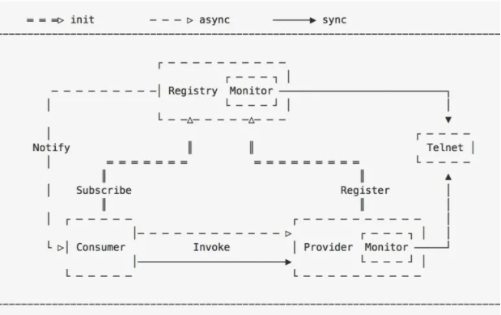
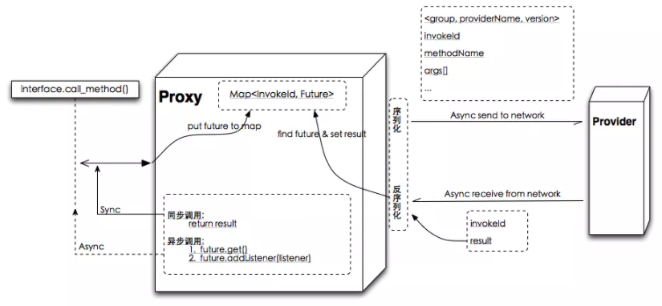
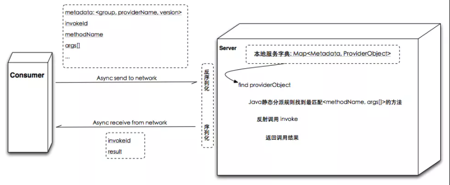
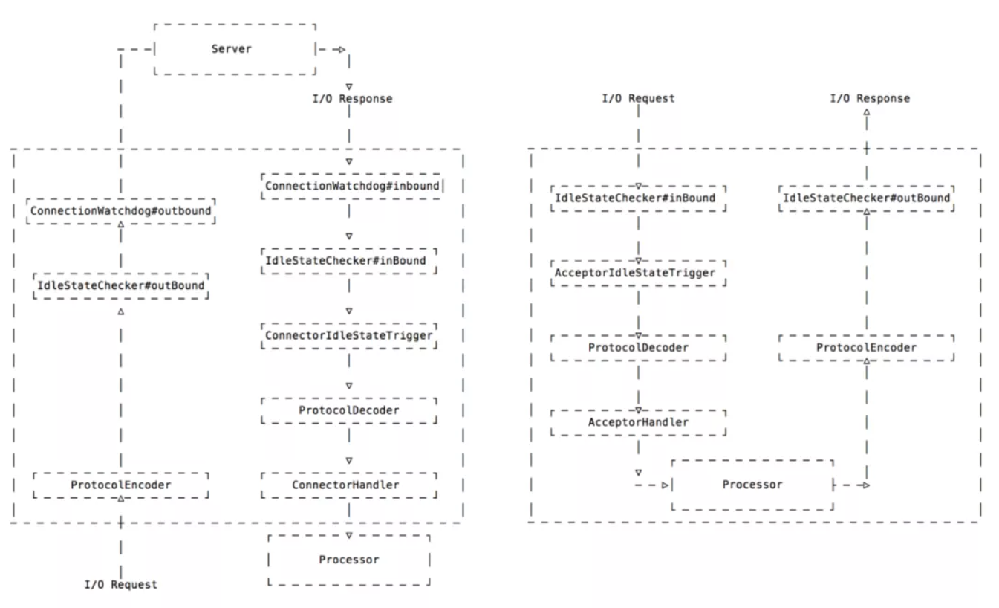
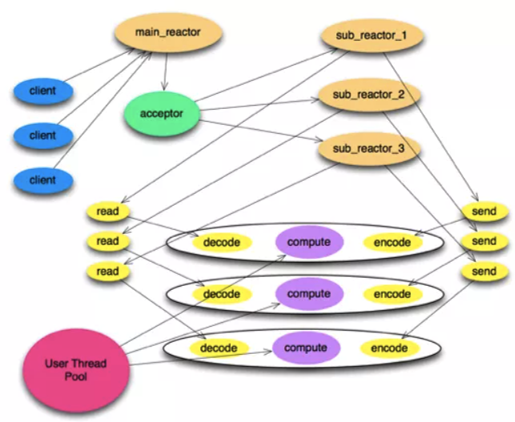
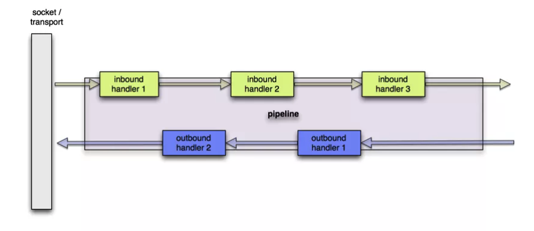
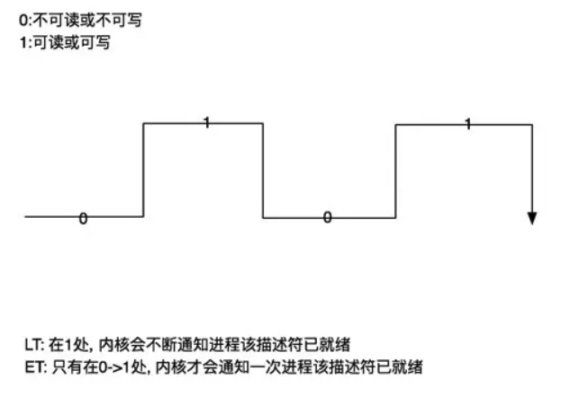
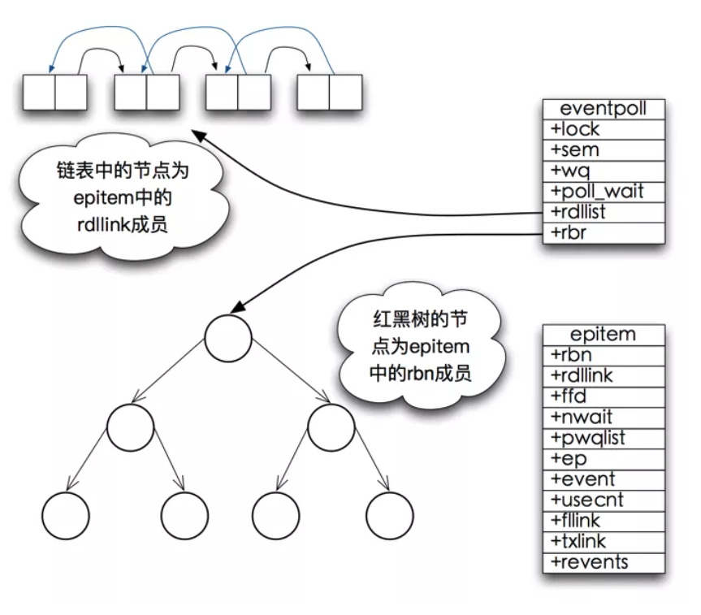

# Netty
Netty 是一个致力于创建高性能网络应用程序的成熟的 IO 框架。业界常见的涉及到网络通信的相关中间件大部分基于 Netty 实现网络层。

## 远程调用流程
- 启动服务端(服务提供者)并发布服务到注册中心。
- 启动客户端(服务消费者)并去注册中心订阅感兴趣的服务。
- 客户端收到注册中心**推送**的服务地址列表。
- 调用者发起调用，`Proxy`从服务地址列表中选择一个地址并将请求信息 `<group，providerName，version>`，`methodName`，`args[]` 等信息序列化为字节数组并通过网络发送到该地址上。
- 服务端收到收到并反序列化请求信息，根据 `<group，providerName，version>` 从本地服务字典里查找到对应`providerObject`，再根据 `<methodName，args[]>` 通过**反射**调用指定方法，并将方法返回值序列化为字节数组返回给客户端。
- 客户端收到响应信息再反序列化为 Java 对象后由 `Proxy` 返回给方法调用者。
- 以上流程对方法调用者是**透明**的，一切看起来就像本地调用一样。

远程调用客户端图解

RPC 三元组 `<ID, Request, Response>`
如果是 Netty4.x 的线程模型,  `IO Thread(worker) --> Map<InvokeId, Future>` 代替全局 Map 能更好的避免线程竞争.

远程调用服务端图解

远程调用传输层图解:

## Netty 的几个重要概念及其关系
1. EventLoop

   - 一个 `Selector`。
   - 一个任务队列(`mpsc_queue`: 多生产者单消费者 `lock-free`)。
   - 一个延迟任务队列(`delay_queue`: 一个二叉堆结构的优先级队列，复杂度为`O(log n)`)。
   - EventLoop 绑定了一个 Thread，这直接避免了pipeline 中的线程竞争。

2. Boss: mainReactor, Worker: subReactor

   - `Boss` 和 `Worker` 共用 `EventLoop` 的代码逻辑
       - Boss 处理 `accept` 事件
       - Worker 处理 `read`，`write` 等事件。
   - `Boss` 监听并 `accept` 连接(`channel`)后以**轮训**的方式将 `channel` 交给 `Worker`，`Worker` 负责处理此 `channel` 后续的`read/write` 等 IO 事件。
   - 在不 bind 多端口的情况下 `BossEventLoopGroup` 中只需要包含一个 EventLoop，也只能用上一个，多了没用。
   - `WorkerEventLoopGroup` 中一般包含多个 `EventLoop`，经验值一般为 `cpu cores * 2`(根据场景测试找出最佳值才是王道)。
   - `Channel` 分两大类 `ServerChannel` 和 `Channel`
        - `ServerChannel` 对应着监听套接字(`ServerSocketChannel`)
        - `Channel` 对应着一个网络连接。

Netty4 Thread Model

ChannelPipeline:

PooledByteBufAllocator:
- 基于 jemalloc paper (3.x)
- ThreadLocal caches for lock free：这个做法导致曾经有坑——申请(Bytebuf)线程与归还(Bytebuf)线程不是同一个导致内存泄漏，后来用一个mpsc_queue解决，代价就是牺牲了一点点性能。
- Different size classes。

Recycler:
- ThreadLocal + Stack。
- 曾经有坑，申请(元素)线程与归还(元素)线程不是同一个导致内存泄漏。
- 后来改进为不同线程归还元素的时候放入一个 WeakOrderQueue 中并关联到 stack 上，下次 pop 时如果 stack 为空则先扫描所有关联到当前 stack 上的 weakOrderQueue。
- WeakOrderQueue 是多个数组的链表，每个数组默认size=16。

Netty Native Transport: 相比 Nio 创建更少的对象, 更小的 GC 压力. 针对 Linux 平台的优化:
  - `SO_REUSEPORT` - 端口复用(允许多个 socket 监听同一个 IP+端口，与 RPS/RFS 协作，可进一步提升性能)：可把 RPS/RFS 模糊的理解为在软件层面模拟多队列网卡，并提供负载均衡能力，避免网卡收包发包的中断集中的一个 CPU core 上而影响性能。
  - `TCP_FASTOPEN` - 3次握手时也用来交换数据。
  - `EDGE_TRIGGERED` (支持Epoll ET是重点)。
  - `Unix` 域套接字(同一台机器上的进程间通信，比如Service Mesh)。

## 多路复用

- select/poll
    1. 本身的实现机制上的限制(采用**轮询**方式检测就绪事件，时间复杂度: `O(n)`，每次还要将臃肿的 `fd_set` 在用户空间和内核空间拷贝来拷贝去)，并发连接越大，性能越差。
    2. `poll` 相比 `select` 没有很大差异，只是*取消了最大文件描述符个数的限制*。
    3. `select/poll` 都是 `LT` 模式。
- epoll
    1. 采用**回调**方式检测就绪事件，时间复杂度: `O(1)`，每次 `epoll_wait` 调用只返回已就绪的文件描述符。
    2. epoll 支持 `LT` 和 `ET` 模式。

LT模式: level-triggered 水平触发.
ET模式: edge-triggered 边沿触发.

可读: buffer 不为空的时候, fd 的 events 中对应的可读状态就会被置为 `1`, 否则为 `0`.
可写: buffer 中有空间科协的时候, fd 的 events 中对应的可写状态就被置为 `1`, 否则为 `0`

epoll 三个方法简介: 代码`linux-2.6.11.12/fs/eventpoll.c`
- `int epoll_create(int size)`
    创建 `rb-tree(红黑树)` 和 `ready-list(就绪链表)`
    - 红黑树`O(logN)`，平衡效率和内存占用，在容量需求不能确定并可能量很大的情况下红黑树是最佳选择
    - `size`参数已经**没什么意义**，早期epoll实现是hash表，所以需要`size`参数。
- `int epoll_ctl(int epfd，int op，int fd，struct epoll_event *event)`
    把`epitem`放入`rb-tree`并向内核中断处理程序注册`ep_poll_callback`，`callback`触发时把该`epitem`放进`ready-list`。
- `int epoll_wait(int epfd，struct epoll_event * events，int maxevents，int timeout)`: `ready-list —> events[]`

    `epoll_wait` 工作流程: 代码 `linux-2.6.11.12/fs/eventpoll.c`
    1. `epoll_wait` 调用 `ep_poll`

        - 当 `rdlist(ready-list)` 为空(无就绪fd)时挂起当前线程,直到 rdlist 不为空时线程才被唤醒。

    2. 文件描述符 fd 的 `events` 状态改变

        - `buffer`由不可读变为可读或由不可写变为可写，导致相应fd上的回调函数`ep_poll_callback`被触发。

    3. `ep_poll_callback` 被触发

        - 将相应`fd`对应`epitem`加入`rdlist`，导致`rdlist`不空，线程被唤醒，`epoll_wait`得以继续执行。

    4. 执行 `ep_events_transfer` 函数

        - 将`rdlist`中的`epitem`拷贝到`txlist`中，并将`rdlist`清空。
        - 如果是`epoll LT`，并且`fd.events`状态没有改变(比如`buffer`中数据没读完并不会改变状态)，会再重新将`epitem`放回`rdlist`。

    5. 执行 `ep_send_events` 函数

        - 扫描`txlist`中的每个`epitem`，调用其关联`fd`对应的`poll`方法取得较新的`events`。
        - 将取得的`events`和相应的`fd`发送到用户空间。

Epoll 数据结构
