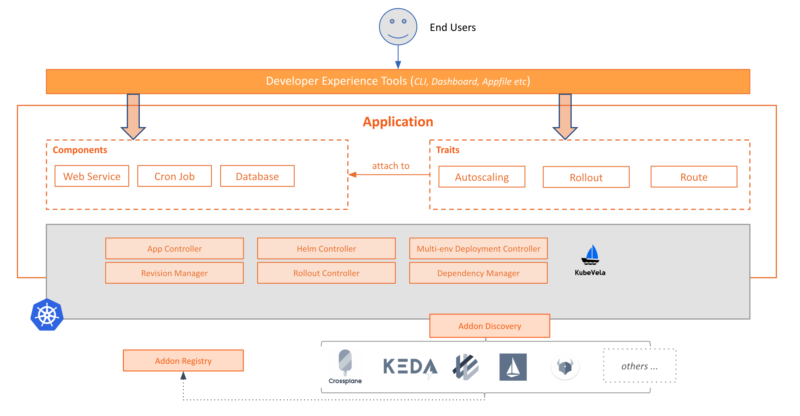
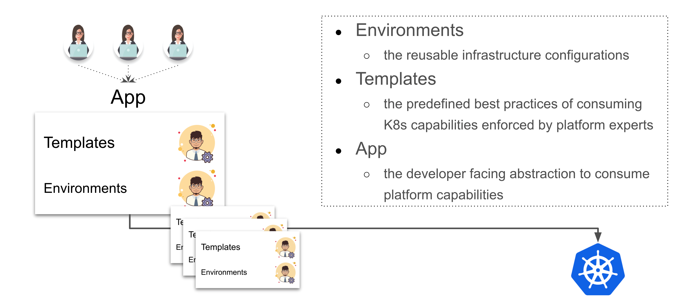

## 核心概念
1. 关注点分离

- Platform team
    defining reusable templates for such as deployment environments and capabilities, and registering those templates into the cluster.

- End users
    choose a deployment environment, model the app with available capability templates, and deploy the app to target environment.


主要概念:
- `Application` : 类似乐高积木, 通过组合 component 和 traits 组成上层应用, 而无需暴露 kubernetes workload 的细节.
  示例:
  ```
  apiVersion: core.oam.dev/v1beta1
  kind: Application
  metadata:
    name: website
  spec:
    components:
      - name: backend
        type: worker
        properties:
          image: busybox
          cmd:
            - sleep
            - '1000'
      - name: frontend
        type: webservice
        properties:
          image: nginx
        traits:
          - type: autoscaler
            properties:
              min: 1
              max: 10
          - type: sidecar
            properties:
              name: "sidecar-test"
              image: "fluentd"
  ```
  - `ComponentDefinition` : 是一个 kubernetes workload 的预定义模板, 包含 模板, 参数, workload 的字段信息 作为声明式 API 资源.

    本质上, Application 主要声明 Component 在 k8s 集群中如何被实例化. 
    - `.type` 字段声明引用的 `ComponentDefinition`.
    - `.properties` 字段声明实例化所需的参数.

    所有 Component 需要预安装到集群中, 或者被其他第三方 provider 提供.

  - `TraitDefinition` : 每个 component 有个可选的 `.traits` 字段, 用来为 workload 增加可操作的资源换, 如 负载均衡策略, ingress, auto-scalling , 升级策略等.

    Traits 是 平台层 提供的可操作特性. 
    在 Component 定义中, `.type` 用来引用 TraitDefinition, `.properties` 用来配置 trait 的可选项.

  - `capability definitions` : 在 kubevela 中, component definitions 和 trait definitions  也被称为 `capability definitions`
- `Environment` : 每个环境有自己独特的定义, 如 domain, Kubernetes cluster and namespace, configuration data, access control policy, etc. 目前, kubevela 只支持 kubernetes namespace 的环境配置, 集群级别的在开发中.





### 几个概念



- `Environments`: 可重用的基础设施配置
- `Templates`: 平台部门 预定义的, 集成最佳实践的 k8s 能力模型模板.
- `App`: 面向开发者的应用抽象.


### crd
```
appdeployments.core.oam.dev
applicationconfigurations.core.oam.dev
applicationcontexts.core.oam.dev
applicationdeployments.core.oam.dev
applicationrevisions.core.oam.dev
applications.core.oam.dev
approllouts.core.oam.dev
componentdefinitions.core.oam.dev
components.core.oam.dev
containerizedworkloads.core.oam.dev
healthscopes.core.oam.dev
manualscalertraits.core.oam.dev
podspecworkloads.standard.oam.dev
scopedefinitions.core.oam.dev
traitdefinitions.core.oam.dev
workloaddefinitions.core.oam.dev
```


## kube-vela 集成 argocd

OAM 模型是 [Kubernetes Resource Model](https://github.com/kubernetes/community/blob/master/contributors/design-proposals/architecture/resource-management.md) 

kubevela 是声明式应用描述，所以原生支持所有 gitops 工具，不需要任何额外的工作。这也是我们建议的使用 kubevela 的方式，具体优势在 cncf 的文章中有介绍。不过文章中用的是 appfile 为例，如果直接使用 app crd的话，任何配置工作都不需要。

汇总:
1. appfile 模式: 需要配置 argocd 的 kubevela 插件.
    参考: https://www.cncf.io/blog/2020/12/22/argocd-kubevela-gitops-with-developer-centric-experience/ 
2. app crd 模式: 无需配置, 原生支持.


## kubevela 应用抽象模式
- CUE
- Helm : 支持纳管 Helm 为 ComponentDefinition
    
    Helm chart 中所有 value 值都可以在 properties 进行定义，同时还可以为 components 绑定已经定义好的 Trait（运维特性），无需修改 Helm chart 本身的 template

    将一个 elasticsearch 的 helm chart 定义为 `ComponentDefinition`:
    ```
    apiVersion: core.oam.dev/v1beta1
    kind: ComponentDefinition
    metadata:
      name: elasticsearch-chart
      annotations:
        definition.oam.dev/description: helm chart for elasticsearch
    spec:
      workload:
        definition:
          apiVersion: apps/v1
          kind: StatefulSet
      schematic:
        helm:
          release:
            chart:
              spec:
                chart: "elasticsearch"
                version: "7.11.1"
          repository:
            url: "https://helm.elastic.co/"

    ```
    定义一个 es + kibana 的应用:
    ```
    apiVersion: core.oam.dev/v1beta1
    kind: Application
    metadata:
      name: elasticsearch
      namespace: default
    spec:
      components:
        - name: elasticsearch-web
          type: elasticsearch-chart
          properties: 
            imageTag: "7.11.1"
            replicas: 1
            volumeClaimTemplate:
              accessModes: [ "ReadWriteOnce" ]
              resources:
                requests:
                  storage: 20Gi
            fullnameOverride: "elasticsearch-web"
        - name: kibana-web
          type: kibana-chart
          properties: 
            fullnameOverride: "kibana-web"
            elasticsearchHosts: "http://elasticsearch-web:9200"
            imageTag: "7.11.1"
          traits:
            - type: ingress
              properties:
                domain: kibana.guoxudong.io
                http:
                  "/": 5610

    ```
- 原生 Kubernetes 资源模板

open-api schema: 在 1.0 版本，所有的抽象定义都会自动生成 Open-API-v3 架构 JSON 格式的表单数据，方便前端进行集成。无论是 CUE、Helm 还是原生 Kubernetes 资源模板，都会已生成一个名为 schema-<your-definition-name> 的 ConfigMap，其中的 key  openapi-v3-json-schema 的值就是 JSON 格式的参数，可以非常方便生成一个前端表单供平台和应用团队使用


## kubevele & terraform 

https://github.com/oam-dev/terraform-controller

## 社区
https://i.cloudnative.to/oam/articles


