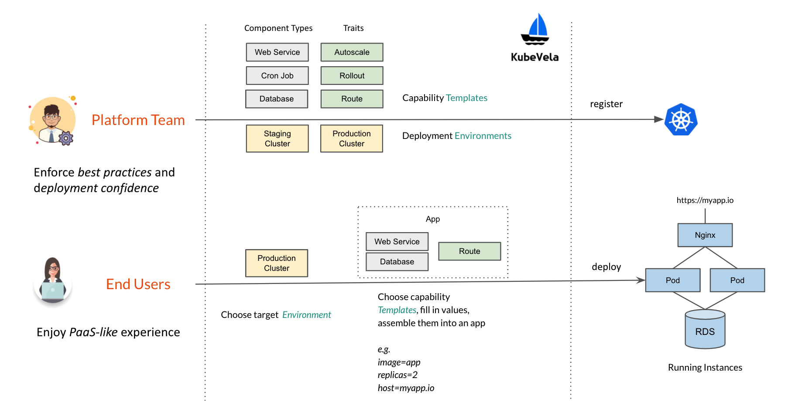
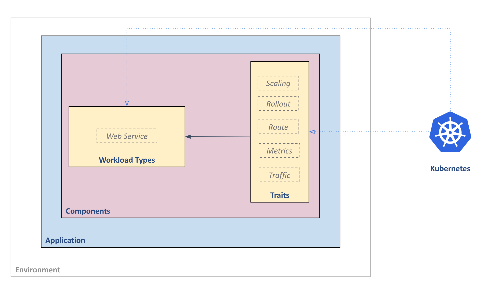
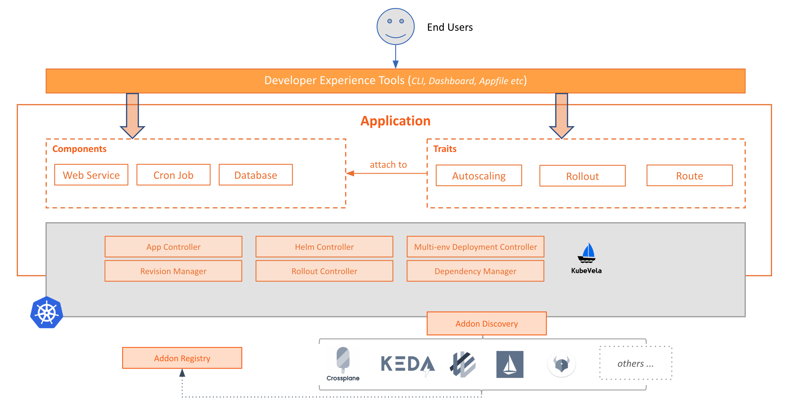
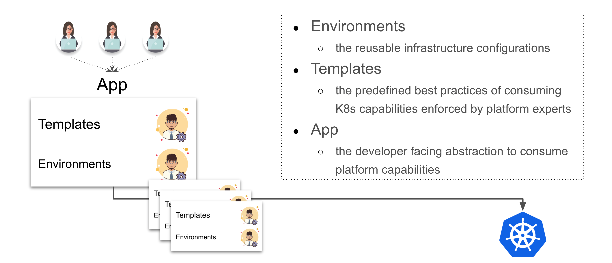

# KubeVela

- 以开发人员为中心: kubevela 引入 `Application` 的概念来抽象基础架构级别的原语, 从而捕获微服务的完整部署, 然后根据应用程序的酗酒构建操作功能.
- 本地扩展: `Application` 有模块化的构建块组成. 这些构建块支持 CUELang 和 Helm 作为模板引擎. 对抽象模板所做的
- 简单而可靠的抽象机制: KubeVela 中的抽象是用 Kubernetes Control Loop 构建的，所以它们永远不会在集群中留下配置漂移。作为 Kubernetes 自定义资源，KubeVela可以与任何 CI/CD 或 GitOps 工具无缝协作，不需要进行集成工作。

## 安装部署
依赖:
- kubernetes > 1.15.0
- ingress-nginx

### 安装 kubevela
```shell
# 通过 helm 安装
$ helm repo add kubevela https://kubevelacharts.oss-cn-hangzhou.aliyuncs.com/core
$ helm repo update
$ helm install --create-namespace -n vela-system kubevela kubevela/vela-core

# (可选) 使用 cert-manager 生成证书, 需要在 kubevela 安装之**前**.
$ helm repo add jetstack https://charts.jetstack.io
$ helm repo update
$ helm install cert-manager jetstack/cert-manager --namespace cert-manager --version v1.2.0 --create-namespace --set installCRDs=true
$ helm install --create-namespace -n vela-system --set admissionWebhooks.certManager.enabled=true kubevela kubevela/vela-core

# (可选) 安装 flux2 : 将 Helm chart 作为 kubevela 的能力.
$ helm install --create-namespace -n flux-system helm-flux http://oam.dev/catalog/helm-flux2-0.1.0.tgz


# 卸载
$ helm uninstall -n vela-system kubevela
$ rm -r ~/.vela
$ kubectl delete crd \
  appdeployments.core.oam.dev \
  applicationconfigurations.core.oam.dev \
  applicationcontexts.core.oam.dev \
  applicationdeployments.core.oam.dev \
  applicationrevisions.core.oam.dev \
  applications.core.oam.dev \
  approllouts.core.oam.dev \
  componentdefinitions.core.oam.dev \
  components.core.oam.dev \
  containerizedworkloads.core.oam.dev \
  healthscopes.core.oam.dev \
  manualscalertraits.core.oam.dev \
  podspecworkloads.standard.oam.dev \
  scopedefinitions.core.oam.dev \
  traitdefinitions.core.oam.dev \
  workloaddefinitions.core.oam.dev
```
升级:

```shell
$ helm repo update

$ kubectl apply -f https://raw.githubusercontent.com/oam-dev/kubevela/master/charts/vela-core/crds/core.oam.dev_componentdefinitions.yaml
$ kubectl apply -f https://raw.githubusercontent.com/oam-dev/kubevela/master/charts/vela-core/crds/core.oam.dev_workloaddefinitions.yaml
$ kubectl apply -f https://raw.githubusercontent.com/oam-dev/kubevela/master/charts/vela-core/crds/core.oam.dev_traitdefinitions.yaml
$ kubectl apply -f https://raw.githubusercontent.com/oam-dev/kubevela/master/charts/vela-core/crds/core.oam.dev_applications.yaml
$ kubectl apply -f https://raw.githubusercontent.com/oam-dev/kubevela/master/charts/vela-core/crds/core.oam.dev_approllouts.yaml
$ kubectl apply -f https://raw.githubusercontent.com/oam-dev/kubevela/master/charts/vela-core/crds/core.oam.dev_applicationrevisions.yaml
$ kubectl apply -f https://raw.githubusercontent.com/oam-dev/kubevela/master/charts/vela-core/crds/core.oam.dev_scopedefinitions.yaml
$ kubectl apply -f https://raw.githubusercontent.com/oam-dev/kubevela/master/charts/vela-core/crds/core.oam.dev_appdeployments.yaml
$ kubectl apply -f https://raw.githubusercontent.com/oam-dev/kubevela/master/charts/vela-core/crds/core.oam.dev_applicationcontexts.yaml

# 如果碰到类似 * is invalid: spec.scope: Invalid value: "Namespaced": filed is immutable问题. 请删除带有错误的 crd 并重新应用 KubeVela crds。
$ kubectl delete crd \
  scopedefinitions.core.oam.dev \
  traitdefinitions.core.oam.dev \
  workloaddefinitions.core.oam.dev

$ helm upgrade --install --create-namespace --namespace vela-system  kubevela kubevela/vela-core --version <the_new_version>

```

快速开始:
```shell
$ kubectl apply -f https://raw.githubusercontent.com/oam-dev/kubevela/master/docs/examples/vela-app.yaml

$ kubectl get application

$ curl -H "Host:testsvc.example.com" http://<your ip address>/


```

## 核心概念
1. 关注点分离

- 平台团队: 通过给部署环境和可重复使用的能力模块编写模板来构建应用, 并将他们注册到集群当中.
- 业务用户: 选择部署环境, 模型和可用模块来组装应用, 并吧应用部署到目标环境中.



主要概念:
- `Application` : 应用（Application），是 KubeVela 的核心 API。它使得业务开发者只需要基于一个单一的制品和一些简单的原语就可以构建完整的应用。

    `Application` 没有固定的 schema。相反，它由构建模块，比如app components（应用组件）和 traits（运维能力）等 构成。这种构建模块允许开发者通过自己定义的抽象来集成平台的能力到此应用定义。

    示例:
    
    ```yaml
    apiVersion: core.oam.dev/v1beta1
    kind: Application
    metadata:
      name: website
    spec:
      components:
        - name: backend
          type: worker
          properties:
            image: busybox
            cmd:
              - sleep
              - '1000'
        - name: frontend
          type: webservice
          properties:
            image: nginx
          traits:
            - type: autoscaler
              properties:
                min: 1
                max: 10
            - type: sidecar
              properties:
                name: "sidecar-test"
                image: "fluentd"
    ```
    
    定义抽象和建模平台能力的构建模块是 `ComponentDefinition` 和 `TraitDefinition`
    - `ComponentDefinition` : 是一个预先定义好的，用于可部署的工作负载的模板.  包含 模板, 参数, workload 的字段信息 作为声明式 API 资源.

        本质上, Application 主要声明 Component 在 k8s 集群中如何被实例化. 
        - `.type` 字段声明引用的 `ComponentDefinition`.
        - `.properties` 字段声明实例化所需的参数.

        所有 Component 需要预安装到集群中, 或者被其他第三方 provider 提供.

    - `TraitDefinition` : 每个 component 有个可选的 `.traits` 字段, 用来为 workload 增加可操作的资源换, 如 负载均衡策略, ingress, auto-scalling , 升级策略等.

        Traits 是 平台层 提供的可操作特性. 
        在 Component 定义中, `.type` 用来引用 TraitDefinition, `.properties` 用来配置 trait 的可选项.

    - `capability definitions` : 在 kubevela 中, component definitions 和 trait definitions  也被称为 `capability definitions`

- `Environment` : 每个环境有自己独特的定义, 如 domain, Kubernetes cluster and namespace, configuration data, access control policy, etc. 目前, kubevela 只支持 kubernetes namespace 的环境配置, 集群级别的在开发中.





### 几个概念



- `Environments`: 可重用的基础设施配置
- `Templates`: 平台部门 预定义的, 集成最佳实践的 k8s 能力模型模板.
- `App`: 面向开发者的应用抽象.


### crd
```text
appdeployments.core.oam.dev
applicationconfigurations.core.oam.dev
applicationcontexts.core.oam.dev
applicationdeployments.core.oam.dev
applicationrevisions.core.oam.dev
applications.core.oam.dev
approllouts.core.oam.dev
componentdefinitions.core.oam.dev
components.core.oam.dev
containerizedworkloads.core.oam.dev
healthscopes.core.oam.dev
manualscalertraits.core.oam.dev
podspecworkloads.standard.oam.dev
scopedefinitions.core.oam.dev
traitdefinitions.core.oam.dev
workloaddefinitions.core.oam.dev
```


# Topic
## kube-vela 集成 argocd

OAM 模型是 [Kubernetes Resource Model](https://github.com/kubernetes/community/blob/master/contributors/design-proposals/architecture/resource-management.md) 

kubevela 是声明式应用描述，所以原生支持所有 gitops 工具，不需要任何额外的工作。这也是我们建议的使用 kubevela 的方式，具体优势在 cncf 的文章中有介绍。不过文章中用的是 appfile 为例，如果直接使用 app crd的话，任何配置工作都不需要。

汇总:
1. appfile 模式: 需要配置 argocd 的 kubevela 插件.
    参考: https://www.cncf.io/blog/2020/12/22/argocd-kubevela-gitops-with-developer-centric-experience/ 
2. app crd 模式: 无需配置, 原生支持.


## kubevela 应用抽象模式
- CUE
- Helm : 支持纳管 Helm 为 ComponentDefinition
    
    Helm chart 中所有 value 值都可以在 properties 进行定义，同时还可以为 components 绑定已经定义好的 Trait（运维特性），无需修改 Helm chart 本身的 template

    将一个 elasticsearch 的 helm chart 定义为 `ComponentDefinition`:

    ```yaml
    apiVersion: core.oam.dev/v1beta1
    kind: ComponentDefinition
    metadata:
      name: elasticsearch-chart
      annotations:
        definition.oam.dev/description: helm chart for elasticsearch
    spec:
      workload:
        definition:
          apiVersion: apps/v1
          kind: StatefulSet
      schematic:
        helm:
          release:
            chart:
              spec:
                chart: "elasticsearch"
                version: "7.11.1"
          repository:
            url: "https://helm.elastic.co/"

    ```
    定义一个 es + kibana 的应用:

    ```yaml
    apiVersion: core.oam.dev/v1beta1
    kind: Application
    metadata:
      name: elasticsearch
      namespace: default
    spec:
      components:
        - name: elasticsearch-web
          type: elasticsearch-chart
          properties: 
            imageTag: "7.11.1"
            replicas: 1
            volumeClaimTemplate:
              accessModes: [ "ReadWriteOnce" ]
              resources:
                requests:
                  storage: 20Gi
            fullnameOverride: "elasticsearch-web"
        - name: kibana-web
          type: kibana-chart
          properties: 
            fullnameOverride: "kibana-web"
            elasticsearchHosts: "http://elasticsearch-web:9200"
            imageTag: "7.11.1"
          traits:
            - type: ingress
              properties:
                domain: kibana.guoxudong.io
                http:
                  "/": 5610

    ```
- 原生 Kubernetes 资源模板

open-api schema: 在 1.0 版本，所有的抽象定义都会自动生成 Open-API-v3 架构 JSON 格式的表单数据，方便前端进行集成。无论是 CUE、Helm 还是原生 Kubernetes 资源模板，都会已生成一个名为 schema-<your-definition-name> 的 ConfigMap，其中的 key  openapi-v3-json-schema 的值就是 JSON 格式的参数，可以非常方便生成一个前端表单供平台和应用团队使用


## kubevele & terraform 

https://github.com/oam-dev/terraform-controller

## 社区
https://i.cloudnative.to/oam/articles


