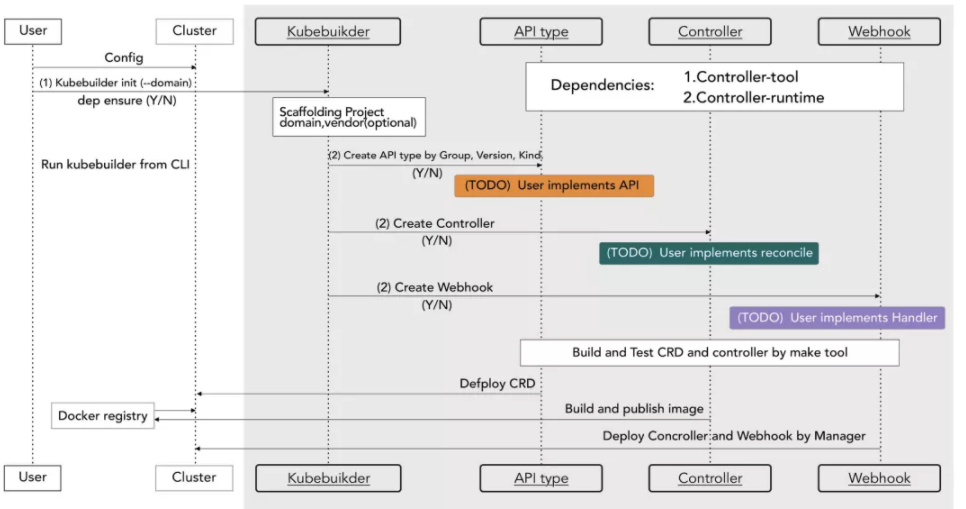

## kubebuilder
快速开始

```
# 初始化新项目
$ kubebuilder init --domain my.domain

# 创建 API
$ kubebuilder create api --group webapp --version v1 --kind Guestbook

# 安装 CRD: kustomize build config/crd | kubectl apply -f -
$ make install

# 运行控制器
$ make run

# 运行自定义资源示例
$ kubectl apply -f config/samples/

# 卸载 CRD
$ make uninstall

# 卸载控制器
$ make undeploy

```
在集群中运行:
```
# 构建并推送你的镜像到 IMG 指定的位置。
$ make docker-build docker-push IMG=<some-registry>/<project-name>:tag

# 根据 IMG 指定的镜像将控制器部署到集群中。
$ make deploy IMG=<some-registry>/<project-name>:tag
```

kubebuilder vs dev from scratch


### 0. 使用 minikube 启动集群
```shell
$ minikube start --kubernetes-version='v1.18.8' --image-repository="registry.cn-hangzhou.aliyuncs.com/google_containers"
```

### 1. 创建基础组件

`kubebuilder init` 生成的主要配置文件:

- `PROJECT`: 用于生成组件的 Kubebuilder 元数据
- `config`: 启动配置。刚初始化时, 它只包含了在集群上启动控制器所需的 Kustomize YAML 定义，但一旦我们开始编写控制器，它还将包含我们的 `CustomResourceDefinitions(CRD)` 、`RBAC` 配置和 `WebhookConfigurations`。
    - `config/default`: 在标准配置中包含 Kustomize base ，它用于启动控制器。
    - `config/manager`: 在集群中以 pod 的形式启动控制器
    - `config/rbac`: 在自己的账户下运行控制器所需的权限
- `main.go`: 
    导入依赖库: 核心的 controller-runtime 库; 控制器运行时日志库 zap.

    每一组控制器都需要一个 `Scheme`，它提供了 Kinds 和相应的 Go 类型之间的映射。
    ```
    var (
        scheme   = runtime.NewScheme()
        setupLog = ctrl.Log.WithName("setup")
    )

    func init() {

        // +kubebuilder:scaffold:scheme
    }
    ```

    - 通过 flag 库解析入参
    - 实例化了一个manager，它记录着我们所有控制器的运行情况，以及设置共享缓存和API服务器的客户端（注意，我们把我们的 Scheme 的信息告诉了 manager）。
    - 运行 manager，它反过来运行我们所有的控制器和 webhooks。manager 状态被设置为 Running，直到它收到一个优雅停机 (graceful shutdown) 信号。这样一来，当我们在 Kubernetes 上运行时，我们就可以优雅地停止 pod。
    ```
    mgr, err := ctrl.NewManager(ctrl.GetConfigOrDie(), ctrl.Options{
        Scheme:             scheme,
        MetricsBindAddress: metricsAddr,
        Port:               9443,
        LeaderElection:     enableLeaderElection,
        LeaderElectionID:   "1736c338.tutorial.kubebuilder.io",
    })
    if err != nil {
        setupLog.Error(err, "unable to start manager")
        os.Exit(1)
    }

    // +kubebuilder:scaffold:builder

    setupLog.Info("starting manager")
    if err := mgr.Start(ctrl.SetupSignalHandler()); err != nil {
        setupLog.Error(err, "problem running manager")
        os.Exit(1)
    }
    ```

### 2. GVK: groups, versions, kinds

GVK = Group + Version + Kind 

GVR = Group + Version + Resources


- `Group/Version`: Kubernetes 中的 API 组简单来说就是相关功能的集合。每个组都有一个或多个版本，顾名思义，它允许我们随着时间的推移改变 API 的职责。
- `kind/resource`: 


### 3. 设计 API
在 Kubernetes 中，对如何设计 API 有一些原则。也就是说，**所有序列化的字段必须是 `驼峰式`**，所以我们使用的 JSON 标签需要遵循该格式。

我们也可以使用`omitempty` 标签来标记一个字段在空的时候应该在序列化的时候省略。

表示数字:
- 整数:
  - `int32`
  - `int64`
- 小数
  - `resource.Quantity`

字段可以使用大多数的基本类型。数字是个**例外**：出于 API 兼容性的目的，我们只允许三种数字类型。对于整数，需要使用 `int32` 和 `int64` 类型；对于小数，使用 `resource.Quantity` 类型。

`resource.Quantity`: Quantity 是十进制数的一种特殊符号，它有一个明确固定的表示方式，使它们在不同的机器上更具可移植性。 你可能在 Kubernetes 中指定资源请求和对 pods 的限制时已经注意到它们。

它们在概念上的工作原理类似于浮点数：它们有一个 significand、基数和指数。它们的序列化和人类可读格式使用整数和后缀来指定值，就像我们描述计算机存储的方式一样。

例如，值 2m 在十进制符号中表示 0.002。 2Ki 在十进制中表示 2048 ，而 2K 在十进制中表示 2000。 如果我们要指定分数，我们就换成一个后缀，让我们使用一个整数：2.5 就是 2500m。

有两个支持的基数：10 和 2（分别称为十进制和二进制）。十进制基数用 “普通的” SI 后缀表示（如 M 和 K ），而二进制基数用 “mebi” 符号表示（如 Mi 和 Ki ）。 对比 megabytes vs mebibytes。

还有一个我们使用的特殊类型：metav1.Time。 它有一个稳定的、可移植的序列化格式的功能，其他与 time.Time 相同。

#### groupversion_info.go && zz_generated.deepcopy.go

`groupversion_info.go` 和 `zz_generated.deepcopy.go` 一般无需处理.

- groupversion_info.go --> 保持原样, 包含了关于 group-version 的一些元数据.
- zz_generated.deepcopy.go --> 自动生成, 包含了前述 `runtime.Object` 接口的自动实现，这些实现标记了代表 Kinds 的所有根类型。
    
    `runtime.Object` 接口的核心是一个深拷贝方法，即 **`DeepCopyObject`**。

    `controller-tools` 中的 object 生成器也能够为每一个根类型以及其子类型生成另外两个易用的方法：`DeepCopy` 和 `DeepCopyInto`。


### 4. 控制器

控制器是 Kubernetes 的核心，也是任何 operator 的**核心**。

控制器的工作是确保对于任何给定的对象，世界的实际状态（包括集群状态，以及潜在的外部状态，如 Kubelet 的运行容器或云提供商的负载均衡器）与对象中的期望状态相匹配。每个控制器专注于一个根 Kind，但可能会与其他 Kind 交互。

我们把这个过程称为 `reconciling`。

在 controller-runtime 中，为特定种类实现 reconciling 的逻辑被称为 `Reconciler`。 Reconciler 接受一个对象的名称，并返回我们是否需要再次尝试（例如在错误或周期性控制器的情况下，如 HorizontalPodAutoscaler）。

Reconcile 实际上是对**单个对象**进行调谐。我们的 Request 只是有一个名字，但我们可以使用 client 从缓存中获取这个对象。

我们返回一个空的结果，没有错误，这就向 controller-runtime 表明我们已经成功地对这个对象进行了调谐，在有一些变化之前不需要再尝试调谐。
```go
func (r *CronJobReconciler) Reconcile(req ctrl.Request) (ctrl.Result, error) {
	_ = context.Background()
	_ = r.Log.WithValues("cronjob", req.NamespacedName)

	// your logic here

	return ctrl.Result{}, nil
}
```

大多数控制器需要一个日志句柄和一个上下文，所以我们在 Reconcile 中将他们初始化:
- 上下文: 是用来允许取消请求的，也或者是实现 tracing 等功能。它是所有 client 方法的第一个参数。`Background` 上下文只是一个基本的上下文，没有任何额外的数据或超时时间限制。
- 日志句柄: controller-runtime 通过一个名为logr的库使用结构化的日志记录。其工作原理是将键值对附加到静态消息中。我们可以在我们的调和方法的顶部预先分配一些对，让这些对附加到这个调和器的所有日志行。

controller-runtime 通过一个名为 logr 日志库使用结构化的记录日志。正如我们稍后将看到的，日志记录的工作原理是将键值对附加到静态消息中。我们可以在我们的 Reconcile 方法的顶部预先分配一些配对信息，将他们加入这个 Reconcile 的所有日志中。

最后, 我们将 Reconcile 添加到 manager 中，这样当 manager 启动时它就会被启动。
```go
func (r *CronJobReconciler) SetupWithManager(mgr ctrl.Manager) error {
    return ctrl.NewControllerManagedBy(
        For(&batchv1.CronJob{}).
        Complete(r)
}
```

### 5. 实现 webhook

## 原理篇

市场上出现了多款开发 Operator 的脚手架，比较常用的有 Operator-SDK 和 Kubebuilder，他们两者其实都是对 `Controller Runtime（Kubernetes SIG 官方封装和抽象的开发 Operator 的公共库）` 的封装，Operator-SDK 是 CoreOS 出品，Kubebuilder 则是 Kubernetes-SIG 官方团队原生打造

Kubebuilder 脚手架生成 Operator 的代码后，开发者只需要在 Reconciler 里面实现自己的控制逻辑，下图中除 Reconciler 外，其它部分的都是 Kubebuilder 自动生成的。生成的代码底层直接依赖 Controller Runtime 这个 Kubernetes SIG 维护的核心库.


### 核心概念

#### 1. GVK & GVR

- `GVK = Group + Version + Kind` 组合而来的，资源**种类**描述术语
    例如 deployment kind 的 GVK 是 `apps/v1/deployments`，用来唯一标识某个种类资源

- `GVR = Group + Version + Resource` 组合而来的，资源**实例**描述术语

    例如某个 deployment 的 name 是 `sample`，那么它的 GVR 则是 `apps/v1/sample`，用来唯一标识某个类型资源的具体对象

Group 是相关 API 功能集合，每个 Group 拥有一个或多个 Version，用于接口的演进, Kind 关联着一个 Package 中定义的 Go Type，比如 apps/v1/deployment 就关联着 Kubernetes 源码里面的 k8s.io/api/apps/v1 package 中的 Deployment 的 struct，自然 GVK 实例化出来的资源对象就是 GVR。

#### 2 CRD & CR
CRD 即 Custom Resource Definition，是 Kubernetes 提供给开发者自定义类型资源的功能，开发者自定义 CRD 然后实现该 CRD 对应的 Operator 来完成对应的控制逻辑，CRD 是通知 Kubernetes 平台存在一种新的资源

CR 则是该 CRD 定义的具体的**实例对象**.

CRD 就是某个类型的 GVK，而 CR 则对应 GVR 表示某个具体资源类型的对象。
```
CRD --> GVK
CR  --> GVR
```

#### 3. Scheme
Scheme 存储了 GVK 对应的 Go Type 的**映射关系**，相反也存储了 Go Type 对应 GVK 的映射关系，也就是说给定 Go Type 就知道他的 GVK，给定 GVK 就知道他的 Go Type.

上图中 Kubebuilder 生成的代码里就自动生成了 Scheme，该Scheme里面存储了Kubernetes 原生资源和自定义的 CRD 的 GVK 和 Go Type的映射关系，例如我们收到 Kubernetes APIServer 的 GVR 的 JSON 数据之后如下：

```json
{
    "kind": "MyJob",
    "apiVersion": "myjob.github.com/v1beta1",
    ...
}
```
根据 JSON 数据里面的 kind 和 apiVersion 字段即获得了 GVK，然后就能根据 GVK 获得 Go Type 来反序列化出对应的 GVR。


#### 4. Manager
`Controller Runtime` 抽象的**最外层管理对象**，负责管理内部的 `Controller`，`Cache`，`Client` 等对象。

##### 4.1 Cache

负责管理 GVK 对应的 `Share Informer`，GVK 和 `Share Informer` 是**一一对应**的，一个 GVK 只会存在对应的一个 `Share Informer`，里面管理的 `Share Informer` 只有 `Controller` Watch 才会创建出 GVK 对应的 `Share Informer`，然后上层所有的 `Controller` 根据 GVK 共享该 `Share Informer`，`Share Informer` 会负责监听对应 GVK 的 GVR 的创建/删除/更新操作，然后通知所有 Watch 该 GVK 的 `Controller`，`Controller` 将对应的资源名称添加到 `Queue` 里面，最终触发开发者的 Reconciler 的调和。

##### 4.2 Client

Reconciler 对资源的创建/删除/更新操作都是通过该对象去操作，里面分为两种 Client：
- `Read Client` 则是对应资源的**读**操作，该操作*不会去访问v Kubernetes APIServer，而是去访问 GVK 对应的 `Share Informer` 对应的**本地缓存**.
- `Write Client` 则是对应资源的**写操作**，该操作则会*直接去访问* Kubernetes APIServer

开发者**无需去选择**使用哪种 Client，而是直接去使用从 `Manager` 对象获取到的 Client 然后使用 Create/Update/Delete 接口去操作对应的 GVR，Client 里面会*自动*帮你完成对应的操作。

##### 4.3 Controller

Controller 对象跟开发者要实现的逻辑 `Reconciler` 是**一一对应**的关系，里面有创建的*带限速功能*的 `Queue`，以及该 Controller 关注 GVK 的 Watcher.

一个 Controller 可以关注很多 GVK，该关注会根据 GVK 到 Cache 里面找到对应的 Share Informer 去 Watch 资源，Watch 到的*事件*会加入到 Queue里面，Queue 最终触发开发者的 Reconciler 的调和。

#### 5. Reconciler
接收 Controller 发送给自己的 GVR 事件，然后从 Cache 中读取出 GVR 的当前状态，经过自己的控制逻辑，通过 Client 向 Kubernetes APIServer 更新 GVR 资源，开发者只需要在 Reconciler 实现自己的控制逻辑，示意图如下:


### 工作流程
我们以 MyJob CRD 这个 Operator 示例来说明整个流程:
- 初始化 `Scheme`，将 Kubernetes 的原生资源以及 MyJob 资源的 GVK 和 Go Type 注册进去
- 初始化 `Manager`，会将上面初始完毕的 `Scheme` 传入进去，`Manager` 内部会初始化 `Cache` 和 `Client`
- 初始化 `Reconciler`，同时将该 `Reconciler` 注册到 `Manager`，同时会在 `Manager` 里面初始化一个 `Controller` 与该 `Reconciler`对应
- `Reconciler` Watch `MyJob` 和 `Pod` 资源
    - Watch MyJob 资源 : `Controller` 会从 `Cache` 里面去获取 `MyJob` 的 `Share Informer`，如果没有则创建，然后对该 `Share Informer` 进行 Watch，将得到的 `MyJob` 的名字和 `Namespace` 扔进 `Queue`
    - Watch Pod 资源 : `Controller` 会从 `Cache` 里面去获取 `Pod` 的 `Share Informer`，如果没有则创建，然后对该 `Share Informer` 进行 Watch，将得到的 `Pod` 资源的 Owner 是 MyJob 的名字和 Namespace 扔进 `Queue`
- 最终 `Controller` 将所有 Watch 的**资源事件**扔到 `Queue`后，`Controller` 会将 `Queue` 里的 `MyJob` 的名字和 `Namespace` 去触发 `Reconciler` 的 `Reconcile 接口进行调和
- 开发者只需要在 `Reconciler` 里面接收到对应 GVR 的**事件**去完成对应的控制逻辑，**上面的步骤则直接由 Kubebuilder 生成的代码自动完成**.

Operator 概念层级图:




## 生成 CRD

### controller-gen

kubebuilder 使用 `controller-gen` 的工具来生成工具代码和 kubernetes YAML 对象, 如 CustomResourceDefinitions.
```
controller-gen ---> 工具代码
               |--> Kubernetes YAML 对象
```
kubebuilder 使用特殊的标记注释`// +` 开头, 表示此处要插入字段, 类型 和 包 相关的信息. 如果是 CRD，那么这些信息通常是从以 `_types.go` 结尾的文件中产生的。

KubeBuilder 提供了提供了一个 `make` 的命令来运行 controller-gen 并生成 CRD：`make manifests`。
当运行 `make manifests` 的时候，在 `config/crd/bases` 目录下可以看到生成的 CRD, 此外还有其他的文件.

KubeBuilder 会制定规则来运行 `controller-gen`。如果 controller-gen 不在 go get 用来下载 Go 模块的路径下的时候，这些规则会自动的安装 controller-gen。

每一个 controller-gen “生成器” 都由 controller-gen 的一个*参数选项*控制，和标签的语法一样。比如，要生成带有 `trivial versions` 的 CRD（无版本转换的 webhook），我们可以执行 `controller-gen crd:trivialVersions=true paths=./api/...`。

controller-gen 也支持不同的输出“规则”，以此来控制如何及输出到哪里。注意 manifests 生成规则（是只生成 CRD 的简短写法）：

```shell
# 生成 CRD 清单
manifests: controller-gen
    $(CONTROLLER_GEN) crd:trivialVersions=true paths="./..." output:crd:artifacts:config=config/crd/bases
```
它使用了 `output:crd:artifacts` 输出规则来表示 CRD 关联的配置（非代码）应该在 `config/crd/bases` 目录下，而不是在 `config/crd` 下。

```
# 查看 controller-gen 的所有支持参数
$ controller-gen -h

# 可以执行以下命令，获取更多详细信息
$ controller-gen -hhh
```

controller-gen 由不同的配置, 两者都可以作为命令行参数:
1. `generators`: 指定生成什么. 每个不同的生成器都是通过 CLI 选项配置的, 一次运行也可以指定多个生成器。
    - `// +webhook on_package`

        generates (partial) {Mutating,Validating}WebhookConfiguration objects.

    - `// +schemapatch on_package`

        patches existing CRDs with new schemata.

        For legacy (v1beta1) single-version CRDs, it will simply replace the global schema. For legacy (v1beta1) multi-version CRDs, and any v1 CRDs, it will replace schemata of existing versions and clear the schema from any versions not specified in the Go code. It will not add new versions, or remove old ones. For legacy multi-version CRDs with identical schemata, it will take care of lifting the per-version schema up to the global schema. It will generate output for each “CRD Version“ (API version of the CRD type itself) , e.g. apiextensions/v1beta1 and apiextensions/v1) available.

        - `manifests=<string>`: contains the CustomResourceDefinition YAML files.
        - `maxDescLen=<int>` opt : specifies the maximum description length for fields in CRD's OpenAPI schema.

            - `0` indicates drop the description for all fields completely. 
            - `n` indicates limit the description to at most n characters and truncate the description to closest sentence boundary if it exceeds n characters.

    - `// +rbac on_package`

        generates ClusterRole objects.

        - `roleName=<string>`: sets the name of the generated ClusterRole.

    - `// +object on_package`

        generates code containing DeepCopy, DeepCopyInto, and DeepCopyObject method implementations.

        - `headerFile=<string>` opt :
            specifies the header text (e.g. license) to prepend to generated files.
        - `year=<string>` opt :
            specifies the year to substitute for " YEAR" in the header file.

    - `// +crd on_package`

        generates CustomResourceDefinition objects.

        - `crdVersions=<string>` opt :

            specifies the target API versions of the CRD type itself to generate. Defaults to v1beta1.

            The first version listed will be assumed to be the “default“ version and will not get a version suffix in the output filename. You‘ll need to use “v1“ to get support for features like defaulting, along with an API server that supports it (Kubernetes 1.16+).
        
        - `maxDescLen=<int>` opt :

            specifies the maximum description length for fields in CRD's OpenAPI schema.

            - `0` indicates drop the description for all fields completely. 
            - `n` indicates limit the description to at most n characters and truncate the description to closest sentence boundary if it exceeds n characters.
        
        - `preserveUnknownFields=<bool>` opt :

            indicates whether or not we should turn off pruning.

            Left unspecified, it‘ll default to true when only a v1beta1 CRD is generated (to preserve compatibility with older versions of this tool), or false otherwise. It‘s required to be false for v1 CRDs.
        
        - `trivialVersions=<bool>` opt :

            indicates that we should produce a single-version CRD.

            Single “trivial-version“ CRDs are compatible with older (pre 1.13) Kubernetes API servers. The storage version‘s schema will be used as the CRD‘s schema. Only works with the v1beta1 CRD version.

2. `输出规则`: 指定如何以及在何处输出结果. 输出规则配置给定生成器如何输出其结果。

    - `fallback` 规则, 指定为 `output:<rule>`:
    - `per-generator` 规则, 指定为`output:<generator>:<rule>`, **默认规则**: 等同于`output:<generator>:artifacts:config=config/<generator> `
    - 为简便起见，每个生成器的输出规则(`output:<generator>:<rule>`)默认省略
    
    全局备用选项:
    - `+output:artifacts on_package`

        outputs artifacts to different locations, depending on whether they're package-associated or not.

        - `code=<string>` opt:
            overrides the directory in which to write new code (defaults to where the existing code lives).
        - `config=<string>`:
            points to the directory to which to write configuration.

    - `+output:dir=<string> on_package`

        outputs each artifact to the given directory, regardless of if it's package-associated or not.

    - `+output:none on_package`

        skips outputting anything.

    - `+output:stdout on_package`

        outputs everything to standard-out, with no separation.

        Generally useful for single-artifact outputs.


3. 其他选项: 

    - `+paths=<[]string> on_package` represents paths and go-style path patterns to use as package roots.

示例:
```
# 生成的 CRD 和 RBAC YAML 文件默认存储在config/crd/bases目录。 RBAC 规则默认输出到(config/rbac)

$ controller-gen paths=./... crd:trivialVersions=true rbac:roleName=controller-perms output:crd:artifacts:config=config/crd/bases
```


### 验证
CRD 支持使用 [OpenAPI v3 schema](https://github.com/OAI/OpenAPI-Specification/blob/master/versions/3.0.0.md#schemaObject) 在 `validation` 段中进行**声明式验证**。

通常，**验证标记**可能会关联到*字段*或者*类型*。

如果你定义了复杂的验证，或者如果你需要重复使用验证，亦或者你需要验证切片元素，那么通常你最好定义一个新的类型来描述你的验证。
```go
type ToySpec struct {
    // +kubebuilder:validation:MaxLength=15
    // +kubebuilder:validation:MinLength=1
    Name string `json:"name,omitempty"`

    // +kubebuilder:validation:MaxItems=500
    // +kubebuilder:validation:MinItems=1
    // +kubebuilder:validation:UniqueItems=true
    Knights []string `json:"knights,omitempty"`

    Alias   Alias   `json:"alias,omitempty"`
    Rank    Rank    `json:"rank"`
}

// +kubebuilder:validation:Enum=Lion;Wolf;Dragon
type Alias string           // 使用新类型来描述验证

// +kubebuilder:validation:Minimum=1
// +kubebuilder:validation:Maximum=3
// +kubebuilder:validation:ExclusiveMaximum=false
type Rank int32
```

### 打印其他信息列

从 Kubernetes 1.11 开始，`kubectl get` 可以询问 Kubernetes 服务要展示哪些列。对于 CRD 来说，可以用 `kubectl get` 来提供展示有用的特定类型的信息，类似于为内置类型提供的信息。

你 CRD 的 `additionalPrinterColumns` 字段 和 `kube-additional-printer-columns` 控制了要展示的信息，它是通过在给 CRD 的 Go 类型上标注 `+kubebuilder:printcolumn` 标签来控制要展示的信息。

```go
// 如下示例, 添加字段来显示 knights，rank 和 alias 字段的信息

// +kubebuilder:printcolumn:name="Alias",type=string,JSONPath=`.spec.alias`
// +kubebuilder:printcolumn:name="Rank",type=integer,JSONPath=`.spec.rank`
// +kubebuilder:printcolumn:name="Bravely Run Away",type=boolean,JSONPath=`.spec.knights[?(@ == "Sir Robin")]`,description="when danger rears its ugly head, he bravely turned his tail and fled",priority=10
// +kubebuilder:printcolumn:name="Age",type="date",JSONPath=".metadata.creationTimestamp"
type Toy struct {
    metav1.TypeMeta   `json:",inline"`
    metav1.ObjectMeta `json:"metadata,omitempty"`

    Spec   ToySpec   `json:"spec,omitempty"`
    Status ToyStatus `json:"status,omitempty"`
}
```

### 子资源

在 Kubernetes 1.13 中 CRD 可以选择实现 `/status` 和 `/scale` 这类[子资源](https://kubernetes.io/docs/tasks/access-kubernetes-api/custom-resources/custom-resource-definitions/#status-subresource)。

通常推荐你在所有资源上实现 `/status` 子资源的时候，要有一个状态字段。

两个子资源都有对应的**标签 crd markers**。

#### 状态

通过 `+kubebuilder:subresource:status` 设置子资源的状态。当时启用状态时，更新主资源**不会**修改它的状态。类似的，更新子资源状态也**只是**修改了状态字段。

```go
// +kubebuilder:subresource:status
type Toy struct {
    metav1.TypeMeta   `json:",inline"`
    metav1.ObjectMeta `json:"metadata,omitempty"`

    Spec   ToySpec   `json:"spec,omitempty"`
    Status ToyStatus `json:"status,omitempty"`
}
```

#### 扩缩容
子资源的伸缩可以通过 `+kubebuilder:subresource:scale` 来启用。启用后，用户可以使用 `kubectl scale` 来对你的资源进行扩容或者缩容。

如果 `selectorpath` 参数被指定为*字符串形式*的**标签选择器**，`HorizontalPodAutoscaler` 将可以自动扩容你的资源。

```go
type CustomSetSpec struct {
    Replicas *int32 `json:"replicas"`
}

type CustomSetStatus struct {
    Replicas int32 `json:"replicas"`
    Selector string `json:"selector"` // this must be the string form of the selector
}


// +kubebuilder:subresource:status
// +kubebuilder:subresource:scale:specpath=.spec.replicas,statuspath=.status.replicas,selectorpath=.status.selector
type CustomSet struct {
    metav1.TypeMeta   `json:",inline"`
    metav1.ObjectMeta `json:"metadata,omitempty"`

    Spec   ToySpec   `json:"spec,omitempty"`
    Status ToyStatus `json:"status,omitempty"`
}
```

### 多版本
Kubernetes 1.13，你可以在你的 CRD 的同一个 `Kind` 中定义多个版本，并且使用一个 `webhook` 对它们进行互转。

默认情况下，KubeBuilder 会*禁止*为你的 CRD 的不同版本产生不同的验证，这都是为了兼容老版本的 Kubernetes。

如果需要，你要通过修改 `makefile` 中的命令：把 `CRD_OPTIONS ?= "crd:trivialVersions=true` 修改为 `CRD_OPTIONS ?= crd`。 这样，你就可以使用 `+kubebuilder:storageversion` 标签 来告知 `GVK` 这个字段应该被 API 服务来存储数据。

## Finalizers

[Finalizers](https://kubernetes.io/docs/tasks/extend-kubernetes/custom-resources/custom-resource-definitions/#finalizers) 允许控制器实现**异步预删除挂钩**。假设你为 API 类型的每个对象创建了一个外部资源（例如存储桶），并且想要从 Kubernetes 中删除对象同时删除关联的外部资源，则可以使用 `finalizers` 来实现。

要注意的**关键点**是 `finalizers` 使对象上的**删除**成为**设置删除时间戳的“更新”**。对象上存在**删除时间戳标记**表明该对象正在被删除。否则，在没有 `finalizers` 的情况下，删除将显示为协调，缓存中缺少该对象(a delete shows up as a reconcile where the object is missing from the cache.)。

注意:
- 如果未删除对象并且*未*注册 `finalizers` ，则添加 `finalizers` 并在 Kubernetes 中更新对象。
- 如果要删除对象，但 `finalizers` 列表中仍存在 `finalizers` ，请执行*预删除逻辑*并移除 `finalizers` 并更新对象。
- 确保预删除逻辑是**幂等**的。

### 如何在控制器的 Reconcile 方法中注册和触发预删除挂钩

导入相关的库:
```go
package controllers

import (
    "context"

    "github.com/go-logr/logr"
    ctrl "sigs.k8s.io/controller-runtime"
    "sigs.k8s.io/controller-runtime/pkg/client"

    batchv1 "tutorial.kubebuilder.io/project/api/v1"
)
```

实现 finalizer 的代码框架:
```go
func (r *CronJobReconciler) Reconcile(req ctrl.Request) (ctrl.Result, error) {
    ctx := context.Background()
    log := r.Log.WithValues("cronjob", req.NamespacedName)

    var cronJob *batchv1.CronJob
    if err := r.Get(ctx, req.NamespacedName, cronJob); err != nil {
        log.Error(err, "unable to fetch CronJob")
        // 在我们删除一个不存在的对象的时，我们会遇到not-found errors这样的报错
        // 我们将暂时忽略，因为不能通过重新加入队列的方式来修复这些错误
        //（我们需要等待新的通知），而且我们可以根据删除的请求来获取它们
        return ctrl.Result{}, client.IgnoreNotFound(err)
    }

    // 自定义 finalizer 的名字
    myFinalizerName := "storage.finalizers.tutorial.kubebuilder.io"

    // 检查 DeletionTimestamp 以确定对象是否在删除中
    if cronJob.ObjectMeta.DeletionTimestamp.IsZero() {
        // 如果当前对象没有 finalizer， 说明其没有处于正被删除的状态。
        // 接着让我们添加 finalizer 并更新对象，相当于注册我们的 finalizer。
        if !containsString(cronJob.ObjectMeta.Finalizers, myFinalizerName) {
            cronJob.ObjectMeta.Finalizers = append(cronJob.ObjectMeta.Finalizers, myFinalizerName)
            if err := r.Update(context.Background(), cronJob); err != nil {
                return ctrl.Result{}, err
            }
        }
    } else {
        // 这个对象将要被删除
        if containsString(cronJob.ObjectMeta.Finalizers, myFinalizerName) {
            // 我们的 finalizer 就在这, 接下来就是处理外部依赖
            if err := r.deleteExternalResources(cronJob); err != nil {
                // 如果无法在此处删除外部依赖项，则返回错误
                // 以便可以重试
                return ctrl.Result{}, err
            }
            // 从列表中删除我们的 finalizer 并进行更新。
            cronJob.ObjectMeta.Finalizers = removeString(cronJob.ObjectMeta.Finalizers, myFinalizerName)
            if err := r.Update(context.Background(), cronJob); err != nil {
                return ctrl.Result{}, err
            }
        }

        // 当它们被删除的时候停止 reconciliation
        return ctrl.Result{}, nil
    }

    // Your reconcile logic

    return ctrl.Result{}, nil
}

func (r *Reconciler) deleteExternalResources(cronJob *batch.CronJob) error {

    // 删除与 cronJob 相关的任何外部资源
    // 确保删除是幂等性操作且可以安全调用同一对象多次。
}

// 辅助函数用于检查并从字符串切片中删除字符串。
func containsString(slice []string, s string) bool {
    for _, item := range slice {
        if item == s {
            return true
        }
    }
    return false
}

func removeString(slice []string, s string) (result []string) {
    for _, item := range slice {
        if item == s {
            continue
        }
        result = append(result, item)
    }
    return
}
```


## Webhook

Webhooks 是一种以**阻塞**方式发送的信息请求。实现 webhooks 的 web 应用程序将在特定事件发生时向其他应用程序发送 HTTP 请求。

在 kubernetes 中，有下面三种 webhook:
- [admission(准入) webhook](https://kubernetes.io/docs/reference/access-authn-authz/extensible-admission-controllers/#admission-webhooks)
- [authorization(授权) webhook](https://kubernetes.io/docs/reference/access-authn-authz/webhook/)
- [CRD conversion(转换) webhook](https://kubernetes.io/docs/tasks/extend-kubernetes/custom-resources/custom-resource-definition-versioning/#webhook-conversion)

在 `controller-runtime` 库中，支持 `admission webhooks` 和 `CRD conversion webhooks`。

Kubernetes 在 1.9 版本中（该特性进入 beta 版时）支持这些动态 admission webhooks。

Kubernetes 在 1.15 版本（该特性进入 beta 版时）支持 conversion webhook。


### admission(准入) webhook

[`admission(准入) webhook`](https://kubernetes.io/docs/reference/access-authn-authz/extensible-admission-controllers/#authenticate-apiservers) 是 HTTP 的回调，它可以接受准入请求，处理它们并且返回准入响应。

默认情况下 apiserver 自己没有对 webhook 进行认证。然而，如果你想认证客户端，你可以配置 apiserver 使用基本授权，持有 token，或者证书对 webhook 进行认证。 

Kubernetes 提供了下面几种类型的准入 webhook：
- `Mutating(变更) Admission Webhook` : 这种类型的 webhook 会在对象创建或是更新且没有存储**前`改变`**操作对象，然后才存储。
    它可以用于资源请求中的默认字段，比如在 Deployment 中没有被用户制定的字段。它可以用于注入 sidecar 容器。
- `Validating(验证) Admission Webhook` : 这种类型的 webhook 会在对象创建或是更新且没有存储**前`验证`**操作对象，然后才存储。
    它可以有比纯基于 schema 验证更加复杂的验证。比如：交叉字段验证和 pod 镜像白名单。

### 核心类型的准入 webhook

为 CRD 构建准入 webhook 非常容易，这在 CronJob 教程中已经介绍过了。由于 kubebuilder 不支持核心类型的 webhook 自动生成，您必须使用 `controller-runtime` 的库来处理它。这里可以参考 `controller-runtime` 的一个 [示例](https://github.com/kubernetes-sigs/controller-runtime/tree/master/examples/builtins)。

#### 1. 使用处理程序实现 [`admission.Handler`](https://pkg.go.dev/sigs.k8s.io/controller-runtime/pkg/webhook/admission?tab=doc#Handler) 接口
```go
type podAnnotator struct {
    Client  client.Client
    decoder *admission.Decoder
}

func (a *podAnnotator) Handle(ctx context.Context, req admission.Request) admission.Response {
    pod := &corev1.Pod{}
    err := a.decoder.Decode(req, pod)
    if err != nil {
        return admission.Errored(http.StatusBadRequest, err)
    }

    //在 pod 中修改字段

    marshaledPod, err := json.Marshal(pod)
    if err != nil {
        return admission.Errored(http.StatusInternalServerError, err)
    }
    return admission.PatchResponseFromRaw(req.Object.Raw, marshaledPod)
}
```

如果需要客户端，只需在*结构构建时*传入客户端。
如果你为你的处理程序添加了 `InjectDecoder` 方法，将会注入一个*解码器*。
```go
func (a *podAnnotator) InjectDecoder(d *admission.Decoder) error {
    a.decoder = d
    return nil
}
```
注意: 为了使得 `controller-gen` 能够为你生成 webhook 配置，你需要添加一些标记。例如， `// +kubebuilder:webhook:path=/mutate-v1-pod,mutating=true,failurePolicy=fail,groups="",resources=pods,verbs=create;update,versions=v1,name=mpod.kb.io`


#### 2. 更新 `main.go`

需要在 webhook 服务端中注册你的处理程序, 并需要确保这里的*路径*与标记中的*路径*相匹配。

```go
mgr.GetWebhookServer().Register("/mutate-v1-pod", &webhook.Admission{Handler: &podAnnotator{Client: mgr.GetClient()}})
```
#### 3. 部署
部署它就像为 CRD 部署 `webhook` 服务端一样。你需要
- 提供服务证书
- 部署服务端

## 用于 配置/代码 生成的标记
Kubebuilder 利用一个叫做`controller-gen`的工具来生成公共的代码和 Kubernetes YAML 文件。 这些代码和配置的生成是由 Go 代码中特殊存在的“标记注释” `// +`来控制的。

标记都是以加号开头的*单行注释*，后面跟着一个*标记名称*，而跟随的关于标记的*特定配置*则是可选的。
```go
// +kubebuilder:validation:Optional
// +kubebuilder:validation:MaxItems=2
// +kubebuilder:printcolumn:JSONPath=".status.replicas",name=Replicas,type=string
```

### 在 KubeBuilder 中生成代码 & 制品(Artifacts)

kubebuilder 项目中有两个 `make` 命令用到了 `controller-gen` :
- `make manifests` 用来生成 Kubernetes 对象的 YAML 文件，像`CustomResourceDefinitions`，`WebhookConfigurations` 和 `RBAC roles`。
- `make generate` 用来生成代码，像`runtime.Object/DeepCopy implementations`。

### 标记语法
准确的语法在 [godocs for controller-tools](https://pkg.go.dev/sigs.k8s.io/controller-tools/pkg/markers?tab=doc) 中有描述.

标记:
- `Empty (+kubebuilder:validation:Optional)`：空标记像命令行中的布尔标记位-- 仅仅是指定他们来开启某些行为。
- `Anonymous (+kubebuilder:validation:MaxItems=2)`：匿名标记使用单个值作为参数。
- `Multi-option (+kubebuilder:printcolumn:JSONPath=".status.replicas",name=Replicas,type=string)`：多选项标记使用一个或多个命名参数。第一个参数与名称之间用冒号`:`隔开，而后面的参数使用逗号`,`隔开。参数的顺序没有关系。有些参数是可选的。

标记的参数可以是字符，整数，布尔，切片，或者 map 类型。 字符，整数，和布尔都应该符合 Go 语法：
```go
// +kubebuilder:validation:ExclusiveMaximum=false
// +kubebuilder:validation:Format="date-time"
// +kubebuilder:validation:Maximum=42
```

**切片**可以用*大括号*和*逗号*分隔来指定。或者，在简单的例子中，用*分号*来隔开。
```
// +kubebuilder:webhooks:Enum={"crackers, Gromit, we forgot the crackers!","not even wensleydale?"}

// +kubebuilder:validation:Enum=Wallace;Gromit;Chicken
```

**Maps** 是用字符类型的键和任意类型的值（有效地`map[string]interface{}`）来指定的。一个 map 是由大括号（`{}`）包围起来的，每一个键和每一个值是用冒号（`:`）隔开的，每一个键值对是由逗号`,`隔开的。
```go
// +kubebuilder:validation:Default={magic: {numero: 42, stringified: forty-two}}
```

`+kububuilder:object:root`: object 生成器这个类型表示一个种类。然后，object 生成器为我们生成 这个所有表示种类的类型一定要实现的runtime.Object接口的实现。

### CRD 生成标记
CRD 生成标记: 描述了如何从一系列 Go 类型和包中构建出一个 CRD。而验证标记则描述了实际验证模式的生成。

- `// +kubebuilder:printcolumn on_type` 增加 `kubectl get` 打印信息

    - `JSONPath=<string>` specifies the jsonpath expression used to extract the value of the column.
    - `description=<string> opt` specifies the help/description for this column.
    - `format=<string> opt` specifies the format of the column.
        It may be any OpenAPI data format corresponding to the type, listed at https://github.com/OAI/OpenAPI-Specification/blob/master/versions/2.0.md#data-types.

    - `name=<string>` specifies the name of the column.
    - `priority=<int> opt` indicates how important it is that this column be displayed. 
        Lower priority (higher numbered) columns will be hidden if the terminal width is too small.
    - `type=<string>` indicates the type of the column.
        It may be any OpenAPI data type listed at https://github.com/OAI/OpenAPI-Specification/blob/master/versions/2.0.md#data-types.

- `// +kubebuilder:resource on_type`: configures naming and scope for a CRD.

    - `categories=<[]string> opt`: specifies which group aliases this resource is part of.
        
        Group aliases are used to work with groups of resources at once. The most common one is “all“ which covers about a third of the base resources in Kubernetes, and is generally used for “user-facing“ resources.

    - `path=<string> opt`: specifies the plural "resource" for this CRD.
        
        It generally corresponds to a plural, lower-cased version of the Kind. See https://book.kubebuilder.io/cronjob-tutorial/gvks.html.

    - `scope=<string> opt` overrides the scope of the CRD (Cluster vs Namespaced).
        
        Scope defaults to “Namespaced“. Cluster-scoped (“Cluster“) resources don‘t exist in namespaces.

    - `shortName=<[]string> opt` specifies aliases for this CRD.
        
        Short names are often used when people have work with your resource over and over again. For instance, “rs“ for “replicaset“ or “crd“ for customresourcedefinition.

    - `singular=<string> opt` overrides the singular form of your resource.
        
        The singular form is otherwise defaulted off the plural (path).

- `// +kubebuilder:skipversion on_type` removes the particular version of the CRD from the CRDs spec.
    
    This is useful if you need to skip generating and listing version entries for ‘internal‘ resource versions, which typically exist if using the Kubernetes upstream conversion-gen tool.

- `// +kubebuilder:storageversion on_type` marks this version as the "storage version" for the CRD for conversion.
    
    When conversion is enabled for a CRD (i.e. it‘s not a trivial-versions/single-version CRD), one version is set as the “storage version“ to be stored in etcd. Attempting to store any other version will result in conversion to the storage version via a conversion webhook.

- `// +kubebuilder:subresource:scale on_type`enables the `/scale` subresource on a CRD.
    - `selectorpath=<string> opt`: specifies the jsonpath to the pod label selector field for the scale's status.
    - `specpath=<string>`: specifies the jsonpath to the replicas field for the scale's spec.
    - `statuspath=<string>`: specifies the jsonpath to the replicas field for the scale's status.
- `// +kubebuilder:subresource:status on_type` enables the `/status` subresource on a CRD.
versionName

- `// +groupName=<string>  on_package`: specifies the API group name for this package.

- `// +kubebuilder:skip  on_package`: don't consider this package as an API version.

- `// +versionName=<string> on_package`: overrides the API group version for this package (defaults to the package name).


### CRD 验证标记
这些标记修改了如何为其修改的类型和字段生成 CRD 验证框架。每个标记大致对应一个 OpenAPI/JSON 模式选项。


- `// +kubebuilder:default:=<any> on_field`

    sets the default value for this field.

    A default value will be accepted as any value valid for the field. 
    Formatting for common types include: 
    - boolean: `true`, 
    - string: `Cluster`, 
    - numerical: `1.24`, 
    - array: `{1,2}`, 
    - object: `{policy: "delete"}`. 

    Defaults should be defined in pruned form, and only best-effort validation will be performed. Full validation of a default requires submission of the containing CRD to an apiserver.

- `// +kubebuilder:validation:EmbeddedResource on_field`

    EmbeddedResource marks a fields as an embedded resource with apiVersion, kind and metadata fields.

    An embedded resource is a value that has apiVersion, kind and metadata fields. They are validated implicitly according to the semantics of the currently running apiserver. It is not necessary to add any additional schema for these field, yet it is possible. This can be combined with PreserveUnknownFields.

- `// +kubebuilder:validation:Enum=<[]any> on_field`

    specifies that this (scalar) field is restricted to the `exact` values specified here.

- `// +kubebuilder:validation:Enum=<[]any> on_type`

    specifies that this (scalar) field is restricted to the `exact` values specified here.

- `// +kubebuilder:validation:ExclusiveMaximum=<bool> on_field`

    indicates that the maximum is "up to" but not including that value.

- `// +kubebuilder:validation:ExclusiveMaximum=<bool> on_type`

    indicates that the maximum is "up to" but not including that value.

- `// +kubebuilder:validation:ExclusiveMinimum=<bool> on_field`

    indicates that the minimum is "up to" but not including that value.
    
- `// +kubebuilder:validation:ExclusiveMinimum=<bool> on_type`

    indicates that the minimum is "up to" but not including that value.

- `// +kubebuilder:validation:Format=<string> on_field`

    specifies additional "complex" formatting for this field.

    For example, a date-time field would be marked as “type: string“ and “format: date-time“.

- `// +kubebuilder:validation:Format=<string> on_type`

    specifies additional "complex" formatting for this field.

    For example, a date-time field would be marked as “type: string“ and “format: date-time“.

- `// +kubebuilder:validation:MaxItems=<int> on_field`

    specifies the maximum length for this list.

- `// +kubebuilder:validation:MaxItems=<int> on_type`

    specifies the maximum length for this list.

- `// +kubebuilder:validation:MaxLength=<int> on_field`

    specifies the maximum length for this string.

- `// +kubebuilder:validation:MaxLength=<int> on_type`

    specifies the maximum length for this string.

- `// +kubebuilder:validation:Maximum=<int> on_field`

    specifies the maximum numeric value that this fi
    eld can have.

- `// +kubebuilder:validation:Maximum=<int> on_type`

    specifies the maximum numeric value that this fie
    ld can have.

- `// +kubebuilder:validation:MinItems=<int> on_field`

    specifies the minimun length for this list.

- `// +kubebuilder:validation:MinItems=<int> on_type`

    specifies the minimun length for this list.

- `// +kubebuilder:validation:MinLength=<int> on_field`

    specifies the minimum length for this string.

- `// +kubebuilder:validation:MinLength=<int> on_type`

    specifies the minimum length for this string.

- `// +kubebuilder:validation:Minimum=<int> on_field`

    specifies the minimum numeric value that this fi
    eld can have.

- `// +kubebuilder:validation:Minimum=<int> on_type`

    specifies the minimum numeric value that this field
     can have.

- `// +kubebuilder:validation:MultipleOf=<int> on_field`

    specifies that this field must have a numeric value
     that's a multiple of this one.

- `// +kubebuilder:validation:MultipleOf=<int> on_type`

    specifies that this field must have a numeric value that's a multiple of this one.

- `// +kubebuilder:validation:Optional on_filed`

    specifies that all fields in this package are optional by default.

- `// +kubebuilder:validation:Optional on_package`

    specifies that this field is optional, if fields are required by default.

- `// +kubebuilder:validation:Pattern=<string> on_field`

    specifies that this string must match the given regular expression.

- `// +kubebuilder:validation:Pattern=<string> on_type`

    specifies that this string must match the given regular expression.

- `// +kubebuilder:validation:Required on_field`

    specifies that this field is required, if fields are optional by default.

- `// +kubebuilder:validation:Required on_package`

    specifies that all fields in this package are required by default.

- `// +kubebuilder:validation:Type=<string> on_field`

    overrides the type for this field (which defaults to the equivalent of the Go type).

    This generally must be paired with custom serialization. For example, the metav1.Time field would be marked as “type: string“ and “format: date-time“.

- `// +kubebuilder:validation:Type=<string> on_type`

    overrides the type for this field (which defaults to the equivalent of the Go type).

    This generally must be paired with custom serialization. For example, the metav1.Time field would be marked as “type: string“ and “format: date-time“.

- `// +kubebuilder:validation:UniqueItems=<bool> on_field`

    specifies that all items in this list must be unique.

- `// +kubebuilder:validation:UniqueItems=<bool> on_type`

    specifies that all items in this list must be unique.

- `// +kubebuilder:validation:XEmbeddedResource on_field`

    EmbeddedResource marks a fields as an embedded resource with apiVersion, kind and metadata fields.

    An embedded resource is a value that has apiVersion, kind and metadata fields. They are validated implicitly according to the semantics of the currently running apiserver. It is not necessary to add any additional schema for these field, yet it is possible. This can be combined with PreserveUnknownFields.

- `// +kubebuilder:validation:XEmbeddedResource on_type`

    EmbeddedResource marks a fields as an embedded resource with apiVersion, kind and metadata fields.

    An embedded resource is a value that has apiVersion, kind and metadata fields. They are validated implicitly according to the semantics of the currently running apiserver. It is not necessary to add any additional schema for these field, yet it is possible. This can be combined with PreserveUnknownFields.

- `// +nullable on_field`

    marks this field as allowing the "null" value.

    This is often not necessary, but may be helpful with custom serialization.

- `// +optional on_field`

    specifies that this field is optional, if fields are required by default.


### CRD 处理标记
当你有自定义资源请求时,这些标记有助于 Kubernetes API 服务器控制处理 API。

- `// +kubebuilder:pruning:PreserveUnknownFields on_field`: PreserveUnknownFields stops the apiserver from pruning fields which are not specified.

    By default the apiserver drops unknown fields from the request payload during the decoding step. This marker stops the API server from doing so. It affects fields recursively, but switches back to normal pruning behaviour if nested properties or additionalProperties are specified in the schema. This can either be true or undefined. `False` is forbidden.

- `// +kubebuilder:validation:XPreserveUnknownFields on_type`: PreserveUnknownFields stops the apiserver from pruning fields which are not specified.

    By default the apiserver drops unknown fields from the request payload during the decoding step. This marker stops the API server from doing so. It affects fields recursively, but switches back to normal pruning behaviour if nested properties or additionalProperties are specified in the schema. This can either be true or undefined. `False` is forbidden.

- `// +listMapKey on_field=<string> on_field`: specifies the keys to map listTypes.

    It indicates the index of a map list. They can be repeated if multiple keys must be used. It can only be used when ListType is set to map, and the keys should be scalar types.

- `// +listType on_field=<string> on_field`: specifies the type of data-structure that the list represents (map, set, atomic).

    Possible data-structure types of a list are:
    - `map`: it needs to have a key field, which will be used to build an associative list. A typical example is a the pod container list, which is indexed by the container name.
    - `set`: Fields need to be “scalar“, and there can be only one occurrence of each.
    - `atomic`: All the fields in the list are treated as a single value, are typically manipulated together by the same actor.

- `// +mapType on_field=<string> on_field`: specifies the level of atomicity of the map; i.e. whether each item in the map is independent of the others, or all fields are treated as a single unit.

    Possible values:
    - `granular`: items in the map are independent of each other, and can be manipulated by different actors. This is the default behavior.
    - `atomic`: all fields are treated as one unit. Any changes have to replace the entire map.

- `// +structType on_field=<string> on_field`: specifies the level of atomicity of the struct; i.e. whether each field in the struct is independent of the others, or all fields are treated as a single unit.

    Possible values:
    - `granular`: fields in the struct are independent of each other, and can be manipulated by different actors. This is the default behavior.
    - `atomic`: all fields are treated as one unit. Any changes have to replace the entire struct.


### webhook 标记
这些标记描述了webhook配置如何生成。 使用这些使你的 webhook 描述与实现它们的代码保持一致。

- `// +kubebuilder:webhook failurePolicy=<string>,groups=<[]string>,mutating=<bool>,name=<string>,path=<string>,resources=<[]string>,verbs=<[]string>,versions=<[]string> on_package`: specifies how a webhook should be served.
    It specifies only the details that are intrinsic to the application serving it (e.g. the resources it can handle, or the path it serves on).


### Object/DeepCopy 标记
这些标记控制何时生成 `DeepCopy` 和 `runtime.Object` 实现方法。

- `// +kubebuilder:object:generate=<bool> on_type` overrides enabling or disabling deepcopy generation for this type
- `// +kubebuilder:object:root=<bool> on_type` enables object interface implementation generation for this type
- `// +kubebuilder:object:generate=<bool> on_package` enables or disables object interface & deepcopy implementation generation for this package

- `// +k8s:deepcopy-gen=<raw>`: `use kubebuilder:object:generate(on_package)` , enables or disables object interface & deepcopy implementation generation for this package

- `// +k8s:deepcopy-gen=<raw> `: `use kubebuilder:object:generate(on_type)` , overrides enabling or disabling deepcopy generation for this type
raw
- `// +k8s:deepcopy-gen:interfaces=<string> ` : `use kubebuilder:object:root(on_type)` , enables object interface implementation generation for this type

### RBAC 标记
这些标签会导致生成一个 RBAC 的 ClusterRole。这可以让您描述控制器所需要的权限，以及使用这些权限的代码。

- `// +kubebuilder:rbac on_package`: specifies an RBAC rule to all access to some resources or non-resource URLs.
    - `groups=<[]string> opt` specifies the API groups that this rule encompasses.
    - `namespace=<string> opt` specifies the scope of the Rule. If not set, the Rule belongs to the generated ClusterRole. If set, the Rule belongs to a Role, whose namespace is specified by this field.
    - `resources=<[]string> opt` specifies the API resources that this rule encompasses.
    - `urls=<[]string> opt` URL specifies the non-resource URLs that this rule encompasses.
    - `verbs=<[]string>` specifies the (lowercase) kubernetes API verbs that this rule encompasses.

### 标记汇总

```
$ controller-gen crd:trivialVersions=true rbac:roleName=manager-role webhook paths=./... output:crd:artifacts:config=config/crd/bases -w

CRD

+groupName=<string>                                                                                                               package  specifies the API group name for this package.
+kubebuilder:printcolumn:JSONPath=<string>[,description=<string>][,format=<string>],name=<string>[,priority=<int>],type=<string>  type     adds a column to "kubectl get" output for this CRD.
+kubebuilder:resource[:categories=<[]string>][,path=<string>][,scope=<string>][,shortName=<[]string>][,singular=<string>]         type     configures naming and scope for a CRD.
+kubebuilder:skip                                                                                                                 package  don't consider this package as an API version.
+kubebuilder:skipversion                                                                                                          type     removes the particular version of the CRD from the CRDs spec.
+kubebuilder:storageversion                                                                                                       type     marks this version as the "storage version" for the CRD for conversion.
+kubebuilder:subresource:scale[:selectorpath=<string>],specpath=<string>,statuspath=<string>                                      type     enables the "/scale" subresource on a CRD.
+kubebuilder:subresource:status                                                                                                   type     enables the "/status" subresource on a CRD.
+versionName=<string>                                                                                                             package  overrides the API group version for this package (defaults to the package name).


CRD processing

+kubebuilder:pruning:PreserveUnknownFields      field  PreserveUnknownFields stops the apiserver from pruning fields which are not specified.
+kubebuilder:validation:XPreserveUnknownFields  field  PreserveUnknownFields stops the apiserver from pruning fields which are not specified.
+kubebuilder:validation:XPreserveUnknownFields  type   PreserveUnknownFields stops the apiserver from pruning fields which are not specified.
+listMapKey=<string>                            field  specifies the keys to map listTypes.
+listType=<string>                              field  specifies the type of data-structure that the list represents (map, set, atomic).
+mapType=<string>                               field  specifies the level of atomicity of the map; i.e. whether each item in the map is independent of the others, or all fields are treated as a single unit.
+structType=<string>                            field  specifies the level of atomicity of the struct; i.e. whether each field in the struct is independent of the others, or all fields are treated as a single unit.


CRD validation

+kubebuilder:default=<any>                       field    sets the default value for this field.
+kubebuilder:validation:EmbeddedResource         field    EmbeddedResource marks a fields as an embedded resource with apiVersion, kind and metadata fields.
+kubebuilder:validation:Enum=<[]any>             field    specifies that this (scalar) field is restricted to the *exact* values specified here.
+kubebuilder:validation:Enum=<[]any>             type     specifies that this (scalar) field is restricted to the *exact* values specified here.
+kubebuilder:validation:ExclusiveMaximum=<bool>  field    indicates that the maximum is "up to" but not including that value.
+kubebuilder:validation:ExclusiveMaximum=<bool>  type     indicates that the maximum is "up to" but not including that value.
+kubebuilder:validation:ExclusiveMinimum=<bool>  field    indicates that the minimum is "up to" but not including that value.
+kubebuilder:validation:ExclusiveMinimum=<bool>  type     indicates that the minimum is "up to" but not including that value.
+kubebuilder:validation:Format=<string>          type     specifies additional "complex" formatting for this field.
+kubebuilder:validation:Format=<string>          field    specifies additional "complex" formatting for this field.
+kubebuilder:validation:MaxItems=<int>           field    specifies the maximum length for this list.
+kubebuilder:validation:MaxItems=<int>           type     specifies the maximum length for this list.
+kubebuilder:validation:MaxLength=<int>          type     specifies the maximum length for this string.
+kubebuilder:validation:MaxLength=<int>          field    specifies the maximum length for this string.
+kubebuilder:validation:Maximum=<int>            type     specifies the maximum numeric value that this field can have.
+kubebuilder:validation:Maximum=<int>            field    specifies the maximum numeric value that this field can have.
+kubebuilder:validation:MinItems=<int>           type     specifies the minimun length for this list.
+kubebuilder:validation:MinItems=<int>           field    specifies the minimun length for this list.
+kubebuilder:validation:MinLength=<int>          field    specifies the minimum length for this string.
+kubebuilder:validation:MinLength=<int>          type     specifies the minimum length for this string.
+kubebuilder:validation:Minimum=<int>            type     specifies the minimum numeric value that this field can have.
+kubebuilder:validation:Minimum=<int>            field    specifies the minimum numeric value that this field can have.
+kubebuilder:validation:MultipleOf=<int>         field    specifies that this field must have a numeric value that's a multiple of this one.
+kubebuilder:validation:MultipleOf=<int>         type     specifies that this field must have a numeric value that's a multiple of this one.
+kubebuilder:validation:Optional                 package  specifies that all fields in this package are optional by default.
+kubebuilder:validation:Optional                 field    specifies that this field is optional, if fields are required by default.
+kubebuilder:validation:Pattern=<string>         field    specifies that this string must match the given regular expression.
+kubebuilder:validation:Pattern=<string>         type     specifies that this string must match the given regular expression.
+kubebuilder:validation:Required                 package  specifies that all fields in this package are required by default.
+kubebuilder:validation:Required                 field    specifies that this field is required, if fields are optional by default.
+kubebuilder:validation:Type=<string>            type     overrides the type for this field (which defaults to the equivalent of the Go type).
+kubebuilder:validation:Type=<string>            field    overrides the type for this field (which defaults to the equivalent of the Go type).
+kubebuilder:validation:UniqueItems=<bool>       field    specifies that all items in this list must be unique.
+kubebuilder:validation:UniqueItems=<bool>       type     specifies that all items in this list must be unique.
+kubebuilder:validation:XEmbeddedResource        type     EmbeddedResource marks a fields as an embedded resource with apiVersion, kind and metadata fields.
+kubebuilder:validation:XEmbeddedResource        field    EmbeddedResource marks a fields as an embedded resource with apiVersion, kind and metadata fields.
+nullable                                        field    marks this field as allowing the "null" value.
+optional                                        field    specifies that this field is optional, if fields are required by default.


RBAC

+kubebuilder:rbac[:groups=<[]string>][,namespace=<string>][,resources=<[]string>][,urls=<[]string>],verbs=<[]string>  package  specifies an RBAC rule to all access to some resources or non-resource URLs.


Webhook

+kubebuilder:webhook:failurePolicy=<string>,groups=<[]string>,mutating=<bool>,name=<string>,path=<string>,resources=<[]string>,verbs=<[]string>,versions=<[]string>  package  specifies how a webhook should be served.

```

### 扩展: Go 注释相关
参考: https://learnku.com/go/t/34696

注释用法:
1. 语法注释
2. godoc 文档
3. 构建约束
4. 生成代码
5. Cgo


## 在集成测试用使用 `envtest`
`controller-runtime` 提供 [`envtest`](https://pkg.go.dev/sigs.k8s.io/controller-runtime/pkg/envtest?tab=doc)，这个包可以帮助你为你在 etcd 和 Kubernetes API server 中设置并启动的 controllers 实例来写**集成测试**，不需要 kubelet，controller-manager 或者其他组件。

可以根据以下通用流程在集成测试中使用 envtest：
```go
import sigs.k8s.io/controller-runtime/pkg/envtest

//指定 testEnv 配置
testEnv = &envtest.Environment{
    CRDDirectoryPaths: []string{filepath.Join("..", "config", "crd", "bases")},
}

//启动 testEnv
cfg, err = testEnv.Start()

//编写测试逻辑

//停止 testEnv
err = testEnv.Stop()
```

kubebuilder 为你提供了 testEnv 的设置和清除模版，在生成的 `/controllers` 目录下的 `ginkgo` 测试套件中。

测试运行中的 Logs 以 `test-env` 为前缀。

测试注意事项:
- 除非你在使用一个已存在的 cluster，否则需要记住在测试内容中**没有**内置的 `controllers` 在运行。在某些方面，测试控制面会表现的和“真实” clusters 有点不一样，这可能会对你如何写测试有些影响。

    一个很常见的例子就是*垃圾回收*: 因为没有 `controllers` 来监控内置的资源，对象是不会被删除的，即使设置了 `OwnerReference`。

- 为了测试删除生命周期是否工作正常，要测试所有权而不是仅仅判断是否存在(To test that the deletion lifecycle works, test the ownership instead of asserting on existence.)。比如：

    ```go
    expectedOwnerReference := v1.OwnerReference{
        Kind:       "MyCoolCustomResource",
        APIVersion: "my.api.example.com/v1beta1",
        UID:        "d9607e19-f88f-11e6-a518-42010a800195",
        Name:       "userSpecifiedResourceName",
    }
    Expect(deployment.ObjectMeta.OwnerReferences).To(ContainElement(expectedOwnerReference))
    ```

### 配置测试控制面

可以在集成测试中使用*环境变量*和/或者*标记位*来指定 `api-server` 和 `etcd` 设置。

#### 环境变量

- `USE_EXISTING_CLUSTER`, boolean 值:	可以指向一个已存在 cluster 的控制面，而不用设置一个本地的控制面。

- `KUBEBUILDER_ASSETS`,	目录路径 : 将集成测试指向一个包含所有二进制文件（api-server，etcd 和 kubectl）的目录。

- `TEST_ASSET_KUBE_APISERVER`, `TEST_ASSET_ETCD`, `TEST_ASSET_KUBECTL`, 文件路径.	分别代表 api-server，etcd，和 kubectl 二进制文件的路径
    和 `KUBEBUILDER_ASSETS` 相似，但是更细一点。指示集成测试使用非默认的二进制文件。这些环境变量也可以被用来确保特定的测试是在期望版本的二进制文件下运行的。

- `KUBEBUILDER_CONTROLPLANE_START_TIMEOUT` 和 `KUBEBUILDER_CONTROLPLANE_STOP_TIMEOUT`	`time.ParseDuration`, 支持的持续时间的格式: 指定不同于测试控制面（分别）启动和停止的超时时间；任何超出设置的测试都会运行失败。

- `KUBEBUILDER_ATTACH_CONTROL_PLANE_OUTPUT`, boolean值:	设置为 `true` 可以将控制面的标准输出和标准错误**贴合**到 `os.Stdout` 和 `os.Stderr` 上。
    这种做法在调试测试失败时是非常有用的，因为输出包含控制面的输出。

#### 标记位
下面是一个在集成测试中通过修改标记位来启动 API server 的例子，和 `envtest.DefaultKubeAPIServerFlags` 中的默认值相对比:

```go
// 通过标记为来启动 API server
var _ = BeforeSuite(func(done Done) {
    Expect(os.Setenv("TEST_ASSET_KUBE_APISERVER", "../testbin/bin/kube-apiserver")).To(Succeed())
    Expect(os.Setenv("TEST_ASSET_ETCD", "../testbin/bin/etcd")).To(Succeed())
    Expect(os.Setenv("TEST_ASSET_KUBECTL", "../testbin/bin/kubectl")).To(Succeed())

    logf.SetLogger(zap.New(zap.WriteTo(GinkgoWriter), zap.UseDevMode(true)))
    testenv = &envtest.Environment{}

    _, err := testenv.Start()
    Expect(err).NotTo(HaveOccurred())

    close(done)
}, 60)

var _ = AfterSuite(func() {
    Expect(testenv.Stop()).To(Succeed())

    Expect(os.Unsetenv("TEST_ASSET_KUBE_APISERVER")).To(Succeed())
    Expect(os.Unsetenv("TEST_ASSET_ETCD")).To(Succeed())
    Expect(os.Unsetenv("TEST_ASSET_KUBECTL")).To(Succeed())

})
```

```go
// 使用默认人
customApiServerFlags := []string{
    "--secure-port=6884",
    "--admission-control=MutatingAdmissionWebhook",
}

apiServerFlags := append([]string(nil), envtest.DefaultKubeAPIServerFlags...)
apiServerFlags = append(apiServerFlags, customApiServerFlags...)

testEnv = &envtest.Environment{
    CRDDirectoryPaths: []string{filepath.Join("..", "config", "crd", "bases")},
    KubeAPIServerFlags: apiServerFlags,
}
```

## prometheus 指标

默认情况下，`controller-runtime` 会构建一个全局 prometheus 注册，并且会为每个控制器发布一系列性能指标。

如果使用了 kubebuilder `kube-auth-proxy` 默认会保护这些指标。Kubebuilder v2.2.0+ 会创建一个 clusterrole，它在 `config/rbac/auth_proxy_client_clusterrole.yaml` 文件中配置。

你需要给你所有的 Prometheus 服务授权，以便它可以拿到这些被保护的指标。为实现授权，你可以创建一个 clusterRoleBinding 把 clusterRole 绑定到一个你的 Prometheus 服务使用的账户上。

可以运行下面的 kubectl 命令来创建它。如果你使用 kubebuilder，在`config/default/kustomization.yaml` 文件中 `namePrefix` 字段是 `<project-prefix>`。
```shell
$ kubectl create clusterrolebinding metrics --clusterrole=<project-prefix>-metrics-reader --serviceaccount=<namespace>:<service-account-name>
```

### 增加额外的指标

如果希望控制器发布额外的指标，可以通过在 `conoller-runtime/pkg/metrics` 中使用*全局注册*的方式实现。

实现发布额外指标的一种方式是把收集器声明为全局变量，并且使用 `init()` 来注册。
```go
import (
    "github.com/prometheus/client_golang/prometheus"
    "sigs.k8s.io/controller-runtime/pkg/metrics"
)

var (
    goobers = prometheus.NewCounter(
        prometheus.CounterOpts{
            Name: "goobers_total",
            Help: "Number of goobers proccessed",
        },
    )
    gooberFailures = prometheus.NewCounter(
        prometheus.CounterOpts{
            Name: "goober_failures_total",
            Help: "Number of failed goobers",
        },
    )
)

func init() {
    // Register custom metrics with the global prometheus registry
    metrics.Registry.MustRegister(goobers, gooberFailures)
}
```
You may then record metrics to those collectors from any part of your reconcile loop, and those metrics will be available for prometheus or other openmetrics systems to scrape.


### 配置监控
在 `config/default/kustomization.yaml` 配置文件中取消 `- ../prometheus` 这一行的注释。它会创建可以导出指标的 ServiceMonitor 资源。

```bash
# [PROMETHEUS] 用于启用 prometheus 监控, 取消所有带 'PROMETHEUS' 部分的注释。
- ../prometheus
```
注意，当你在集群中安装你的项目时，它会创建一个 ServiceMonitor 来导出指标。为了检查 ServiceMonitor，可以运行 `kubectl get ServiceMonitor -n <project>-system`, 如下所示:
```
$ kubectl get ServiceMonitor -n monitor-system
NAME                                         AGE
monitor-controller-manager-metrics-monitor   2m8s
```
同样，要注意默认情况下是通过 `8443` 端口导出指标的。这种情况下，你可以在自己的 dashboard 中检查 Prometheus metrics。要检查这些指标，在项目运行的 `{namespace="<project>-system"}` 命名空间下搜索导出的指标。
