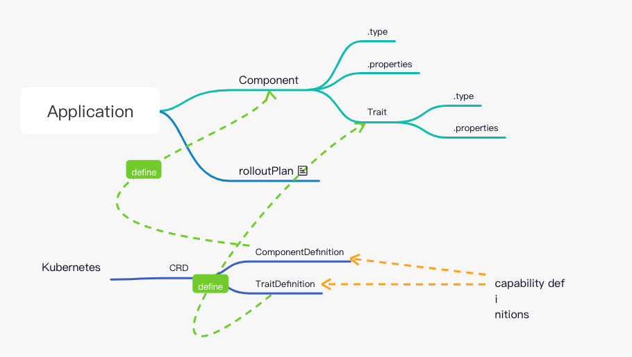

# KubeVela

- 以开发人员为中心: kubevela 引入 `Application` 的概念来抽象基础架构级别的原语, 从而捕获微服务的完整部署, 然后根据应用程序的酗酒构建操作功能.
- 本地扩展: `Application` 有模块化的构建块组成. 这些构建块支持 CUELang 和 Helm 作为模板引擎. 对抽象模板所做的
- 简单而可靠的抽象机制: KubeVela 中的抽象是用 Kubernetes Control Loop 构建的，所以它们永远不会在集群中留下配置漂移。作为 Kubernetes 自定义资源，KubeVela可以与任何 CI/CD 或 GitOps 工具无缝协作，不需要进行集成工作。


## 安装部署

依赖:
- kubernetes > 1.15.0
- ingress-nginx

```shell
# 通过 helm 安装
$ helm repo add kubevela https://kubevelacharts.oss-cn-hangzhou.aliyuncs.com/core
$ helm repo update
$ helm install --create-namespace -n vela-system kubevela kubevela/vela-core

# (可选) 使用 cert-manager 生成证书, 需要在 kubevela 安装之**前**.
$ helm repo add jetstack https://charts.jetstack.io
$ helm repo update
$ helm install cert-manager jetstack/cert-manager --namespace cert-manager --version v1.2.0 --create-namespace --set installCRDs=true
$ helm install --create-namespace -n vela-system --set admissionWebhooks.certManager.enabled=true kubevela kubevela/vela-core

# (可选) 安装 flux2 : 将 Helm chart 作为 kubevela 的能力.
$ helm install --create-namespace -n flux-system helm-flux http://oam.dev/catalog/helm-flux2-0.1.0.tgz


# 卸载
$ helm uninstall -n vela-system kubevela
$ rm -r ~/.vela
$ kubectl delete crd \
  appdeployments.core.oam.dev \
  applicationconfigurations.core.oam.dev \
  applicationcontexts.core.oam.dev \
  applicationdeployments.core.oam.dev \
  applicationrevisions.core.oam.dev \
  applications.core.oam.dev \
  approllouts.core.oam.dev \
  componentdefinitions.core.oam.dev \
  components.core.oam.dev \
  containerizedworkloads.core.oam.dev \
  healthscopes.core.oam.dev \
  manualscalertraits.core.oam.dev \
  podspecworkloads.standard.oam.dev \
  scopedefinitions.core.oam.dev \
  traitdefinitions.core.oam.dev \
  workloaddefinitions.core.oam.dev
```

升级:

```shell
$ helm repo update

$ kubectl apply -f https://raw.githubusercontent.com/oam-dev/kubevela/master/charts/vela-core/crds/core.oam.dev_componentdefinitions.yaml
$ kubectl apply -f https://raw.githubusercontent.com/oam-dev/kubevela/master/charts/vela-core/crds/core.oam.dev_workloaddefinitions.yaml
$ kubectl apply -f https://raw.githubusercontent.com/oam-dev/kubevela/master/charts/vela-core/crds/core.oam.dev_traitdefinitions.yaml
$ kubectl apply -f https://raw.githubusercontent.com/oam-dev/kubevela/master/charts/vela-core/crds/core.oam.dev_applications.yaml
$ kubectl apply -f https://raw.githubusercontent.com/oam-dev/kubevela/master/charts/vela-core/crds/core.oam.dev_approllouts.yaml
$ kubectl apply -f https://raw.githubusercontent.com/oam-dev/kubevela/master/charts/vela-core/crds/core.oam.dev_applicationrevisions.yaml
$ kubectl apply -f https://raw.githubusercontent.com/oam-dev/kubevela/master/charts/vela-core/crds/core.oam.dev_scopedefinitions.yaml
$ kubectl apply -f https://raw.githubusercontent.com/oam-dev/kubevela/master/charts/vela-core/crds/core.oam.dev_appdeployments.yaml
$ kubectl apply -f https://raw.githubusercontent.com/oam-dev/kubevela/master/charts/vela-core/crds/core.oam.dev_applicationcontexts.yaml

# 如果碰到类似 * is invalid: spec.scope: Invalid value: "Namespaced": filed is immutable问题. 请删除带有错误的 crd 并重新应用 KubeVela crds。
$ kubectl delete crd \
  scopedefinitions.core.oam.dev \
  traitdefinitions.core.oam.dev \
  workloaddefinitions.core.oam.dev

$ helm upgrade --install --create-namespace --namespace vela-system  kubevela kubevela/vela-core --version <the_new_version>

```

快速开始:
```shell
$ kubectl apply -f https://raw.githubusercontent.com/oam-dev/kubevela/master/docs/examples/vela-app.yaml

$ kubectl get application

$ curl -H "Host:testsvc.example.com" http://<your ip address>/
```

## 核心概念
关注点分离:
- 平台团队: 通过给部署环境和可重复使用的能力模块编写模板来构建应用, 并将他们注册到集群当中.
- 业务用户: 选择部署环境, 模型和可用模块来组装应用, 并吧应用部署到目标环境中.


主要概念:
- `Application` : 应用（Application），是 KubeVela 的核心 API。它使得业务开发者只需要基于一个单一的制品和一些简单的原语就可以构建完整的应用。

    `Application` 没有固定的 schema。相反，它由构建模块，比如app components（应用组件）和 traits（运维能力）等 构成。这种构建模块允许开发者通过自己定义的抽象来集成平台的能力到此应用定义。

    示例:
    
    ```yaml
    apiVersion: core.oam.dev/v1beta1
    kind: Application
    metadata:
      name: website
    spec:
      components:
        - name: backend
          type: worker
          properties:
            image: busybox
            cmd:
              - sleep
              - '1000'
        - name: frontend
          type: webservice
          properties:
            image: nginx
          traits:
            - type: autoscaler
              properties:
                min: 1
                max: 10
            - type: sidecar
              properties:
                name: "sidecar-test"
                image: "fluentd"
    ```
    
    定义抽象和建模平台能力的构建模块是 `ComponentDefinition` 和 `TraitDefinition`
    - `ComponentDefinition` : 是一个预先定义好的，用于可部署的工作负载的模板.  包含 模板, 参数, workload 的字段信息 作为声明式 API 资源.

        本质上, Application 主要声明 Component 在 k8s 集群中如何被实例化. 
        - `.type` 字段声明引用的 `ComponentDefinition`.
        - `.properties` 字段声明实例化所需的参数.

        所有 Component 需要预安装到集群中, 或者被其他第三方 provider 提供.

    - `TraitDefinition` : 每个 component 有个可选的 `.traits` 字段, 用来为 workload 增加可操作的资源换, 如 负载均衡策略, ingress, auto-scalling , 升级策略等.

        Traits 是 平台层 提供的可操作特性. 
        在 Component 定义中, `.type` 用来引用 TraitDefinition, `.properties` 用来配置 trait 的可选项.

    - `capability definitions` : 在 kubevela 中, component definitions 和 trait definitions  也被称为 `capability definitions`

- `Environment` : 可重用的基础设施配置. 每个环境有自己独特的定义, 如 domain, Kubernetes cluster and namespace, configuration data, access control policy, etc. 目前, kubevela 只支持 kubernetes namespace 的环境配置, 集群级别的在开发中.




CRD:
- `appdeployments.core.oam.dev` : 应用部署相关, 如滚动更新, 流量切换等.
- `applicationconfigurations.core.oam.dev` : 
- `applicationcontexts.core.oam.dev` : 
- `applicationrevisions.core.oam.dev` : 
- `applications.core.oam.dev` : 
- `approllouts.core.oam.dev` : 
- `clusters.core.oam.dev` : 
- `componentdefinitions.core.oam.dev` : 
- `components.core.oam.dev` : 
- `containerizedworkloads.core.oam.dev` : 
- `definitionrevisions.core.oam.dev` : 
- `healthscopes.core.oam.dev` : 应用健康探针
- `manualscalertraits.core.oam.dev` : 
- `podspecworkloads.standard.oam.dev` : 
- `resourcetrackers.core.oam.dev` : 
- `rollouttraits.standard.oam.dev` : 
- `scopedefinitions.core.oam.dev` : 
- `traitdefinitions.core.oam.dev` : 
- `workloaddefinitions.core.oam.dev` : 

## kubectl vela 使用
```shell
# 获取所有在运行的 application
kubectl get [app|application]
kubectl get app APP_NAME -o yaml

# 获取历史版本
kubectl get apprev 

# 查看所有可用的 components
# 一般 ComponentDefinition 只能被同 namespace 下 application 引用，但是 vela-system namespace 下可以被所有 application 引用。
kubectl get comp -n vela-system

# 获取某个 component 详细配置信息.
kubectl vela shwo webservice

# 获取所有 trait
kubectl get trait -n vela-system   
- annotations   [deployments.apps]    Add annotations for your Workload.
- cpuscaler     [webservice worker]   Automatically scale the component based on CPU usage.
- ingress       [webservice worker]   Enable public web traffic for the component.
- labels        [deployments.apps]    Add labels for your Workload.
- scaler        [webservice worker]   Manually scale the component.
- sidecar       [deployments.apps]    Inject a sidecar container to the component.

# 查看某个 trait 配置详情
kubectl vela show sidecar
```

远端仓库的 component
```shell
# 获取远端仓库的 component
kubectl get comp --discover [--url REGISTRY]

# 安装远端仓库的 component
kubectl vela comp get cloneset [--url REGISTRY]
```

远端仓库的 trait:
```shell
# 获取远端仓库的 trait
kubectl vela trait --discover [--url REGISTRY]

# 安装远端仓库的 trait 到本地集群
kubectl vela trait get init-container [--url REGISTRY]

```

# kubevela 开发
## 1. 应用抽象扩展
### 1.1 Component
- Helm
- CUE
- Simple Template
- Cloud Services

### 1.2 Trait
- CUE
- TraitDefinition

## 2. Appfile

有点类似 [skaffold](https://skaffold.dev/docs/), 结合配置文件来管理 kubevela 应用生命周期.

Schema
```yaml
name: _app-name_

services:
  _service-name_:
    # If `build` section exists, this field will be used as the name to build image. Otherwise, KubeVela will try to pull the image with given name directly.
    image: oamdev/testapp:v1

    build:
      docker:
        file: _Dockerfile_path_ # relative path is supported, e.g. "./Dockerfile"
        context: _build_context_path_ # relative path is supported, e.g. "."

      push:
        local: kind # optionally push to local KinD cluster instead of remote registry

    type: webservice (default) | worker | task

    # detailed configurations of workload
    ... properties of the specified workload  ...

    _trait_1_:
      # properties of trait 1

    _trait_2_:
      # properties of trait 2

    ... more traits and their properties ...
  
  _another_service_name_: # more services can be defined
    ...

```

Demo:
```yaml
name: testapp

services:
  frontend: # 1st service

    image: oamdev/testapp:v1
    build:
      docker:
        file: Dockerfile
        context: .

    cmd: ["node", "server.js"]
    port: 8080

    route: # trait
      domain: example.com
      rules:
        - path: /testapp
          rewriteTarget: /

  backend: # 2nd service
    type: task # workload type
    image: perl 
    cmd: ["perl",  "-Mbignum=bpi", "-wle", "print bpi(2000)"]
```

Command
```shell
vela init

vela up [-f /path/to/appfile]

vela status APPNAME
vela delete APPNAME
vela port-forward APPNAME
vela ls 

vela components
vela traits    
vela workloads 
```


## 3. Open API Schema

所有的抽象定义都会自动生成 Open-API-v3 架构 JSON 格式的表单数据，并把它储存到一个和定义对象处于同一个 `namespace` 的 `ConfigMap` 中.

无论是 CUE、Helm 还是原生 Kubernetes 资源模板，都会已生成一个名为 `schema-<your-definition-name>` 的 ConfigMap，其中的 `key`  `openapi-v3-json-schema` 的值就是 JSON 格式的参数，可以非常方便生成一个前端表单供平台和应用团队使用.

```
$ kubectl get configmap -n vela-system -l definition.oam.dev=schema
    NAME                   DATA   AGE
    schema-cpuscaler       1      28h
    schema-ingress         1      28h
    schema-scaler          1      28h
    schema-sidecar         1      28h
    schema-task            1      28h
    schema-task-v1         1      28h
    schema-webservice      1      28h
    schema-webservice-v1   1      28h
    schema-worker          1      28h
    schema-worker-v1       1      28h

$ kubectl get configmap -n vela-system schema-webservice -o yaml
    apiVersion: v1
    kind: ConfigMap
    metadata:
      labels:
        definition.oam.dev: schema
      name: schema-webservice
      namespace: vela-system
    data:
      openapi-v3-json-schema: '{"properties":{"addRevisionLabel":{"default":false,"description":"If
        addRevisionLabel is true, the appRevision label will be added to the underlying
        pods","title":"addRevisionLabel","type":"boolean"},"cmd":{"description":"Commands
        to run in the container","items":{"type":"string"},"title":"cmd","type":"array"},"cpu":{"description":"Number
        of CPU units for the service, like `0.5` (0.5 CPU core), `1` (1 CPU core)","title":"cpu","type":"string"},"env":{"description":"Define
        arguments by using environment variables","items":{"properties":{"name":{"description":"Environment
        variable name","title":"name","type":"string"},"value":{"description":"The value
        of the environment variable","title":"value","type":"string"},"valueFrom":{"description":"Specifies
        a source the value of this var should come from","properties":{"secretKeyRef":{"description":"Selects
        a key of a secret in the pod''s namespace","properties":{"key":{"description":"The
        key of the secret to select from. Must be a valid secret key","title":"key","type":"string"},"name":{"description":"The
        name of the secret in the pod''s namespace to select from","title":"name","type":"string"}},"required":["name","key"],"title":"secretKeyRef","type":"object"}},"required":["secretKeyRef"],"title":"valueFrom","type":"object"}},"required":["name"],"type":"object"},"title":"env","type":"array"},"image":{"description":"Which
        image would you like to use for your service","title":"image","type":"string"},"port":{"default":80,"description":"Which
        port do you want customer traffic sent to","title":"port","type":"integer"},"volumes":{"description":"Declare
        volumes and volumeMounts","items":{"properties":{"mountPath":{"title":"mountPath","type":"string"},"name":{"title":"name","type":"string"},"type":{"description":"Specify
        volume type, options: \"pvc\",\"configMap\",\"secret\",\"emptyDir\"","enum":["pvc","configMap","secret","emptyDir"],"title":"type","type":"string"}},"required":["name","mountPath","type"],"type":"object"},"title":"volumes","type":"array"}},"required":["addRevisionLabel","image","port"],"type":"object"}'
```

该 schema 是根据`capability` 定义中的 `parameter` 部分生成的：
- 对于基于 CUE 的定义：`parameter` CUE 模板中的关键词。
- 对于基于 Helm 的定义：`parameter` 是从在 Helm Chart 中的 `values.yaml` 生成的。

### 3.1 vela dashboard

```shell
$ vela dashboard

$ curl localhost:38081
```

API
```text
/api/envs/
/api/envs/:envName
/api/envs/:envName/apps/
/api/envs/:envName/apps/:appName
/api/envs/:envName/apps/:appName/components/
/api/envs/:envName/apps/:appName/components/:compName
/api/envs/:envName/apps/:appName/components/:compName/traits/
/api/envs/:envName/apps/:appName/components/:compName/traits/:traitName
/api/components/:componentName
/api/components/
/api/traits/
/api/traits/:traitName
/api/scopes/
/api/scopes/:scopeName
/api/capability-centers/
/api/capability-centers/:capabilityCenterName
/api/capability-centers/:capabilityCenterName/capabilities/
/api/capability-centers/:capabilityCenterName/capabilities/:capabilityName
/api/capabilities/:capabilityName
/api/capabilities/
/api/definitions/:name
/api/version
/swagger/*any
```

# Topic
## 1. kube-vela 集成 argocd

OAM 模型 [Kubernetes Resource Model](https://github.com/kubernetes/community/blob/master/contributors/design-proposals/architecture/resource-management.md) 

kubevela 是声明式应用描述，所以原生支持所有 gitops 工具，不需要任何额外的工作。这也是推荐的使用 kubevela 的方式。

可以使用如下两种方式:
1. `appfile` 模式: 需要配置 argocd 的 kubevela 插件.

    参考: https://www.cncf.io/blog/2020/12/22/argocd-kubevela-gitops-with-developer-centric-experience/ 

2. app crd 模式: 无需配置, 原生支持.

## 2. kubevela & terraform 

https://github.com/oam-dev/terraform-controller

<!-- 

## kubevela 应用抽象模式
- CUE
- Helm : 支持纳管 Helm 为 ComponentDefinition
    
    Helm chart 中所有 value 值都可以在 properties 进行定义，同时还可以为 components 绑定已经定义好的 Trait（运维特性），无需修改 Helm chart 本身的 template

    将一个 elasticsearch 的 helm chart 定义为 `ComponentDefinition`:

    ```yaml
    apiVersion: core.oam.dev/v1beta1
    kind: ComponentDefinition
    metadata:
      name: elasticsearch-chart
      annotations:
        definition.oam.dev/description: helm chart for elasticsearch
    spec:
      workload:
        definition:
          apiVersion: apps/v1
          kind: StatefulSet
      schematic:
        helm:
          release:
            chart:
              spec:
                chart: "elasticsearch"
                version: "7.11.1"
          repository:
            url: "https://helm.elastic.co/"

    ```
    定义一个 es + kibana 的应用:

    ```yaml
    apiVersion: core.oam.dev/v1beta1
    kind: Application
    metadata:
      name: elasticsearch
      namespace: default
    spec:
      components:
        - name: elasticsearch-web
          type: elasticsearch-chart
          properties: 
            imageTag: "7.11.1"
            replicas: 1
            volumeClaimTemplate:
              accessModes: [ "ReadWriteOnce" ]
              resources:
                requests:
                  storage: 20Gi
            fullnameOverride: "elasticsearch-web"
        - name: kibana-web
          type: kibana-chart
          properties: 
            fullnameOverride: "kibana-web"
            elasticsearchHosts: "http://elasticsearch-web:9200"
            imageTag: "7.11.1"
          traits:
            - type: ingress
              properties:
                domain: kibana.guoxudong.io
                http:
                  "/": 5610

    ```
- 原生 Kubernetes 资源模板


## 社区
https://i.cloudnative.to/oam/articles 

-->
