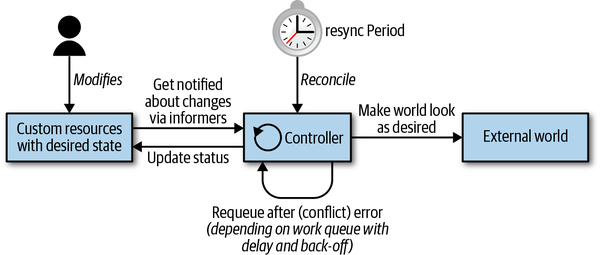
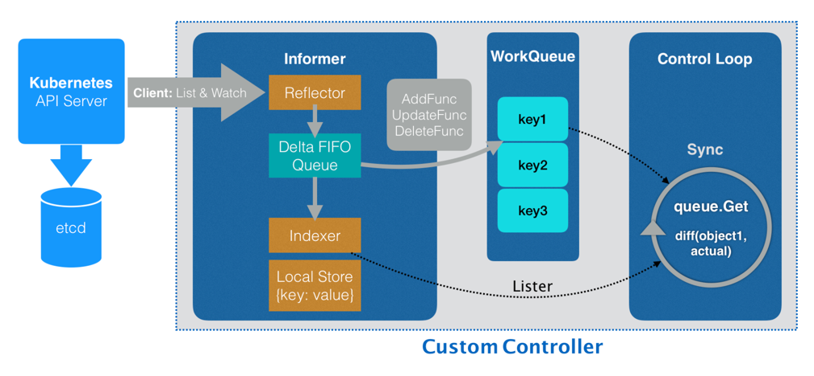
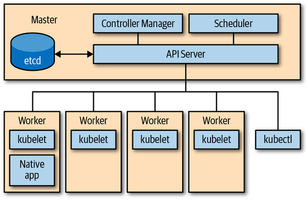

## kubernetes 扩展模式

Kubernetes 扩展可以使用如下方式:
- 二进制 `kubelet` 插件, 如 网络 (CNI), 设备, 存储 (CSI), 容器运行时 (CRI)
- 二进制 `kubectl` 插件
- API server 中的访问扩展, 例如 webhooks 的动态准入控制
- 自定义资源（CRD）和自定义 controller
- 自定义 API servers
- 调度器扩展, 例如使用 [webhook](https://github.com/kubernetes/community/blob/master/contributors/design-proposals/scheduling/scheduler_extender.md) 来实现自己的调度决策
- 通过 webhook 进行 [身份验证](https://kubernetes.io/docs/reference/access-authn-authz/authentication/#webhook-token-authentication)


### Controller 模式
所有的控制器都按照如下逻辑运行:
1. 有事件驱动来读取资源(resources)的状态(state)
2. 更改集群内或集群外对象的状态(state), 如启动一个 pod, 创建 endpoint 等
3. 通过 API Server 更新步骤 1 中的资源状态(status), 存储到 etcd 中.
4. 重复循环, 返回步骤 1.



### 控制器组件
从架构角度, Conotroller 通常使用如下的数据结构:


- `Informers` 从 Kubernetes API Server 里监听它所关心的对象状态, **`Informer` 与 API 对象是 一一对应的**.
- `Reflector` 连接 APIServer 使用 `ListAndWatch` 方法, 获取并监听 API 对象实例的变化. 变化事件及对应的 API 对象, 被称为**增量**, 放进 `Delta FIFO Queue`.
- `Delta FIFO Queue` 存放事件数据.
- `Local Store` 对象在本地的缓存.
- `Indexer` 查询与索引本地缓存的数据结构.
- `ResourceEventHandler` 在初始化时, 将事件类型对应的处理函数注册到 `Informer`, 当事件触发时, 由 `Informer` 调用 `Handler`.
- `Work queues` 在执行周期里(`processNextWorkItem`), 从工作队列(`workqueue`)中获取一个对象来处理. `event handler`可以通过他来排队或重试状态变化处理任务. 资源在处理中遇到错误时可以被重新入队(`requeued`).

### 事件 Event

Kubernetes 控制平面大量使用时间和松散耦合的组件. Kubernetes Controller 监听 API Server 中 Kubernetes 对象的操作: 增加/更新/删除. 当发生此类事件时, Controller 将执行其业务逻辑.

许多独立的控制循环只通过 API server 上对象的变化进行通信, 这些变化通过 informer 触发事件.

例如, 为了通过 deployment 来启动 pod, 要通过如下许多 Controller 和 其他控制平面组件协同工作:
- Deployment Controller (在 kube-controller-manager 内部) 感知到 (通过 deployment informer) 用户创建了一个 deployment. 根据其业务逻辑, 它将创建一个 replica set
- Replica set Controller (在 kube-controller-manager 内部) 感知到 (通过 replica set informer) 新的 replica set 被创建, 根据其业务逻辑, 它将创建一个 pod 对象.
- Scheduler (在 kube-scheduler) -- 同样是一个 controller, 感知到 (通过 pod informer) pod 设置了一个空的 spec.nodeName 字段. 根据其业务逻辑, 它将该 pod 放入其调度队列中.
- 于此同时, 另一个 controller kubelet (通过 pod informer) 感知到有新的 Pod 出现, 但是新的 pod 的 spec.nodeName 为空, 与当前 kubelet 的 node name 不匹配, 他讲忽略该 pod 并返回休眠状态(直到下一个事件).
- Scheduler 更新 pod 的 spec.nodeName 字段, 并将该字段写入 API server, 由此将 pod 从工作队列中移除, 并调度到具有足够可用资源的 node 上.
- 由于 pod 更新时间, kubelet 将被唤醒, 并比较 pod 的 spec.nodeName 与 自己的 node name 进行比较, 当比较匹配时, kubelet 将启动 pod 中的容器, 并将容器已启动的信息写入 pod status 中, 并上报 API server.
- Replica set controller 会感知到已更新的 pod, 但不会做什么.
- 如果 pod 终止, kubelet 将感知到该事件, 进而从 API server 获取 pod 对象, 并把 pod status 设置为 terminated, 然后将其写回到 API server.
- Replica set controller 会感知到终止 pod, 并决定必须更换此 pod. 他将在 API server 上删除终止了的 pod, 然后创建一个新的 pod.
- 以此类推.

### API server

API Server 是系统的中央管理实体(central management entiry), 他是系统中唯一一个与分布式存储组件 etcd 进行直接交互的组件.

API server 职责:
1. 为 kubernetes API 提供服务
    - 读取状态(`state`)
    - 操作状态(`state`)
2. 代理转发集群组件
    - kubernetes dashboard
    - 代理 `kubectl exec` 回话




API Server HTTP 协议接口
- API Server 使用 RESTful HTTP API
- 外部请求使用 json 格式
- 内部调用使用 protocol buffer 格式, 为了更高性能.
- 使用 API 路径参数: 如 `GET /api/v1/namespace/{namespace}/pods`

使用 `kubectl` 的 `-v 6` 参数, 可以看到 HTTP 请求的 log:

```txt
$ kubectl get pods -n emojivoto -v 6

    I0603 14:56:43.975252   21971 loader.go:375] Config loaded from file:  /Users/bob/.kube/config
    I0603 14:56:43.976111   21971 cert_rotation.go:137] Starting client certificate rotation controller
    I0603 14:56:44.000581   21971 round_trippers.go:444] GET https://127.0.0.1:49395/api/v1/namespaces/emojivoto/pods?limit=500 200 OK in 18 milliseconds

    NAME                        READY   STATUS    RESTARTS   AGE
    emoji-65df4d68f7-mrj7c      1/1     Running   0          4d18h
    vote-bot-7c59767698-265mh   1/1     Running   0          4d18h
    voting-768f496cd8-9mrps     1/1     Running   0          4d18h
    web-545f869fc4-5tjqw        1/1     Running   0          4d18h
```


## CNI 

CNI Plugin 可以分为三类 : `Main`, `IPAM` 和 `Meta`. 其中 `Main` 和 `IPAM` 插件相辅相成, 完成了为容器创建网络环境的基本工作. 

- IPAM 插件
    
    IPAM (IP Address Management) 插件主要用来负责分配IP地址. 官方提供的可使用插件包括下面几种 : 

    - `dhcp` : 宿主机上运行的守护进程, 代表容器发出 DHCP 请求
    - `host-local` : 使用提前分配好的 IP 地址段来分配, 并在内存中记录 ip 的使用情况
    - `static` : 用于为容器分配静态的 IP 地址, 主要是调试使用

- Main 插件

    Main 插件主要用来创建具体的网络设备的二进制文件. 官方提供的可使用插件包括下面几种 : 

    - `bridge` :  在宿主机上创建网桥然后通过 veth pair 的方式连接到容器
    - `macvlan` : 虚拟出多个 macvtap, 每个 macvtap 都有不同的 mac 地址
    - `ipvlan` : 和 macvla n相似, 也是通过一个主机接口虚拟出多个虚拟网络接口, 不同的是 ipvlan 虚拟出来的是共享 MAC 地址, ip 地址不同
    - `loopback` : lo 设备（将回环接口设置成up）
    - `ptp` : veth pair 设备
    - `vlan` : 分配 vlan 设备
    - `host-device` : 移动宿主上已经存在的设备到容器中

- Meta 插件

    由CNI社区维护的内部插件, 目前主要包括 : 

    - `flannel`: 专门为 Flannel 项目提供的插件
    - `tuning` : 通过 sysctl 调整网络设备参数的二进制文件
    - `portmap` : 通过 iptables 配置端口映射的二进制文件
    - `bandwidth` : 使用 Token Bucket Filter (TBF) 来进行限流的二进制文件
    - `firewall` : 通过 iptables 或者 firewalled 添加规则控制容器的进出流量

[CNI Plugins 插件 https://github.com/containernetworking/plugins ](https://github.com/containernetworking/plugins)
[CNI 仓库 https://github.com/containernetworking/cni](https://github.com/containernetworking/cni)

每个 Plugin 都需要实现以下三个方法, 再在 main 中注册一下. 

```golang
func cmdCheck(args *skel.CmdArgs) error {
    ...
}

func cmdAdd(args *skel.CmdArgs) error {
    ...
}

func cmdDel(args *skel.CmdArgs) error {
    ...
}
```