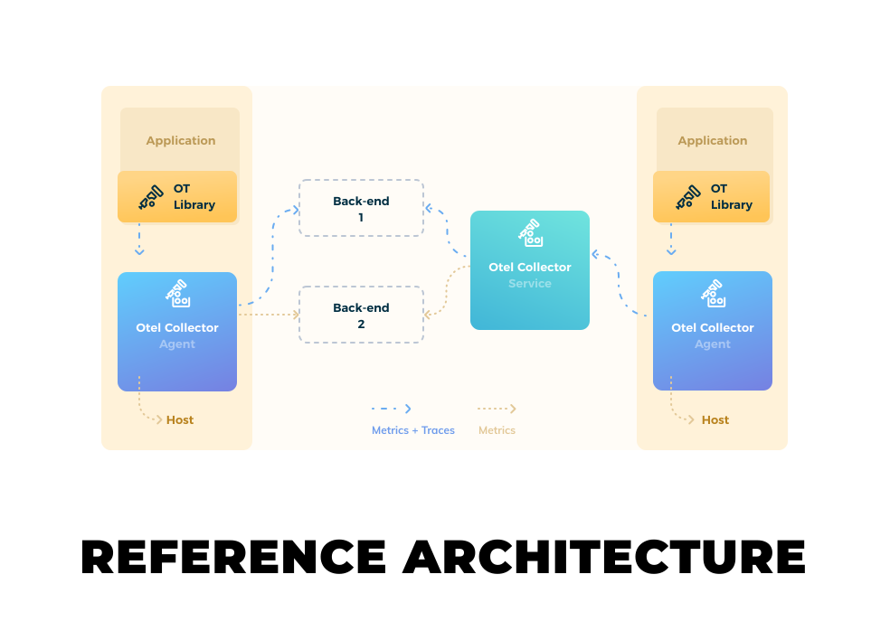

# OpenTelemetry



OpenTelemetry 是一系列 API, SDK 和 工具的集合, 用来创建和管理 trace, metrics, logs 等遥测数据.
- 为每个语言提供一个统一的, 供应商不可知的 公共库, 支持自动或者手动的 instrumentation.
- 一个单独的 二进制 的 collector, 可以被部署为 agent 或者 gateway.
- 一个端到端的实现, 用来生成, 提交, 收集, 处理 和 导出 遥测数据.
- 对遥测数据的完全控制, 支持异步输出到多个目标地址.
- 开放的标准语义, 来保证 供应商不可知 的数据收集.
- 支持多重上下文传播格式, 与数据迁移和标准保持平行.
- 支持多种数据存储后端, 迁移到 OpenTelemetry 路线明确.

OpenTelemetry 不是一个像 Jaeger Prometheus 那样的可观察性存储后端, 而是支持多种开源或者商业的数据存储后端. 它提供一个可插拔式架构, 可为各种技术协议和数据格式提供方便的支持.

## 组件
- [`Proto`](https://github.com/open-telemetry/opentelemetry-proto) : 语言无关的接口类型定义. 为每种 collector 和 基础库(instrumentationi libraries) 定义数据源 和 其他方便的共同点和资源.
- `Specification` : 为每种实现 描述跨语言的需求和期望. 包含一下方面:
    - `API`: 用于生成遥测数据.包括 data source, baggage 和 propagators.
    - `SDK`: 实现用于数据处理和导出能力的 API. 定义 data source, resources 和 配置 等.
    - `Data`: 符合语义惯例的定义条约, 即 OpenTelemetry Protocol(OTLP).
- `Collector` : OpenTelemetry 提供一个统一的, 供应商不可知 的收集器. 用于 收集, 处理, 导出 遥测数据. 从而避免了运行和管理多个独立供应商的收集器.
- `Instrumentation Libraries` : A library that enables observability for another library is called an instrumentation library. The OpenTelemetry project provides an instrumentation library for multiple languages. All instrumentation libraries support manual (code modified) instrumentation and several support automatic (byte-code) instrumentation.

### 数据源
OpenTelemetry 支持如下多种数据源, 如下:
- `Traces`: a `trace` is a tree of `span`
    Spans are objects than represent the work being done by individual services or components involved in a request as it flows through a system. A `span` contains a *span context*, which is a set of globally unique identifiers that represent the unique request tha each `span` is part of. 

    A `span` provides Request, Error, Duration(**RED**) metrics that can be used to debug availability as well as performance issues.

    一个 `trace` 包含一个 root span, 该 root span 包含真个请求的时延.
    一个 `trace` 包含一个 root span 和若干 child span, 每个 span 代表整个请求中一个独立的动作, 并包含该动作的原信息, 如 name, 开始和结束时间, attributes, events and status.

    OpenTelemetry API 提供一个 `tracer` 接口来创建和跟踪当前的 `span`. 并允许向其添加 属性, 时间 或者 结束该 `span`.

    一个 `span` 的生命周期:
    1. 当服务接受到一个请求, 如果请求头中包含 span, 则从其中提取 span context.
    2. 新建一个 span 作为 请求头 中span 的 child span, 如果 请求头中没有 span, 则新建 root span.
    3. 服务处理请求. 相关请求的数据和时间被加入到新建里的 span 中. 也可以加入自定义的 信息.
    4. New spans may be created to represent work being done by sub-components of the service .
    5. 当服务向另一个服务发起请求, 当前的 span context 会被序列化, 并注入请求头或者消息体(message envolope) 中, 传给下一个服务.
    6. 当服务操作完成, 无奈成功或失败, span 状态更新, 并被标记为 完成. 

- `Metrics`: 服务运行时指标.

    OpenTelemetry 定义三种 metric instrumentation:
    - `counter`: 随时间只增加.
    - `measure`: 随时间聚合.
    - `observer`: cuptures a current set of values at a particular point in time.

- `Logs`: 打上时间戳的文本记录. 结构化 或 非结构化. In OpenTelemetry, any data that is not part of a distributed trace or a metric is a log. For example, events are a specific type of log.

    日志格式模型: https://github.com/open-telemetry/opentelemetry-specification/blob/main/specification/logs/data-model.md

### Instrumenting(监测仪表装置)

Instrumentation libraries offer a core repository per language. They may or may not offer additional repositories for automatic instrumentation or non-core components.

Some instrumentation libraries, for example Ruby, offer a single repository that supports both manual and automatic instrumentation. Other languages, for example JS, support both manual and automatic instrumentation, but separate core components from contrib components in separate repositories.

#### 1. Automatic Instrumentation
1. 添加依赖: 提供 OpenTelemetry API 和 SDK 能力.

2. 配置 OpenTelemetry Instrumentation

    可以通过设置 环境变量 或者 其他语言特定的配置(如 java 的 system properties)来配置.

    配置项:
    - service name
    - Data source specific config
    - Propagator config
    - Resource config

#### 2. Manual Instrumentation
1. 导入 OpenTelemetry API 和 SDK
2. 配置 OpenTelemetry API
    
    需要创建 tracer 或 meter provider, 需要提供特定的名字, 来标识服务本身.

3. 配置 OpenTelemetry SDK
    配置导出数据到特定的 backend.
4. 新建 遥测 数据
5. 导出数据
    OpenTelemetry 支持导出数据到特定 backend 有两种方式:
    - exporting data from process
    - proxying data through OpenTelemetry Collector.

    支持的后端供应商列表: https://opentelemetry.io/vendors/


### Data Collection: Collector

OpenTelemetry 提供一个 供应商无关的 收集器实现, 来 接收/处理/导出 遥测数据. 


#### Collector 组件
1. `receivers`: 如何接收数据, 可以基于 `pull` 或 `push` 模式.
2. `processors`: 对于接受到的数据, 如何处理.
3. `exporters`: 接收到的数据如何发送出去, 可以基于 `pull` 或 `push` 模式.
4. `pipelines`: `receivers`, `processors`, `exporters` 这些组件通过 `pipelines` 组件启用. 可以用过 yaml 配置, 同时 启用一个或多个组件.

OpenTelemetry 提供两种版本的 Collector:
- `Core`: 提供最基础, 最核心的 OpenTelemetry 组件, 如 receivers, processors, exporters, and extensions. 支持常用的开源项目, 如 `Jaeger`, `Prometheus`, `Fluent Bit`.
- `Contrib`: 除了提供 `Core` 的功能之外, 会提供实验性的其他组件, 同时, 包含特定供应商的 receivers, processors, exporters, and extensions.

#### 部署

##### 部署模式
1. Agent 模式: **推荐**, 与应用运行在一起或者同一宿主机上.
2. Gateway 模式: 作为独立服务运行, 比如 每个 cluster, datacenter, or region 运行一个或多个作为独立服务. **每个 Gateway 服务后面的 Colloctor 作为独立的无状态实体运行, 可以轻松的实现横向扩展**

##### docker-compose

```shell
$ git clone git@github.com:open-telemetry/opentelemetry-collector.git
$ cd opentelemetry-collector/examples/demo
$ docker-compose up -d
```

##### kubernetes 部署
1. 配置文件

    ```yaml
    ---
    apiVersion: v1
    kind: ConfigMap
    metadata:
    name: otel-agent-conf
    labels:
        app: opentelemetry
        component: otel-agent-conf
    data:
    otel-agent-config: |
        receivers:
        otlp:
            protocols:
            grpc:
            http:
        exporters:
        otlp:
            endpoint: "otel-collector.default:4317"
            insecure: true
            sending_queue:
            num_consumers: 4
            queue_size: 100
            retry_on_failure:
            enabled: true
        processors:
        batch:
        memory_limiter:
            # Same as --mem-ballast-size-mib CLI argument
            ballast_size_mib: 165
            # 80% of maximum memory up to 2G
            limit_mib: 400
            # 25% of limit up to 2G
            spike_limit_mib: 100
            check_interval: 5s
        extensions:
        health_check: {}
        zpages: {}
        service:
        extensions: [health_check, zpages]
        pipelines:
            traces:
            receivers: [otlp]
            processors: [memory_limiter, batch]
            exporters: [otlp]
    ---
    apiVersion: apps/v1
    kind: DaemonSet
    metadata:
    name: otel-agent
    labels:
        app: opentelemetry
        component: otel-agent
    spec:
    selector:
        matchLabels:
        app: opentelemetry
        component: otel-agent
    template:
        metadata:
        labels:
            app: opentelemetry
            component: otel-agent
        spec:
        containers:
        - command:
            - "/otelcol"
            - "--config=/conf/otel-agent-config.yaml"
            # Memory Ballast size should be max 1/3 to 1/2 of memory.
            - "--mem-ballast-size-mib=165"
            image: otel/opentelemetry-collector-dev:latest
            name: otel-agent
            resources:
            limits:
                cpu: 500m
                memory: 500Mi
            requests:
                cpu: 100m
                memory: 100Mi
            ports:
            - containerPort: 55679 # ZPages endpoint.
            - containerPort: 4317 # Default OpenTelemetry receiver port.
            - containerPort: 8888  # Metrics.
            volumeMounts:
            - name: otel-agent-config-vol
            mountPath: /conf
            livenessProbe:
            httpGet:
                path: /
                port: 13133 # Health Check extension default port.
            readinessProbe:
            httpGet:
                path: /
                port: 13133 # Health Check extension default port.
        volumes:
            - configMap:
                name: otel-agent-conf
                items:
                - key: otel-agent-config
                    path: otel-agent-config.yaml
            name: otel-agent-config-vol
    ---
    apiVersion: v1
    kind: ConfigMap
    metadata:
    name: otel-collector-conf
    labels:
        app: opentelemetry
        component: otel-collector-conf
    data:
    otel-collector-config: |
        receivers:
        otlp:
            protocols:
            grpc:
            http:
        jaeger:
            protocols:
            grpc:
            thrift_http:
        zipkin: {}
        processors:
        batch:
        memory_limiter:
            # Same as --mem-ballast-size-mib CLI argument
            ballast_size_mib: 683
            # 80% of maximum memory up to 2G
            limit_mib: 1500
            # 25% of limit up to 2G
            spike_limit_mib: 512
            check_interval: 5s
        extensions:
        health_check: {}
        zpages: {}
        exporters:
        zipkin:
            endpoint: "http://somezipkin.target.com:9411/api/v2/spans" # Replace with a real endpoint.
        jaeger:
            endpoint: "somejaegergrpc.target.com:14250" # Replace with a real endpoint.
            insecure: true
        service:
        extensions: [health_check, zpages]
        pipelines:
            traces/1:
            receivers: [otlp, zipkin]
            processors: [memory_limiter, batch]
            exporters: [zipkin]
            traces/2:
            receivers: [otlp, jaeger]
            processors: [memory_limiter, batch]
            exporters: [jaeger]
    ---
    apiVersion: v1
    kind: Service
    metadata:
    name: otel-collector
    labels:
        app: opentelemetry
        component: otel-collector
    spec:
    ports:
    - name: otlp # Default endpoint for OpenTelemetry receiver.
        port: 4317
        protocol: TCP
        targetPort: 4317
    - name: jaeger-grpc # Default endpoint for Jaeger gRPC receiver
        port: 14250
    - name: jaeger-thrift-http # Default endpoint for Jaeger HTTP receiver.
        port: 14268
    - name: zipkin # Default endpoint for Zipkin receiver.
        port: 9411
    - name: metrics # Default endpoint for querying metrics.
        port: 8888
    selector:
        component: otel-collector
    ---
    apiVersion: apps/v1
    kind: Deployment
    metadata:
    name: otel-collector
    labels:
        app: opentelemetry
        component: otel-collector
    spec:
    selector:
        matchLabels:
        app: opentelemetry
        component: otel-collector
    minReadySeconds: 5
    progressDeadlineSeconds: 120
    replicas: 1 #TODO - adjust this to your own requirements
    template:
        metadata:
        labels:
            app: opentelemetry
            component: otel-collector
        spec:
        containers:
        - command:
            - "/otelcol"
            - "--config=/conf/otel-collector-config.yaml"
    #           Memory Ballast size should be max 1/3 to 1/2 of memory.
            - "--mem-ballast-size-mib=683"
            image: otel/opentelemetry-collector-dev:latest
            name: otel-collector
            resources:
            limits:
                cpu: 1
                memory: 2Gi
            requests:
                cpu: 200m
                memory: 400Mi
            ports:
            - containerPort: 55679 # Default endpoint for ZPages.
            - containerPort: 4317 # Default endpoint for OpenTelemetry receiver.
            - containerPort: 14250 # Default endpoint for Jaeger HTTP receiver.
            - containerPort: 14268 # Default endpoint for Jaeger HTTP receiver.
            - containerPort: 9411 # Default endpoint for Zipkin receiver.
            - containerPort: 8888  # Default endpoint for querying metrics.
            volumeMounts:
            - name: otel-collector-config-vol
            mountPath: /conf
    #        - name: otel-collector-secrets
    #          mountPath: /secrets
            livenessProbe:
            httpGet:
                path: /
                port: 13133 # Health Check extension default port.
            readinessProbe:
            httpGet:
                path: /
                port: 13133 # Health Check extension default port.
        volumes:
            - configMap:
                name: otel-collector-conf
                items:
                - key: otel-collector-config
                    path: otel-collector-config.yaml
            name: otel-collector-config-vol
    #        - secret:
    #            name: otel-collector-secrets
    #            items:
    #              - key: cert.pem
    #                path: cert.pem
    #              - key: key.pem
    #                path: key.pem

    ```

2. [OpenTelemetry Operator](https://github.com/open-telemetry/opentelemetry-operator)


#### 配置
1. `receivers`, `processors`, `exporters` 组件必须要在 `service.pipelines` 中 enable 后才可以使用.
2. `extensions` 为 Collector 提供额外的能力, 但是无需直接访问 遥测数据, 也不是 pipeline 的一部分. 需要在 `service` 中 enable.
3. the same `receiver`, `processor`, `exporter` and/or `pipeline` can be defined more than once. 

```yaml
receivers:
  otlp:
    protocols:
      grpc:
      http:
  otlp/2:
    protocols:
      grpc:
        endpoint: 0.0.0.0:55690

processors:
  batch:
  batch/test:

exporters:
  otlp:
    endpoint: otelcol:55680
  otlp/2:
    endpoint: otelcol2:55680

extensions:
  health_check:
  pprof:
  zpages:

service:
  extensions: [health_check,pprof,zpages]
  pipelines:
    traces:
      receivers: [otlp]
      processors: [batch]
      exporters: [otlp]
    traces/2:
      receivers: [otlp/2]
      processors: [batch/test]
      exporters: [otlp/2]
    metrics:
      receivers: [otlp]
      processors: [batch]
      exporters: [otlp]
    logs:
      receivers: [otlp]
      processors: [batch]
      exporters: [otlp]
```

##### Receivers
- 可以基于 `push` 或 `pull` 模式
- 支持多个数据源

Receivers 配置参考: https://github.com/open-telemetry/opentelemetry-collector/blob/main/receiver/README.md

```yaml
receivers:
  # Data sources: logs
  fluentforward:
    listenAddress: 0.0.0.0:8006

  # Data sources: metrics
  hostmetrics:
    scrapers:
      cpu:
      disk:
      filesystem:
      load:
      memory:
      network:
      process:
      processes:
      swap:

  # Data sources: traces
  jaeger:
    protocols:
      grpc:
      thrift_binary:
      thrift_compact:
      thrift_http:

  # Data sources: traces
  kafka:
    protocol_version: 2.0.0

  # Data sources: traces, metrics
  opencensus:

  # Data sources: traces, metrics, logs
  otlp:
    protocols:
      grpc:
      http:

  # Data sources: metrics
  prometheus:
    config:
      scrape_configs:
        - job_name: "otel-collector"
          scrape_interval: 5s
          static_configs:
            - targets: ["localhost:8888"]

  # Data sources: traces. Receivers 带有默认的配置, 因此, 如无特殊需要只需配置名称即可.
  zipkin:
```

##### Processors

运行在 Receivers 和 Exporters 之间, 需要在 `service` 中开启, 才可以使用.

Processors 是可选的, 但有一些推荐的 Processors 的推荐配置:
- Traces

    1. memory_limiter
    2. any sampling processors
    3. Any processor relying on sending source from Context (e.g. k8s_tagger)
    4. batch
    5. any other processors

- Metrics

    1. memory_limiter
    2. Any processor relying on sending source from Context (e.g. k8s_tagger)
    3. batch
    4. any other processors

```yaml
processors:
  # Data sources: traces
  attributes:
    actions:
      - key: environment
        value: production
        action: insert
      - key: db.statement
        action: delete
      - key: email
        action: hash

  # Data sources: traces, metrics, logs
  batch:

  # Data sources: metrics
  filter:
    metrics:
      include:
        match_type: regexp
        metric_names:
        - prefix/.*
        - prefix_.*

  # Data sources: traces, metrics, logs
  memory_limiter:
    ballast_size_mib: 2000
    check_interval: 5s
    limit_mib: 4000
    spike_limit_mib: 500

  # Data sources: traces
  resource:
    attributes:
    - key: cloud.zone
      value: "zone-1"
      action: upsert
    - key: k8s.cluster.name
      from_attribute: k8s-cluster
      action: insert
    - key: redundant-attribute
      action: delete

  # Data sources: traces
  probabilistic_sampler:
    hash_seed: 22
    sampling_percentage: 15

  # Data sources: traces
  span:
    name:
      to_attributes:
        rules:
          - ^\/api\/v1\/document\/(?P<documentId>.*)\/update$
      from_attributes: ["db.svc", "operation"]
      separator: "::"
```

##### Exporters
- 可以基于 `push` 或 `pull` 的模式
- 支持一个或多个导出目标
- 许多 Exporters 支持默认的配置, 所以, 只需写个名字即可.

Exporters 配置参考: https://github.com/open-telemetry/opentelemetry-collector/blob/main/exporter/README.md

```yaml
exporters:
  # Data sources: traces, metrics, logs
  file:
    path: ./filename.json

  # Data sources: traces
  jaeger:
    endpoint: "http://jaeger-all-in-one:14250"
    insecure: true

  # Data sources: traces
  kafka:
    protocol_version: 2.0.0

  # Data sources: traces, metrics, logs
  logging:
    loglevel: debug

  # Data sources: traces, metrics
  opencensus:
    endpoint: "otelcol2:55678"

  # Data sources: traces, metrics, logs
  otlp:
    endpoint: otelcol2:55680
    insecure: true

  # Data sources: traces, metrics
  otlphttp:
    endpoint: https://example.com:55681/v1/traces

  # Data sources: metrics
  prometheus:
    endpoint: "prometheus:8889"
    namespace: "default"

  # Data sources: metrics
  prometheusremotewrite:
    endpoint: "http://some.url:9411/api/prom/push"

  # Data sources: traces
  zipkin:
    endpoint: "http://localhost:9411/api/v2/spans"
```

##### Extensions
- 可选配置
- 用于**非**处理遥测数据的 任务
- 许多插件有默认配置, 因此, 只写一个名字即可, 如 `pprof:`
- 插件:
  - `health_check`: http 健康检查, 
    - `port: 13133`: 端口
  - `pprof`: 开启 golang `net/http/pprof` endpoint. 常用性能监测.
    - `endpoint: localhost:1777`: pprof 监控端口
    - `block_profile_fraction: 0`: 阻塞, Fraction of blocking events that are profiled. A value `<= 0` disables profiling.
    - `mutex_profile_fraction: 0`: 互斥锁, Fraction of mutex contention events that are profiled. A value `<= 0` disables profiling.
    - `save_to_file: /path/to/file`: 保存 CPU profile 到文件.
  - `zpages`: Enables an extension that serves zPages, an HTTP endpoint that provides live data for debugging different components that were properly instrumented for such. All core exporters and receivers provide some zPages instrumentation.
    - `endpoint: localhost:55679`: 


Extensions 配置文档: https://github.com/open-telemetry/opentelemetry-collector/blob/main/extension/README.md

```yaml
extensions:
  health_check:
  pprof:
  zpages:
```

##### Service

只有在 service 中定义的 Receivers, Processors, Exporters, Extensions, 才会被启动.

包含两段配置:
- `extensions`: 包含一个 enable 的扩展的列表

    ```yaml
    service:
        extensions: [health_check, pprof, zpages]
    ```

- `piplines`: 包含一组 Receivers, Processors, Exporters. 
    
    Tips:
    - 每个 Receivers/Processors/Exporters 必须在 `Service` 段之外定义配置.
    - 每个 Receivers, Processors, Exporters 可以被在 `pipelines` 中**多次**定义.

        For processor(s) referenced in multiple pipelines, each pipeline will get a separate instance of that processor(s). This is in contrast to receiver(s)/exporter(s) referenced in multiple pipelines, where only one instance of a receiver/exporter is used for all pipelines. Also note that the order of processors dictates the order in which data is processed.
        对于在多个 pipelines 中的 processors, 每个 pipeline 获取到一个独立的 processors 实例. 而 receivers/exporter 在每个 pipeline 得到的是同一个实例. processors 的顺序影响数据被处理的顺序.

    可以被配置为以下三个段:
    - `traces`
    - `metrics`
    - `logs`

```yaml
service:
  pipelines:
    metrics:
      receivers: [opencensus, prometheus]
      exporters: [opencensus, prometheus]
    traces:
      receivers: [opencensus, jaeger]
      processors: [batch]
      exporters: [opencensus, zipkin]
```

##### 其他配置
1. 配置环境变量: 可以在 Collector 配置中配置环境变量.

    ```yaml
    processors:
    attributes/example:
        actions:
        - key: "${DB_KEY}"
            action: "${OPERATION}"
    ```

2. 配置代理

    Exporters that leverage the net/http package (all do today) respect the following proxy environment variables:

    使用 `net/http` 包的 exporters , 使用如下环境变量, 配置代理:
    
    ```text
    HTTP_PROXY
    HTTPS_PROXY
    NO_PROXY
    ```
    
    If set at Collector start time then exporters, regardless of protocol, will or will not proxy traffic as defined by these environment variables.


