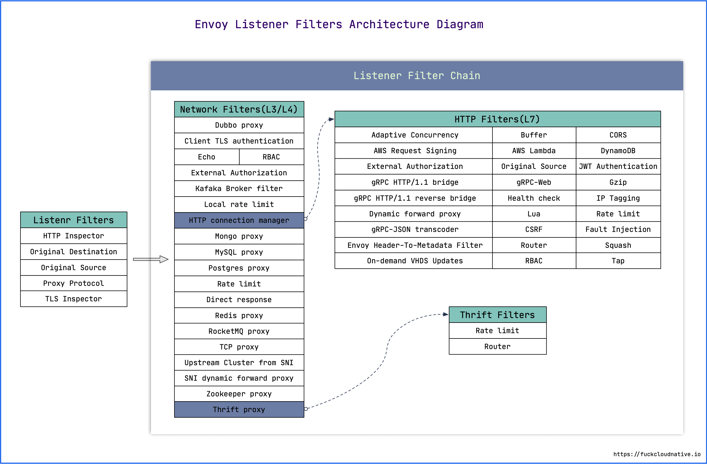

## 配置文件




```json
{
  "node": "{...}",
  "static_resources": "{...}",
  "dynamic_resources": "{...}",
  "cluster_manager": "{...}",
  "hds_config": "{...}",
  "flags_path": "...",
  "stats_sinks": [],
  "stats_config": "{...}",
  "stats_flush_interval": "{...}",
  "watchdog": "{...}",
  "tracing": "{...}",
  "runtime": "{...}",
  "layered_runtime": "{...}",
  "admin": "{...}",
  "overload_manager": "{...}",
  "enable_dispatcher_stats": "...",
  "header_prefix": "...",
  "stats_server_version_override": "{...}",
  "use_tcp_for_dns_lookups": "..."
}
```

- `node` : 节点标识，配置的是 Envoy 的标记信息，`management server` 利用它来标识不同的 Envoy 实例. 
- `static_resources` : 定义**静态**配置，是 Envoy 核心工作需要的资源，由 Listener、Cluster 和 Secret 三部分组成. 
  - `Listener`
  - `Cluster`
  - `Secret`
- `dynamic_resources` : 定义**动态**配置，通过 `xDS` 来获取配置. 可以同时配置动态和静态. 
- `cluster_manager` : 管理所有的上游集群. 它封装了连接后端服务的操作，当 `Filter` 认为可以建立连接时，便调用 `cluster_manager` 的 API 来建立连接. `cluster_manager` 负责处理负载均衡、健康检查等细节. 
- `hds_config` : 健康检查服务发现动态配置. 
- `stats_sinks` : 状态输出插件. 可以将状态数据输出到多种采集系统中. 一般通过 Envoy 的管理接口 `/stats/prometheus` 就可以获取 Prometheus 格式的指标，这里的配置应该是为了支持其他的监控系统. 
- `stats_config` : 状态指标配置. 
- `stats_flush_interval` : 状态指标刷新时间. 
- `watchdog` : 看门狗配置. Envoy 内置了一个看门狗系统，可以在 Envoy 没有响应时增加相应的计数器，并根据计数来决定是否关闭 Envoy 服务. 
- `tracing` : 分布式追踪相关配置. 
- `layered_runtime` : **层级化**的运行时状态配置. 如层级目录树. 可以静态配置，也可以通过 `RTDS` 动态加载配置. 
- `admin` : 管理接口. 
- `overload_manager` : 过载过滤器. 
- `header_prefix` : `Header` 字段前缀修改. 例如，如果将该字段设为 `X-Foo`，那么 `Header` 中的 `x-envoy-retry-on` 将被会变成 `x-foo-retry-on`. 
- `use_tcp_for_dns_lookups` : 强制使用 TCP 查询 DNS. 可以在 `Cluster` 的配置中覆盖此配置. 

### 查看 admin 配置
0. 启动 `admin` 监听

    ```yaml
    admin:
      access_log_path: /dev/null
      address:
        socket_address:
          address: 127.0.0.1
          port_value: 19000
    ```

1. `config_dump`

    ```shell
    $ curl -s http://localhost:9901/config_dump | jq -r '.configs[] | .["@type"]'
        type.googleapis.com/envoy.admin.v3.BootstrapConfigDump
        type.googleapis.com/envoy.admin.v3.ClustersConfigDump
        type.googleapis.com/envoy.admin.v3.ListenersConfigDump
        type.googleapis.com/envoy.admin.v3.ScopedRoutesConfigDump
        type.googleapis.com/envoy.admin.v3.RoutesConfigDump
        type.googleapis.com/envoy.admin.v3.SecretsConfigDump
    ```

2. 监控相关:

    ```
    /stats: print server stats
    /stats/prometheus: print server stats in prometheus format
    ```

    ```bash
    $ curl -s http://localhost:9901/stats | cut -d. -f1 | sort | uniq
        cluster
        cluster_manager
        filesystem
        http
        http1
        listener
        listener_manager
        main_thread
        runtime
        server
        vhost
        workers
    
    $ curl -s http://localhost:9901/stats?filter='^http\.ingress_http'
    $ curl -s "http://localhost:9901/stats?filter=http.ingress_http.rq&format=json" | jq '.stats'
    ```

3. 服务状态信息
    ```
    /server_info
    /memory
    /contention
    /init_dump
    /hot_restart_version
    ```

4. 监听配置
    ```
    /config_dump
    /clusters
    /listeners
    /certs
    ```

5. 健康检查
    ```
    /healthcheck/fail: cause the server to fail health checks
    /healthcheck/ok: cause the server to pass health checks
    /ready
    ```

6. 修改配置
    ```
    /cpuprofiler: enable/disable the CPU profiler
    /drain_listeners: drain listeners

    /heapprofiler: enable/disable the heap profiler
    /logging: query/change logging levels

    /quitquitquit: exit the server

    /reopen_logs: reopen access logs
    /reset_counters: reset all counters to zero

    /runtime: print runtime values
    /runtime_modify: modify runtime values

    ```

### wasm


### Tips

```shell

RUN go env -w GOPROXY=https://goproxy.cn,direct
```

Traceing Headers

```python
TRACE_HEADERS_TO_PROPAGATE = [
    'X-Ot-Span-Context',
    'X-Request-Id',

    # Zipkin headers
    'X-B3-TraceId',
    'X-B3-SpanId',
    'X-B3-ParentSpanId',
    'X-B3-Sampled',
    'X-B3-Flags',

    # Jaeger header (for native client)
    "uber-trace-id",

    # SkyWalking headers.
    "sw8"
]
```
