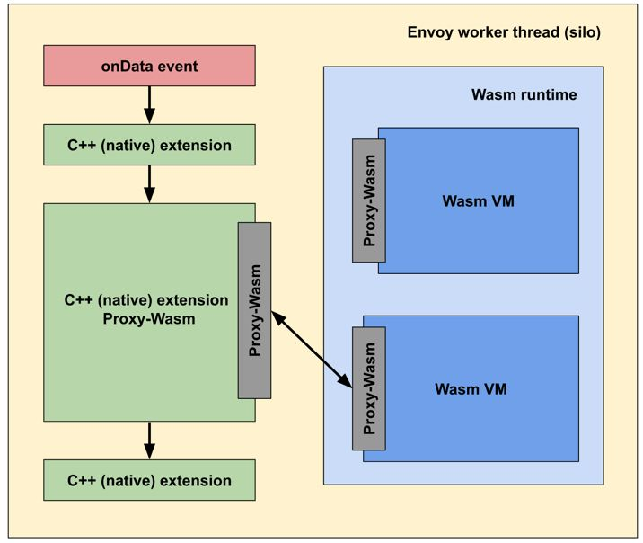

## 术语

- `Host`: 服务端点.
- `Cluster`: 一组提供服务的 Host, 作为 Envoy 的 Upstream 被链接.
- `Downstream`: 向 Envoy 发起请求.
- `Upstream`: 从 Envoy 接受链接和请求.
- `Listener`: Envoy 监听端口, 用于被 Downstream 访问.
- `Mesh`:  一组 Envoy Proxies. A group of hosts that coordinate(配合) to provide a consistent(一致性的) network topology. In this documentation, an “Envoy mesh” is a group of Envoy proxies that form a message passing substrate(基石, 基座) for a distributed system comprised of many different services and application platforms.
- `Runtime Configuration`: Out of band realtime configuration system deployed alongside Envoy. Configuration settings can be altered(改动) that will affect operation without needing to restart Envoy or change the primary configuration.

线程模型: Envoy 使用**单进程, 多线程**架构. 
- 主线程: 负责协调其他线程.
- work 线程: 负责 listening, filtering, forwarding. Once a connection is accepted by a listener, the connection spends the rest of its lifetime bound to a single worker thread. 
- Envoy 是 100% **非阻塞**模型, 推荐配置 **线程数 等于机器的硬件线程数**.

默认情况下, worker 线程之间没有通讯, 每个 worker 线程在 listener 上独立接受链接, 并且依赖于 内核在 线程之间执行调度. 大多数情况下, 这种方式工作良好, 但在有些场景中, 例如 少量长链接场景 如 service mesh HTTP2/gRPC egress, 有可能需要 Envoy 强制在 worker 线程之间做负载均衡. 此时, 可以通过在 listener 上配置 `connection_balance_config` 实现.

## Listeners

### Listeners 
推荐每台机器运行一个 Envoy 进程, 并监听多个端口. Envoy 支持 TCP/UDP 监听.

- TCP: 

    - 监听器 + filter chains: 处理链接请求, mTLS, http 链接管理, tcp proxy.
    - listener filter: 在 network level filter 处理之前处理. 可以用于处理链接的元信息(connection metadata). 常用于(修改链接元信息)来影响后续信息如何被处理后面的 filter 和 cluster 处理. 该功能的初衷是, 为了给 Envoy 核心功能添加其他的系统集成功能的时候更加方便.
        
        listener filter 的 API 是相对 简单的, 基本上这些 filter 作用在 新接收到的套接字上. 在 listener filter chain 上的 filter 可以停止或者转发到后面的 filter 上, 这允许处理更加多和复杂的场景, 例如调用 rate limiting 服务.
        
        内置 listener filter: https://www.envoyproxy.io/docs/envoy/latest/configuration/listeners/listener_filters/listener_filters#config-listener-filters
    - 可以通过 LDS(listener discovery service) 动态获得.

- UDP: 

    - 监听器 + UDP listener filter: 每当一个 Worker 线程启动之后, 实例化一个 UDP listener filter, 并且对当前线程全局可见. listener filter 处理接受到的 UDP 数据报. 通常 UDP 监听器会配置 `SO_REUSEPORT` 内核参数, 这会导致内核持续将每个 UDP 4-tuple 发送到同一个 worker 线程. 因此, UDP listener 自带有类似 session 的功能, 该功能可以参考 [UDP Proxy listern filter](https://www.envoyproxy.io/docs/envoy/latest/configuration/listeners/udp_filters/udp_proxy#config-udp-listener-filters-udp-proxy).


Listener 配置
```json
{
  "name": "...",
  "address": "{...}",
  "stat_prefix": "...",
  "filter_chains": [],
  "use_original_dst": "{...}",
  "default_filter_chain": "{...}",
  "per_connection_buffer_limit_bytes": "{...}",
  "metadata": "{...}",
  "drain_type": "...",
  "listener_filters": [],
  "listener_filters_timeout": "{...}",
  "continue_on_listener_filters_timeout": "...",
  "transparent": "{...}",
  "freebind": "{...}",
  "socket_options": [],
  "tcp_fast_open_queue_length": "{...}",
  "traffic_direction": "...",
  "udp_listener_config": "{...}",
  "api_listener": "{...}",
  "connection_balance_config": "{...}",
  "reuse_port": "...",
  "access_log": [],
  "tcp_backlog_size": "{...}",
  "bind_to_port": "{...}"
}
```

### Network(L3/L4) Filter

Network levle(L3/L4) filter 是构建 Envoy 链接处理的核心. 这些 filter api 允许被混合, 附着到一个 listener 上 处理链接请求.

有三种不同类型的 network filter:
- Read: 当 Envoy 接受到赖在 downstream 的链接时, 被调用.
- Write: 当 Envoy 准备发送数据到 downstream 链接时, 被调用.
- Read/Write: 以上两种的混合.

Network level filter 的 API 保持相对简单, 并主要用于处理 raw bytes 和 少量的 connection event(如 tls 握手/本地或远端链接断开 等).

多个 Network level filter 之间在一个 downstream 链接上下文里, 可以共享(静态或动态)状态. 参考[ data shareing between filter](https://www.envoyproxy.io/docs/envoy/latest/intro/arch_overview/advanced/data_sharing_between_filters#arch-overview-data-sharing-between-filters).


#### filter chain

network filter 被串联成有序的列表, 即 filter chain. 每个 listenter 有多个 filter chain 以及一个可选的 default filter chain. 

如果没有 filter chain 被匹配到请求, 则 default filter chain 将发生作用. 如果没有提供 default filter chain, 链接将被关闭

filter chain 可以被独立更新. 如果 listenter manager 监测到 listener 配置的更新只是 filter chain 的更新, 则 listener manager 管理器会 增/删/改 这写 filter chain. 哪些被老的 filter chain 处理的请求, 会被 drained (The connections owned by these destroying filter chains will be drained as described in listener drain).

如果新的 filter chain 和 旧的 filter chain 持有相同的 protobuf message (protobuf message equivalent), 则这些一致的 filter chain runtime info 会被保留. 被这些 filter chain 处理的链接也会保持 open.

并不是所有的 listener 配置更新可以被当做 filter chain 更新. 例如 如果 listener metadata 的更新, 新的 listener metadata 需要被 新的 filter chain 获取, 这种情况下, 整个 listener 会被 drained 和 更新.

### TCP Proxy

TCP proxy filter 在 upstream cliend 和 downstream server 之间, 维护 1:1 的网络连接. 

TCP proxy filter 可以自己工作, 也可以配合其他的 filter 联合工作, 如 MongoDB filter , rate limit filter.

TCP proxy filter 尊重每个 upstream cluster 的全局资源管理对 connection limits 的配置. TCP proxy filter 创建连接之前会检查 upstream cluster 的 connection limit 配置, 如果不超过则建立连接, 否则不会创建连接.

### UDP Proxy

Envoy 通过 UDP proxy listener filer 支持 UDP proxy.

### DNS Filter

Envoy 支持响应 通过配置 [UDP listener DNS filter] 来响应 DNS 请求.

DNS filter 支持响应 DNS `A` 和 `AAAA` 记录. 这些响应通过静态配置资源, cluster, 或 额外的 DNS server 产生.

DNS filter 返回 DNS 响应最大为 512 bytes. 如果某个域名有多个地址, Envoy 只会响应小于这个大小的 DNS 响应.

### Connection limiting

Envoy 支持如下的 connection limit:
- local(non-distributed) connection limiting of L4 connections via the [connection limit filter](https://www.envoyproxy.io/docs/envoy/latest/configuration/listeners/network_filters/connection_limit_filter#config-network-filters-connection-limit)
- runtime conection limiting via [Runtime listener connection limit](https://www.envoyproxy.io/docs/envoy/latest/configuration/listeners/runtime#config-listeners-runtime)

## HTTP

Envoy 将 HTTP 协议视为一等公民.

### HTTP connection management

HTTP Connection manager 将原生的 bytes 转换为 HTTP 协议的消息和事件(如 headers received, body data received, trailers received 等). 同时, 它也处理与 HTTP 请求和链接相关的其他事务, 如 access log, request id 生成和 tracing, request/response 首部处理, 请求路由映射 和 statistics 等.

- 协议: Envoy 原生支持 HTTP/1.1, HTTP/2, HTTP/3, WebSockets, 目前尚未支持**SPDY**. 

    Envoy HTTP 支持被首要设置为最 HTTP/2 多路复用代理, 并在内部实现中, 使用 HTTP/2 术语.

- HTTP header sanitizing

    Envoy sanitize(无害化处理) 首部是基于 请求是内部还是一个外部请求. 通常基于 `x-forwarded-for` 来判断, 也可以通过设置 `internal_address_condfig` 来修改.

    出于安全考虑, Envoy 会对如下 HTTP 首部做 santize(无害化) 处理:
    - x-envoy-decorator-operation
    - x-envoy-downstream-service-cluster
    - x-envoy-downstream-service-node
    - x-envoy-expected-rq-timeout-ms
    - x-envoy-external-address
    - x-envoy-force-trace
    - x-envoy-internal
    - x-envoy-ip-tags
    - x-envoy-max-retries
    - x-envoy-retry-grpc-on
    - x-envoy-retry-on
    - x-envoy-upstream-alt-stat-name
    - x-envoy-upstream-rq-per-try-timeout-ms
    - x-envoy-upstream-rq-timeout-alt-response
    - x-envoy-upstream-rq-timeout-ms
    - x-forwarded-client-cert
    - x-forwarded-for
    - x-forwarded-proto
    - x-request-id

- 路由映射
    
    Envoy 通过两种方式来做路由映射:
    1. 静态 配置
    2. 动态 RDS API.

- 重试策略插件

    通常情况下, 重试时 主机的选择遵循与原始请求一样的规则.

    重试策略插件可以组合使用, Envoy 也支持自定义的 重试插件.
    ```yaml
    retry_policy:
      retry_host_predicate:
      - name: envoy.retry_host_predicates.previous_hosts
      host_selection_retry_max_attempts: 3
      retry_priority:
        name: envoy.retry_priorities.previous_priorities
        typed_config:
          "@type": type.googleapis.com/envoy.extensions.retry.priority.previous_priorities.v3.PreviousPrioritiesConfig
          update_frequency: 2
    ```
    重试插件, 可以将重试策略分为如下两类:
    - host predicates: 通常用来 reject host. 可以定义任意数量的 host predicates, 任意一个 predicates 匹配到主机, 则会拒绝该 host.
        Envoy 支持如下内置 host predicates:
        - `envoy.retry_host_predicates.previous_hosts` : 使用原始请求中的 reject host.
            ```yaml
            retry_policy:
              retry_host_predicate:
              - name: envoy.retry_host_predicates.previous_hosts
              host_selection_retry_max_attempts: 3
            ```
        - `envoy.retry_host_predicates.omit_canary_hosts` : reject 任意被标记为 canary 的 host.
            主机被标记为 canary 通过 `envoy.lb` 中配置 `canary: true` 实现.
        - `envoy.retry_host_predicates.omit_host_metadata` : reject 任意匹配在预定于元信息的匹配项.
            ```yaml
            retry_policy:
              retry_host_predicate:
              - name: envoy.retry_host_predicates.omit_host_metadata
                typed_config:
                  "@type": type.googleapis.com/envoy.extensions.retry.host.omit_host_metadata.v3.OmitHostMetadataConfig
                  metadata_match:
                    filter_metadata:
                      envoy.lb:
                        key: value
            ```
    - priotiry predicatres: 依据 定义的负载优先级匹配主机. 只能定义一个匹配向.
        Envoy 使用 如下内置 优先级 predicates:
        - `envoy.retry_priorities.previous_priorities`: 使用原始请求中 priotiry predicates.
        
        ```yaml
        retry_policy:
          retry_priority:
            name: envoy.retry_priorities.previous_priorities
            typed_config:
              "@type": type.googleapis.com/envoy.extensions.retry.priority.previous_priorities.v3.PreviousPrioritiesConfig
              update_frequency: 2
        ```

- 内部跳转: Envoy 通过在路由配置中配置 internal redirect policy 支持内部 3xx 跳转. Trailers 暂不支持.
    配置:
    ```json
    {
      "max_internal_redirects": "{...}",
      "redirect_response_codes": [],
      "predicates": [],
      "allow_cross_scheme_redirect": "..."
    }
    ```

    有种 predicates 可以被用来定义重定向链的 DAG(有向无环图):
    - [previous routes](https://www.envoyproxy.io/docs/envoy/latest/api-v3/extensions/internal_redirect/previous_routes/v3/previous_routes_config.proto#envoy-v3-api-msg-extensions-internal-redirect-previous-routes-v3-previousroutesconfig)
    - [allow_listed_routes](https://www.envoyproxy.io/docs/envoy/latest/api-v3/extensions/internal_redirect/allow_listed_routes/v3/allow_listed_routes_config.proto#envoy-v3-api-msg-extensions-internal-redirect-allow-listed-routes-v3-allowlistedroutesconfig)
    
    [safe_cross_scheme](https://www.envoyproxy.io/docs/envoy/latest/api-v3/extensions/internal_redirect/safe_cross_scheme/v3/safe_cross_scheme_config.proto#envoy-v3-api-msg-extensions-internal-redirect-safe-cross-scheme-v3-safecrossschemeconfig) 可以用来防止 `HTTP -> HTTPS` 的重定向.

- Timeout: 有多种 timeout 配置可以用来应用到 HTTP 链接.

    比较重要的超时配置:
    - HTTP/gRPC
        - Connection timeouts: 
            HTTP 协议的 idle_timeout 用来定义一个通用的超时时间, 适用于 HTTP connection manager 和 upstream cluster HTTP connection
            
            ```json
            # config.core.v3.HttpProtocolOptions
            {
              "idle_timeout": "{...}",      # 默认为 1h
              "max_connection_duration": "{...}",
              "max_headers_count": "{...}",
              "max_stream_duration": "{...}",
              "headers_with_underscores_action": "..."
            }
            ```

            - 修改 downstream 链接的超时时间, 
                ```yaml
                # extensions.filters.network.http_connection_manager.v3.HttpConnectionManager
                
                common_http_protocol_options: 
                    headers_with_underscores_action: REJECT_REQUEST,
                    idle_timeout: 900s
                ```
            - 修改 upstream 链接的超时时间, 
                ```yaml
                # extensions.upstreams.http.v3.HttpProtocolOptions
                common_http_protocol_options: 
                          idle_timeout: 1s
                ```
        - Stream timeouts: 应用HTTP 链接中的独立的 请求流, 包含 HTTP/1, HTTP/2, HTTP/3 .
            - `extensions.filters.network.http_connection_manager.v3.HttpConnectionManager.request_timeout: 300s`
            - `extensions.filters.network.http_connection_manager.v3.HttpConnectionManager.request_headers_timeout: 10s`
            - `extensions.filters.network.http_connection_manager.v3.HttpConnectionManager.stream_idle_timeout: 30s`
            - `config.core.v3.HttpProtocolOptions.max_stream_duration: 10s`
        - Route timeout: 
            - `config.route.v3.RouteAction.timeout: 15s`
            - `config.route.v3.RouteAction.idle_timeout: 10s`
            - `config.route.v3.RetryPolicy.pre_try_timeout: `
            - `config.route.v3.RouteAction.MaxStreamDuration.max_stream_duration: `
        - Scaled timeout: 
    - TCP
        - `config.cluster.v3.Cluster.connect_timeout: 5s`
        - `extensions.filters.network.tcp_proxy.v3.TcpProxy.idle_timeout: 1h`
    - Transport Socket
        - `config.listener.v3.FilterChain.transport_socket_connect_timeout: `

### HTTP filters

Envoy 支持在 HTTP 协议级别的 filter. 这些 filter 可以在 HTTP协议级别做修改操作, 而 无需感知底层协议(HTTP/1.1, HTTP2 ...)


HTTP level filter 有三种:
- Decode: decode 请求流, 如 headers, body, trailers.
- Encoder: encode 请求流, 如 headers, body, trailers.
- Decoder/Encoder: 上面二合一.

HTTP level filter 可以在单个请求流中共享状态(静态或者动态).

- filter 顺序: 与定义顺序有关. 调用 decoder 顺序, encode 逆序.
- 有条件的 filter 配置: https://www.envoyproxy.io/docs/envoy/latest/configuration/http/http_filters/composite_filter#config-http-filters-composite
- Filter route mutation: https://www.envoyproxy.io/docs/envoy/latest/intro/arch_overview/http/http_filters#filter-route-mutation

### HTTP routing

HTTP router filter 可以用做边缘代理, 构建服务到服务的 Envoy mesh, 或者正向代理.

- Route Scope: 用于约束 domain 和 route rule 的搜索范围. 
    
    一个 Route scope 将一个 Scope key 与 route table 做映射. 对于每个请求来说, 一个 Scope key 被 HTTP connection manager 动态计算出来,用来匹配一个 route table.

    Scoped RDS (SRDS) API 可以用来动态配饰 route scope.

    ```yaml
    # addr: foo=1;x-foo-key=127.0.0.1;x-bar-key=1.1.1.1 中, 127.0.0.1 会被用来被计算做 scope key
    name: scope_by_addr
    fragments:
      - header_value_extractor:
          name: Addr
          element_separator: ;
          element:
            key: x-foo-key
            separator: =
    ```

- Route table
    
    HTTP connection manager 中的 route table 配置可以被所有的 HTTP filter 访问. 

    ```json
    // config.route.v3.RouteConfiguration
    
    {
      "name": "...",
      "virtual_hosts": [],
      "vhds": "{...}",
      "internal_only_headers": [],
      "response_headers_to_add": [],
      "response_headers_to_remove": [],
      "request_headers_to_add": [],
      "request_headers_to_remove": [],
      "most_specific_header_mutations_wins": "...",
      "validate_clusters": "{...}",
      "max_direct_response_body_size_bytes": "{...}"
    }
    ```

- Retry semantics(语义)
    重试策略可以通过 route 配置中的 `config.route.v3.RouteAction.retry_policy` 定义 也可以通过在特定请求中添加 请求头(`x-envoy-max-retries`, `x-envoy-retry-on`, `x-envoy-retry-grpc-on` 等)来定义.

    retry 有如下四种可用配置参数:
    - Maximum number of retries: 
    - Retry conditions: 如依据 5xx 响应码等.
    - Retry budgets: 用来限制 retry_budget, 防止发生网络风暴.
    - Host selection retry plugins: 

    Envoy 会在当配置有 `x-envoy-overloaded` 首部的时候重试请求. 推荐同时配置 `retry_budget` 或 设置 `maximum active retries circuit breaker` 来避免重试风暴.
- Request Headging(范围,限制): Envoy 会同时向 upstream cluster 发起请求, 并返回响应最快的请求给 downstream.
    ```json
    // config.route.v3.HedgePolicy
    {
        "hedge_on_per_try_timeout": "..."
    }
    ```
- Priotiry routing: envoy 支持 在 route 阶段 的 优先级路由. 当前的优先级路由实现为每个 优先级 使用不同的 [connection pool](https://www.envoyproxy.io/docs/envoy/latest/intro/arch_overview/upstream/connection_pooling#arch-overview-conn-pool) 和 [circuit breaking](https://www.envoyproxy.io/docs/envoy/latest/configuration/upstream/cluster_manager/cluster_circuit_breakers#config-cluster-manager-cluster-circuit-breakers). 这意味着即使是 http/2 协议, 也会用两个物理链接来链接 upstream host.

    当前支持的优先级有:
    - `default`
    - `high`
    
- Direct Response: 直接响应无需将请求路由到一个 upstream server.

    在一个 Route 配置中有两种方式来配置 直接响应:
    - 设置 `direct_response` 字段, 适用于所有的 HTTP 响应状态码
    - 设置 `redirect` 字段, 只适用于 重定向状态码.

### HTTP3 overview

Alpha 支持. 

### HTTP upgrades


### HTTP dynamic forward proxy


## 配置文件


```json
{
  "node": "{...}",
  "static_resources": "{...}",
  "dynamic_resources": "{...}",
  "cluster_manager": "{...}",
  "hds_config": "{...}",
  "flags_path": "...",
  "stats_sinks": [],
  "stats_config": "{...}",
  "stats_flush_interval": "{...}",
  "watchdog": "{...}",
  "tracing": "{...}",
  "runtime": "{...}",
  "layered_runtime": "{...}",
  "admin": "{...}",
  "overload_manager": "{...}",
  "enable_dispatcher_stats": "...",
  "header_prefix": "...",
  "stats_server_version_override": "{...}",
  "use_tcp_for_dns_lookups": "..."
}
```

- `node` : 节点标识，配置的是 Envoy 的标记信息，`management server` 利用它来标识不同的 Envoy 实例. 
- `static_resources` : 定义**静态**配置，是 Envoy 核心工作需要的资源，由 Listener、Cluster 和 Secret 三部分组成. 
  - `Listener`
  - `Cluster`
  - `Secret`
- `dynamic_resources` : 定义**动态**配置，通过 `xDS` 来获取配置. 可以同时配置动态和静态. 
- `cluster_manager` : 管理所有的上游集群. 它封装了连接后端服务的操作，当 `Filter` 认为可以建立连接时，便调用 `cluster_manager` 的 API 来建立连接. `cluster_manager` 负责处理负载均衡、健康检查等细节. 
- `hds_config` : 健康检查服务发现动态配置. 
- `stats_sinks` : 状态输出插件. 可以将状态数据输出到多种采集系统中. 一般通过 Envoy 的管理接口 `/stats/prometheus` 就可以获取 Prometheus 格式的指标，这里的配置应该是为了支持其他的监控系统. 
- `stats_config` : 状态指标配置. 
- `stats_flush_interval` : 状态指标刷新时间. 
- `watchdog` : 看门狗配置. Envoy 内置了一个看门狗系统，可以在 Envoy 没有响应时增加相应的计数器，并根据计数来决定是否关闭 Envoy 服务. 
- `tracing` : 分布式追踪相关配置. 
- `layered_runtime` : **层级化**的运行时状态配置. 如层级目录树. 可以静态配置，也可以通过 `RTDS` 动态加载配置. 
- `admin` : 管理接口. 
- `overload_manager` : 过载过滤器. 
- `header_prefix` : `Header` 字段前缀修改. 例如，如果将该字段设为 `X-Foo`，那么 `Header` 中的 `x-envoy-retry-on` 将被会变成 `x-foo-retry-on`. 
- `use_tcp_for_dns_lookups` : 强制使用 TCP 查询 DNS. 可以在 `Cluster` 的配置中覆盖此配置. 

### 查看 admin 配置
0. 启动 `admin` 监听

    ```yaml
    admin:
      access_log_path: /dev/null
      address:
        socket_address:
          address: 127.0.0.1
          port_value: 19000
    ```

1. `config_dump`

    ```shell
    $ curl -s http://localhost:9901/config_dump | jq -r '.configs[] | .["@type"]'
        type.googleapis.com/envoy.admin.v3.BootstrapConfigDump
        type.googleapis.com/envoy.admin.v3.ClustersConfigDump
        type.googleapis.com/envoy.admin.v3.ListenersConfigDump
        type.googleapis.com/envoy.admin.v3.ScopedRoutesConfigDump
        type.googleapis.com/envoy.admin.v3.RoutesConfigDump
        type.googleapis.com/envoy.admin.v3.SecretsConfigDump
    ```

2. 监控相关:

    ```
    /stats: print server stats
    /stats/prometheus: print server stats in prometheus format
    ```

    ```bash
    $ curl -s http://localhost:9901/stats | cut -d. -f1 | sort | uniq
        cluster
        cluster_manager
        filesystem
        http
        http1
        listener
        listener_manager
        main_thread
        runtime
        server
        vhost
        workers
    
    $ curl -s http://localhost:9901/stats?filter='^http\.ingress_http'
    $ curl -s "http://localhost:9901/stats?filter=http.ingress_http.rq&format=json" | jq '.stats'
    ```

3. 服务状态信息
    ```
    /server_info
    /memory
    /contention
    /init_dump
    /hot_restart_version
    ```

4. 监听配置
    ```
    /config_dump
    /clusters
    /listeners
    /certs
    ```

5. 健康检查
    ```
    /healthcheck/fail: cause the server to fail health checks
    /healthcheck/ok: cause the server to pass health checks
    /ready
    ```

6. 修改配置
    ```
    /cpuprofiler: enable/disable the CPU profiler
    /drain_listeners: drain listeners

    /heapprofiler: enable/disable the heap profiler
    /logging: query/change logging levels

    /quitquitquit: exit the server

    /reopen_logs: reopen access logs
    /reset_counters: reset all counters to zero

    /runtime: print runtime values
    /runtime_modify: modify runtime values

    ```

### wasm




## HTTP Filter
### Lua Filter

HTTP Lua Filter 允许在 请求和响应 流中, 使用 [LuaJIT 运行时](https://luajit.org/), 执行 Lua 脚本代码.

> [moonjit](https://github.com/moonjit/moonjit/) 是新一代的 LuaJIT 运行时环境, 并且支持个多 5.2 版本 和 多平台的特性. Envoy 可以使用 `--//source/extensions/filters/common/lua:moonjit=1` 的 bazel 选项 来增加 Envoy 对 moonjit 的支持.

特点:
- 所有 Lua 脚本执行环境是每个 Envoy 线程独立的. 即 没有真正的全局数据, 任何全局的数据都是 envoy 线程独立的.
- 所有脚本都作为协程(coroutines)运行. 即 这些脚本使用同步模型写出来, 但在执行时, 仍然是异步的.
- 不要在脚本中执行阻塞操作. 这对 Envoy 的性能表现是灾难性的.


当前支持的高级特性:
- 在请求/响应流 中, 检查 header, body 和 trailers .
- 修改 headers, trailers
- 为检查(inspection), 阻塞和缓存整个 请求/响应的 body.
- 向 upstream host 执行异步的 HTTP 请求.
- 直接响应请求, 并且跳过后面的 filter 过滤.

默认情况下, `inline_code` 中定义的 lua 代码会被认为是 `GLOBAL` script, Envoy 会为每个 HTTP 请求执行 `inline_code` 中定义的代码.

#### 配置:
##### extensions.filters.http.lua.v3.Lua

```yaml
1. extensions.filters.http.lua.v3.Lua

{
  "inline_code": "...",
  "source_codes": "{...}"
}

# inline_code
  inline_code: |
    -- Called on the request path.
    function envoy_on_request(request_handle)
      -- Do something.
    end
    -- Called on the response path.
    function envoy_on_response(response_handle)
      -- Do something.
    end
    
# source_codes
source_codes:
  hello.lua:
    inline_string: |
      function envoy_on_response(response_handle)
        -- Do something.
      end
  world.lua:
    filename: /etc/lua/world.lua
```

示例:
```yaml
name: envoy.filters.http.lua
typed_config:
  "@type": type.googleapis.com/envoy.extensions.filters.http.lua.v3.Lua
  inline_code: |
    function envoy_on_request(request_handle)
      -- do something
    end
  source_codes:
    hello.lua:
      inline_string: |
        function envoy_on_request(request_handle)
          request_handle:logInfo("Hello World.")
        end
    bye.lua:
      inline_string: |
        function envoy_on_response(response_handle)
          response_handle:logInfo("Bye Bye.")
        end
```

##### extensions.filters.http.lua.v3.LuaPerRoute

通过提供 `LuaPerRoute` 配置, Lua HTTP filter 可以被 disable 或 overridden . 

`LuaPerRoute` 可以被定义在 如下配置部分:
- virtual host
- route
- weighted cluster 

`LuaPerRoute` 提供如下两种方式来负载 `GLOBAL` lua 脚本:
- 通过提供一个 lua 脚本的名字, 该名字定义于 `source_codes` 字段的字典配置当中.
- 通过提供 `source_code` 字段提供的 脚本代码. 此处允许脚本通过 **RDS** 获取.

```yaml
{
  "disabled": "...",    # bool, 为特定的 vhost 或 route 禁用 lua filter.
  "name": "...",        # 所使用的 lua 代码的名称, 列表存储在 Lua.source_codes 中.
  "source_code": "{...}" # lua 代码段, 可以为 RDS 发现 或者 文本代码段.
}

```

禁用 filter:
```yaml
typed_per_filter_config:
  envoy.filters.http.lua:
    "@type": type.googleapis.com/envoy.extensions.filters.http.lua.v3.LuaPerRoute
    disabled: true
```

使用 `source_code.inline_string` 覆盖 `GLOBAL` lua 脚本:
```yaml
typed_per_filter_config:
  envoy.filters.http.lua:
    "@type": type.googleapis.com/envoy.extensions.filters.http.lua.v3.LuaPerRoute
    source_code:
      inline_string: |
        function envoy_on_response(response_handle)
          response_handle:logInfo("Goodbye.")
        end
```
#### Envoy Lua API

##### Stream handle API
Envoy 会在 Lua Filter 中 寻找 并调用 如下两个函数, 在 Lua 脚本段可以定义 两个或者其中一个函数:
- `envoy_on_request(request_handle)`: 在请求流中, 作为协程(coroutine) 调用. 传入 `handle` 作为参数.
- `envoy_on_response(response_handle)`: 在响应流中, 作为协程(coroutine) 调用. 传入 `handle` 作为参数.

在 stream handle 中支持如下函数:
- `headers()` : 返回 请求/响应 首部.

    ```lua
    local headers = handle:headers()
    ```

- `body()`: 返回 请求/响应 body. 此处调用会阻塞脚本的执行, 直到 接收到所有的 body 内容到缓存.

    ```lua
    local body = handle:body(always_wrap_body)
    ```

    `always_wrap_body` 是个布尔参数, 用来要求 envoy 永远返回一个 body object, 即使 body 为 空.

- `bodyChunks()`: 返回一个迭代器, 用来迭代接受到的 body. Envoy 会在执行每次迭代中 暂停脚本执行, 直到收到结果, 但是不会缓存接受到的 body 内容. 主要用来接受流式数据.

    ```lua
    local iterator = handle:bodyChunks()
    ```

    示例:
    ```lua
    for chunk in request_handle:bodyChunks() do
        request_handle:log(0, chunk:length())
    end
    ```

- `trailers()`: 返回一个 stream 的 trailer 信息. 如果没有 trailer 信息, 可能返回 `nil`. 这些 trailer 信息可能被其他 filter 修改.

- `log*()`: 使用 envoy 的 application logging 打印日志.

    ```lua
    -- message is a string to log.
    handle:logTrace(message)
    handle:logDebug(message)
    handle:logInfo(message)
    handle:logWarn(message)
    handle:logErr(message)
    handle:logCritical(message)
    ```

- `httpCall()` 向 upstream host 发起 http 调用.

    ```lua
    local headers, body = handle:httpCall(cluster, headers, body, timeout, asynchronous)
    ```
    - `cluster`: 字符串, 为一个 cluster 的名字.
    - `headers`: 发送的 key/value 对, 作为请求首部.
        `:method`, `:path`, and `:authority` headers must be set.
    - `body`: 可选字段, 请求体.
    - `timeout`: int, 请求超时时间, 单位 milliseconds.
    - `asynchronous`: 布尔值, 当设置为 `true` 时, Envoy 会采用协程执行 http 请求, 并不再关心 响应的成功与失败. 如果为 `false` 时(**默认值**), Envoy 会阻塞并等待请求完成或出错.
    -  `headers`: 一个 table 表示的响应首部
    -  `body`: 一个 string 类型的响应体, 当响应体为 空时, 值为 `nil`.
    
- `respond()`: 立即返回响应, 并不再执行后续的 filter. 该方法只在 请求流 中有效.

    ```lua
    handle:respond(headers, body)
    ```
    响应内容:
    - `headers`: 一个包含 key/value 的 table, `:status` 为必选首部.
    - `body`: 一个可选的字符串, 表示响应体. 可以为 `nil`

- `metadata()`: 返回当前路由的路径的 metadata 信息. metadata 信息需要特别指定在 filter name 下.

    ```yaml
    metadate:
      filter_metadata:
        envoy.filters.http.lua:
          foo: bar
          baz:
            - bad
            - baz
    ```

- `streamInfo()`: 返回与当前请求相关的 [information](https://github.com/envoyproxy/envoy/blob/v1.17.3/include/envoy/stream_info/stream_info.h)

    ```lua
    local streamInfo = handle:streamInfo()
    ```

- `connection()`: 返回与当前请求的基础(underlying) [connection](https://github.com/envoyproxy/envoy/blob/v1.17.3/include/envoy/network/connection.h)

    ```lua
    local connection = handle:connection()
    ```

- `importPublicKey()`: 返回 `verifySignature` 用来校验的数字签名的公钥.

    ```lua
    local pubkey = handle:importPublicKey(keyder, keyderLength)
    ```

- `verifySignature()`: 使用提供的参数, 做数字校验. 该函数返回两个值, 如果第一个值为 true, 则请求成功, 第二个值为 空; 反之, 第二个值为 报错信息.

    ```lua
    local ok, error = verifySignature(hashFunction, pubkey, signature, signatureLength, data, dataLength)
    ```

    - `hashFunction`: 用来验证数字签名的 hash 函数. 支持的函数有 SHA1, SHA224, SHA256, SHA384 and SHA512 . 
    - `pubkey`: 公钥. 
    - `signature`: 签名. 
    - `signatureLength`: 签名长度. 
    - `data`: 被 hash 的内容. 
    - `dataLength`: 被 hash 内容长度.

- `base64Escape()`: 将输入内容使用 base64 encode 转义.

    ```lua
    local base64_encoded = handle:base64Escape("input string")
    ```

##### Header object API

- `add()`: 添加一个 header
    ```lua
    headers:add(key, value)
    ```
- `get()`: 获取
    ```lua
    headers:get(key)
    ```
- `__pairs()`: 迭代每个 headers
    ```lua
    for key, value in pairs(headers) do
        -- do something
    end
    ```
- `remove()`: 删除
    ```lua
    headers:remove(key)
    ```
- `replace()`: 替换
    ```lua
    headers:replace(key, value)
    ```

##### Buffer API

- `length()`: 获取 buffer bytes 的大小, 返回一个 int.
    ```lua
    local size = buffer:length()
    ```
- `getBytes()`: 从 buffer 中获取 bytes. 默认情况下, envoy 不会拷贝 all buffer 到 lua 运行时环境, 该方法拷贝一个 segment 到内存.
    ```lua
    buffer:getBytes(index, length)
    ```
    - `index` + `length` 必须小于 buffer 本身的长度.
    - `index`: int, 开始拷贝的 buffer index.
    - `length`: int, 拷贝的 buffer 长度.
    
- `setBytes()`: 设置 buffer 的内容.
    ```lua
    buffer:setBytes(string)
    ```

##### Metadata object API

- `get()`: 获取 metadata
    ```lua
    metadata:get(key)
    ```
- `__pairs()`: 迭代 metadata 键值对.
    ```lua
    for key, value in pairs(metadata) do
        -- do something
    end
    ```

##### Stream info object API
- `protocol()`: 获取当前请求的 HTTP 请求协议文本表示. 可能为值为: `HTTP/1.0`, `HTTP/1.1`, and `HTTP/2`.
    ```lua
    streamInfo:protocol()
    ```

- `downstreamLocalAddress()`: 返回字符串表示的 当前请求的 downstream remote addr.
    ```lua
    streamInfo:downstreamLocalAddress()
    ```

- `downstreamDirectRemoteAddress()`: 返回字符串表示的 当前请求的 downstream directly connected addr.
    ```lua
    streamInfo:downstreamDirectRemoteAddress()
    ```

- `dynamicMetadata()`: 返回 dynamic metadata object
    ```lua
    streamInfo:dynamicMetadata()
    ```

- `downstreamSslConnection()`: 返回与当前 SSL 链接相关的 [information](https://github.com/envoyproxy/envoy/blob/v1.17.3/include/envoy/ssl/connection.h)
    ```lua
    streamInfo:downstreamSslConnection()
    ```

##### Dynamic metadata object API
- `get()`: get an entry in dynamic metadata struct. 返回一个相应的 filterName 的 table
    
    ```lua
    dynamicMetadata:get(filterName)

    -- to get a value from a returned table.
    dynamicMetadata:get(filterName)[key]
    ```

    - `filterName`: 是一个 filter 的名称, 如 `envoy.lb`

- `set()`: 设置一个 filter 的 键/值 对 metadata.

    ```lua
    dynamicMetadata:set(filterName, key, value)
    ```

    示例:

    ```lua
    function envoy_on_request(request_handle)
      local headers = request_handle:headers()
      request_handle:streamInfo():dynamicMetadata():set("envoy.filters.http.lua", "request.info", {
        auth: headers:get("authorization"),
        token: headers:get("x-request-token"),
      })
    end

    function envoy_on_response(response_handle)
      local meta = response_handle:streamInfo():dynamicMetadata():get("envoy.filters.http.lua")["request.info"]
      response_handle:logInfo("Auth: "..meta.auth..", token: "..meta.token)
    end
    ```

- `__pairs()`: 迭代 dynamicMetadata entry.
    
    ```lua
    for key, value in pairs(dynamicMetadata) do
        -- do something
    end
    ```

##### Connection object API
- `ssl()`: 当使用 SSL 链接时, 返回 [SSL connection object](https://github.com/envoyproxy/envoy/blob/v1.17.3/include/envoy/ssl/connection.h), 否则返回 `nil`.

    ```lua
    if connection:ssl() == nil then
      print("plain")
    else
      print("secure")
    end
    ```

##### SSL connection object API
- `downstreamSslConnection:peerCertificatePresented()`
- `downstreamSslConnection:peerCertificateValidated()`
- `downstreamSslConnection:uriSanLocalCertificate()`
- `downstreamSslConnection:sha256PeerCertificateDigest()`
- `downstreamSslConnection:serialNumberPeerCertificate()`
- `downstreamSslConnection:issuerPeerCertificate()`
- `downstreamSslConnection:subjectPeerCertificate()`
- `downstreamSslConnection:uriSanPeerCertificate()`
- `downstreamSslConnection:subjectLocalCertificate()`
- `downstreamSslConnection:urlEncodedPemEncodedPeerCertificate()`
- `downstreamSslConnection:urlEncodedPemEncodedPeerCertificateChain()`
- `downstreamSslConnection:dnsSansPeerCertificate()`
- `downstreamSslConnection:dnsSansLocalCertificate()`
- `downstreamSslConnection:validFromPeerCertificate()`
- `downstreamSslConnection:expirationPeerCertificate()`
- `downstreamSslConnection:sessionId()`
- `downstreamSslConnection:ciphersuiteId()`
- `downstreamSslConnection:ciphersuiteString()`
- `downstreamSslConnection:tlsVersion()`

#### Lua 脚本示例

修改 headers
```lua
-- Called on the request path.
function envoy_on_request(request_handle)
  -- Wait for the entire request body and add a request header with the body size.
  request_handle:headers():add("request_body_size", request_handle:body():length())
end

-- Called on the response path.
function envoy_on_response(response_handle)
  -- Wait for the entire response body and add a response header with the body size.
  response_handle:headers():add("response_body_size", response_handle:body():length())
  -- Remove a response header named 'foo'
  response_handle:headers():remove("foo")
end
```

向 upstream host 发起请求 http 请求
```lua
function envoy_on_request(request_handle)
  -- Make an HTTP call to an upstream host with the following headers, body, and timeout.
  local headers, body = request_handle:httpCall(
  "lua_cluster",
  {
    [":method"] = "POST",
    [":path"] = "/",
    [":authority"] = "lua_cluster"
  },
  "hello world",
  5000)

  -- Add information from the HTTP call into the headers that are about to be sent to the next
  -- filter in the filter chain.
  request_handle:headers():add("upstream_foo", headers["foo"])
  request_handle:headers():add("upstream_body_size", #body)
end
```

发启 upstream http 请求, 并直接响应客户端请求, 跳过其他的 filter:
```lua
function envoy_on_request(request_handle)
  -- Make an HTTP call.
  local headers, body = request_handle:httpCall(
  "lua_cluster",
  {
    [":method"] = "POST",
    [":path"] = "/",
    [":authority"] = "lua_cluster",
    ["set-cookie"] = { "lang=lua; Path=/", "type=binding; Path=/" }
  },
  "hello world",
  5000)

  -- Response directly and set a header from the HTTP call. No further filter iteration
  -- occurs.
  request_handle:respond(
    {[":status"] = "403",
     ["upstream_foo"] = headers["foo"]},
    "nope")
end
```

打印自定义日志:
```lua
function envoy_on_request(request_handle)
  -- Log information about the request
  request_handle:logInfo("Authority: "..request_handle:headers():get(":authority"))
  request_handle:logInfo("Method: "..request_handle:headers():get(":method"))
  request_handle:logInfo("Path: "..request_handle:headers():get(":path"))
end

function envoy_on_response(response_handle)
  -- Log response status code
  response_handle:logInfo("Status: "..response_handle:headers():get(":status"))
end
```

### Tips

```shell

RUN go env -w GOPROXY=https://goproxy.cn,direct

RUN sed -i 's/dl-cdn.alpinelinux.org/mirrors.aliyun.com/g' /etc/apk/repositories

```

TODO:
```
https://www.envoyproxy.io/docs/envoy/v1.17.3/start/sandboxes/load_reporting_service

```

Envoy 性能测试:
- [envoy-perf](https://github.com/envoyproxy/envoy-perf)
- https://github.com/google/copybara: A tool for transforming and moving code between repositories.
- envoy mock: https://github.com/envoyproxy/envoy/tree/main/test/mocks


参考: 
- https://dropbox.tech/infrastructure/how-we-migrated-dropbox-from-nginx-to-envoy? 翻译: http://dockone.io/article/450995
- https://dropbox.tech/infrastructure/courier-dropbox-migration-to-grpc
- https://dropbox.tech/infrastructure/optimizing-web-servers-for-high-throughput-and-low-latency
- https://blog.envoyproxy.io/the-universal-data-plane-api-d15cec7a
- https://dropbox.tech/infrastructure/monitoring-server-applications-with-vortex
- https://istio.io/latest/blog/2020/wasm-announce/
- https://dropbox.tech/infrastructure/meet-bandaid-the-dropbox-service-proxy
- https://dropbox.tech/infrastructure/dropbox-traffic-infrastructure-edge-network
- https://dropbox.tech/infrastructure/meet-bandaid-the-dropbox-service-proxy

grpc 参考:
- https://grpc.io/docs/guides/error/

envoy 扩展:
- https://www.getenvoy.io/
- https://github.com/tetratelabs/getistio


