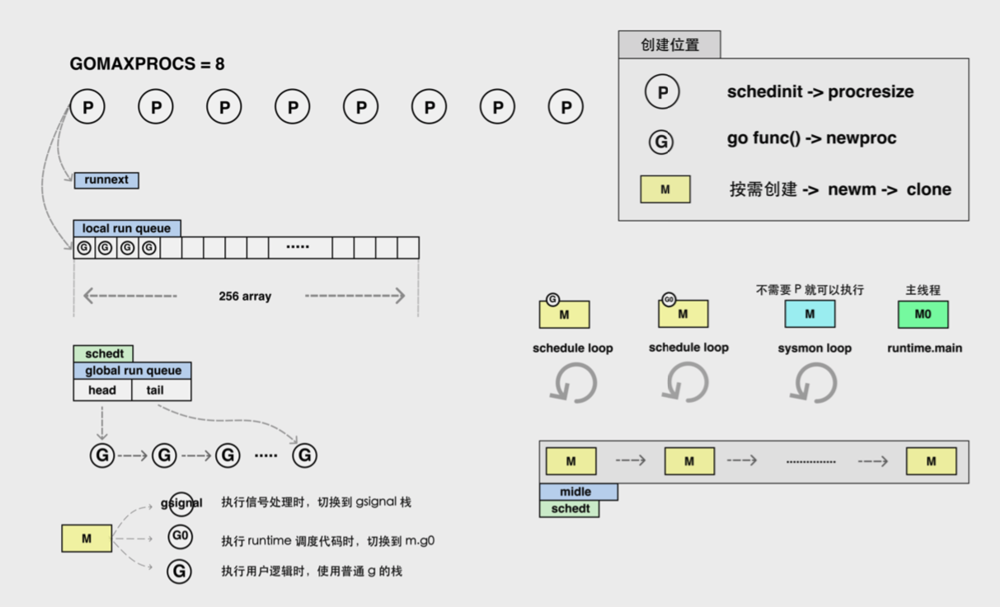

# Go 程序是怎么跑起来的: 对 GO 的启动和执行流程建立简单的宏观认知

语言深度:
- 调度原理
- 调试技巧
- 汇编/反汇编
- 内部数据结构实现
- 常见 syscall
- 函数调用规约(待定)
- 内存管理与垃圾回收
- 并发编程
  
应用深度:
- 框架原理
  - web 框架
  - grpc
- 社区框架分析
- 模块分成
- linter 规范
- 中台场景实现
  - 数据中台案例讲解
- 性能调优

架构广度
- 模块拆分
- CI/CD 实战(coding 平台)
- 监控与可观测
- 基础设施
  - 服务发现
  - 信息检索
  - 定时任务
- 稳定性保障
- 未来架构
  - service mesh
  - dapr
- 语言前沿


工程师的学习与进步
- **多写代码**, 积累代码量, 多总结思考, 自动化/系统化, 积累自己的代码库/笔记库/开源项目
- **读好书**, 建立知识体系: 如 `Designing Data-Intensive Application` 这种书, 应该读好多遍.
- 关注靠谱的**国内外新闻源**, 通过问题出发, 主动使用 Google, Reddit, hackernews 上参与讨论, 避免被困在信息茧房中
    背托福单词
- **锻炼口才与演讲能力**, 内部分享 -> 外部分享. 在公司内, 该演要演, 不要只是闷头干活.
- 通过**输出**促进输入(博客/公众号/分享), 打造个人品牌, 通过读者的反馈循环提升自己的认知.
- 信息源:
  - Github Trending
  - reddit
  - medium
  - hacker news
  - morning paper(作者不干了): 论文
  - acm.org: 论文, 可以登录 o'reily online
  - o'reily
  - 国外领域的相关大会:
    - OSDI
    - SOSP
    - VLDB
  - 国际一流公司的技术博客
    - 美团
    - 阿里巴巴 云原生
  - YouTube 上国外工程师的演讲


## 理解可执行文件

Linux 的可执行文件格式 ELF(Executable and Linkable Format) .

ELF 有下面几部分构成:
- ELF header
- Section Header
- Sections

```
参考:
1. https://github.com/corkami/pics/blob/28cb0226093ed57b348723bc473cea0162dad366/binary/elf101/elf101.pdf
```

操作系统执行可执行文件的步骤(以 Linux 为例):
```
解析 ELF header -> 加载文件内容到内存 -> 从 entry point 开始执行代码
```

Tips
1. dlv : go debug 工具, https://github.com/go-delve/delve
    - https://www.jianshu.com/p/2802d71ab9e9
    - https://linuxtools-rst.readthedocs.io/zh_CN/latest/tool/readelf.html
2. readelf : `yum install binutils`

## Go 进程的启动与初始化

计算机如何执行程序?
- CPU 无法理解文本, 只能执行一条一条的二进制机器码指令, 每次执行完一条指令, **PC 寄存器**就指向下一条继续执行.
- 在 63 位平台上 **PC 寄存器** = **rip**.

通过 entry point 找到 Go 进程的执行入口:
```
runtime._rt0_amd64_linux -> runtime._rt0_amd64 -> runtime.rt0_go

runtime.rt0_go :
    - argc, argv 处理
    - 全局 m0, g0 初始化
        - m0 : Go 程序启动后创建的第一个线程
    - 获取 CPU 核心数
    - 初始化内置数据结构
    - 开始执行用户 main 函数 --> 从这里开始进入调度循环.
```

## 调度组件 与 调度循环

先关概念 与 文字定义: GMP 模型
- G: goroutine, 可以理解成一个计算任务. 由需要执行的代码和其上下文组成.
    上下文包括:
    - 当前代码位置
    - 栈顶/栈底 位置
    - 状态 等.
- M: machine, 系统线程, 执行实体, 想要在 CPU 上执行代码, 必须有线程, 与 C 语言中的线程相同, 通过系统调用 clone 来创建.
- P: 逻辑概念. processor, 虚拟处理器, M 必须获得 P 才能执行代码, 否则必须陷入休眠(后台监控线程除外), 你也可以将其理解为一种 Token, 有这个 Token, 才有在物理 CPU 核心上执行的权利.
    - 队列
    - 缓存
    Finally, a "P" represents the resources required to execute user Gocode, such as scheduler and memory allocator state.

G 的数量一般比 M 要多很多, 所以也有人称其为 `M:N` 模型.


Go 的调度流程**本质**上是一个**生产-消费**流程.


调度组件


goroutine 生产端


goroutine 消费端


Work stealing 就是说 `runqsteal -> runqgrab` 这个流程.


仅仅能够处理正常情况是不行的, 如果程序中有阻塞, 那线程不就全被堵上了?

## 处理阻塞

在线程发生阻塞的时候, 会无限制的创建线程么? 并**不会**.

阻塞有一下几种情况: --> 被  runtime 拦截到的阻塞.
1. channel send/revc
    
    
    ```go
    // Chanel send
    var ch = make(chan int)
    ch <- 1

    // channel recv
    var ch = m,ake(chan int)
    <- ch
    ```


2. connection read/write block
    
    

    ```go
    // net write
    var c net.Conn
    var buf = []byte("hello")

    // send buffer full, write blocked
    n, err := c.Write(buf)
    ```

3. time.Sleep block

    

    ```go
    time.Sleep(time.Hour)
    ```

4. select block

    

    ```go
    var (
        ch1 = make(chan int)
        ch2 = make(chan int)
    )

    // no case ready, block
    select {
        case <- ch1:
            println("ch1 ready")
        case <- ch2:
            println("ch3 ready")
    }
    ```

5. lock block
    
    

    ```go
    var l sync.RWMutex

    // somebodu already grap the lock, block here
    l.Lock()
    ```

这些情况下不会阻塞调度循环, 而是会把 goroutine 挂起, 所谓的挂起, 其实让 g 先进某个数据结构, 待 ready 后再继续执行, 不会占用线程. 这时候, 线程会进入 schedule , 继续消费队列, 执行其他的 g .

为啥有的等待是 `sudog`, 有的是 `g`: g 与 sudog 是一对多的关系
> sudog represents a g in a wait list, such as for sending/receiving on a channel
> sudog is necessary because the g <-> synchronization object relation is many-to-many. 
> - A g can be on many wait lists, so there may be many sudogs for on g;
> - and many gs may be waiting on the same synchronization object, so there may be many sudogs for the object.
> 就是说 一个 g 可能对应多个 sudog, 比如一个 g 会同时 select 多个 channle.

还有一些是 runtime 无法拦截的: **执行 C 代码, 或者阻塞在 syscall 上时, 必须占用一个线程**
- 执行 C 代码: CGO
    ```go
    package main 
    /*
    #include <stdio.h>
    #include <stdlib.h>
    #include <unistd.h>
    void output(char *str) {
        usleep(1000000);
        printf("%s\n", str)
    }
    */

    import "C"
    import "unsafe"
    ```
- 阻塞的 syscall
    - `sys`: syscall blocking
    - `sysnb`: syscal nonblocking

    


`sysmon`: system monitor, 高优先级, 在专有线程中执行, 不需要绑定 P 就可以执行.

- `checkdead` -> 常见误解: 这个可以检查 死锁
    > Check for deadlock situation. The check is based on number of running M's, if 0 --> deadlock.
- `netpoll`: inject g list to global runqueue
- `retake`:
    - 如果是 syscall 卡了很久, 那就吧 p 剥离(handoffp)
    - 如果是用户 g 运行很久了, 那么发信号 SIGURG 抢占.

## 调度器的发展历史

参考: https://github.com/golang-design/history#scheduler

- `paper/work-steal` Robert D. Blumofe and Charles E. Leiserson. 1999. Scheduling multithreaded computations by work stealing. J. ACM 46, 5 (September 1999), 720-748.
- `cl/sched-m-1` Russ Cox, Clean up scheduler. Aug 5, 2008.
- `cl/sched-m-n` things are much better now, Nov 11, 2009. **M:N appears here**
- `design/go11sched` Dmitry Vyukov. Scalable Go Scheduler Design Doc, 2012 **GM --> GMP**
  - `cl/7314062` runtime: improved scheduler
- `design/sched-preempt-dmitry` Dmitry Vyukov. Go Preemptive Scheduler Design Doc, 2013
- `design/sched-numa` Dmitry Vyukov, NUMA-aware scheduler for Go. Sep 2014.
- `design/go15gomaxprocs` Russ Cox. Go 1.5 GOMAXPROCS Default. May 2015.
- `doc/go17sched` Ian Lance Taylor. How does the golang scheduler work? July 16, 2016.
- `design/sched-preempt-austin` Austin Clements. Proposal: Non-cooperative goroutine preemption. Jan 2019. **noncooperative preemption 非合作式抢占**


## 与调度有关的常见问题
1. Goroutine 比 Thread 优势在哪里?
    
    | x | Goroutine | Thread |
    |--|--|--|
    | 内存占用 | 2KB -> 1GB | 一般为 几MB, 且无法增长, 调用多会 stack overflow |
    | Context Switch | NS 级 | 1-2 us |
    | 由谁管理 | Go runtime | 操作系统 |
    | 通信方式 | CSP/传统共享内存 | 传统共享内存 |
    | ID | 有, 用户无法访问 | 有 |
    | 前瞻 | 1.13 以前需主动让出, 1.14 开始可由信号中断 | 内核抢占 |

2. goroutine 的切换成本

    `gobuf` 描述一个 goroute 所有现场, 从一个 g 切换到另一个 g, 只要吧这几个现场字段保存下来, 再把 g 往队列里一扔, m 就可以执行其他的 g 了, **无需进入内核态**.

    ```go
    type gobuf struct {
        // The offsets of sp, pc, and g are known to (hard-coded in) libmach.
        //
        // ctxt is unusual with respect to GC: it may be a
        // heap-allocated funcval, so GC needs to track it, but it
        // needs to be set and cleared from assembly, where it's
        // difficult to have write barriers. However, ctxt is really a
        // saved, live register, and we only ever exchange it between
        // the real register and the gobuf. Hence, we treat it as a
        // root during stack scanning, which means assembly that saves
        // and restores it doesn't need write barriers. It's still
        // typed as a pointer so that any other writes from Go get
        // write barriers.

        sp   uintptr
        pc   uintptr
        g    guintptr
        ctxt unsafe.Pointer
        ret  sys.Uintreg
        lr   uintptr
        bp   uintptr // for framepointer-enabled architectures
    }
    ```

3. 输出顺序问题, 如下两段代码分别输出什么? 1.13 和 1.14 不同

    ```go
    package main
    import (
        "fmt"
        "runtime"
    )

    func main() {
        runtime.GOMAXPROCS(1)
        for i:=0; i<10; i++ {
            i := i
            go func() {
                fmt.Println("A: ", i)
            }()
        }

        var ch = make(chan int)
        <- ch
    }

    // 输出: 
    // A:  9
    // A:  0
    // A:  1
    // A:  2
    // A:  3
    // A:  4
    // A:  5
    // A:  6
    // A:  7
    // A:  8
    // fatal error: all goroutines are asleep - deadlock!
    // 
    // goroutine 1 [chan receive]:
    // main.main()
    //     /Users/bob/Documents/LeYan/code/goMooc/day01/code/main.go:17 +0x96
    // exit status 2

    ```

    代码 2:
    ```go
    package main
    import (
        "fmt"
        "time"
        "runtime"
    )

    func main() {
        runtime.GOMAXPROCS(1)
        for i:=0; i<10; i++ {
            i := i
            go func() {
                fmt.Println("A: ", i)
            }()
        }

        time.Sleep(time.Hour)
    }

    // 输出: 
    // 
    // A:  9
    // A:  0
    // A:  1
    // A:  2
    // A:  3
    // A:  4
    // A:  5
    // A:  6
    // A:  7
    // A:  8
    // 
    // sleep here
    ```

4. 死循环导致进程 hang 死问题

## 参考资料
- xargin 大佬
  - 笔记: https://github.com/cch123/golang-notes
  - 博客: https://xargin.com/
- golang 设计核心: https://github.com/golang-design/history#scheduler
- go 语言原本: https://golang.design/under-the-hood/

## 作业

关于作业：
* 部署好本机的 docker 环境，使用 ppt 中的 dockerfile build 自己的环境
* 使用 readelf 工具，查看编译后的进程入口地址
* 在 dlv 调试工具中，使用断点功能找到代码位置
* 使用断点调试功能，查看 Go 的 runtime 的下列函数执行流程，使用 IDE 查看函数的调用方：
    * 必做：runqput，runqget，globrunqput，globrunqget
    * 选做：schedule，findrunnable，sysmon
* 难度++课外作业：跟踪进程启动流程中的关键函数，rt0_go，需要汇编知识，可以暂时不做，只给有兴趣的同学

https://www.notion.so/ch01-Go-fd34a462323a47b3b9760d0f1175df77

https://blog.weekii.cn/post/13

### 汇编

编译 -> 汇编 -> 优化 -> 链接

go plan9 汇编入门: https://www.bilibili.com/video/av46494102


https://github.com/talkgo/night


https://github.com/cch123/asmshare.git


