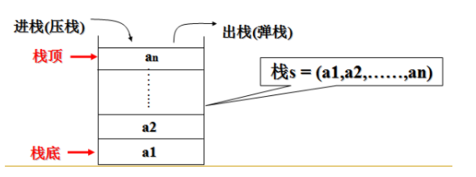

# 堆和栈

## 数据结构中的堆和栈
堆栈是两种数据结构 :  堆和栈. 

- 栈(stack)就像装数据的桶或箱子

    我们先从大家比较熟悉的栈说起吧, 它是一种具有后进先出性质的数据结构, 也就是说后存放的先取, 先存放的后取. 

    这就如同我们要取出放在箱子里面底下的东西（放入的比较早的物体）, 我们首先要移开压在它上面的物体（放入的比较晚的物体）. 

    

- 堆(heap)像一棵倒过来的树

    - 堆是一种经过排序的**树形**数据结构, 每个结点都有一个值. 
    - 通常我们所说的堆的数据结构, 是指**二叉堆**. 
    - 堆的特点是**根结点的值最小（或最大）**, 且根结点的两个子树也是一个堆. 

## 内存分配中的堆区和栈区

- 栈区（stack）: 由编译器**自动**分配释放 , 存放函数的参数值, 局部变量的值等. 其操作方式类似于数据结构中的栈. 
- 堆区（heap） : 一般由**程序员分配释放**,  若程序员不释放, 程序结束时可能由OS回收 . 

### 堆区和栈区的区别和联系: 

1.申请方式
  
  - **堆**是由程序员自己申请并指明大小, 在`c`中`malloc`函数 如`p1 = (char *)malloc(10)`;
  - **栈**由系统自动分配, 如声明在函数中一个局部变量 `int b;` 系统自动在栈中为b开辟空间

2.申请后系统的响应

  - 栈 :  只要栈的剩余空间大于所申请空间, 系统将为程序提供内存, 否则将报异常提示**栈溢出**. 
  - 堆 :  首先应该知道操作系统有一个记录空闲内存地址的链表, 当系统收到程序的申请时, 会 遍历该链表, 寻找第一个空间大于所申请空间的堆结点, 然后将该结点从空闲结点链表中删除, 并将该结点的空间分配给程序, 另外, 对于大多数系统, 会在这块内 存空间中的首地址处记录本次分配的大小, 这样, 代码中的delete语句才能正确的释放本内存空间. 另外, 由于找到的堆结点的大小不一定正好等于申请的大 小, 系统会自动的将多余的那部分重新放入空闲链表中. 

3.申请大小的限制

  - 栈 :  在Windows下,栈是向低地址扩展的数据结 构, 是一块连续的内存的区域. 这句话的意思是栈顶的地址和栈的最大容量是系统预先规定好的, 在WINDOWS下, 栈的大小是2M（也有的说是1M, 总之是 一个编译时就确定的常数）, 如果申请的空间超过栈的剩余空间时, 将提示overflow. 因此, 能从栈获得的空间较**小**.     
  - 堆 :  堆是向高地址扩展的数据结构, 是不连续的内存区域. 这是由于系统是用链表来存储的空闲内存地址的, 自然是不连续的, 而链表的遍历方向是由低地址向高地址. 堆的大小受限于计算机系统中有效的虚拟内存. 由此可见, 堆获得的空间比较灵活, 也比较**大**. 

4.申请效率的比较

  - 栈由系统自动分配, 速度较**快**. 但程序员是无法控制的.     
  - 堆是由new分配的内存, 一般速度比较**慢**, 而且容易产生内存碎片,不过用起来最方便.

