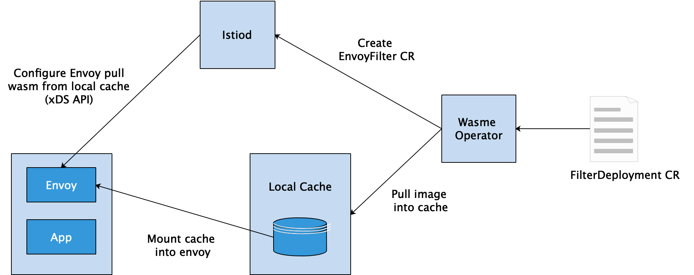

## solo.io & wasme

开发工具 与 脚手架: [wasme](https://github.com/solo-io/wasm)

开发教程:  https://docs.solo.io/web-assembly-hub/latest/tutorial_code/

wasme 仓库: https://webassemblyhub.io/

### SDK
https://github.com/proxy-wasm/spec
https://github.com/proxy-wasm/spec/blob/master/docs/WebAssembly-in-Envoy.md

1. AssemblyScript SDK (TypeScript 子集)
    - [proxy-runtime](https://github.com/solo-io/proxy-runtime)

2. C++
    - [proxy-wasm-cpp-sdk](https://github.com/proxy-wasm/proxy-wasm-cpp-sdk)

3. Rust
    - [Rust 程序设计语言](https://kaisery.github.io/trpl-zh-cn/ch01-02-hello-world.html)
    - [proxy-wasm-rust-sdk](https://github.com/proxy-wasm/proxy-wasm-rust-sdk)
    - [envoy-wasm-rust-sdk](https://github.com/tetratelabs/envoy-wasm-rust-sdk)

4. TinyGo: 一个微型 Go 编译器
    - [TinyGO With WebAssembly](https://tinygo.org/webassembly/)
    - [proxy-wasm-go-sdk](https://github.com/tetratelabs/proxy-wasm-go-sdk)

5. getEnvoy 扩展包:
    - https://cloudnative.to/blog/introducing-getenvoy-extension-toolkit-for-webassembly-based-envoy-extensions/


### 部署
#### wasm operator
- https://docs.solo.io/web-assembly-hub/latest/tutorial_code/wasme_operator/

官方推荐使用 Wasme Operator 管理 Service Mesh 集群中的 wasm filter。主要包括两个组件：
- 镜像缓存：从 filter registry 拉取 filter 镜像，并缓存到本地，该组件以 DaemonSet 的形式进行部署；
- operator：安装、配置 wasm filter 到数据面代理，以 Kubernetes Deployment 的形式部署。

示例:

```yaml
apiVersion: wasme.io/v1
kind: FilterDeployment
metadata:
  name: bookinfo-custom-filter
  namespace: bookinfo
spec:
  deployment:
    istio:
      kind: Deployment
  filter:
    config: '{"name":"hello","value":"world"}'
    image: webassemblyhub.io/ilackarms/istio-test:1.5.0-0
```
对应的 EnvoyFilter 配置:
```yaml
apiVersion: networking.istio.io/v1alpha3
kind: EnvoyFilter
metadata:
  creationTimestamp: "2020-04-23T09:19:34Z"
  generation: 1
  name: productpage-v1-myfilter
  namespace: default
  resourceVersion: "9071122"
  selfLink: /apis/networking.istio.io/v1alpha3/namespaces/default/envoyfilters/productpage-v1-myfilter
  uid: b528b175-5e08-4b08-85ed-a324a2418a64
spec:
  configPatches:
  - applyTo: HTTP_FILTER
    match:
      context: SIDECAR_INBOUND
      listener:
        filterChain:
          filter:
            name: envoy.http_connection_manager
            subFilter:
              name: envoy.router
    patch:
      operation: INSERT_BEFORE
      value:
        config:
          config:
            name: myfilter
            rootId: add_header_root_id
            vmConfig:
              code:
                local:
                  filename: /var/local/lib/wasme-cache/72ad74e260c99fd77bbfd62f5dfab16af666dbdee8bacca39d97eafe60c69584
              runtime: envoy.wasm.runtime.v8
              vmId: myfilter
        name: envoy.filters.http.wasm
  workloadSelector:
    labels:
      app: productpage
      version: v1
```
对应的 Envoy 配置:
```yaml
{
 "name": "envoy.filters.http.wasm",
 "config": {
  "config": {
   "name": "myfilter",
   "rootId": "add_header_root_id",
   "vmConfig": {
    "code": {
     "local": {
      "filename": "/var/local/lib/wasme-cache/72ad74e260c99fd77bbfd62f5dfab16af666dbdee8bacca39d97eafe60c69584"
     }
    },
    "runtime": "envoy.wasm.runtime.v8",
    "vmId": "myfilter"
   }
  }
 }
},
```

工作原理分析 , 刚才我们使用 wasme 命令行工具完成了 wasm filter 的构建、部署过程，其背后的工作原理简单描述如下: 
- 由 Wasme Operator 设置 wasm filter 的本地缓存信息，同时生成 EnvoyFilter 资源提交给k8s；
- 镜像缓存模块拉取需要的 wasm filter 到本地缓存中，该模块以 DaemonSet 的形式部署在集群节点中；
- 缓存模块拉取完成后，将 wasm 文件挂载到目标的workload中；
- 同时，Istiod 监测到 EnvoyFilter 变更，通过 xDS API 将 wasm 文件的信息下发到 envoy 代理。



### 使用 Wasm 扩展 Envoy Proxy 的优缺点

在实际应用中，会根据以下优缺点来决定是否使用 Wasm 这种方式扩展 Envoy Filter。

1. Pros

    - 敏捷性 : 过滤器可以动态加载到正在运行的 Envoy 进程中，而无需停止或重新编译。
    - 可维护性 : 不必更改 Envoy 自身基础代码库即可扩展其功能。
    - 多样性 : 可以将流行的编程语言（例如 C/C++ 和 Rust）编译为 WASM，因此开发人员可以选择实现过滤器的编程语言。
    - 可靠性和隔离性 : 过滤器会被部署到 VM 沙箱中，因此与 Envoy 进程本身是隔离的；即使当 WASM Filter 出现问题导致崩溃时，它也不会影响 Envoy 进程。
    - 安全性 : 过滤器通过预定义 API 与 Envoy 代理进行通信，因此它们可以访问并只能修改有限数量的连接或请求属性。
    
2. Cons

    - 性能约为 C++ 编写的原生静态编译的 Filter 的 70％。
    - 由于需要启动一个或多个 WASM 虚拟机，因此会消耗一定的内存使用量。
    - The WebAssembly ecosystem is still young。

### envoy-wasm 运行机制

如下图所示，envoy-wasm 运行机制包括以下几个步骤：


- Wasm 二进制代码需要能够被动态加载进来，无论是通过 local file 方式还是 xds 远程获取方式。
- 一个 Wasm filter 是否被允许加载，需要一致性校验：https://github.com/proxy-wasm/spec。
- 一旦被加载之后，Wasm filter 就成为 filter chain 的一部分，当新的请求进来之后，还是先进入到原生的 filter，之后进入到 Proxy-Wasm 扩展控制器。
- Proxy-Wasm 扩展控制器会根据在 filter chain 中定义的 configuration 信息，调用并执行注册的校验过的这些 Wasm filter。
- 内置的 Wasm runtime 支持：LLVM-based WAVM ~20MB, and V8 ~10MB。
- 事件驱动模型。
- 兼容 native filter 调用方式。

### 社区实践
- [ucloud - Kubernetes上的Service Mesh实践：用EnvoyFilter扩展Istio ](https://www.servicemesher.com/blog/using-envoyfilter-extend-istio/)
- [使用 Rust 和 WASM 扩展 Istio](https://blog.red-badger.com/extending-istio-with-rust-and-webassembly)
- [Extending Envoy with WASM and Rust](https://antweiss.com/blog/extending-envoy-with-wasm-and-rust/)

## 基础知识

WASM 并不是一种语言，而是字节码标准。理论上任何一种语言，都可以被编译成 WASM 字节码，然后在WASM虚拟机中执行。

- https://istio.io/latest/docs/concepts/wasm/
- https://istio.io/latest/blog/2020/deploy-wasm-declarative/
- [envoy-filter](https://istio.io/latest/docs/reference/config/networking/envoy-filter/)
- [Envoy WASM 源码抽丝剥茧](https://cloudnative.to/blog/envoy-wasm-source-deep-dive/)

### envoy filter 分层

1. 侦听器过滤器: 侦听器过滤器在初始连接阶段访问原始数据并操作 L4 连接的元数据。
2. L4 network filter: 网络过滤器访问和操作 L4 连接上的原始数据，即TCP数据包。
    - [mysql proxy](https://www.envoyproxy.io/docs/envoy/latest/configuration/listeners/network_filters/mysql_proxy_filter)
    - [redis proxy](https://www.envoyproxy.io/docs/envoy/latest/configuration/listeners/network_filters/redis_proxy_filter)
    - [kafka broker filter](https://www.envoyproxy.io/docs/envoy/latest/configuration/listeners/network_filters/kafka_broker_filter)
    - [wasm network filter](https://www.envoyproxy.io/docs/envoy/latest/configuration/listeners/network_filters/wasm_filter)
    
3. L7 http filter: HTTP 过滤器在 L7 上运行，由网络过滤器（即 HTTP 连接管理器，HTTP Connection Manager）创建。这些过滤器用于访问、操作 HTTP 请求和响应
    - [lua filter](https://www.envoyproxy.io/docs/envoy/latest/configuration/http/http_filters/lua_filter)
    - [wasm](https://www.envoyproxy.io/docs/envoy/latest/configuration/http/http_filters/wasm_filter)

### OPAS 及 Wasm filter 注册库
在 Cloud Native 生态系统中，如何管理一个 Artifact 文件，相信绝大多数人会想到 oci 规范标准，是否可以像管理 Docker 镜像那样去管理这些 Wasm filter。

ORAS 项目就是用来解决这个问题的，它的全称为 OCI Registry As Storage。ORAS 是 OCI Artifacts 项目的参考实现，可以显著地简化 OCI 注册库中任意内容的存储。

使用 ORAS API/SDK Library 可以构建自定义工具，完成以下功能：
- 将 WebAssembly 模块推入到 OCI 注册库中。
- 从 OCI 注册库中拉取 WebAssembly 模块。

以阿里云容器镜像服务企业版 ACR EE 为例，作为企业级云原生应用制品管理平台，已经提供了容器镜像、Helm Chart 以及符合 OCI 规范的制品的生命周期管理。开通之后，创建一个镜像仓库，会分配一个地址，提供了 vpc 和公网两种方式。

使用 oras login 命令行登录, 执行以下命令：

oras login --username=<登录账号> acree-1-registry.cn-hangzhou.cr.aliyuncs.com

## 泳道
### 应用网络层: http/grpc
1. 应用 打 lable
2. vs + ds --> service 配合实现.
### 配置层
两种方案:
1. 多 cluster 实现,
2. 多 apollo 实例实现, 依赖 mysql.

### 数据层
1. 物理隔离方案
2. 数据隔离方案:
   - redis: 
   - kafka/schemaRedistry: 
   - mysql: 
3. 备份与导入:
    - kafka: 
      - https://github.com/Cobliteam/kafka-topic-dumper/blob/master/kafka_topic_dumper/kafka_client.py
      - https://medium.com/@anatolyz/introducing-kafka-backup-9dc0677ea7ee
      - https://www.digitalocean.com/community/tutorials/how-to-back-up-import-and-migrate-your-apache-kafka-data-on-ubuntu-18-04
      - [kafka 消息跟踪](https://www.servicemesher.com/istio-handbook/practice/kafka-tracing.html) 

### 协议
- Redis
  - [redis 协议](http://redisdoc.com/topic/protocol.html)
  - [redis 协议详解](https://www.nginx.cn/5066.html)

- mysql
  - https://domicat.me/_posts/2020-03-16-mysql-client-server-protocol/
  - http://hutaow.com/blog/2013/11/06/mysql-protocol-analysis/
  - https://gohalo.me/post/mysql-protocol.html
  - https://blog.csdn.net/weixin_42517963/article/details/113313398
  - https://www.jianshu.com/p/ef286d39e41d

- kafka
  - [kafka 通讯协议指南](https://colobu.com/2017/01/26/A-Guide-To-The-Kafka-Protocol/)

## Aeraki: Manage any layer 7 traffic in Istio Service Mesh.

官网:
- https://github.com/aeraki-framework
- https://github.com/aeraki-framework/aeraki

参考: 
- https://cloudnative.to/blog/istiocon-layer7-traffic/
- https://www.cnblogs.com/tencent-cloud-native/p/14501387.html
