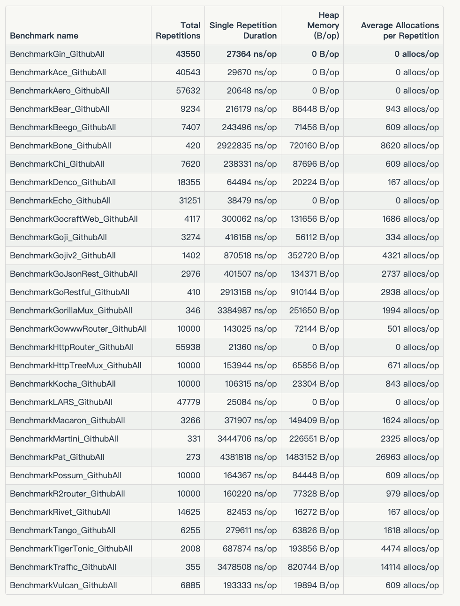
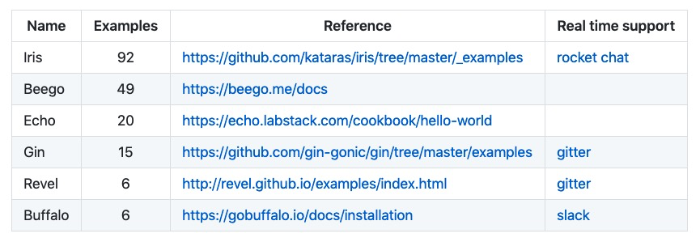
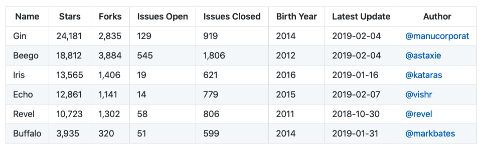
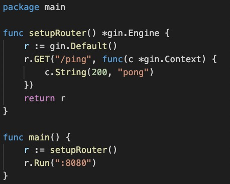
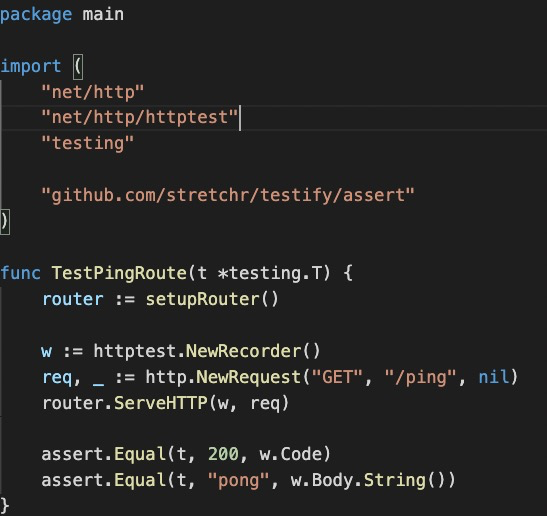

# Go Web 框架

- Beego：开源的高性能 Go 语言 Web 框架: `https://beego.me`
- Gin：Go 语言编写的 Web 框架，更好的性能, Martini like : `https://github.com/gin-gonic/gin`
- Echo：简约的高性能 Go 语言 Web 框架: `https://github.com/labstack/echo`
- Iris：全宇宙最快的 Go 语言 Web 框架。完备 MVC 支持，未来尽在掌握: `https://github.com/kataras/iris`
- go-zero: 集成了各种工程实践的 web 和 rpc 框架: `https://github.com/tal-tech/go-zero`

---
# Why Gin ?
## 高性能

https://github.com/smallnest/go-web-framework-benchmark



---
## 学习曲线


---

```shell
$ vim main.go

    package main

    import "github.com/gin-gonic/gin"

    func main() {
        r := gin.Default()
        r.GET("/ping", func(c *gin.Context) {
            c.JSON(200, gin.H{
                "message": "pong",
            })
        })
        r.Run() // listen and serve on 0.0.0.0:8080
    }

$ go run main.go

$ curl localhost:8080/ping
```
---
## 受欢迎程度


---
## 方便扩展
- Middleware : https://github.com/gin-gonic/contrib
- 扩展使用 grpc 实现服务间通信: [集成 grpc](https://github.com/gin-gonic/examples/tree/master/grpc)
- web 作为 portal, 方便应用使用: [gin-vue-admin](https://github.com/flipped-aurora/gin-vue-admin)
    - vue + gin: 比较熟悉.
	- 权限管理: 基于jwt和casbin实现的权限管理
    - 配置管理: 配置文件可前台修改
	- 代码生成器: 后台基础逻辑以及简单curd的代码生成器
	- swagger: 集成

---
# 文档
- Http Server
  - http server 
  - gin middleware
  - 日志
- 路由/请求
- 模板/响应
- 测试: 
  - httptest

---

## 1. 自定义 HTTP Server 配置

```go
func main() {
	// 使用 gin
	router := gin.Default()
	router.Run(":8080")

	// 直接使用 `http.ListenAndServe()`
	http.ListenAndServe(":8080", router)

	// 其他参数
	s := &http.Server{
		Addr:           ":8080",
		Handler:        router,
		ReadTimeout:    10 * time.Second,
		WriteTimeout:   10 * time.Second,
		MaxHeaderBytes: 1 << 20,
	}
	s.ListenAndServe()
}
```
---
```go
func (engine *Engine) Run(addr ...string) (err error) {
	defer func() { debugPrintError(err) }()

	address := resolveAddress(addr)
	debugPrint("Listening and serving HTTP on %s\n", address)
	err = http.ListenAndServe(address, engine)
	return
}
```

---
## 2. Multiple service: errgroup

多 Server 场景, 需要将多个 Server 配置到 goroutine 中运行, 核心是使用 "golang.org/x/sync/errgroup" goroutines 实现:

```go
var (
	g errgroup.Group
)

func main() {
	server01 := &http.Server{
		Addr:         ":8080",
		Handler:      router01(),
		ReadTimeout:  5 * time.Second,
		WriteTimeout: 10 * time.Second,
	}

	server02 := &http.Server{
		Addr:         ":8081",
		Handler:      router02(),
		ReadTimeout:  5 * time.Second,
		WriteTimeout: 10 * time.Second,
	}

	g.Go(func() error {
		err := server01.ListenAndServe()
		return err
	})

	g.Go(func() error {
		err := server02.ListenAndServe()
		return err
	})

	if err := g.Wait(); err != nil {
		log.Fatal(err)
	}
}
```

---
## 2. Gin 初始化 及 配置

### 2.1 空白/默认 gin server

```go
router := gin.New() 		// 未加载任何中间件的 gin server
router := gin.Default() 	// 默认配置的 Gin Server, 只配置 Logger , Recovery 两个中间件.
```

---

### 2.1 配置使用 Gin 中间件

```go
func main() {
	r := gin.New()

	// 使用全局 中间件
	r.Use(gin.Logger())
	r.Use(gin.Recovery())
	
	// 可以给每个单独的路由, 添加任意多个 中间件
	r.GET("/benchmark", MyBenchLogger(), benchEndpoint)

	// 给每个 URL 组添加任意多个 中间件
	authorized := r.Group("/")
	authorized.Use(AuthRequired())
	{
		authorized.POST("/login", loginEndpoint)
		authorized.POST("/logout", logoutEndpoint)
	}

	// Listen and serve on 0.0.0.0:8080
	r.Run(":8080")
}
```

---
## 3. 日志相关
- 日志双写
- 自定义日志格式

---

### 3.1 将日志写入日志文件

```go
func main() {
	// 禁用 日志的 控制台颜色 功能
    gin.DisableConsoleColor()

    // 将日志输出到文件
	// `var DefaultWriter io.Writer = os.Stdout`
    f, _ := os.Create("gin.log")
    gin.DefaultWriter = io.MultiWriter(f)

	// 同时 将日志 写入文件 和 标准输出.
    gin.DefaultWriter = io.MultiWriter(f, os.Stdout)
}
```
---

### 3.2 自定义日志格式

```go
func main() {
	router := gin.New()

	// LoggerWithFormatter 默认将日志写入 gin.DefaultWriter
	router.Use(gin.LoggerWithFormatter(func(param gin.LogFormatterParams) string {
		// 自定义日志格式
		return fmt.Sprintf("%s - [%s] \"%s %s %s %d %s \"%s\" %s\"\n",
				param.ClientIP,
				param.TimeStamp.Format(time.RFC1123),
				param.Method,
				param.Path,
				param.Request.Proto,
				param.StatusCode,
				param.Latency,
				param.Request.UserAgent(),
				param.ErrorMessage,
		)
	}))
}
```

**日志输出样例**
```
::1 - [Fri, 07 Dec 2018 17:04:38 JST] "GET /ping HTTP/1.1 200 122.767µs "Mozilla/5.0 (Macintosh; Intel Mac OS X 10_11_6) AppleWebKit/537.36 (KHTML, like Gecko) Chrome/71.0.3578.80 Safari/537.36" "
```
---
## 4. 请求方法

```go
router := gin.Default()

router.GET("/someGet", getting)
router.POST("/somePost", posting)
router.PUT("/somePut", putting)
router.DELETE("/someDelete", deleting)
router.PATCH("/somePatch", patching)
router.HEAD("/someHead", head)
router.OPTIONS("/someOptions", options)

// 匹配任意请求方法
router.Any("/test", handlerAny)

// 没有路由匹配时, 返回 404 页面
router.NoRoute(func(c *gin.Context) {
	c.HTML(http.StatusNotFound, "views/404.html", nil)
})

// 默认实现
func (engine *Engine) NoRoute(handlers ...HandlerFunc) {
	engine.noRoute = handlers
	engine.rebuild404Handlers()
}

```

---
## 5. URL 分组

```go
func main() {
	router := gin.Default()

	// Simple group: v1
	v1 := router.Group("/v1")
	{
		v1.POST("/login", loginEndpoint)
		v1.POST("/read", readEndpoint)
	}

	// Simple group: v2
	v2 := router.Group("/v2")
	{
		v2.POST("/login", loginEndpoint)
		v2.POST("/read", readEndpoint)

		// 组内嵌组.
		testing := v2.Group("testing")
		testing.GET("/newtest", newtestEndpoint)
	}
}
```
---

## 6. 请求与参数
- `/user/:name/*action`: 路由匹配
  - `:`: 精准匹配
  - `*`: 匹配所有
- `c.Query`, `c.DefaultQuery`: 查询字符串
- `c.PostForm`, `c.DefaultPostForm`: Multipart, url encode
  - `application/x-www-form-urlencoded`
  - `multipart/form-data`
- `c.QueryMap`, `c.PostFormMap`: 字典.
---

### 6.1 URL 地址包含 请求参数
```go
// 如下路由将匹配 /user/john/ 和 /user/john/send
// 如果没有其他的路由匹配 /user/john , 服务会重定向 到 /user/john/
router.GET("/user/:name/*action", func(c *gin.Context) {
    name := c.Param("name")
    action := c.Param("action")
    message := name + " is " + action
    c.String(http.StatusOK, message)        // tom is /read
})
```
---
### 6.2 查询字符串

```go
// URL 查询字符串
router.GET("/welcome", func(c *gin.Context) {
    firstname := c.DefaultQuery("firstname", "Guest")
	// shortcut for c.Request.URL.Query().Get("lastname")
    lastname := c.Query("lastname") 

    c.String(http.StatusOK, "Hello %s %s", firstname, lastname)
})
```
---
### 6.3 Multipart/Urlencoded Form

```go
router.POST("/form_post", func(c *gin.Context) {
    message := c.PostForm("message")
    nick := c.DefaultPostForm("nick", "anonymous")

    c.JSON(200, gin.H{
        "status":  "posted",
        "message": message,
        "nick":    nick,
    })
})
```
---
### 6.4 Map as querystring or postform parameters

```
POST /post?ids[a]=1234&ids[b]=hello HTTP/1.1
Content-Type: application/x-www-form-urlencoded

names[first]=thinkerou&names[second]=tianou
```
```go
func main() {
    router := gin.Default()

    router.POST("/post", func(c *gin.Context) {

        ids := c.QueryMap("ids")
        names := c.PostFormMap("names")

        fmt.Printf("ids: %v; names: %v", ids, names)
    })
    router.Run(":8080")
}
```
输出:
```
ids: map[b:hello a:1234]; names: map[second:tianou first:thinkerou]
```
---
## 7. model binding

- 基于请求的 Content-Type 识别请求数据类型并利用**反射机制**自动提取请求中QueryString、form表单、JSON、XML等参数到**结构体**中。
- 当使用 model binding 时, 需要配置对应的 标签到所有需要 绑定的 字段. 例如, 当需要从 JSON 做绑定时, 使用 `json:"fieldname"`.
- `binding:"required"` : 用于定义某个字段为必选字段, 如果被 binding 字段为空, 则抛出.

---

Gin 提供两种类型的 binding 方法:

- Must bind: 这些方法封装了 `MustBindWith` 方法. 如果发生 binding 错误, 则请求返回 `c.AbortWithError(400, err).SetType(ErrorTypeBind)`, 返回码 404, `Content-Type: text/plain; charset=utf-8`
  	`Bind`, `BindJSON`, `BindXML`, `BindQuery`, `BindYAML`, `BindHeader`, `BindUri`
- Should bind: 这些方法封装了 `ShouldBindWith` 方法. 如果发生 binding 错误, 则返回错误, 交还给开发者做处理.
	`ShouldBind`, `ShouldBindJSON`, `ShouldBindXML`, `ShouldBindQuery`, `ShouldBindYAML`, `ShouldBindHeader`, `ShouldBindUri`

---
### 7.1 Binding JSON
```go
// Binding from JSON
type Login struct {
	User     string `form:"user" json:"user" xml:"user"  binding:"required"`
	Password string `form:"password" json:"password" xml:"password" binding:"required"`
}

func main() {
	router := gin.Default()

	// Example for binding JSON ({"user": "manu", "password": "123"})
	router.POST("/loginJSON", func(c *gin.Context) {
		var json Login
		if err := c.ShouldBindJSON(&json); err != nil {
			c.JSON(http.StatusBadRequest, gin.H{"error": err.Error()})
			return
		}

		if json.User != "manu" || json.Password != "123" {
			c.JSON(http.StatusUnauthorized, gin.H{"status": "unauthorized"})
			return
		}

		c.JSON(http.StatusOK, gin.H{"status": "you are logged in"})
	})
	// Listen and serve on 0.0.0.0:8080
	router.Run(":8080")
}
```
<!--
**请求示例:**
```shell
$ curl -v -X POST \
  http://localhost:8080/loginJSON \
  -H 'content-type: application/json' \
  -d '{ "user": "manu" }'
> POST /loginJSON HTTP/1.1
> Host: localhost:8080
> User-Agent: curl/7.51.0
> Accept: */*
> content-type: application/json
> Content-Length: 18
>
* upload completely sent off: 18 out of 18 bytes
< HTTP/1.1 400 Bad Request
< Content-Type: application/json; charset=utf-8
< Date: Fri, 04 Aug 2017 03:51:31 GMT
< Content-Length: 100
<
{"error":"Key: 'Login.Password' Error:Field validation for 'Password' failed on the 'required' tag"}
```
-->
---
### 7.2 Binding Uri

```go
package main

import "github.com/gin-gonic/gin"

type Person struct {
	ID string `uri:"id" binding:"required,uuid"`
	Name string `uri:"name" binding:"required"`
}

func main() {
	route := gin.Default()
	route.GET("/:name/:id", func(c *gin.Context) {
		var person Person
		if err := c.ShouldBindUri(&person); err != nil {
			c.JSON(400, gin.H{"msg": err})
			return
		}
		c.JSON(200, gin.H{"name": person.Name, "uuid": person.ID})
	})
	route.Run(":8088")
}
```

请求示例:
```bash
$ curl -v localhost:8088/thinkerou/987fbc97-4bed-5078-9f07-9141ba07c9f3
$ curl -v localhost:8088/thinkerou/not-uuid
```
---
### 7.3 Bind Header: `ShouldBindHeader`

```go
package main

import (
	"fmt"
	"github.com/gin-gonic/gin"
)

type testHeader struct {
	Rate   int    `header:"Rate"`
	Domain string `header:"Domain"`
}

func main() {
	r := gin.Default()
	r.GET("/", func(c *gin.Context) {
		h := testHeader{}

		if err := c.ShouldBindHeader(&h); err != nil {
			c.JSON(200, err)
		}

		fmt.Printf("%#v\n", h)
		c.JSON(200, gin.H{"Rate": h.Rate, "Domain": h.Domain})
	})

	r.Run()

// client
// curl -H "rate:300" -H "domain:music" 127.0.0.1:8080/
// output
// {"Domain":"music","Rate":300}
}
```
---
## 8. 重定向 Redirects: `c.Redirect`
Gin 同时支持 内部重定向 和 外部重定向 .

```go
// 外部重定向
r.GET("/test", func(c *gin.Context) {
	c.Redirect(http.StatusMovedPermanently, "http://www.google.com/")
})

// 内部重定向
r.POST("/test", func(c *gin.Context) {
	c.Redirect(http.StatusFound, "/foo")
})

// 内部重定向
r.GET("/test", func(c *gin.Context) {
    c.Request.URL.Path = "/test2"
    r.HandleContext(c)
})
r.GET("/test2", func(c *gin.Context) {
    c.JSON(200, gin.H{"hello": "world"})
})
```
---
## 9. 响应渲染
- `c.String`
- `c.XML`
- `c.YAML`
- `c.JSON`
  - `c.SecureJSON`
  - `c.JSONP`
  - `c.PureJSON`
  - `c.AsciiJSON`
- `c.ProtoBuf`
---
### 9.1 XML/YAML/String
```go
r.GET("/someString", func(c *gin.Context) {
	c.XML(http.StatusOK, "SomeString")
})

r.GET("/someXML", func(c *gin.Context) {
	c.XML(http.StatusOK, gin.H{"message": "hey", "status": http.StatusOK})
})

r.GET("/someYAML", func(c *gin.Context) {
	c.YAML(http.StatusOK, gin.H{"message": "hey", "status": http.StatusOK})
})
```
---
### 9.2 JSON
#### 9.2.1 `c.JSON`, `c.SecureJSON`
```go
r := gin.Default()

// gin.H == map[string]interface{}
r.GET("/someJSON", func(c *gin.Context) {
	c.JSON(http.StatusOK, gin.H{"message": "hey", "status": http.StatusOK})
})

r.GET("/moreJSON", func(c *gin.Context) {
	// 可以使用结构体
	var msg struct {
		Name    string `json:"user"`
		Message string
		Number  int
	}
	msg.Name = "Lena"
	msg.Message = "hey"
	msg.Number = 123

	c.JSON(http.StatusOK, msg)
})

// Using SecureJSON to prevent json hijacking. 
r.GET("/secureJSON", func(c *gin.Context) {
	names := []string{"lena", "austin", "foo"}
	c.SecureJSON(http.StatusOK, names)
})

```
---
#### 9.2.3 JSONP: `c.JSONP`

Using JSONP to request data from a server  in a different domain. Add callback to response body if the query parameter callback exists.

```go
func main() {
	r := gin.Default()

	r.GET("/JSONP", func(c *gin.Context) {
		data := gin.H{
			"foo": "bar",
		}

		//callback is x, Will output  :   x({\"foo\":\"bar\"})
		c.JSONP(http.StatusOK, data)
	})

	// Listen and serve on 0.0.0.0:8080
	r.Run(":8080")

	// client
	// curl http://127.0.0.1:8080/JSONP?callback=x
}
```
---
#### 9.2.4 AsciiJSON: `c.AsciiJSON`

ASCII-only JSON

```go
func main() {
	r := gin.Default()

	r.GET("/someJSON", func(c *gin.Context) {
		data := gin.H{
			"lang": "GO语言",
			"tag":  "<br>",
		}

		// will output : {"lang":"GO\u8bed\u8a00","tag":"\u003cbr\u003e"}
		c.AsciiJSON(http.StatusOK, data)
	})

	// Listen and serve on 0.0.0.0:8080
	r.Run(":8080")
}
```
---
#### 9.2.5 PureJSON: `c.PureJSON`

通常情况下, JSON 会替换特殊 HTML 字符为 unicode 字符. 使用`c.PureJSON` 可以取消这种替换.

```go
func main() {
	r := gin.Default()

	// Serves unicode entities: {"html":"\u003cb\u003eHello, world!\u003c/b\u003e"}%
	r.GET("/json", func(c *gin.Context) {
		c.JSON(200, gin.H{
			"html": "<b>Hello, world!</b>",
		})
	})

	// Serves literal characters: {"html":"<b>Hello, world!</b>"}
	r.GET("/purejson", func(c *gin.Context) {
		c.PureJSON(200, gin.H{
			"html": "<b>Hello, world!</b>",
		})
	})

	// listen and serve on 0.0.0.0:8080
	r.Run(":8080")
}
```
---
#### 9.2.6 使用 jsoniter 加速 json encode/decode
高性能, 完全兼容内置 `encoding/json` 库的 第三方库.

https://github.com/json-iterator/go

```
$ go build -tags=jsoniter .
```

---
### 9.3 ProtoBuf: `c.ProtoBuf`

```go
r.GET("/someProtoBuf", func(c *gin.Context) {
	reps := []int64{int64(1), int64(2)}
	label := "test"
	// protoexample is a generated protocol buffer package.
	data := &protoexample.Test{
		Label: &label,
		Reps:  reps,
	}
	// Note that data becomes binary data in the response
	// Will output protoexample.Test protobuf serialized data
	c.ProtoBuf(http.StatusOK, data)
})
```
---
## 10. 静态文件
- 静态文件服务
  -  `r.Static`
		```go
		func (group *RouterGroup) Static(relativePath, root string) IRoutes {
			return group.StaticFS(relativePath, Dir(root, false))
		}
		```
  -  `r.StaticFS`
  -  `r.StaticFile`
- `c.File`, `c.FileFromFS`, `c.FileAttachment`
- `c.DataFromReader`
---
### 10.1 Serving static files: `r.Static` & `r.StaticFS` & `r.StaticFile`

```go
func main() {
	router := gin.Default()
	router.Static("/assets", "./assets")
	router.StaticFS("/more_static", http.Dir("my_file_system"))
	router.StaticFile("/favicon.ico", "./resources/favicon.ico")

	// Listen and serve on 0.0.0.0:8080
	router.Run(":8080")
}
```
---
### 10.2 Serving data from file: `c.FileFromFS`

```go
func main() {
	router := gin.Default()

	router.GET("/local/file", func(c *gin.Context) {
		c.File("local/file.go")
	})

	var fs http.FileSystem = // ...
	router.GET("/fs/file", func(c *gin.Context) {
		c.FileFromFS("fs/file.go", fs)
	})
}

```
---
### 10.3 Serving data from reader: `c.DataFromReader`

```go
func main() {
	router := gin.Default()
	router.GET("/someDataFromReader", func(c *gin.Context) {
		response, err := http.Get("https://raw.githubusercontent.com/gin-gonic/logo/master/color.png")
		if err != nil || response.StatusCode != http.StatusOK {
			c.Status(http.StatusServiceUnavailable)
			return
		}

		reader := response.Body
 		defer reader.Close()
		contentLength := response.ContentLength
		contentType := response.Header.Get("Content-Type")

		extraHeaders := map[string]string{
			"Content-Disposition": `attachment; filename="gopher.png"`,
		}

		c.DataFromReader(http.StatusOK, contentLength, contentType, reader, extraHeaders)
	})
	router.Run(":8080")
}
```
---
## 11  HTML rendering
- `r.LoadHTMLGlob`, `r.LoadHTMLFiles`: glob 路径匹配, 多文件路径
- `c.HTML`: 渲染 html 模板
- `r.SetFuncMap`: 自定义模板处理函数
- multitemplate: 多模板

---
### 11.1 HTML rendering: `c.HTML`
```go
func main() {
	router := gin.Default()
	router.LoadHTMLGlob("templates/*")
	//router.LoadHTMLFiles("templates/template1.html", "templates/template2.html")
	router.GET("/index", func(c *gin.Context) {
		c.HTML(http.StatusOK, "index.tmpl", gin.H{
			"title": "Main website",
		})
	})
	router.Run(":8080")
}
```

```html
<!--  templates/index.tmpl -->
<html>
	<h1>
		{{ .title }}
	</h1>
</html>
```
---
### 11.2 自定义模板函数: `r.SetFuncMap`

```go
// main.go
import (
    "fmt"
    "html/template"
    "net/http"
    "time"

    "github.com/gin-gonic/gin"
)

func formatAsDate(t time.Time) string {
    year, month, day := t.Date()
    return fmt.Sprintf("%d%02d/%02d", year, month, day)
}

func main() {
    router := gin.Default()
    router.Delims("{[{", "}]}") // 模板 定义字符
    router.SetFuncMap(template.FuncMap{
        "formatAsDate": formatAsDate,
    })
    router.LoadHTMLFiles("./testdata/template/raw.tmpl")

    router.GET("/raw", func(c *gin.Context) {
        c.HTML(http.StatusOK, "raw.tmpl", gin.H{
            "now": time.Date(2017, 07, 01, 0, 0, 0, 0, time.UTC),
        })
    })

    router.Run(":8080")
}

// raw.tmpl
// Date: {[{.now | formatAsDate}]}  <!-- Result: Date: 2017/07/01 -->
```
---
### 11.3 Multitemplate

Gin 默认只支持单个 html 模板, 参考 [multitemplate render](https://github.com/gin-contrib/multitemplate) 可以实现 go 1.6+ `block template`.
```go
import (
	"github.com/gin-contrib/multitemplate"
	"github.com/gin-gonic/gin"
)

func createMyRender() multitemplate.Renderer {
	r := multitemplate.NewRenderer()
	r.AddFromFiles("article", "templates/base.html", "templates/index.html", "templates/article.html")
	return r
}

func main() {
	router := gin.Default()
	router.HTMLRender = createMyRender()
	
	router.GET("/article", func(c *gin.Context) {
		c.HTML(200, "article", gin.H{
			"title": "Html5 Article Engine",
		})
	})
	router.Run(":8080")
}
```

---
## 12. 自定义中间件

一个中间件包含两个部分:
- Part1: 只在初始化中间件时, 执行一次的部分. 此处, 可用于设置所有全局对象, 全局逻辑.
- Part2: 每次请求中, 都要执行的逻辑. 

---
### 12.1 Middleware 结构
```go
func funcName(params string) gin.HandlerFunc {
	// <--- This is Part 1 --->
	if err := change(params); err != nil {
		panic(err)
	}

	return func(c *gin.Context) {
		// <--- This is Part 2 --->
		c.Set("TestVar", params)

		// before request
		c.Next()
		// 不调用该请求的剩余处理程序
		// c.Abort()

		// after request
	}
}
```
---
示例:
```go
func main() {
	router.Use(globalMiddleWare())	// 全局插件
	router.GET("/rest/n/api/*some", mid1(), mid2(), handler) 	// URL 插件
}

func globalMiddleWare() gin.HandlerFunc {
	fmt.Println("Global Middleware ... 1")
	return func(c *gin.Context) {
		fmt.Println("Global Middleware ... 2")
		c.Next()
		fmt.Println("Global Middleware ... 3")
	}
}

func mid1() gin.HandlerFunc {
	fmt.Println("mid1 ... 1")
	return func(c *gin.Context) {
		fmt.Println("mid1 ... 2")
		c.Next()
		fmt.Println("mid1 ... 3")
	}
}

func mid2() gin.HandlerFunc {
	fmt.Println("mid2 ... 1")
	return func(c *gin.Context) {
		fmt.Println("mid2 ... 2")
		c.Next()
		fmt.Println("mid2 ... 3")
	}
}
```
---
```
/*
$ go run main.go

	[GIN-debug] [WARNING] Creating an Engine instance with the Logger and Recovery middleware already attached.

	[GIN-debug] [WARNING] Running in "debug" mode. Switch to "release" mode in production.
	 - using env:	export GIN_MODE=release
	 - using code:	gin.SetMode(gin.ReleaseMode)

	# 中间件只执行一次的逻辑: part1
	Global Middleware ... 1
	mid1 ... 1
	mid2 ... 1
	[GIN-debug] GET    /rest/n/api/*some         --> main.handler (6 handlers)
	[GIN-debug] Environment variable PORT is undefined. Using port :8080 by default
	[GIN-debug] Listening and serving HTTP on :8080

	# 每次请求执行的逻辑: part2
	Global Middleware ... 2
	mid1 ... 2
	mid2 ... 2
	Exec Handler...
	mid2 ... 3
	mid1 ... 3
	Global Middleware ... 3
	[GIN] 2021/03/01 - 17:22:41 | 200 |      27.765µs |             ::1 | GET      "/rest/n/api/asda"

$ curl localhost:8080/rest/n/api/asda

*/

```
---

### 12.2 在中间件中 使用 Goroutines: `c.Copy()`

当在 中间件 或 handler 中使用 Goroutines 时, **不应该** 使用 原请求中的 context, 而应该使用它的一个拷贝 `c.Copy()`.

```go
func main() {
	r := gin.Default()

	r.GET("/long_async", func(c *gin.Context) {
		// create copy to be used inside the goroutine
		cCp := c.Copy()
		go func() {
			time.Sleep(5 * time.Second)
			// note that you are using the copied context "cCp", IMPORTANT
			log.Println("Done! in path " + cCp.Request.URL.Path)
		}()
	})
}
```

---
# 测试
- httptest
- mock: `httptest.Server`, `httptest.NewServer`, `httptest.NewTLSServer`

---
## 1. httptest




---
运行测试:
```
$ go test

    [GIN-debug] [WARNING] Creating an Engine instance with the Logger and Recovery middleware already attached.

    [GIN-debug] [WARNING] Running in "debug" mode. Switch to "release" mode in production.
     - using env:   export GIN_MODE=release
     - using code:  gin.SetMode(gin.ReleaseMode)

    [GIN-debug] GET    /ping                     --> ginLearn.setupRouter.func1 (3 handlers)
    [GIN] 2021/02/25 - 16:45:31 | 200 |      14.423µs |                 | GET      "/ping"
    PASS
    ok      ginLearn    0.018s

```
---
## mock server: `httptest.NewServer`
```go
var weatherResp = []Weather{
	{
		City:    "shenzhen",
		Date:    "10-22",
		TemP:    "15℃~21℃",
		Weather: "rain",
	},
	{
		City:    "beijing",
		Date:    "10-22",
		TemP:    "1℃~11℃",
		Weather: "snow",
	},
}
var weatherRespBytes, _ = json.Marshal(weatherResp)

func TestGetInfoUnauthorized(t *testing.T) {
	// test url: 	url := fmt.Sprintf("%s/weather?city=%s", api, ADDRESS)
	ts := httptest.NewServer(http.HandlerFunc(func(w http.ResponseWriter, r *http.Request) {
		w.WriteHeader(http.StatusUnauthorized)
		w.Write(weatherRespBytes)
		if r.Method != "GET" {
			t.Errorf("Except 'Get' got '%s'", r.Method)
		}

		if r.URL.EscapedPath() != "/weather" {
			t.Errorf("Except to path '/person',got '%s'", r.URL.EscapedPath())
		}

		r.ParseForm()
		topic := r.Form.Get("city")
		if topic != "shenzhen" {
			t.Errorf("Except rquest to have 'city=shenzhen',got '%s'", topic)
		}
	}))
	defer ts.Close()
	api := ts.URL
	fmt.Printf("Url:%s\n", api)
	resp, err := GetWeatherInfo(api)
	if err != nil {
		t.Errorf("ERR: %v", err)
	} else {
		fmt.Println("resp:", resp)
	}
}
```
---

# 第三方包与组件

- [Air](https://github.com/cosmtrek/air): 热加载.
- [GORM](https://github.com/go-gorm/gorm): ORM
- [Casbin](https://github.com/casbin): 支持 ACL/ABAC/RBAC 访问控制模型.
- [spf13/cobra](https://github.com/spf13/cobra): 命令行
- [spf13/viper](https://github.com/spf13/viper): 配置管理
- [sirupsen/logrus](https://github.com/sirupsen/logrus): 日志
- [swaggo/swag](https://github.com/swaggo/swag):  swagger
- [golang-migrate/migrate](https://github.com/golang-migrate/migrate): 数据库迁移工具
- [ginkgo](https://github.com/onsi/ginkgo): BDD (behavior-driver development) 风格的测试框架.
- [gorillatoolkit](https://www.gorillatoolkit.org/): web 开发工具箱, 如 websocket 等.
- [uber-go/fx](https://github.com/uber-go/fx): 依赖注入

<!--
- [httprouter](https://github.com/julienschmidt/httprouter): Gin 使用的多路复用器(multiplexer), 支持路由变量, 高效的路由匹配.
- [nsqio/go-nsq](https://github.com/nsqio/go-nsq): 消息队列
- [vektra/monckery](https://github.com/vektra/mockery): 模拟代码自动生成器
-->
---
# Thanks ~