[toc]

# Istio 介绍

## 1. 功能特点
Service Mesh 也是一种服务治理技术，其核心能力是对流量进行控制。

- 为 HTTP、gRPC、WebSocket 和 TCP 流量自动负载均衡。
- 通过丰富的路由规则、重试、故障转移和故障注入对流量行为进行细粒度控制。
- 提供完善的可观察性方面的能力，包括对所有网格控制下的流量进行自动化度量、日志记录和追踪。
- 提供身份验证和授权策略，在集群中实现安全的服务间通信。

## 2. 核心功能
### 2.1 流量控制
Istio 通过这些自定义资源，实现了对网格内部、网格外部、进出网格边界的流量的全面的控制, 即 所有和网格产生交互的流量都可以被 Istio 所控制.

Istio 流量控制的自定义资源:
- `VirtualService`: 用于**网格内**路由的设置.
- `DestinationRule`: 定义**路由**的*目标服务*和*流量策略*.
- `ServiceEntry`: 注册**外部服务**到网格内，并对其流量进行管理.
- `Ingress、Egress gateway`: 控制**进出网格**的流量.
- `Sidecar`: 对 **Sidecar** 代理进行整体设置.

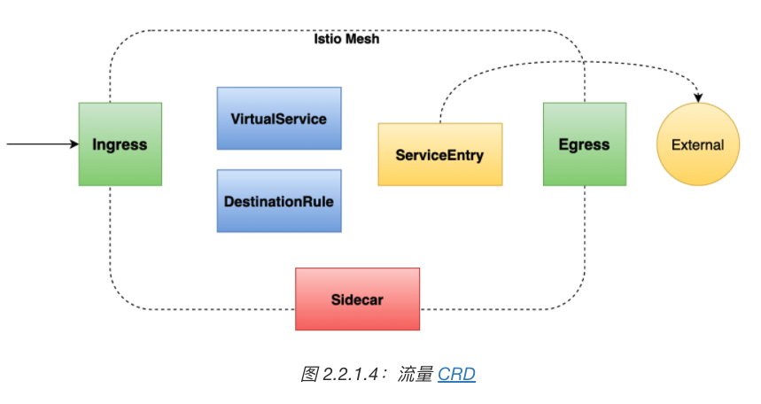

#### 请求路由和流量转移
1. 服务间流量

    Istio 为了控制服务请求，引入了**服务版本（version）**的概念，可以通过版本这一标签将服务进行区分。

    版本设置:
    - 服务的迭代编号, 如 v1, v2
    - 服务部署环境, 如 dev/stg/prd
    - 自定义标记

2. 与网格边界交互流量, 可以在系统的入口与出口处部署 Sidecar 代理, 让所有流入和流出的流量都由代理进行转发. Ingress/Egress.

    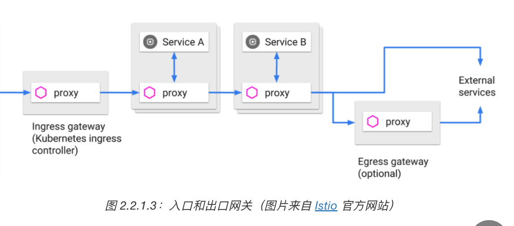

3. 流量策略.
    - 对连接池相关属性进行设置
    - 修改最大连接等参数
    - 对负载均衡策略进行设置: 轮训/随机/最少访问等
    - 异常探测策略, 将满足异常条件的实例从负载均衡池重摘除.

#### 弹性功能: 熔断/超时/重试
1. 超时`timeout`: 设置一个等待时间, 当上游服务的响应时间超过这个时间上限, 就不在等待直接返回, 即 **快速失败**.
    超时主要的目的是控制故障的范围，避免故障进行扩散.
2. 重试`retry`: 用来解决网络抖动时通信失败的问题. 可以通过重试来提供系统的可用性.
3. 熔断: 过载保护手段, 可以避免服务的级联失败. 在自定义资源 `DestinationRule.TrafficPoliocy` 中设置.
    熔断有三种状态:
    1. 关闭: 当上游服务可以返回正常时, 关闭.
    2. 打开: 一旦失败的请求数超过了*失败计数器*设定的上限，就切换到打开状态，让服务快速失败
    3. 半开状态: 通过一个超时时钟，在一定时间后切换到半开状态，让请求尝试去访问上游服务，看看服务是否已经恢复正常。如果服务恢复就关闭熔断，否则再次切换为打开状态。

#### 调试能力: 故障注入/流量镜像
对流量进行调试可以让系统具有更好的容错能力，也方便我们在问题排查时通过调试来快速定位原因所在。

1. 故障注入: 在系统中人为的设置一些故障，来测试系统的稳定性和系统恢复的能力。
    Istio 中实现故障注入很方便, 在路由配置中添加 `fault` 关键字即可.
    
    Istio 支持两种类型故障:
    1. 延迟: 模拟服务网络延迟或服务过载的情况.
    2. 中断: 模拟上游服务泵快的情况, 以 HTTP 的错误码 和 TCP 链接失败来表现.
    
2. 流量镜像: 过复制一份请求并把它发送到镜像服务，从而实现流量的复制功能。
    Istio 中实现流量镜像, 只需在路由配置中添加 `mirror` 关键字即可.
    主要使用场景:
    1. 进行线上问题排查, 如 把真实的请求发送到镜像服务，再打开 debug 日志来查看详细的信息.
    2. 观察生产环境的请求处理能力, 如在镜像服务进行压力测试.
    3. 观察生产环境的请求处理能力.

### 2.2 安全

安全对于微服务这样的分布式系统来说至关重要. Istio 提供一套完整的安全解决方案, 可以以**透明**的方式为微服务应用添加安全策略.
    单体 --> 进程内通信
    微服务 --> 网络通信

需求:
1. 抵御外来攻击 --> 流量加密
2. 保证服务间通信的可靠性 --> mTLS 方式交互
3. 控制不同身份的访问 --> 不同的粒度的授权策略

Istio 中的安全架构
1. Citadel : 负责安全的主要组件, 用于密钥和证书管理
2. Pilot : 将安全策略分发给 Envoy 代理
3. Envoy : 执行安全策略来实现访问控制.

Istio 安全架构和运作流程:
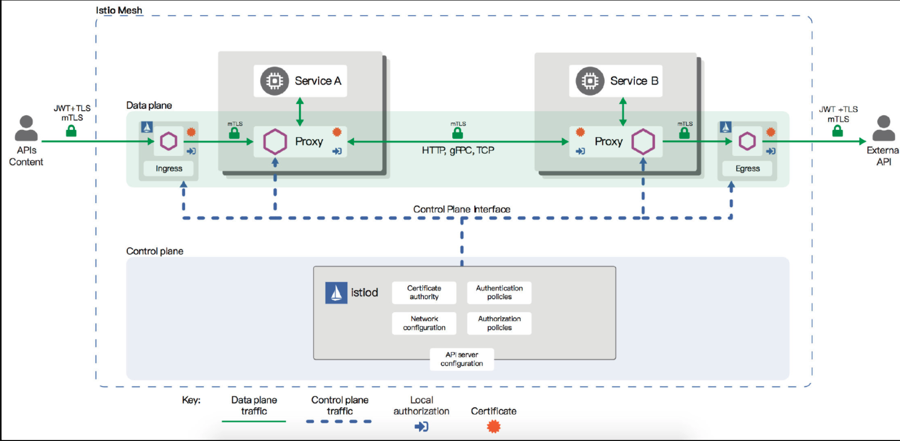

Istio 提供的安全功能:
1. 认证
2. 授权

#### 2.2.1 认证

Istio 提供多粒度,灵活的认证策略, 用户可以灵活的配置各种级别的策略和组合, 支持:
- 网格级别
- namespace 级别
- 工作负载级别的认证.

Istio 提供两种**类型**的认证:

- 对等认证 Peer Authentication <--> mTLS: 双向 TLS.

    用于服务到服务的认证.
    
    mTLS : 即客户端到服务端都要验证彼此的合法性. Istio 的 mTLS 提供了一种宽容模式(permissive mode)的配置方法, 使得服务可以同时支持**纯文本**和 **mTLS流量**, 用户可以先用非加密的流量保证服务间的连通性, 然后再逐渐迁移到 mTLS, 可以极大的降低迁移和调试的成本.
    
    Istio 提供内置的密钥和证书管理机制, 可以自动进行密钥和证书的生成, 分发和轮换, 而无需修改业务代码.
    
- 请求认证 Request Authentication, 也叫最终用户认证 <--> JWT, 
    用于验证用户或客户端. Istio 使用 JWT 做为实现方案


#### 2.2.2 授权 `AuthorizationPolicy`
##### 授权级别
Istio 的授权可以为网格中的服务提供不同**级别**的访问控制:
- 网格级别
- 命名空间级别
- 工作负载级别

##### 授权动作
授权策略支持**动作**:
- `ALLOW` : 默认策略.
- `DENY` : 


每个 Envoy 代理都运行一个授权引擎. 当请求到达时, 授权引擎根据当前策略评估请求的授权上下文, 并返回授权结构 `ALLOW` 或 `DENY`.

授权功能没有没有显式的开关配置, 默认即 ALLOW 状态, 只需要配置好的授权策略应用到对应的工作负载就可以进行访问控制.

##### 匹配规则
策略匹配规则:
- 来源
- 目标
- 路径
- 请求头
- 方法
- 自定义匹配条件

### 2.3 可观察性

在微服务治理中, 随着服务数量大大增加, 服务拓扑不断复杂化, 可观察性至关重要.

可观察性好处:
1. 及时反馈异常或者风险, 使开封人员可以及时关注, 修复和 解决问题 --> 告警
2. 出问题时, 快速定位问题并解决问题.
3. 收集并分析数据, 以帮助开发人员不断的调整和改善服务 --> 持续优化.

Istio 提供三种不同类型的数据, 从不同角度支撑其可观察性:
- 指标(metrics)
- 日志(access log)
- 分布式追踪(Distributed Traces)

#### 2.3.1 指标(metrics) : 
    
指标本质上是**时间序列**上的一系列具有特定名称的**计数器**的组合. 不同计数器用于表征系统中的不同状态并将之数值化. 通过数据聚合之后, 指标可以用于查看一段时间范围内系统状态的变化的情况甚至预测未来一段时间系统的行为. 是从一个相对宏观的角度来展示整个网格或者系统状态随时间发生的变化和趋势.

1. Istio 基于四种不同的监控标志生成一系列观测不同服务的监控指标, 用于记录和展示网格中服务状态.

    Istio 监控标志:
    - 响应延迟
    - 流量大小
    - 错误数量
    - 饱和度

2. Istio 提供一组默认的基于上述指标的网络监控仪表盘, 对指标进行聚合和可视化.

#### 2.3.2 日志(access log) : 
    
日志是软件系统中记录软件执行状态及内部事件最为常用, 也最为有效的工具.

日志是具有固定结构的一段文本或二进制数据, 并且和系统中需要关注的事件一一对应. 当系统发生一个新的事件, 指标只会有一个相关的计数器自增, 而日志则会记录下该事件的具体上下文, 因此包含了系统状态的更多的细节部分.

在分布式系统中, 日志是定位复杂问题的关键手段.由于每个事件都会产生一条对应的日志，所以日志也往往被用于计费系统，作为数据源。其相对固定的结构，也提供了日志解析和快速搜索的可能，对接 ELK 等日志分析系统后，可以快速的筛选出具有特定特征的日志以分析系统中某些特定的或者需要关注的事件。

在 Istio 网格汇总, 当请求流入到网格的任何一个服务时, Istio 都会生成该请求的完整记录, 包括*请求源*和*请求目标*, 以及请求本身的*元数据*等. 日志是使得开发人员可以在单个服务实例级别观察和审计流经该实例的所有流量.

**日志记录的事件是孤立的**

#### 2.3.3  分布式追踪(Distributed Traces) : 

日志记录的事件是孤立的, 但在分布式系统中, 不同组件中发生的事件往往存在**因果关系**.

分布式追踪通过额外数据（Span ID等特殊标记）记录不同组件中事件之间的关联，并由外部数据分析系统重新构造出事件的**完整事件链路**以及**因果关系**。

在服务网格的一次请求之中，Istio 会为途径的所有服务生成分布式追踪数据并上报，通过 Zipkin 等追踪系统重构服务调用链，开发人员可以借此了解网格内服务的依赖和调用流程，构建整个网格的服务拓扑。在未发生故障时，可以借此分析网格性能瓶颈或热点服务；而在发生故障时，则可以通过分布式追踪快速定位故障点。

- 发生问题: 快速定位故障点.
- 未发生问题: 构建服务拓扑, 分析系统/网络瓶颈.


## 2. Istio 的平台支持
Istio 独立于平台，被设计为可以在各种环境中运行，包括跨云、内部环境、Kubernetes 等等。目前 Istio 支持的平台有：
- Kubernetes
- Consul
- GCP
- 虚拟机 VM: 在 1.6 版本中提供支持.


# 服务网格的代际关系
0. 自定义微服务时代: SDK, 强耦合, 
    - 升级/增加新特性容易造成版本的碎片化.
    - 多语言支持低效, 特别是如果涉及语言特性, 则其他语言很难直接翻译实现
1. 第一代: 只有数据平面, Linkerd
2. 第二代: 数据平面 + 控制平面: Istio, Linkerd
    
    架构中有控制平面的优势在于, 可以**统一**对数据平面进行管理.

    Istio 版本:
    - `v1.5` 之前: 控制平面为分散的, 独立部署的组件构成, Pilot, Citadel, Galley
    - `v1.5` 之后:  单进程, 多模块的单体结构, Istiod
    - 最新版本: 1.8.4 2021年03月


# 架构解析
## 1. 控制平面
控制平面: 控制/管理数据平面的 sidecar 代理.

控制平面功能:
- 完成后配置的分发
- 服务发现
- 授权鉴权
- 负载均衡等.

Service Mesh 的本质是将通用的基础架构的功能沉掉到 Sidecar 中, 由 Sidecar 接管服务的流量并对其进行治理, 因此可以做到业务代码的**零侵入** . 这样使得业务开发人员更关系业务功能, 代码的**零侵入**, 也使得基础功能的升级和快速迭代成为可能.

### 1.1 Pilot: 流量管理的核心组件

Pilot 主要功能: 管理和配置部署在特定 Istio 服务网格中的所有 Sidecar 代理实例. 他管理 Sidecar 之间的路由流量规则, 并配置故障恢复功能, 如超时/重试/熔断等.

#### 1.1.1 Pilot 架构

Pilot 架构图

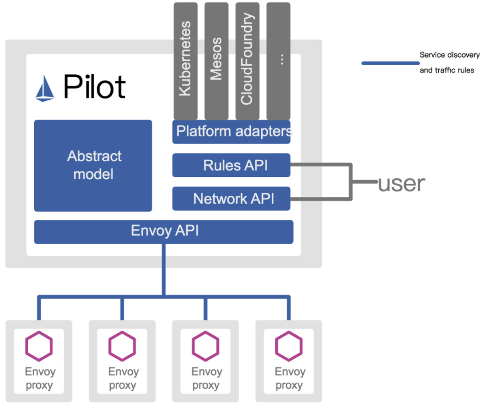

Pilot 关键模块
1. Abstract Model: 抽象模型, 不同数据源的统一格式存储.
    
    为实现对不同服务注册中心(kubernetes, consul, eureka)的支持, Pilot 需要对不同的输入来源的数据, 有一个统一的存储格式, 即抽象模型.

    抽象模型中定义的关键成员包括:
    - `HostName`: 服务名称
    - `Ports`: 服务端口
    - `Address`: 服务 cluster ip
    - `Resolution`: 负载均衡策略

2. Platform Adapters: 平台适配器. 服务注册中心数据到抽象模型之间的转换.
    
    Pilot 的实现是基于平台适配器(Platform Adapters)的, 借助平台适配器 Pilot 可以**实现`服务注册中心`数据到`抽象模型`之间的数据转换**, 另外, 用户可以开发适配器将其他提供服务发现的组件集成到 Pilot 中.

    例如, Pilot 中的 Kubernetes 适配器通过 Kubernetes API 服务器得到 Kubernetes 中的 service 和 pod 的相关数据, 然后翻译为抽象模型提供给 Pilot 使用.

3. xDS API: 数据面服务发现 API.
    
    Pilot 使用了一套起源于 Envoy 项目的标准数据面 API 来将服务信息和流量规则下发到数据面的 Sidecar 中, 这套标准数据面 API 叫做 xDS.

    通过 xDS API, Istio 将控制面和数据面进行了**解耦**, 为多数数据平面 Sidecar 提供的可能性, 如 MOSN.

    Sidecar 通过 xDS API 可以动态获得 Listener(监听器), Route(路由), Cluster(集群) 及 Endpoint (集群成员) 配置.
    - `LDS` Listener 发现服务: 
        Listener 监听器控制 Sidecar 启动端口监听(目前支持 TCP 协议), 并配置 L3/L4 层过滤器, 当网络连接到达后, 配置好的网络过滤器堆栈开始处理后续事件.
    - `RDS` Router 发现服务: 
        用于 HTTP 连接管理过滤器动态动态获取路由配置.
        路由配置包含:
        - HTTP 头部修改, 增加删除 HTTP 头部键值.
        - Virtual Hosts (虚拟主机) 及 Virtual Host 定义的各个路由条目.
    - `CDS` Cluster 发现服务: 动态获取 Cluster 信息.
    - `EDS` Endpoint 发现服务: 动态维护端点信息.
        端点信息还包括 **负载均衡权重**, **金丝雀状态**等, 基于这些信息, Sidecar 可以做出智能的负载均衡策略.

4. User API 用户 API: 
    
    Pilot 定义了一套用户 API, 提供了面向业务的高层抽象, 可以为运维人员理解和使用.

    用户 API --> Pilot --> 数据面配置 --> xDS API --> Sidecar 实例 --> 动态流量控制和调整: 版本分流/断路器/故障注入/灰度发布.


#### 1.1.2 Pilot 实现 与 组件

Pilot 实现图


图中: 实线 --> 控制流, 虚线 --> 数据流, 带 `[pilot]` 的组件为 pilot 组件, 其中关键组件如下:

- Discovery Service 即 pilot-discovery .
    
    主要功能是从 Service Provider (如 kubernetes, consul) 中获取服务信息, 从 Kubernetes API Server 中获取流量规则(kubernetes CRD Resource), 并将 服务信息和流量规则转化为数据面可以理解的格式, 通过标准的数据面 API 下发到网格中的各个 Sidecar .

    - 获取 服务发现中的服务信息
    - 获取 流量规则
    - 下发 转换后的 服务信息 和流量规则到 数据面

- Agent, 即 pilot-agent :
    
    根据 Kubernetes API Server 中的配置信息生成 Envoy 的配置文件, 负责启动/监听 Sidecar 进程.

    - 生成 Sidecar 配置
    - Sidecar 的启动与监听

- Proxy, 即 Sidecar proxy : 
    
    是所有服务的流量代理, 直接连接 pilot-discovery, 间接的从 Kubernetes 等服务注册中心获取集群中微服务的注册情况.

- Server A/B 即业务应用 : 
    
    使用了 Istio 的应用, 业务应用的网络流量会被 Proxy 接管.


##### 1.1.2.1 pilot-agent 关键实现

pilot-agent 主要工作
- 生成 Sidecar 配置
- Sidecar 的启动与监听

**生成 Sidecar 配置**

Sidecar 的配置主要指在 pilot-agent 的 init 方法 与 proxy 命令处理流程的前半部分生成.

- `init` 方法 为 pilot-agent 二进制的命令行配置大量的 flag 与默认值
- `proxy` 命令处理流程则负责将这些 flag 组装成 `ProxyConfig` 对象以启动 Envoy.

```go
//go 语言，源码摘自 pilot-agent，role 角色定义
role = &model.Proxy{}
...

type Proxy struct {
    // ClusterID 用于指代 proxy 所在集群名称
    ClusterID string

    // Type 用于标记 proxy 运行模式
    Type NodeType

    IPAddresses []string
    ID string
    DNSDomain string
    ...
}
```

`role` 默认的对象为 `proxy`，关键参数如下 : 

- `Type` : pilot-agent 的 role 有**两种运行模式**, 由 `role.Type` 变量定义.

    role 运行模式:
    - `sidecar`: 默认模式.
    - `router`

- `IPAddress`, `ID`, `DNSDomain` : 可以接受参数, 依据注册中心的类型, 给予默认值。
    
    默认处理方式是 `Kubernetes`. 在 `Kubernetes` 默认值下:
    - `IPAddress` 默认为 `INSTANCE_IP`
    - `ID` 默认为 `POD_NAME`
    - `DNSDomain` 默认为 `default.svc.cluster.local`

- Istio 可以对接的第三方**注册中心**有 `Kubernetes`, `Consul`, `MCP`, `Mock`.


```go
//go 语言，源码摘自 pilot-agent ，envoy 启动代理及监听器
envoyProxy := envoy.NewProxy(envoy.ProxyConfig{
                Config:              proxyConfig,            //Envoy 的配置，如目录等
                Node:                role.ServiceNode(),    //role 的字符串拼接 node.Type~ip~ID~DNSDomain 格式
                NodeIPs:             role.IPAddresses,
                PodName:             podName,
                PodNamespace:        podNamespace,
                PodIP:               podIP,
                ...
            })

// envoy 的代理
agent := envoy.NewAgent(envoyProxy, features.TerminationDrainDuration())

// envoy 的监控和程序，会监听证书变化和启动 envoy 
watcher := envoy.NewWatcher(tlsCerts, agent.Restart)
go watcher.Run(ctx)

// 监听停止信号
go cmd.WaitSignalFunc(cancel)

// envoy 主循环，阻塞等待停止信号
return agent.Run(ctx)
```

Envoy 配置文件及命令行参数主要有两个:
- Envoy 的启动目录默认为 `/usr/local/bin/envoy`
- Envoy 的启动参数相关代码在 `func (e *proxy) args` 中.

```go
//go 语言，源码摘自 pilot-agent ，envoy 启动参数
startupArgs := []string{"-c", fname,
        "--restart-epoch", fmt.Sprint(epoch),
        "--drain-time-s", fmt.Sprint(int(convertDuration(e.Config.DrainDuration) / time.Second)),
        "--parent-shutdown-time-s", fmt.Sprint(int(convertDuration(e.Config.ParentShutdownDuration) / time.Second)),
        "--service-cluster", e.Config.ServiceCluster,
        "--service-node", e.Node,
        "--max-obj-name-len", fmt.Sprint(e.Config.StatNameLength),
        "--local-address-ip-version", proxyLocalAddressType,
        "--log-format", fmt.Sprintf("[Envoy (Epoch %d)] ", epoch) + "[%Y-%m-%d %T.%e][%t][%l][%n] %v",
    }
```

Envoy 启动参数及含义:

- `-–restart-epoch` : `epoch` 决定了Envoy **热重启**的顺序，第一个 Envoy 进程对应的 epoch 为0，后面新建的 Envoy 进程对应 epoch 顺序递增1
- `-–drain-time-s` : 在 pilot-agent `init` 函数中指定默认值为2秒，可通过 `pilot-agent proxy` 命令的 `drainDuration flag` 指定
- `-–parent-shutdown-time-s` : 在 pilot-agent `init` 函数中指定默认值为3秒，可通过 `pilot-agent proxy` 命令的 `parentShutdownDuration flag` 指定
- `-–service-cluster` : 在 pilot-agent `init` 函数中指定默认值为 `istio-proxy` ，可通 `pilot-agent proxy` 命令的 `serviceCluster flag` 指定
- `-–service-node` : 将 `role` 的字符串拼接成 `node.Type~ip~ID~DNSDomain` 格式


**Sidecar 的启动与监听**
- 创建 `envoy` 对象: 
    结构体包括:
    - `proxyConfig`
    - `role.serviceNode`
    - `loglevel`
    - `pilotSAN (service account name)`
- 创建 `agent` 对象, 包含
    - 上面创建的 `envoy` 结构体
    - 一个 `epochs` 的 map
    - 一个 channel `statusCh`
- 创建 `watcher`, 包含
    - 证书
    - `agent.Restart` 方法
    - 启动协程执行 `watcher.Run`
- `watcher.Run`:
    - 首先执行 `agent.Restart`，启动 Envoy .
    - 启动协程调用 `watchCerts` ，用于监控各种证书，如果证书文件发生变化，则重新生成证书签名并重启 Envoy。
- 创建 `context`:
    - 启动协程调用 `cmd.WaitSignalFunc` 以等待进程接收 `SIGINT`, `SIGTERM` 信号
    - 接受到信号之后通过 `context` 通知 `agent`
    - `agent` 接到通知后调用 `terminate` 来 kill 所有 Envoy 进程，并退出 agent 进程.
- `agent.Run` 主进程堵塞，监听 `statusCh`. 
    这里的 `status` 其实就是 `exitStatus`，在监听到 `exitStatus` 后，会删除当前 `epochs` 中的 channel 资源.


##### 1.1.2.2 pilot-discovery 关键实现

pilot-discovery 扮演服务注册中心, istio 控制平面 和 sidecar 之间的桥梁作用.

主要功能:
- 监控服务注册中心的服务注册情况
    在 kubernetes 环境下, 会监控如下资源信息的变化: 
    - `service`
    - `endpoint`
    - `pod`
    - `node`
- 监控 Istio 控制面板信息变化
    在 kubernetes 环境下, 会监控如下以 Kubernest CRD 形式存在的 Istio 控制面板配置信息:
    - `RouteRule`
    - `VirtualService`
    - `Gateway`
    - `EgressRule`
    - `ServiceEntry`
- 将上述信息合并组合为 Sidecar 可以理解的(遵循 Envoy data plane api)的配置信息, 并将这些信息以 gRPC 协议提供给 Sidecar.

Pilot-discovery 关键实现逻辑:
- 初始化及启动
- 配置信息监控与处理

**初始化及启动**
```go
//go 语言，源码摘自 pilot-discovery，pilot-discovery 初始化及启动的关键部分，省去异常处理

// 创建 discoveryServer 对象并启动
discoveryServer, err := bootstrap.NewServer(serverArgs)
discoveryServer.Start(stop)

// discoveryServer 对象的具体创建方法
func NewServer(args *PilotArgs) (\*Server, error) {
    //环境变量
    e := &model.Environment{...}

    s := &Server{
        clusterID:      getClusterID(args),                                //集群id
        environment:    e,                                                //环境变量
        EnvoyXdsServer: envoyv2.NewDiscoveryServer(e, args.Plugins),     //Pilot 针对 Envoy v2 xds APIs 的 gRPC 实现，用于通知 envoy 配置更新
        ...
    }

    s.initKubeClient(args)
    s.initMeshConfiguration(args, fileWatcher)        
    s.initConfigController(args)                    
    s.initServiceControllers(args)
    s.initDiscoveryService(args)
    ...
}
...

gRPC服务启动
func (s *Server) Start(stop <-chan struct{}) error {
    go func() {
        s.grpcServer.Serve(s.GRPCListener)
    }()
}
```

pilot-discovery 的初始化主要在 pilot-discovery 的 `init` 方法和在 `discovery 命令`处理流程中调用的 `bootstrap.NewServer` 完成，关键步骤如下 : 

- 创建 `Kubernetes apiserver client（initKubeClient）`
    可以在 `pilot-discovery` 的 `discovery` 命令的 `kubeconfig flag` 中提供*文件路径*，默认为空。
- 读取 `mesh` 配置`（initMeshConfiguration）`, 包含:
    - `MixerCheckServer`
    - `MixerReportServer`
    - `ProxyListenPort`
    - `RdsRefreshDelay`
    - `MixerAddress 等`
    - 默认 mesh 配置文件`/etc/istio/config/mesh`.
- 初始化与**配置存储中心**的连接`initConfigController方法`对 Istio 做出的各种配置, 比如:`route rule`, `virtualservice` 等，需要保存在**配置存储中心（config store）**内。

- 配置与**服务注册中心（service registry）**的连接`initServiceControllers 方法`
    初始化 discovery 服务`initDiscoveryService`, 将 discovery 服务注册为 `Config Controller` 和 `Service Controller` 的 `Event Handler`，监听配置和服务变化消息。
- 启动 `gRPC Server` 并接收来自 Envoy 端的连接请求。
- 接收 sidecar 端的 xDS 请求，从 `Config Controller`、`Service Controller` 中获取配置和服务信息，生成响应消息发送给 sidecar。
- 监听来自 `Config Controller` 、`Service Controller` 的变化消息，并将配置、服务变化内容通过 xDS 接口推送到 sidecar。

**配置信息监控与处理**

`ConfigController` 是 Pilot 实现**配置信息监控与处理**的核心，它关联的几个关键的结构体如下：
```go
//go 语言，源码摘自 pilot-discovery，pilot-discovery 实现配置监听的关键部分

// 用于存储 route rule、virtualservice 等流量配置信息
type ConfigStore interface {
    Schemas() collection.Schemas
    Get(typ resource.GroupVersionKind, name, namespace string) *Config
    List(typ resource.GroupVersionKind, namespace string) ([]Config, error)
    Create(config Config) (revision string, err error)
    Update(config Config) (newRevision string, err error)
    Delete(typ resource.GroupVersionKind, name, namespace string) error
    Version() string
    GetResourceAtVersion(version string, key string) (resourceVersion string, err error)
    GetLedger() ledger.Ledger
    SetLedger(ledger.Ledger) error
}

// 扩展了 ConfigStore 存储，并提供资源处理的注册函数，使用此函数注册后，资源变更会回调 handler 处理
type ConfigStoreCache interface {
    RegisterEventHandler(kind resource.GroupVersionKind, handler func(Config, Config, Event))
    Run(stop <-chan struct{})
    HasSynced() bool
}


//controller 实现了 ConfigStore 接口和 ConfigStoreCache 接口
type controller struct {
    client *Client
    queue  queue.Instance
    kinds  map[resource.GroupVersionKind]*cacheHandler
}

type Task func() error

// controller 的 queue 的类型，包装了 Task 任务
type Instance interface {
    Push(task Task)
    Run(<-chan struct{})
}

//initServiceControllers 下的 kubernets 下的 Controller ，由 initKubeRegistry 创建
func NewController(client kubernetes.Interface, options Options) *Controller {
    c := &Controller{
        client:                     client,
        queue:                      queue.NewQueue(1 * time.Second),
        ...
    }

    ...

    registerHandlers(c.services, c.queue, "Services", c.onServiceEvent)
```
`ConfigController` 用于处理 Istio 流控 CRD, 如 `VirtualService`,`DestinationRule` 等:
- `ConfigStore` 对象利用 client-go 库从 Kubernetes 获取 `RouteRule`, `VirtualService` 等 CRD 形式存在控制面信息，转换为 model 包下的 `Config` 对象，对外提供 `Get`,`List`,`Create`,`Update`,`Delete` 等 CRUD 服务。
- `ConfigStoreCache` 则主要扩展了:
    - 注册 `Config` 变更事件处理函数 `RegisterEventHandler`
    - 开始处理流程的 `Run` 方法。

Pilot 中，目前实现了 `ConfigStoreCache` 的 `controller` 主要有以下五种：
- `crd/controller/controller.go` : **关键**
- `serviceregistry/mcp/controller.go`
- `kube/gateway/controller.go`
- `kube/ingress/controller.go`
- `memory/controller.go`

CRD 是 `CustomResourceDefinition` 的缩写 ，CRD `Controller` 利用 `SharedIndexInformer` 实现对 CRD 资源的 `list/watch`。将 `Add`,`Update`,`Delete` 事件涉及到的 CRD 资源对象封装为一个 `Task` ，并 `push` 到 `ConfigController` 的 `queue` 里，`queue` 队列始终处于监听状态，只要队列中有内容，就会回调 `task` 函数执行。关键代码的实现如下:
```go
//go 语言，源码摘自 pilot-discovery，pilot-discovery 实现配置监听的关键部分，接上一段代码中的 registerHandlers

func registerHandlers(informer cache.SharedIndexInformer, q queue.Instance, otype string,
    handler func(interface{}, model.Event) error) {

    informer.AddEventHandler(
        cache.ResourceEventHandlerFuncs{
            AddFunc: func(obj interface{}) {
                ...
                q.Push(...)
                ...
            },
            UpdateFunc: func(old, cur interface{}) {
                ...
                q.Push(...)
                ...
            },
            DeleteFunc: func(obj interface{}) {
                ...
                q.Push(...)
                ...
            },
        })
}

//queue 的实现，始终等待执行 task
func (q *queueImpl) Run(stop <-chan struct{}) {
    ...
    for {
        if len(q.tasks) == 0 {
            return
        }
        task, q.tasks = q.tasks[0], q.tasks[1:]
        task()
    }
}

```


### 1.2 Citadel

Citadel 是 Istio 中负责**身份认证**和**证书管理**的核心安全组件.

Istio 在安全架构方面主要包括如下内容:
- 证书签发机构(CA): 负责 密钥和证书管理
- API 服务器: 将安全配置分发给数据平面
- 客户端, 服务端通过代理安全通信
- Envoy 代理管理遥测和审计.

Istio 的**身份标识模型**使用**一级服务标识**来确定请求的来源, 他可以灵活的标识终端用户, 工作负载等. 在平台层面, Istio 可以使用类似服务名称来标识身份, 或直接使用平台提供的服务标识, 如 kubernetes 的 ServiceAccount, Aws IAM 用户, 角色账户等.

在身份和证书管理方面，Istio 使用 X.509 证书，并支持**密钥和证书的自动轮换**。

从 1.1 版本开始，Istio 开始支持**安全发现服务器（SDS）**，随着不断的完善和增强，1.5 版本 SDS 已经成为**默认开启**的组件。

Citadel 以前有两个功能：
- 将证书以 Secret 的方式挂载到命名空间里；
- 通过 SDS gRPC 接口与 nodeagent（已废弃）通信。

目前 Citadel 只需要完成与 SDS 相关的工作，其他功能被移动到了 istiod 中。

#### 1.2.1 Citadel 工作原理

随着 1.5 版本新架构的发布，Citadel 从独立的进程变成了 istiod 中的一个模块，其功能也逐渐被弱化，目前主要和 istiod、istio-agent 协同工作，负责证书和密钥管理。

Citadel 主要包括 一下模块:
- CA 服务器
- SDS 服务器
- 证书密钥控制器等模块

##### CA 服务器

Citadel 中的 CA 签发机构是一个 **gRPC 服务器**，启动时会注册两个 gRPC 服务
- CA 服务 : 用来处理 CSR 请求 (certificate signing request)
- 证书服务 : 用来签发证书。

证书处理流程:
- CA 首先通过 `HandleCSR` 接口处理来自客户端的 CSR 请求,
- 对客户端进行身份验证（包括 TLS 认证和 JWT 认证）
- 身份验证成功后会调用 `CreateCertificate` 进行证书签发。


##### SDS 服务器: Secret discovery service

SDS 即安全发现服务（Secret discovery service），它是一种在**运行时动态获取证书私钥的 `API`**，Envoy 代理通过 SDS 动态获取证书私钥。SDS 在 1.5 之后的版本, **默认开启**.

Istio 中的 SDS 服务器负责**证书管理**，并实现了**安全配置的自动化**。

相比传统的方式，使用 SDS 主要有以下**优点**:
- 无需挂载 Secret 卷
- 动态更新证书，无需重启
- 可以监听多个证书密钥对


Istio SDS 工作流程图: 
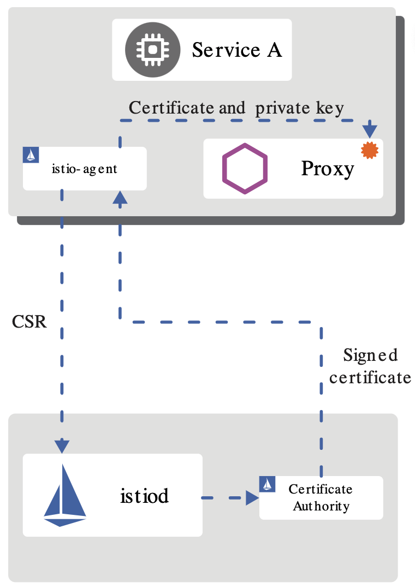


SDS 工作流程:
- Envoy 通过 SDS API 发送**证书和密钥请求**
- `istio-agent` 作为 Envoy 的代理，创建一个**私钥和证书签名请求（CSR）**，并发送给 istiod
- CA 机构验证收到的 CSR 并生成**证书**
- `istio-agent` 将私钥和从 istiod 收到的证书通过 SDS API 发送给 Envoy
- 以上流程**周期性**执行实现密钥和证书轮换


##### CaSecretController 证书密钥控制器

证书密钥控制器（CaSecretController）监听 `istio.io/key-and-cert` 类型的 `Secret` 资源，它会周期性的**检查证书**是否过期，并**更新证书**。


##### 证书轮换

如果没有自动证书轮换功能，当证书过期时，就不得不重启签发，并重启代理。证书轮换解决了这一问题，提高了服务的可用性。

Istio 里通过一个轮换器 `Rotator` 自动检查自签名的根证书，并在证书即将过期时进行更新，它本质上是一个**协程`goroutine`**在后台**轮询**实现的：

- 获取当前证书，解析证书的有效期并获取下一次轮换时间
- 启动定时器，如果发现证书到达轮换时间，从 CA 获取最新的证书密钥对
- 更新证书

### 1.3 Galley
而从1.5版本开始，Galley 的功能已经被合并到 Istiod 中，并且缺省被禁用。 从 Isito 控制面简化的趋势来看，Galley 后续很可能会被逐渐放弃，其自身功能的稳定性也值得怀疑。因此我不建议在产品中启用 Galley。

## 2. 数据平面

数据平面主要负责高速地处理和转发数据包，因为所有由网络处理器处理的数据包都必须经过这里，所以是影响整个系统性能的关键因素。

数据平面的转发工作无疑是网络层的重要工作，需要**最高的优先级**；而控制平面的路由协议等不需要在短时间内处理大量的包，可以将其放到次一级的优先级中。

数据平面可以专注使用**定制序列化**等各种技术来提高传输速率，而控制平面则可以借助于通用库来达到更好的控制与保护效果。

服务网格（Service Mesh）是一个用于**处理服务间通信**的基础设施层，它负责为构建复杂的云原生应用传递可靠的网络请求。

在实践中，服务网格通常实现为一组和应用程序部署在一起的轻量级的网络代理，但对应用程序来说是**透明**的。这看起来和分层网络中的网络层极为相似，因此作为 Service Mesh 的典型实现，Istio 采用同样的设计，如下图，将系统分为数据平面与控制平面。类似的，数据平面由**通信代理组件（Envoy/Linkerd等）**和**组件之间的网络通信**组成；控制平面负责对通信代理组件进行管理和配置。

Service Mesh 分层结构
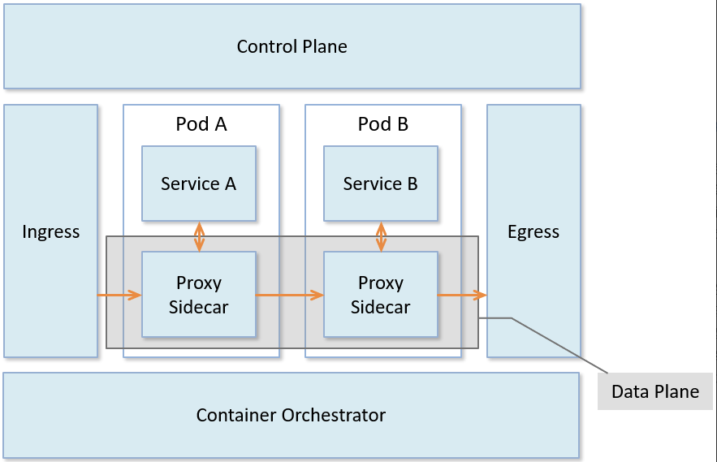


Istio 数据平面核心是以**边车（sidecar）模式**运行的智能代理。

- 边车模式将数据平面核心组件部署到**单独的流程或容器**中，以提供隔离和封装。
- 边车应用与父应用程序共享相同的**生命周期**，与父应用程序一起创建和退出。
- 边车应用附加到父应用程序，并为应用程序提供额外的**特性支持**

数据平面真正触及到对网络数据包的相关操作，是上层控制平面策略的具体执行者。

如下图所示，数据平面的边车代理可以调节和控制微服务之间所有的网络通信，每个服务 Pod 启动时会伴随启动 `istio-init` 和 `proxy` 容器。
- `istio-init` 容器主要功能:
    - 初始化 Pod 网络
    - 对 Pod 设置 iptable 规则，设置完成后自动结束。
- Proxy 容器会启动两个服务：`istio-agent` 以及网络代理组件。
    - istio-agent 的作用是同步管理数据，启动并管理网络代理服务进程，上报遥测数据
    - 网络代理组件则根据管理策略完成流量管控、生成遥测数据。

数据平面架构图:
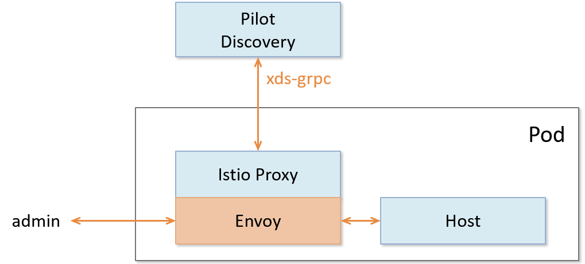


数据平面的工作就是负责有条件地转换、转发以及观察进出服务实例的每个网络包. 数据平面负责执行如下任务:
- **服务发现** : 探测所有可用的上游或后端服务实例
- **健康检测** : 探测上游或后端服务实例是否健康，是否准备好接收网络流量
- **流量路由** : 将网络请求路由到正确的上游或后端服务
- **负载均衡** : 在对上游或后端服务进行请求时，选择合适的服务实例接收请求，同时负责处理**超时**、**断路**、**重试**等情况
- **身份验证和授权** : 在 `istio-agent` 与 `istiod` 配合下，对网络请求进行身份验证、权限验证，以决定是否响应以及如何响应，使用 mTLS 或其他机制对链路进行加密等
- **链路追踪** : 对于每个请求，生成详细的统计信息、日志记录和分布式追踪数据，以便操作人员能够理解调用路径并在出现问题时进行调试

常见的数据平面实现:
- `Envoy` : Istio 默认使用的数据平面实现方案，使用C++开发，性能较高。
- `MOSN` : 阿里巴巴公司开源，设计类似 Envoy，使用 Go 语言开发，优化过多协议支持。
- `Linkerd` : 一个提供弹性云端原生应用服务网格的开源项目，也是面向微服务的开源 RPC 代理，使用 Scala 开发。它的核心是一个透明代理。因此也可作为典型的数据平面的实现。

### 2.1 Sidecar 模式

将应用程序的功能划分为单独的进程运行在同一个最小调度单元中（例如 Kubernetes 中的 Pod）可以被视为 **sidecar 模式**。sidecar 模式允许您在应用程序旁边添加更多功能，而无需额外第三方组件配置或修改应用程序代码。

在软件架构中， Sidecar 连接到父应用并且为其添加扩展或者增强功能。Sidecar 应用与主应用程序**松散耦合**。它可以屏蔽不同编程语言的差异，统一实现微服务的可观察性、监控、日志记录、配置、断路器等功能。

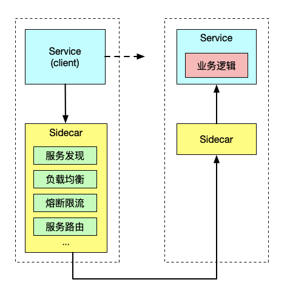


使用 sidecar 模式部署服务网格时，无需在节点上运行代理，但是集群中将运行多个相同的 sidecar 副本。在 sidecar 部署方式中，每个应用的容器旁都会部署一个伴生容器（如 Envoy 或 MOSN），这个容器称之为 sidecar 容器。Sidecar 接管进出应用容器的所有流量。在 Kubernetes 的 Pod 中，在原有的应用容器旁边注入一个 Sidecar 容器，两个容器共享存储、网络等资源。

sidecar 的优势:
- 将与应用业务逻辑无关的功能**抽象到共同基础设施**，降低了微服务代码的复杂度。
- 因为不再需要编写相同的第三方组件配置文件和代码，所以能够降低微服务架构中的**代码重复度**。
- Sidecar 可独立升级，降低应用程序代码和底层平台的**耦合度**。


### 2.2 Sidecar 注入及透明流量劫持

Istio 提供两种 sidecar 注入模式:
- **手动注入**: 使用 istioctl 手动注入。
    
    ```
    # 手动注入 sidecar, 注入完成后, istio 为原来的 pod template 注入 `initContainer` 及 sidecar proxy 先关配置
    $ istioctl kube-inject -f ${YAML_FILE} | kuebectl apply -f -

    ```
- **自动注入**: 基于 Kubernetes 的 `突变 webhook 入驻控制器（mutating webhook addmission controller)` 的自动 sidecar 注入方式。

不论是手动注入还是自动注入, sidecar 注入过程遵循如下步骤:
- Kubernetes 需要了解待注入的 sidecar 所连接的 **Istio 集群**及其配置；
- Kubernetes 需要了解待注入的 **sidecar 容器本身的配置**，如镜像地址、启动参数等；
- Kubernetes 根据 sidecar 注入模板和以上配置填充 sidecar 的配置参数，将以上配置注入到应用容器的一侧；

#### 2.2.1 init 容器

Init 容器是一种专用容器，它在应用程序容器启动之**前**运行，用来包含一些应用镜像中不存在的实用工具或安装脚本。

- 一个 Pod 中可以指定**多个 Init 容器**，如果指定了多个，那么 Init 容器将会在在网络和数据卷初始化之后, **按顺序依次**运行。
- 只有当前面的 Init 容器必须运行成功后，才可以运行下一个 Init 容器。
- Init 容器的端口不会在 Service 中进行聚集。 正在初始化中的 Pod 处于 `Pending` 状态，并且会将 `Initializing` 状态设置为 true。
- 如果由于运行时或失败退出，将导致容器启动失败，它会根据 Pod 的 restartPolicy 指定的策略进行重试。然而，如果 Pod 的 restartPolicy 设置为 Always，Init 容器失败时会使用 RestartPolicy 策略。
- 在所有的 Init 容器没有成功之前，Pod 将不会变成`Ready` 状态。当所有的 Init 容器运行完成后，Kubernetes 才初始化 Pod 和运行应用容器。
- Init 容器使用 Linux Namespace，所以相对应用程序容器来说具有不同的文件系统视图。因此，它们能够具有访问 Secret 的权限，而应用程序容器则不能。
- Init 容器运行完成以后就会自动终止。

#### 2.2.2 Sidecar 注入分析

```
$ cat bookinfo.yaml
    apiVersion: apps/v1
    kind: Deployment
    metadata:
      name: productpage-v1
      labels:
        app: productpage
        version: v1
    spec:
      replicas: 1
      selector:
        matchLabels:
          app: productpage
          version: v1
      template:
        metadata:
          labels:
            app: productpage
            version: v1
        spec:
          serviceAccountName: bookinfo-productpage
          containers:
          - name: productpage
            image: docker.io/istio/examples-bookinfo-productpage-v1:1.15.0
            imagePullPolicy: IfNotPresent
            ports:
            - containerPort: 9080
            volumeMounts:
            - name: tmp
              mountPath: /tmp
          volumes:
          - name: tmp
            emptyDir: {}

$ cat Dockerfile    # 业务容器的 Dockerfile
    FROM python:3.7.4-slim

    COPY requirements.txt ./
    RUN pip install --no-cache-dir -r requirements.txt

    COPY test-requirements.txt ./
    RUN pip install --no-cache-dir -r test-requirements.txt

    COPY productpage.py /opt/microservices/
    COPY tests/unit/* /opt/microservices/
    COPY templates /opt/microservices/templates
    COPY static /opt/microservices/static
    COPY requirements.txt /opt/microservices/

    ARG flood_factor
    ENV FLOOD_FACTOR ${flood_factor:-0}

    EXPOSE 9080
    WORKDIR /opt/microservices
    RUN python -m unittest discover

    USER 1

    # 因为没有设置 ENTRYPOINT, 所以 CMD 将最为默认的 ENTRYPOINT
    CMD ["python", "productpage.py", "9080"]

# 手动注入
$ istioctl kube-inject -f bookinfo.yaml

# 注入之后的配置

  containers:
  - image: docker.io/istio/examples-bookinfo-productpage-v1:1.15.0 # 应用镜像
    name: productpage
    ports:
    - containerPort: 9080
  - args:
    - proxy
    - sidecar
    - --domain
    - $(POD_NAMESPACE).svc.cluster.local
    - --configPath
    - /etc/istio/proxy
    - --binaryPath
    - /usr/local/bin/envoy
    - --serviceCluster
    - productpage.$(POD_NAMESPACE)
    - --drainDuration
    - 45s
    - --parentShutdownDuration
    - 1m0s
    - --discoveryAddress
    - istiod.istio-system.svc:15012
    - --zipkinAddress
    - zipkin.istio-system:9411
    - --proxyLogLevel=warning
    - --proxyComponentLogLevel=misc:error
    - --connectTimeout
    - 10s
    - --proxyAdminPort
    - "15000"
    - --concurrency
    - "2"
    - --controlPlaneAuthPolicy
    - NONE
    - --dnsRefreshRate
    - 300s
    - --statusPort
    - "15020"
    - --trust-domain=cluster.local
    - --controlPlaneBootstrap=false
    image: docker.io/istio/proxyv2:1.5.1 # sidecar proxy
    name: istio-proxy
    ports:
    - containerPort: 15090
      name: http-envoy-prom
      protocol: TCP
  initContainers:
  - command:
    - istio-iptables
    - -p
    - "15001"
    - -z
    - "15006"
    - -u
    - "1337"
    - -m
    - REDIRECT
    - -i
    - '*'
    - -x
    - ""
    - -b
    - '*'
    - -d
    - 15090,15020
    image: docker.io/istio/proxyv2:1.5.1 # init 容器
    name: istio-init
```

Istio 为应用 Pod 注入的配置主要包括:
- `istio-init` Init 容器 : 用于 pod 中设置 iptable 端口转发.
- `istio-proxy` Sidecar 容器: 运行 Sidecar 代理.


##### init 容器

Istio 在 pod 中注入的 Init 容器名为 `istio-init`, init 容器的启动命令, 类似如下:
```
$ istio-iptables -p 15001 -z 15006 -u 1337 -m REDIRECT -i '*' -x "" -b '*' -d 15090,15020

命令的含义为:
- 将应用容器的所有**入站流量**都转发到 sidecar 的 15006 端口。
- 使用 istio-proxy 用户身份运行， UID 为 1337，即 sidecar 所处的用户空间，这也是 istio-proxy 容器默认使用的用户，见 YAML 配置中的 `runAsUser` 字段。
- 使用默认的 `REDIRECT` 模式来重定向流量。
- 将所有**出站流量**都重定向到 sidecar 代理（通过 15001 端口）。
```

我们看到 `istio-init` 容器的入口是 `/usr/local/bin/istio-iptables` 命令行，该命令行工具的代码的位置在 Istio 源码仓库的 [tools/istio-iptables](https://github.com/istio/istio/tree/master/tools/istio-iptables) 目录。

`istio-iptables` 传入的参数都会重新组装成 iptables 规则, 这些规则会保留在应用容器和 sidecar 容器中. `istio-iptables`命令行用法如下, 
```
$ istio-iptables [flags]
  -p: 指定重定向所有 TCP 流量的 sidecar 端口（默认为 $ENVOY_PORT = 15001）
  -m: 指定入站连接重定向到 sidecar 的模式，“REDIRECT” 或 “TPROXY”（默认为 $ISTIO_INBOUND_INTERCEPTION_MODE)
  -b: 逗号分隔的入站端口列表，其流量将重定向到 Envoy（可选）。使用通配符 “*” 表示重定向所有端口。为空时表示禁用所有入站重定向（默认为 $ISTIO_INBOUND_PORTS）
  -d: 指定要从重定向到 sidecar 中排除的入站端口列表（可选），以逗号格式分隔。使用通配符“*” 表示重定向所有入站流量（默认为 $ISTIO_LOCAL_EXCLUDE_PORTS）
  -o：逗号分隔的出站端口列表，不包括重定向到 Envoy 的端口。
  -i: 指定重定向到 sidecar 的 IP 地址范围（可选），以逗号分隔的 CIDR 格式列表。使用通配符 “*” 表示重定向所有出站流量。空列表将禁用所有出站重定向（默认为 $ISTIO_SERVICE_CIDR）
  -x: 指定将从重定向中排除的 IP 地址范围，以逗号分隔的 CIDR 格式列表。使用通配符 “*” 表示重定向所有出站流量（默认为 $ISTIO_SERVICE_EXCLUDE_CIDR）。
  -k：逗号分隔的虚拟接口列表，其入站流量（来自虚拟机的）将被视为出站流量。
  -g：指定不应用重定向的用户的 GID。(默认值与 -u param 相同)
  -u：指定不应用重定向的用户的 UID。通常情况下，这是代理容器的 UID（默认值是 1337，即 istio-proxy 的 UID）。
  -z: 所有进入 pod/VM 的 TCP 流量应被重定向到的端口（默认 $INBOUND_CAPTURE_PORT = 15006）。
```

Init 容器存在的意义, 就是让 Sidecar 代理可以拦截所有的进出 Pod 的流量.
- 入站: 重定向 除了 15090(mixer)/15092(ingress gateway) 之外的所有**入站**流量到 15006 端口(sidecar).
- 出站: 拦截应用容器的**出站**流量经过 Sidecar 处理后再出站, 端口 15001

##### iptables 注入解析

为了查看 iptables 配置，我们需要登陆到 sidecar 容器中使用 root 用户来查看，因为 kubectl 无法使用特权模式来远程操作 docker 容器，所以我们需要登陆到 productpage pod 所在的主机上使用 docker 命令登陆容器中查看.

istio-iptables 重定向流量到 sidecar 模式:
- `REDIRECT`: 转发规则位于 iptables 的 NAT 表.
- `TPROXY`: 转发规则位于 iptables 的 NAT 表 和 mangle 表.

查看容器 iptables 规则:
```

# 查看 productpage pod 的 istio-proxy 容器中的进程
$ docker top `docker ps|grep "istio-proxy_productpage"|cut -d " " -f1`
UID                 PID                 PPID                C                   STIME               TTY                 TIME                CMD
1337                10576               10517               0                   08:09               ?                   00:00:07            /usr/local/bin/pilot-agent proxy sidecar --domain default.svc.cluster.local --configPath /etc/istio/proxy --binaryPath /usr/local/bin/envoy --serviceCluster productpage.default --drainDuration 45s --parentShutdownDuration 1m0s --discoveryAddress istiod.istio-system.svc:15012 --zipkinAddress zipkin.istio-system:9411 --proxyLogLevel=warning --proxyComponentLogLevel=misc:error --connectTimeout 10s --proxyAdminPort 15000 --concurrency 2 --controlPlaneAuthPolicy NONE --dnsRefreshRate 300s --statusPort 15020 --trust-domain=cluster.local --controlPlaneBootstrap=false
1337                10660               10576               0                   08:09               ?                   00:00:33            /usr/local/bin/envoy -c /etc/istio/proxy/envoy-rev0.json --restart-epoch 0 --drain-time-s 45 --parent-shutdown-time-s 60 --service-cluster productpage.default --service-node sidecar~172.17.0.16~productpage-v1-7f44c4d57c-ksf9b.default~default.svc.cluster.local --max-obj-name-len 189 --local-address-ip-version v4 --log-format [Envoy (Epoch 0)] [%Y-%m-%d %T.%e][%t][%l][%n] %v -l warning --component-log-level misc:error --concurrency 2

# 使用 nsenter 进入 sidecar 容器的命名空间（以上任何一个都可以）
$ nsenter -n --target 10660

# 查看 iptables 规则
# 查看 NAT 表中规则配置的详细信息。
$ iptables -t nat -L -v
# PREROUTING 链：用于目标地址转换（DNAT），将所有入站 TCP 流量跳转到 ISTIO_INBOUND 链上。
Chain PREROUTING (policy ACCEPT 2701 packets, 162K bytes)
 pkts bytes target     prot opt in     out     source               destination
 2701  162K ISTIO_INBOUND  tcp  --  any    any     anywhere             anywhere

# INPUT 链：处理输入数据包，非 TCP 流量将继续 OUTPUT 链。
Chain INPUT (policy ACCEPT 2701 packets, 162K bytes)
 pkts bytes target     prot opt in     out     source               destination

# OUTPUT 链：将所有出站数据包跳转到 ISTIO_OUTPUT 链上。
Chain OUTPUT (policy ACCEPT 79 packets, 6761 bytes)
 pkts bytes target     prot opt in     out     source               destination
   15   900 ISTIO_OUTPUT  tcp  --  any    any     anywhere             anywhere

# POSTROUTING 链：所有数据包流出网卡时都要先进入POSTROUTING 链，内核根据数据包目的地判断是否需要转发出去，我们看到此处未做任何处理。
Chain POSTROUTING (policy ACCEPT 79 packets, 6761 bytes)
 pkts bytes target     prot opt in     out     source               destination

# ISTIO_INBOUND 链：将所有入站流量重定向到 ISTIO_IN_REDIRECT 链上，目的地为 15090（mixer 使用）和 15020（Ingress gateway 使用，用于 Pilot 健康检查）端口的流量除外，发送到以上两个端口的流量将返回 iptables 规则链的调用点，即 PREROUTING 链的后继 POSTROUTING。
Chain ISTIO_INBOUND (1 references)
 pkts bytes target     prot opt in     out     source               destination
    0     0 RETURN     tcp  --  any    any     anywhere             anywhere             tcp dpt:ssh
    2   120 RETURN     tcp  --  any    any     anywhere             anywhere             tcp dpt:15090
 2699  162K RETURN     tcp  --  any    any     anywhere             anywhere             tcp dpt:15020
    0     0 ISTIO_IN_REDIRECT  tcp  --  any    any     anywhere             anywhere

# ISTIO_IN_REDIRECT 链：将所有的入站流量跳转到本地的 15006 端口，至此成功的拦截了流量到 sidecar 中。
Chain ISTIO_IN_REDIRECT (3 references)
 pkts bytes target     prot opt in     out     source               destination
    0     0 REDIRECT   tcp  --  any    any     anywhere             anywhere             redir ports 15006

# ISTIO_OUTPUT 链：选择需要重定向到 Envoy（即本地） 的出站流量，所有非 localhost 的流量全部转发到 ISTIO_REDIRECT。为了避免流量在该 Pod 中无限循环，所有到 istio-proxy 用户空间的流量都返回到它的调用点中的下一条规则，本例中即 OUTPUT 链，因为跳出 ISTIO_OUTPUT 规则之后就进入下一条链 POSTROUTING。如果目的地非 localhost 就跳转到 ISTIO_REDIRECT；如果流量是来自 istio-proxy 用户空间的，那么就跳出该链，返回它的调用链继续执行下一条规则（OUTPUT 的下一条规则，无需对流量进行处理）；所有的非 istio-proxy 用户空间的目的地是 localhost 的流量就跳转到 ISTIO_REDIRECT。
Chain ISTIO_OUTPUT (1 references)
 pkts bytes target     prot opt in     out     source               destination
    0     0 RETURN     all  --  any    lo      127.0.0.6            anywhere
    0     0 ISTIO_IN_REDIRECT  all  --  any    lo      anywhere            !localhost            owner UID match 1337
    0     0 RETURN     all  --  any    lo      anywhere             anywhere             ! owner UID match 1337
   15   900 RETURN     all  --  any    any     anywhere             anywhere             owner UID match 1337
    0     0 ISTIO_IN_REDIRECT  all  --  any    lo      anywhere            !localhost            owner GID match 1337
    0     0 RETURN     all  --  any    lo      anywhere             anywhere             ! owner GID match 1337
    0     0 RETURN     all  --  any    any     anywhere             anywhere             owner GID match 1337
    0     0 RETURN     all  --  any    any     anywhere             localhost
    0     0 ISTIO_REDIRECT  all  --  any    any     anywhere             anywhere

# ISTIO_REDIRECT 链：将所有流量重定向到 Sidecar（即本地） 的 15001 端口。
Chain ISTIO_REDIRECT (1 references)
 pkts bytes target     prot opt in     out     source               destination
    0     0 REDIRECT   tcp  --  any    any     anywhere             anywhere             redir ports 15001
```

下图展示的是 productpage 服务请求访问 http://reviews.default.svc.cluster.local:9080/，当流量进入 reviews 服务内部时，reviews 服务内部的 sidecar proxy 是如何做流量拦截和路由转发的。
Sidecar 流量劫持示意图: 
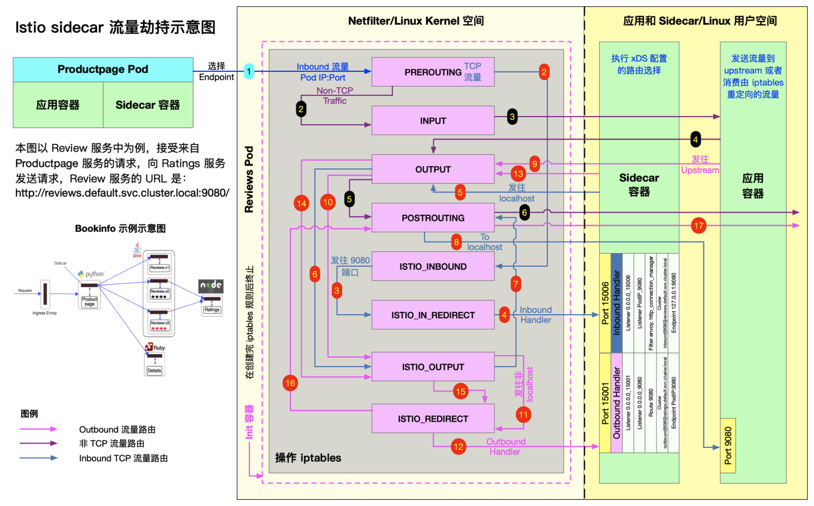


##### Proxy 容器

Proxy 容器镜像的 [Dockerfile](https://github.com/istio/istio/blob/master/pilot/docker/Dockerfile.proxyv2) `ENTRYPOINT` 如下:
```
# 前面的内容省略
# The pilot-agent will bootstrap Envoy.
ENTRYPOINT ["/usr/local/bin/pilot-agent"]
```
##### Istio 使用的端口

| 端口 |协议 |  使用者| 描述 |
| -- | -- | -- | -- |
| 8060 |  HTTP |    Citadel | GRPC 服务器 |
| 8080 |  HTTP |    Citadel agent |  SDS service 监控 |
| 9090 |  HTTP |    Prometheus  |  Prometheus |
| 9091 |  HTTP |    Mixer |  策略/遥测 |
| 9876 |  HTTP |    Citadel, Citadel agent  |  ControlZ 用户界面 |
| 9901 |  GRPC |    Galley  |  网格配置协议 |
| 15000 | TCP | Envoy  |   Envoy 管理端口 (commands/diagnostics) |
| 15001 | TCP | Envoy  |   Envoy 传出 |
| 15006 | TCP | Envoy  |   Envoy 传入 |
| 15004 | HTTP |    Mixer, Pilot  |    策略/遥测 - mTLS |
| 15010 | HTTP |    Pilot  |   Pilot service - XDS pilot - 发现 |
| 15011 | TCP | Pilot  |   Pilot service - mTLS - Proxy - 发现 |
| 15014 | HTTP |    Citadel, Citadel agent, Galley, Mixer, Pilot, Sidecar Injector  |  控制平面监控 |
| 15020 | HTTP |    Ingress Gateway  | Pilot 健康检查 |
| 15029 | HTTP |    Kiali  |   Kiali 用户界面 |
| 15030 | HTTP |    Prometheus  |  Prometheus 用户界面 |
| 15031 | HTTP |    Grafana  | Grafana 用户界面 |
| 15032 | HTTP |    Tracing  | Tracing 用户界面 |
| 15443 | TLS | Ingress and Egress Gateways  | SNI |
| 15090 | HTTP |    Mixer  |   Proxy |
| 42422 | TCP | Mixer  |   遥测 - Prometheus |

### 2.3 Sidecar 流量路由机制机制分析
流量管理是 Istio 服务网格的一项核心能力，Istio 中的很多功能，包括请求路由，负载均衡，灰度发布，流量镜像等，都是依托于其流量管理的能力实现的。

在 Istio 服务网格中，Pilot 提供了控制平面的流量管理接口，而真正的流量路由则是由数据平面的 sidecar 实现的。

#### 2.3.1 Envoy 中流量处理相关术语

- `Host` : 能够进行网络通信的实体（如移动设备、服务器上的应用程序）。
    
    在此文档中，host 是一个逻辑上的网络应用程序。
    一个物理硬件上可能运行有多个 host，只要它们是可以独立寻址的。
    在 EDS 接口中，也使用 `endpoint`来表示一个应用实例，对应一个 `IP + port` 的组合。

- `Downstream` : 下游 host 连接到 Envoy，发送请求并接收响应。
- `Upstream` : 上游 host 接收来自 Envoy 的连接和请求，并返回响应。
- `Listener` : 监听器是一个**命名网络地址（例如，端口、unix domain socket 等)**，可以被下游客户端连接。
    
    Envoy 中暴露一个或者多个给**下游主机连接**的监听器。在 Envoy 中，`listener` 可以绑定到端口上直接对外提供服务，也可以不绑定到端口上，而是接收其他 `listener` 转发的请求。

- `Cluster` : 集群是指 Envoy 连接的一组上游主机，集群中的主机是对等的，对外提供相同的服务，这些主机一起组成了一个可以提供负载均衡和高可用的服务集群。
    
    Envoy 通过**服务发现**来发现集群的成员。可以选择通过**主动健康检查**来确定集群成员的健康状态。

    Envoy 通过**负载均衡策略**决定将请求路由到哪个集群成员。

#### 2.3.2 XDS 服务接口

Pilot 通过 xDS 接口向数据平面的 sidecar 下发动态配置信息，以对网格中的数据流量进行控制。

xDS 中的 DS 意为 `discovery service`，即发现服务，表示 xDS 接口使用**动态发现**的方式提供数据平面所需的配置数据。而 x 则是一个代词，表示有多种 discovery service。

#### 2.3.3 Envoy 配置介绍

Envoy 是一个**四层/七层**代理，其架构非常灵活，采用了**插件式的机制**来实现各种功能，可以通过配置的方式对其功能进行定制。

Envoy 提供了两种配置的方式
- 静态配置 --> 配置文件: 通过配置文件向 Envoy 提供静态配置
- 动态配置 --> xDS: 通过 xDS 接口向 Envoy 下发动态配置。

在 Istio 中同时采用了这**两种方式**对 Envoy 的功能进行设置。
- 静态配置: Sidecar 容器中的 `pilot-agent` 进程, 根据启动参数生成 Envoy 的初始配置文件，并采用该配置文件来启动 Envoy 进程。包括 xDS server 的地址.
- 动态配置: 在 Istio 中, Envoy 的大部分配置都来自于控制平面通过 xDS 接口下发的动态配置.
    如:
    - Service cluster
    - listener
    - router 等

##### 查看 envoy 配置文件
```
$ kubectl exec productpage-v1-6d8bc58dd7-ts8kw -c istio-proxy cat /etc/istio/proxy/envoy-rev0.json > envoy-rev0.json
    {
        "node": {...},
        "stats_config": {...},
        "admin": {...},
        "dynamic_resources": {...},
        "static_resources": {...},
        "tracing": {...}
    }
```

相关的配置说明:
- `node` : 包含了 **Envoy 所在节点的相关信息**，如节点的 id，节点所属的 Kubernetes 集群，节点的 IP 地址，等等。
- `admin` : Envoy 的日志路径以及管理端口。
- `dynamic_resources` : 动态资源,即来自 xDS 服务器下发的配置。
- `static_resources` : 静态资源，包括预置的一些 `listener` 和 `cluster`，例如调用跟踪和指标统计使用到的 listener 和 cluster。
- `tracing` : 分布式调用追踪的相关配置。

Envoy 配置文件中, 包含两部分
- Pilot-agent 在启动 Envoy 时将 xDS server 信息通过静态资源的方式配置到 Envoy 的初始化配置文件中
- Envoy 启动后再通过 `xDS server` 获取网格中的服务信息、路由规则等动态资源。


Envoy 配置生成流程:
- `pilot-agent` 根据启动参数生成 Envoy 的初始配置文件 `envoy-rev0.json`，该文件告诉 Envoy 从指定的 xDS server 中获取动态配置信息，并配置了 xDS server 的地址信息，即控制平面的 Pilot 服务器地址。
- `Pilot-agent` 使用 `envoy-rev0.json` 启动 Envoy 进程。
- Envoy 根据初始配置获得 Pilot 地址，采用 xDS 接口从 Pilot 获取到 listener，cluster，route 等动态配置信息。
- Envoy 根据获取到的动态配置启动 `Listener`，并根据 listener 的配置，结合 route 和 cluster 对拦截到的流量进行处理。

##### 查看 Envoy 完整配置
Envoy 提供相应的管理接口, 可以查看 sidecar 的完整配置:
```
$ kubectl exec -it productpage-v1-6d8bc58dd7-ts8kw -c istio-proxy curl http://127.0.0.1:15000/config_dump > config_dump

$ cat config_dump
    {
     "configs": [
      {
       "@type": "type.googleapis.com/envoy.admin.v3.BootstrapConfigDump",
       "bootstrap": {},
       "last_updated": "2020-03-11T08:14:03.630Z"
       },
      {
       "@type": "type.googleapis.com/envoy.admin.v3.ClustersConfigDump",
       "version_info": "2020-03-11T08:14:06Z/23",
       "static_clusters": [...],
       "dynamic_active_clusters": [...]
      },
      {
        "@type": "type.googleapis.com/envoy.admin.v3.ListenersConfigDump",
        "version_info": "2020-03-11T08:13:39Z/22",
        "static_listeners": [...],
        "dynamic_listeners": [...]
      },
      {
       "@type": "type.googleapis.com/envoy.admin.v3.RoutesConfigDump",
       "static_route_configs": [...],
       "dynamic_route_configs": [...],
      },
      {
       "@type": "type.googleapis.com/envoy.admin.v3.SecretsConfigDump",
       "dynamic_active_secrets": [...]
       }
     ]
    }
```

Envoy 主要有一下几部分组成:
- `BootstrapConfigDump` :  初始化配置，来自于初始化配置文件中配置的内容。
- `ClustersConfigDump` :  集群配置，包括对应于外部服务的 `outbound cluster` 和 自身所在节点服务的 `inbound cluster`。
- `ListenersConfigDump` :  监听器配置，包括用于处理对外业务请求的 `outbound listener`，处理入向业务请求的 `inbound listener`，以及作为流量处理入口的 `virtual listener`。
- `RoutesConfigDump` :  路由配置，用于 HTTP 请求的路由处理。
- `SecretsConfigDump` :  TLS 双向认证相关的配置，包括自身的证书以及用于验证请求方的 CA 根证书。

**Bootstrap**: Envoy 的初始化配置, 其内容与 envoy-rev0.json 一致.

*注意*: bootstrap 部分配置的一些内容也会被用于其他部分，例如 clusters 部分就包含了 bootstrap 中定义的一些静态 cluster 资源。
```
{
 "@type": "type.googleapis.com/envoy.admin.v3.BootstrapConfigDump",
 "bootstrap": {
  "node": {...},
  "stats_config": {...},
  "admin": {...},
  "dynamic_resources": {...},
  "static_resources": {...},
  "tracing": {...}
 },
 "last_updated": "2020-03-11T08:14:03.630Z"
},
```

**Clusters**: 定义了 Envoy 中所有的 cluster，即服务集群

这部分配置定义了 Envoy 中所有的 cluster，即服务集群，cluster 中包含一个到多个 endpoint，每个 endpoint 都可以提供服务，Envoy 根据负载均衡算法将请求发送到这些 endpoint 中。

cluster 配置包含如下部分:
- static_clusters: 来自于 envoy-rev0.json 的初始化配置中的信息.
    - prometheus_stats
    - xDS server
    - zipkin server 等
- dynamic_active_clusters
    - OutboundCluster: 占大多数, 该类 cluster 对应于 Envoy 所在节点的外部服务.
    - InboundCluster: 对应于入向请求的 upstream 集群， 即 Envoy 自身所在节点的服务.
    - BlackHoleCluster: 特殊的 cluster ，其中并没有配置后端处理请求的 host。
        如其名字所表明的一样，请求进入该 cluster 后如同进入了一个黑洞，将**被丢弃**掉，而不是发向一个 upstream host。
    - PassthroughCluster: 该 cluster 的 type 被设置为 `ORIGINAL_DST` 类型， 表明任何发向该 cluster 的请求都会被直接发送到其**请求中的原始目地的**，Envoy 不会对请求进行重新路由。


**Listeners**: Envoy 采用 listener 来**接收并处理** downstream 发过来的请求.

listener 采用了**插件式**的架构，可以通过配置不同的 `filter` 在 listener 中插入不同的处理逻辑.

Listener 可以绑定到 IP Socket 或者 Unix Domain Socket 上，以接收来自客户端的请求；也可以不绑定，而是接收从其他 listener 转发来的数据。

Istio 利用了 Envoy listener 的这一特点，通过 `VirtualOutboundListener` 在一个端口接收所有**出向请求**，然后再按照请求的端口分别转发给不同的 listener 分别处理。

- `VirtualOutboundListener`
    
    Istio 在 Envoy 中配置了一个在 `15001` 端口监听的虚拟入口监听器。

    Iptable 规则将 Envoy 所在 pod 的**对外请求**拦截后发向本地的 15001 端口，该监听器接收后并不进行业务处理，而是根据请求的目的端口分发给其他监听器处理。这就是该监听器取名为 "virtual”（虚拟）监听器的原因。

    从 `VirtualOutboundListener` 的配置中可以看到 `use_original_dest` 属性被设置为 true, 这表示该监听器在接收到来自 downstream 的请求后，会将请求转交给匹配该请求原目的地址的 listener（即名字格式为 *0.0.0.0_目的端口* 的 listener）进行处理。

    如果在 Enovy 的配置中**找不到**匹配请求目的端口的 listener，则将会根据 Istio 的 `outboundTrafficPolicy` 全局配置选项进行处理。存在两种情况：
    - `outboundTrafficPolicy: ALLOW_ANY`:允许发向任何外部服务的请求，无论该服务是否在 Pilot 的服务注册表中。

        在该策略下，Pilot 将会在下发给 Envoy 的 `VirtualOutboundListener` 加入一个 `upstream cluster` 为 `PassthroughCluster` 的 `TCP proxy filter`，找不到匹配端口 listener 的请求会被该 TCP proxy filter 处理，请求将会被发送到其 IP 头中的原始目的地地址。


    - `outboundTrafficPolicy: REGISTRY_ONLY`: 只允许发向 Pilot 服务注册表中存在的服务的对外请求。

        在该策略下，Pilot 将会在下发给 Enovy 的 `VirtualOutboundListener` 加入一个 `upstream cluster` 为 `BlackHoleCluster` 的 `TCP proxy filter`，找不到匹配端口 listener 的请求会被该 `TCP proxy filter` 处理，由于 `BlackHoleCluster` 中没有配置 upstteam host，请求实际上会**被丢弃**。

    ```
    # 示例
    {
     "name": "virtualOutbound",
     "active_state": {
      "version_info": "2020-03-11T08:13:39Z/22",
      "listener": {
       "@type": "type.googleapis.com/envoy.api.v2.Listener",
       "name": "virtualOutbound",
       "address": {
        "socket_address": {
         "address": "0.0.0.0",
         "port_value": 15001
        }
       },
       "filter_chains": [
        {
         "filter_chain_match": {
          "prefix_ranges": [
           {
            "address_prefix": "10.40.0.18",
            "prefix_len": 32
           }
          ]
         },
         "filters": [
          {
           "name": "envoy.tcp_proxy",
           "typed_config": {
            "@type": "type.googleapis.com/envoy.config.filter.network.tcp_proxy.v2.TcpProxy",
            "stat_prefix": "BlackHoleCluster",
            "cluster": "BlackHoleCluster"   # 此处匹配服务本身地址, 防止死循环.
           }
          }
         ]
        },
        {
         "filters": [
          {
           "name": "envoy.tcp_proxy",
           "typed_config": {
            "@type": "type.googleapis.com/envoy.config.filter.network.tcp_proxy.v2.TcpProxy",
            "stat_prefix": "PassthroughCluster",
            "cluster": "PassthroughCluster",    # 此处在没有 filter_chain_match 匹配时, 执行的默认 filter.
            "access_log": []
        }
       ],
       "use_original_dst": true,
       "traffic_direction": "OUTBOUND"
      },
      "last_updated": "2020-03-11T08:14:04.929Z"
     }
    },
    ```

- `OutboundListener`: Envoy 为网格中的外部服务按端口创建多个 Outbound listener，以用于处理出向请求.

- `VirtualInboundListener`: 
    
    在较早的版本中，Istio 采用同一个 VirtualListener 在端口 15001 上同时处理入向和出向的请求。该方案存在一些潜在的问题，例如可能会导致出现死循环。
    
    在 1.4 版本之后，Istio 为 Envoy 单独创建了 一个 VirtualInboundListener，在 15006 端口监听入向请求，原来的 15001 端口只用于处理出向请求。

    另外一个变化是当 VirtualInboundListener 接收到请求后，将直接在 VirtualInboundListener 采用一系列 filterChain 对入向请求进行处理，而不是像 VirtualOutboundListener 一样分发给其它独立的 listener 进行处理。

    这样修改后，Envoy 配置中入向和出向的请求处理流程被完全拆分开，请求处理流程更为清晰，可以避免由于配置导致的一些潜在错误。

**Routes**: HTTP 路由规则

这部分配置是 Envoy 的 HTTP 路由规则。在 listener 中， Outbound listener 是以端口为最小粒度来进行处理的，而不同的服务可能采用了相同的端口，因此需要通过 Route 来进一步对发向同一目的端口的不同服务的请求进行区分和处理。

Istio 在下发给 sidecar 的缺省路由规则中为每个端口设置了一个路由规则，然后再根据 host 来对请求进行路由分发。

##### Bookinfo 端到端调用分析

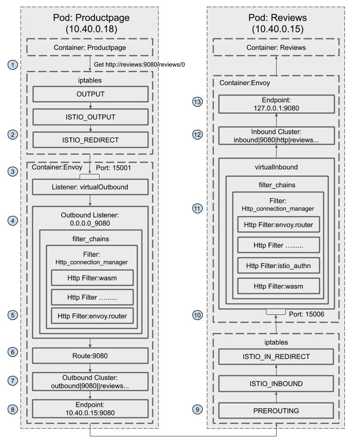

1. Productpage 发起对 reviews 服务的调用：http://reviews:9080/reviews/0 。
2. 请求被 productpage Pod 的 iptable 规则拦截，重定向到本地的 15001 端口。
3. 在 15001 端口上监听的 VirtualOutbound listener 收到了该请求。
4. 请求被 VirtualOutbound listener 根据原目标 IP（通配）和端口（9080）转发到 0.0.0.0_9080 这个 outbound listener。
    
    ```
    {
    "name": "virtualOutbound",
    "active_state": {
    "version_info": "2020-03-11T08:13:39Z/22",
    "listener": {
    "@type": "type.googleapis.com/envoy.api.v2.Listener",
    "name": "virtualOutbound",
    "address": {
     "socket_address": {
      "address": "0.0.0.0",
      "port_value": 15001
     }
    },
    ......

    "use_original_dst": true,
    "traffic_direction": "OUTBOUND"
    },
    "last_updated": "2020-03-11T08:14:04.929Z"
    }
    ```
5. 根据 0.0.0.0_9080 listener 的 http_connection_manager filter 配置，该请求采用 9080 route 进行分发。
    
    ```
    {
      "name": "0.0.0.0_9080",
      "active_state": {
       "version_info": "2020-03-11T08:13:39Z/22",
       "listener": {
        "@type": "type.googleapis.com/envoy.api.v2.Listener",
        "name": "0.0.0.0_9080",
        "address": {
         "socket_address": {
          "address": "0.0.0.0",
          "port_value": 9080
         }
        },
        "filter_chains": [
        ......
        {
          "filters": [
           {
            "name": "envoy.http_connection_manager",
            "typed_config": {
             "@type": "type.googleapis.com/envoy.config.filter.network.http_connection_manager.v2.HttpConnectionManager",
             "stat_prefix": "outbound_0.0.0.0_9080",
             "rds": {
              "config_source": {
               "ads": {}
              },
              "route_config_name": "9080"
             },
             "http_filters": [
              {
               "name": "envoy.filters.http.wasm",
               ......
              },
              {
               "name": "istio.alpn",
               ......
              },
              {
               "name": "envoy.cors"
              },
              {
               "name": "envoy.fault"
              },
              {
               "name": "envoy.filters.http.wasm",
               ......
              },
              {
               "name": "envoy.router"
              }
             ],
             "tracing": {
              "client_sampling": {
               "value": 100
              },
              "random_sampling": {
               "value": 100
              },
              "overall_sampling": {
               "value": 100
              }
             },
             ......           
            }
           }
          ]
         }
        ],
        "deprecated_v1": {
         "bind_to_port": false
        },
        "traffic_direction": "OUTBOUND"
       },
       "last_updated": "2020-03-11T08:14:04.927Z"
      }
     },
    ```

6. 9080 这个 route 的配置中，host name 为 reviews:9080 的请求对应的 cluster 为 `outbound|9080||reviews.default.svc.cluster.local`。
    
    ```
    {
    "version_info": "2020-03-11T08:13:39Z/22",
    "route_config": {
    "@type": "type.googleapis.com/envoy.api.v2.RouteConfiguration",
    "name": "9080",
    "virtual_hosts": [
    ......
     "name": "ratings.default.svc.cluster.local:9080",
     "domains": [
      "ratings.default.svc.cluster.local",
      "ratings.default.svc.cluster.local:9080",
      "ratings",
      "ratings:9080",
      "ratings.default.svc.cluster",
      "ratings.default.svc.cluster:9080",
      "ratings.default.svc",
      "ratings.default.svc:9080",
      "ratings.default",
      "ratings.default:9080",
      "10.102.90.243",
      "10.102.90.243:9080"
     ],
     "routes": [
      {
       "match": {
        "prefix": "/"
       },
       "route": {
        "cluster": "outbound|9080||ratings.default.svc.cluster.local",
        "timeout": "0s",
        "retry_policy": {
         "retry_on": "connect-failure,refused-stream,unavailable,cancelled,resource-exhausted,retriable-status-codes",
         "num_retries": 2,
         "retry_host_predicate": [
          {
           "name": "envoy.retry_host_predicates.previous_hosts"
          }
         ],
         "host_selection_retry_max_attempts": "5",
         "retriable_status_codes": [
          503
         ]
        },
        "max_grpc_timeout": "0s"
       },
       "decorator": {
        "operation": "ratings.default.svc.cluster.local:9080/*"
       },
       "name": "default"
      }
     ]
    },
    {
     "name": "reviews.default.svc.cluster.local:9080",
     "domains": [
      "reviews.default.svc.cluster.local",
      "reviews.default.svc.cluster.local:9080",
      "reviews",
      "reviews:9080",
      "reviews.default.svc.cluster",
      "reviews.default.svc.cluster:9080",
      "reviews.default.svc",
      "reviews.default.svc:9080",
      "reviews.default",
      "reviews.default:9080",
      "10.107.156.4",
      "10.107.156.4:9080"
     ],
     "routes": [
      {
       "match": {
        "prefix": "/"
       },
       "route": {
        "cluster": "outbound|9080||reviews.default.svc.cluster.local",
        "timeout": "0s",
        "retry_policy": {
         "retry_on": "connect-failure,refused-stream,unavailable,cancelled,resource-exhausted,retriable-status-codes",
         "num_retries": 2,
         "retry_host_predicate": [
          {
           "name": "envoy.retry_host_predicates.previous_hosts"
          }
         ],
         "host_selection_retry_max_attempts": "5",
         "retriable_status_codes": [
          503
         ]
        },
        "max_grpc_timeout": "0s"
       },
       "decorator": {
        "operation": "reviews.default.svc.cluster.local:9080/*"
       },
       "name": "default"
      }
     ]
    }
    ],
    "validate_clusters": false
    },
    "last_updated": "2020-03-11T08:14:04.971Z"
    }
    ```


7. outbound|9080||reviews.default.svc.cluster.local cluster 为动态资源，通过 EDS 查询得到该 cluster 中有3个 endpoint
    
    ```
    {
    "clusterName": "outbound|9080||reviews.default.svc.cluster.local",
    "endpoints": [
     {
       "lbEndpoints": [
         {
           "endpoint": {
             "address": {
               "socketAddress": {
                 "address": "10.40.0.15",
                 "portValue": 9080
               }
             }
           },
           "metadata": {},
           "loadBalancingWeight": 1
         },
         {
           "endpoint": {
             "address": {
               "socketAddress": {
                 "address": "10.40.0.16",
                 "portValue": 9080
               }
             }
           },
           "metadata": {},
           "loadBalancingWeight": 1
         },
         {
           "endpoint": {
             "address": {
               "socketAddress": {
                 "address": "10.40.0.17",
                 "portValue": 9080
               }
             }
           },
           "metadata": {},
           "loadBalancingWeight": 1
         }
       ],
       "loadBalancingWeight": 3
     }
    ]
    }
    ```

8. 请求被转发到其中一个 endpoint 10.40.0.15，即 reviews-v1 所在的 Pod。
9. 然后该请求被 iptable 规则拦截，重定向到本地的 15006 端口。
10. 在 15006 端口上监听的 VirtualInbound listener 收到了该请求。
11. 根据匹配条件，请求被 VirtualInbound listener 内部配置的 Http connection manager filter 处理，该 filter 设置的路由配置为将其发送给 inbound|9080|http|reviews.default.svc.cluster.local 这个 inbound cluster。
    
    ```
    {
    "name": "virtualInbound",
    "active_state": {
    "version_info": "2020-03-11T08:13:14Z/21",
    "listener": {
    "@type": "type.googleapis.com/envoy.api.v2.Listener",
    "name": "virtualInbound",
    "address": {
    "socket_address": {
     "address": "0.0.0.0",
     "port_value": 15006
    }
    },
    "filter_chains": [
    {
     "filter_chain_match": {
      "prefix_ranges": [
       {
        "address_prefix": "10.40.0.15",
        "prefix_len": 32
       }
      ],
      "destination_port": 9080,
      "application_protocols": [
       "istio-peer-exchange",
       "istio",
       "istio-http/1.0",
       "istio-http/1.1",
       "istio-h2"
      ]
     },
     "filters": [
      {
       "name": "envoy.filters.network.metadata_exchange",
       "config": {
        "protocol": "istio-peer-exchange"
       }
      },
      {
       "name": "envoy.http_connection_manager",
       "typed_config": {
        "@type": "type.googleapis.com/envoy.config.filter.network.http_connection_manager.v2.HttpConnectionManager",
        "stat_prefix": "inbound_10.40.0.15_9080",
        "route_config": {
         "name": "inbound|9080|http|reviews.default.svc.cluster.local",
         "virtual_hosts": [
          {
           "name": "inbound|http|9080",
           "domains": [
            "*"
           ],
           "routes": [
            {
             "match": {
              "prefix": "/"
             },
             "route": {
              "cluster": "inbound|9080|http|reviews.default.svc.cluster.local",
              "timeout": "0s",
              "max_grpc_timeout": "0s"
             },
             "decorator": {
              "operation": "reviews.default.svc.cluster.local:9080/*"
             },
             "name": "default"
            }
           ]
          }
         ],
         "validate_clusters": false
        },
        "http_filters": [
         {
          "name": "envoy.filters.http.wasm",
          ......
         },
         {
          "name": "istio_authn",
          ......
         },
         {
          "name": "envoy.cors"
         },
         {
          "name": "envoy.fault"
         },
         {
          "name": "envoy.filters.http.wasm",
          ......
         },
         {
          "name": "envoy.router"
         }
        ],
        ......
       }
      }
     ],
     "metadata": {...},
     "transport_socket": {...}
    ],
    ......
    }
    }
    ```

12. inbound|9080|http|reviews.default.svc.cluster.local cluster 配置的 host 为 127.0.0.1:9080。
    
    ```
    {
    "version_info": "2020-03-11T08:13:14Z/21",
    "cluster": {
    "@type": "type.googleapis.com/envoy.api.v2.Cluster",
    "name": "inbound|9080|http|reviews.default.svc.cluster.local",
    "type": "STATIC",
    "connect_timeout": "1s",
    "circuit_breakers": {
    "thresholds": [
    {
     "max_connections": 4294967295,
     "max_pending_requests": 4294967295,
     "max_requests": 4294967295,
     "max_retries": 4294967295
    }
    ]
    },
    "load_assignment": {
    "cluster_name": "inbound|9080|http|reviews.default.svc.cluster.local",
    "endpoints": [
    {
     "lb_endpoints": [
      {
       "endpoint": {
        "address": {
         "socket_address": {
          "address": "127.0.0.1",
          "port_value": 9080
         }
        }
       }
      }
     ]
    }
    ]
    }
    },
    "last_updated": "2020-03-11T08:13:39.118Z"
    }
    ```

13. 请求被转发到 127.0.0.1:9080，即 reviews 服务进行业务处理。


#### pilot 调试接口

```
$ curl http://10.97.222.108:15014/debug/edsz > pilot_eds_dump

```

### 2.4 Envoy

Envoy 是一款由 Lyft 开源的高性能数据和服务代理软件，使用现代 C++ 语言（C++11 以及 C++14）开发，提供四层和七层网络代理能力。

在设计之初 Envoy 没有将性能作为最终的目标，而是更加强调模块化、易测试、易开发等特性，可它仍旧拥有足可媲美 Nginx 等经典代理软件的超高性能。

在保证性能的同时，Envoy 也提供了强大的流量治理能力和可观察性。其独创的 xDS 协议则成为了构建 Service Mesh 通用数据面 API（UDPA）的基石。

Envoy 特性:
- 高性能：C++ 语言实现，基于 Libevent 事件机制以及非阻塞异步 IO，保障性能；
- 易扩展：利用其 L3/L4/L7 筛选器机制，Envoy 可以在各个层次进行功能扩展。
    
    包括但不限于：额外代理协议支持、HTTP 流量治理功能扩展等等。

    由于其良好的封装和现代 C++ 对各种操作的简化，其开发过程非常友好；

    此外，Envoy 也提供了基于 WASM 的扩展支持以及基于 Lua 脚本的简单功能扩展；

- 多协议支持：原生支持代理 HTTP、Kafka、Dubbo、Redis 等多种协议；
- 动态化配置：基于 xDS 协议实现配置的完全动态化，简化配置更新操作，实现监听端口、路由规则、后端服务发现等全运行时动态下发及更新；
- 可观察性：内置日志，指标，追踪三个模块用于实现全方位、多维度流量和事件观察；
- HTTP 筛选器：社区原生提供了大量的功能强大的 HTTP 筛选器如限流、认证鉴权、缓存、压缩、GRPC 协议转换等等，开箱即用；
- 社区开放活跃：Envoy 完全开源，不存在对应的商业版本，保证了它的发展不会受限于商业化；而且 Envoy 社区非常活跃，不断向前推动 Envoy 的演进和发展。


新兴微服务网关如 Gloo，Ambassador 都基于 Envoy 进行扩展开发；而在服务网格中，Istio、Kong 社区 Kuma、亚马逊 AMS App Mesh 都使用 Envoy 作为默认数据平面。

#### 2.4.1 架构

在 Envoy 中，数据请求的*入口*方向被称之为**下游（Downstream）**，而数据请求的*出口*方向则称之为**上游（Upstream）**。Envoy 接收来自下游的请求并将之转发给上游。 

在下游方向，Envoy 使用**监听器（Listener）**来监听数据端口，接受下游连接和请求；在上游方向，Envoy 使用**集群（Cluster）**来抽象上游服务，管理连接池以及与之相关的健康检查等配置。而在监听器和集群之间，Envoy 则使用**筛选器（Filter）**和**路由（Router）**将两者联系在一起。 

**筛选器**是 Envoy 中可拔插的多种功能组件的统称，简单来说，筛选器就是*插件*。但是 Envoy 中 L3/L4 筛选器架构大大扩展了它的功能界限，以至于筛选器的内涵要比常规理解的“插件”要丰富的多，所以本小节选择了直译官方名称，称之为筛选器而非插件。

Envoy 包含多种类型筛选器。其中 L3/L4 筛选器主要用于处理连接和协议解析，不同的 L3/L4 筛选器可以使得 Envoy 代理不同协议的网络数据，举例来说，Envoy 中最为核心的 HTTP 代理功能就是构筑在一个名为*HTTP 连接管理器（Http Connection Manager）*的 L4 筛选器之上的。而 L7 筛选器（绝大部分情况下 L7 筛选器都可以和 HTTP 筛选器划等号）则是作为 L4 筛选器的*子筛选器*存在，用于支撑实现更加丰富的流量治理能力。监听器、集群、路由和筛选器构成了 Envoy 最为核心的骨架。

Envoy 架构图:

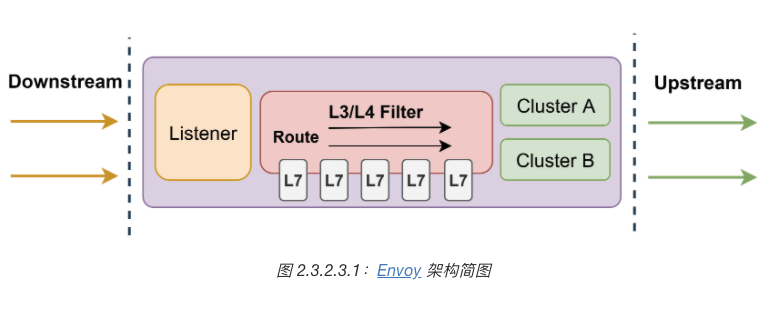


Envoy 采用**多线程**以及**基于 Libevent 的事件触发机制**来保证其超高的性能。在 Envoy 中，一共存在三种不同的线程，分别是

- Main 线程
    
    - Main 线程负责配置更新（对接 xDS 服务）
    - 监控指标刷新和输出
    - 对外提供 Admin 端口等工作
    - 责整个进程的管理, 如处理操作系统信号、Envoy 热重启等。

- Worker 线程
    
    Worker 线程是一个**非阻塞的事件循环**，每个 Worker 线程都会监听所有的 Listener，并处理相关连接和请求事件。

    注意，操作系统会保证一个事件最终只会被一个 Worker 处理。在绝大多数时候，Worker 线程都只在不断的处理下游的请求和上游的响应。极少数情况下，Main 线程会将配置更新以事件的形式添加到 Worker的事件循环中来。

- 文件刷新线程

    文件刷新线程负责将 Envoy 需要*持久化*的数据写入磁盘。在 Envoy 中，所有打开的文件（主要是日志文件）都分别对应一个独立的文件刷新线程用于周期性的把内存缓冲的数据写入到磁盘文件之中。而 Worker 线程在写文件时，实际只是将数据写入到内存缓冲区，最终由文件刷新线程落盘。如此可以避免 Worker 线程被磁盘 IO 所阻塞。

- Thread Local Store, TLS : 为了尽可能的减少线程间由于数据共享而引入的争用以及锁操作，Envoy 设计了一套非常巧妙的 Thread Local Store 机制（简称 TLS）

Envoy 线程模型:
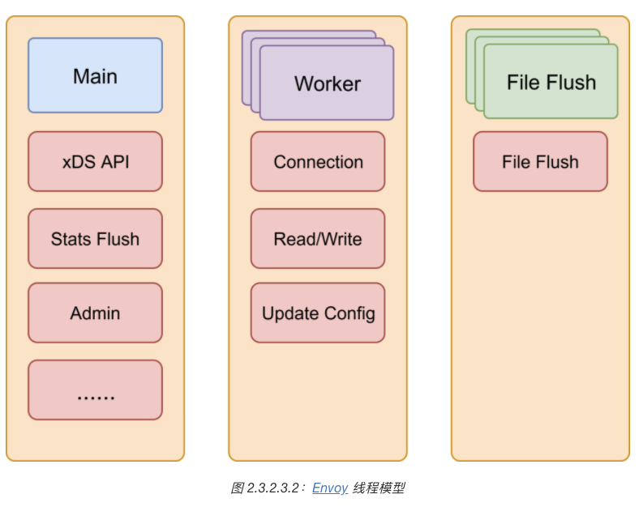


##### 筛选器

 Envoy 强大功能的源泉：筛选器。

 筛选器本质上就是插件，因此通过扩展开发筛选器，可以在不侵入 Envoy 主干源码的前提下，实现对 Envoy 功能的扩展增强。而且 L3/L4 筛选器架构大大拓宽了 Envoy 中“扩展”二字的可能性。在 Envoy 中大量的核心功能都是以可拔插的扩展构筑在其 L3/L4 筛选器架构之上的。

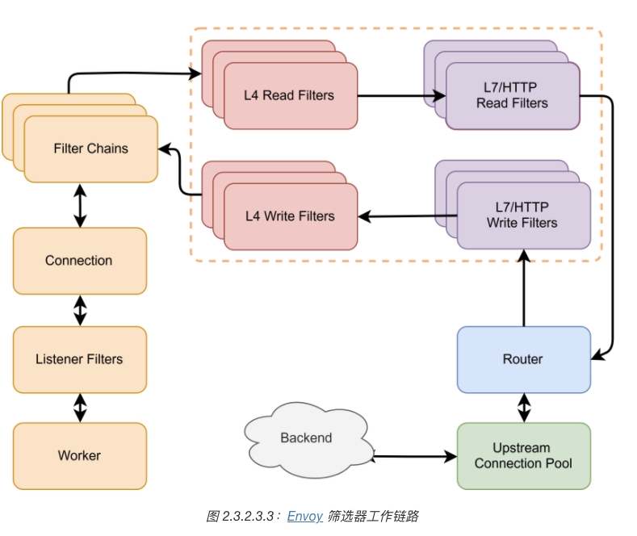

- 当操作系统接收到来自下游的连接时，会随机选择一个 **Worker** 来处理该事件。

- 然后每一个**监听器筛选器（Listener Filter）**都会被用于处理该连接。
    
    监听器筛选器会在一个新连接被操作系统所接受之后但是 Envoy 仍未完全创建对应的连接对象之**前**发挥作用。

    此时，Listener 可以直接操作原始的套接字（Socket），也可以中断插件链执行。
    
    直到所有的监听器筛选器执行完成，一个可操作的 Envoy **连接对象**才会被建立，Envoy 开始接受来自下游的请求或数据。

    而当该连接具体的请求或者数据到来之时，各个 L4（Network）筛选器开始工作。

    监听器筛选器很少被用到，对于绝大部分的开发者来说，即使是需要深度定制开发 Envoy，也极少会需要开发监听器筛选器。 

- L4 筛选器分为 Read 和 Write 两种不同类型，分别用于读取外部数据和向外部发送数据，它可以直接操作连接上的二进制字节流。
    
    在大部分的实现当中，L4 筛选器负责将连接中的二进制字节流解析为具有的协议语义的数据（如 HTTP Headers，Body 等）并交由 L7 筛选器进一步处理。

    Envoy 使用多个 L4 筛选器分别解析不同协议来实现*多协议代理*功能。目前社区已经提供了与 HTTP、Dubbo、Mongo、Kafka、Thrift 等协议对应的多种 L4 筛选器。

    而通过扩展 L4 筛选器，也可以轻松的在不侵入 Envoy 主干的前提下，扩展支持新的协议。

    另外必须要说明的是，协议解析并不是 L4 筛选器的必备功能，同样存在一些非协议解析类型的 L4 筛选器，如工作在 L4 的限流、鉴权等筛选器。实际上，在 L4 筛选器和 L7 筛选器之间，应该有一层专门的编解码器。不过在常见的实现当中，**编解码器都被集成到对应协议的 L4 筛选器中**，所以本节提供的筛选器链路图中干脆也略去了对应的层次。

    一般情况下，只有需要扩展 Envoy 以支持额外的协议之时，才需要扩展开发 L4 筛选器。

- **L7 筛选器**一般是对应协议的 L4 筛选器的子筛选器，如 HTTP 筛选器就是 L4 筛选器“HTTP 连接管理器”的子筛选器。
    
    L4 筛选器在完成二进制数据的解析之后，会依次调用各个 L7 筛选器来处理解析后的具有**协议语义**的结构化数据，用于实现各种流量治理功能，包括但不限于限流、熔断、IP 黑白名单、认证鉴权、缓存、降级等等等等。

    实际上，**路由组件也往往被实现为一个特殊的 L7 筛选器**。当然，整个互联网是搭建在 HTTP 协议之上的，所以在 Envoy 中处处可见对 HTTP 协议的特化。

    在 Envoy 中，L7 筛选器几乎可以等价于 HTTP 筛选器，因为如 Kafka、Redis 等其他协议的 L4 筛选器目前还没有提供良好的 L7 支持。

    L7 筛选器是大部分开发者最常用也是最需要关注的类型。通过扩展 L7 筛选器，可以扩展支持各种特定的流量控制能力，而且社区本身也提供了大量的可靠、高性能的 L7 筛选器供用户直接使用。

- 在所有的 L7 筛选器都执行完成之后，**路由组件（Router）**将会被调用，将请求通过连接池发送给后端服务，并*异步*等待后端响应。

- 在收到后端服务响应之后，Envoy 会**倒序执行**上述的插件链，将响应最终传递给客户端。至此，一个完整的请求转发和响应便完成了。

#### 2.3.2 xDS 协议

Envoy 几乎所有配置都可以通过订阅来**动态**获取，如监控指定路径下的文件、启动 gRPC 流或轮询 REST 接口，对应的发现服务以及各种各样的 API 统称为 `xDS`。

Envoy 与 xDS 之间通过 `Proto` 约定请求和响应的数据模型，不同类型资源，对应的数据模型也不同。

以 Istio 中 Pilot 为例，当 Pilot 发现新的服务或路由规则被创建（通过监控 Kubernetes 集群中特定 CRD 资源变化、或者发现 Consul 服务注册和配置变化），Pilot 会通过已经和 Envoy 之间建立好的 GRPC 流将相关的配置推送到 Envoy。Envoy 接收到相关配置并校验无误之后，就会动态的更新运行时配置，使用新的配置更新相关资源。如 监听器、集群、路由以及筛选器等。

Envoy 有四种核心资源, 监听器, 集群, 路由 及筛选器. 针对不同类型的资源，Envoy 提供了不同的 xDS API，包括 LDS、CDS、RDS等等。

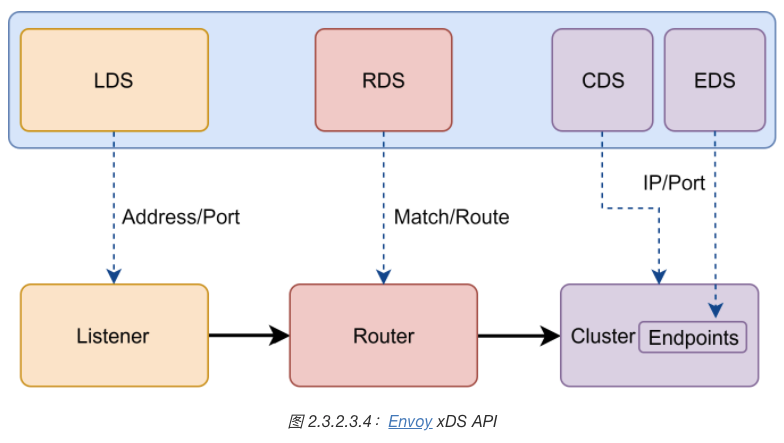


##### LDS --> 监听器

LDS 用于向 Envoy 下发监听器的相关配置用于动态创建新的监听器或者更新已有监听器。其包括监听器的地址、监听端口、完整的筛选器链等等。

在实际的生产环境当中，LDS 往往是整个 Envoy 正常工作的基础。

##### CDS --> 集群 | EDS 

CDS 用于向 Envoy 下发集群的相关配置用于创建新的集群或者更新已有的集群。其中包括健康检查配置、连接池配置等等。

一般情况下，CDS 服务会将其发现的所有可访问的后端服务抽象为集群配置后全量推送给 Envoy。

而与 CDS 紧密相关的另一种 xDS 服务称之为 EDS。CDS 服务负责**集群类型**的推送。而当该**集群类型为 EDS** 时，说明该集群的所有可访问的端点（Endpoints）也需要由通过 xDS 协议动态下发，而不使用 DNS 等手段解析。负责下发端点的服务就称之为 EDS。

##### RDS --> 路由

RDS 用于下发动态的路由规则。

路由中最关键的配置包含匹配规则和目标集群，此外，也可能包含重试、分流、限流等等。

##### 筛选器

筛选器作为核心的一种资源，但是并*没有*与之对应的专门的 xDS API 用于发现和动态下发筛选器的配置。

筛选器的所有配置都是嵌入在 LDS、RDS、以及 CDS 当中，比如 LDS 下发的监听器和 CDS 下发的集群中会包含筛选器链的配置，而 RDS 推送的路由配置当中，也可能包含与具体路由相关的一些筛选器配置。

#### 2.3.3 可观察性

通过日志（Access log），指标（Metrics），追踪（Tracing）三个模块从三个不同的维度来实现对所有流经 Envoy 的请求的统计、观察和监测。

- 日志:
    
    日志是对 Envoy 中事件（主要是指下游请求）的详细记录，用于定位一些疑难问题。

    Envoy 提供了灵活的的**标记符系统**来让用户可以自由的组装和定义自己的日志格式以及所包含的内容。同时，Envoy 也提供了强大的**日志过滤能力**，在数据量较大时，可以以此过滤掉非关键数据。

    借助 xDS 协议，无论是日志格式还是过滤规则，都可以在运行时动态的变化和修改。

- 指标:
    
    指标是对 Envoy 中事件的数值化统计，往往需要搭配 Prometheus 等事件数据库配合使用。

    Envoy 提供了筛选器、集群等多种维度的丰富的指标，包括请求响应码类型、响应耗时区间、异常事件记录等等。

    而且 Envoy 允许筛选器自由的扩展属于自己的独特指标计数，如 HTTP 限流、鉴权等筛选器都扩展了对应的指标，使得 Envoy 也可以从某个具体的流量治理功能的角度观察流量情况。

- 追踪:

    追踪是对 Envoy 以及上下游服务中多个事件因果关系的记录，必须**要上下游服务同时支持**，并**对接外部追踪系统**。

    Envoy 原生支持了 Lightstep、Zipkin 等多种追踪系统，无需额外的修改或者开发，只需要简单的配置即可。

#### 2.3.4 应用场景

Envoy 本身并不限定自己的使用方法。但它最常扮演的是两种角色:
- API 网关, 管理南北流量: 
    一种是作为集群流量入口的 API 网关（Gateway），管理南北向流量；
- 服务 Sidecar, 治理东西流量:
    另一种是作为服务 Sidecar，拦截并治理服务网格中东西向流量。


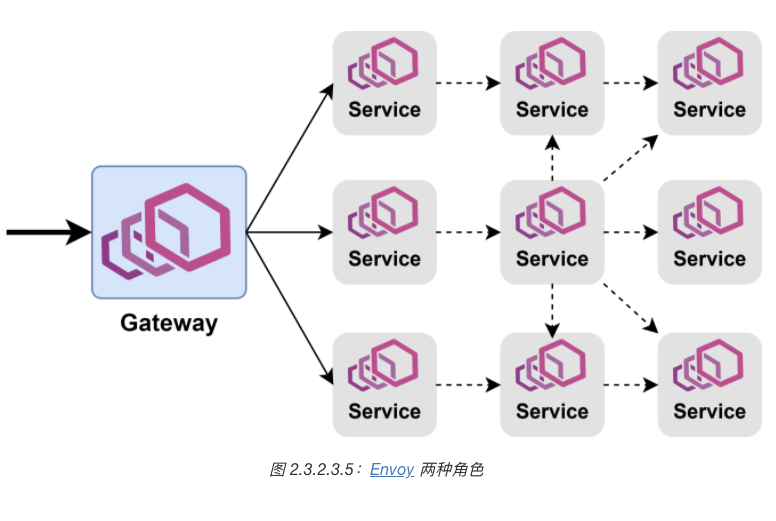
