[toc]

# 图片区
Istio Architecture:
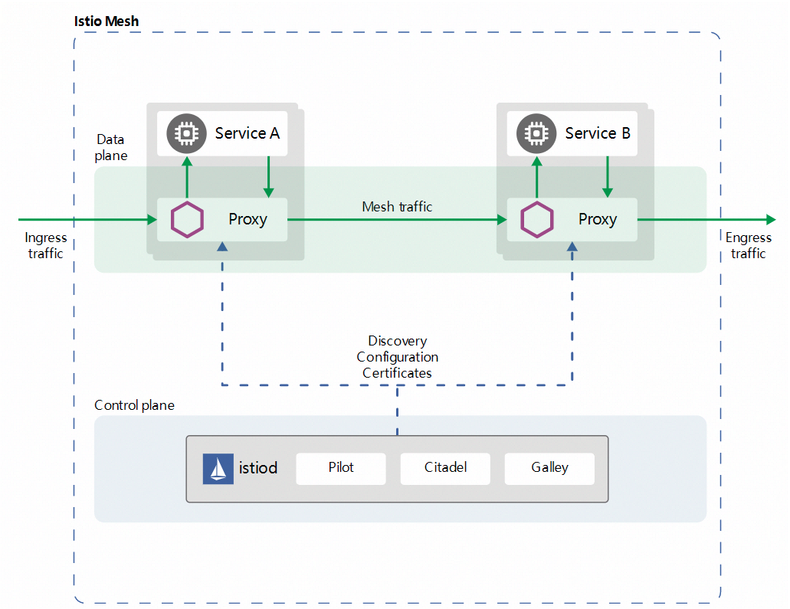


Istio 提供了三种访问外部服务的方法：
- 允许 sidecar 将请求传递到未在网格内配置过的任何外部服务。使用这种方法时，无法监控对外部服务的访问，也不能利用 Istio 的流量控制功能。
- 配置 ServiceEntry 以提供对外部服务的受控访问。这是 Istio 官方推荐使用的方法。
- 对于特定范围的 IP，完全绕过 sidecar。仅当出于性能或其他原因无法使用 sidecar 配置外部访问时，才建议使用该配置方法。

流量镜像原理:
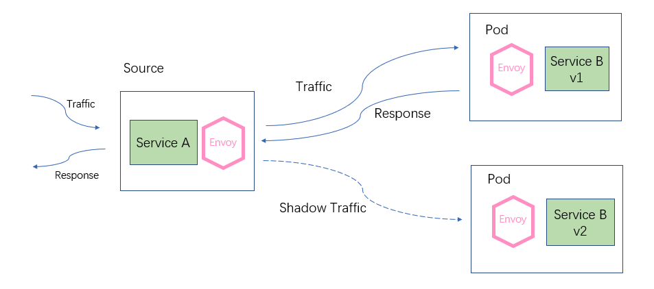

镜像流量示例:
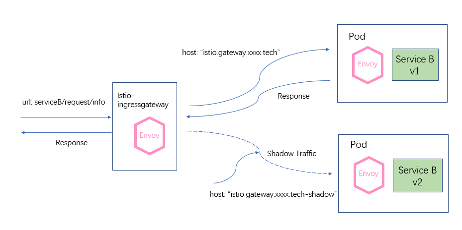
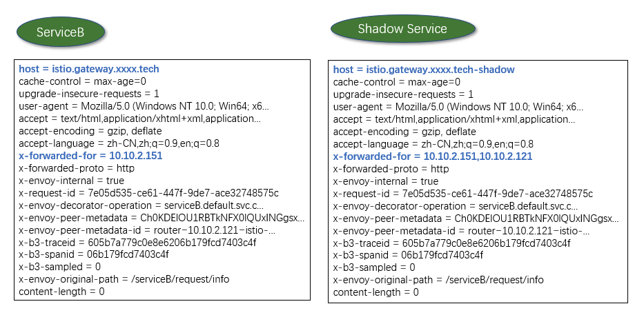

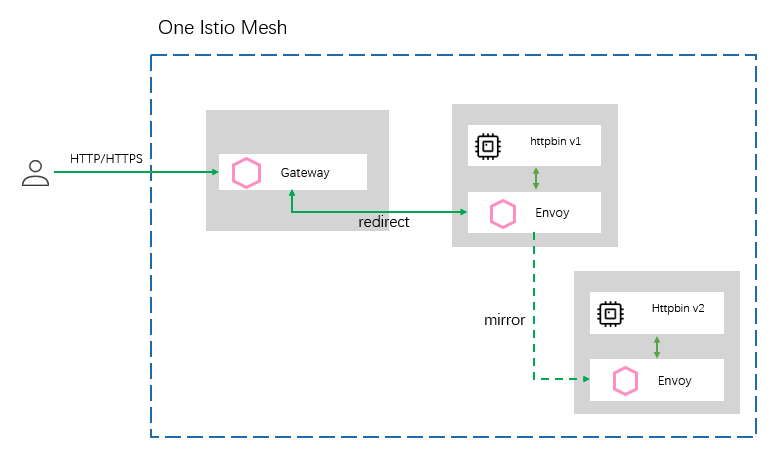

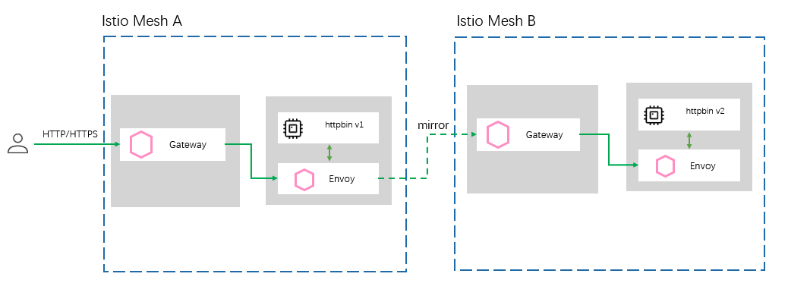

Fortio 是一款优秀的负载测试工具，它起初是 Istio 项目的一部分，现已独立进行运营。
https://github.com/istio/fortio


| Envoy paramether  |  Envoy upon object  | Istio parameter | Istio upon ojbect |
| -- | -- | -- | -- |
| max_connections | cluster.circuit_breakers   | maxConnections | TCPSettings |
| max_pending_requests |    cluster.circuit_breakers   | http1MaxPendingRequests| HTTPSettings |
| max_requests |    cluster.circuit_breakers   | http2MaxRequests   | HTTPSettings |
| max_retries | cluster.circuit_breakers   | maxRetries | HTTPSettings |
| connect_timeout_ms |  cluster| connectTimeout | TCPSettings |
| max_requests_per_connection | cluster| maxRequestsPerConnection   | HTTPSettings |

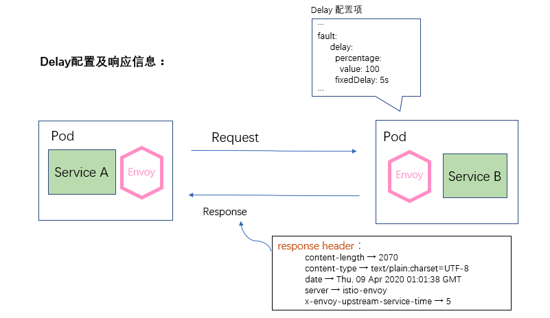


# 需要解决的问题

1. 应用如何部署, 集成 leneo ?
2. 服务发现如何做? 避免冲突, 避免功能上的冲突, 如 熔断, 服务发现等
3. 监控如何做, 特别是容器云 如何部署 prom

日志收集 EFK:
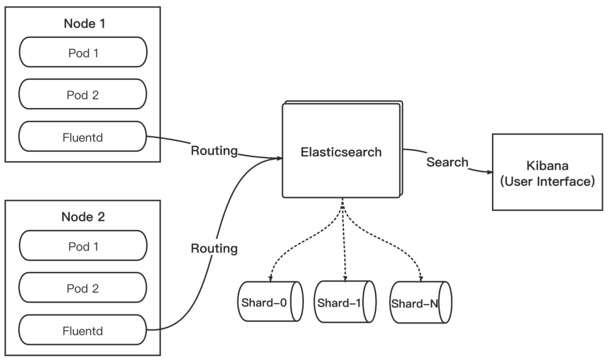

Trace-Span 关系图:
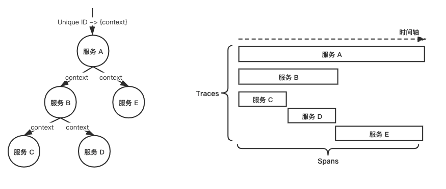

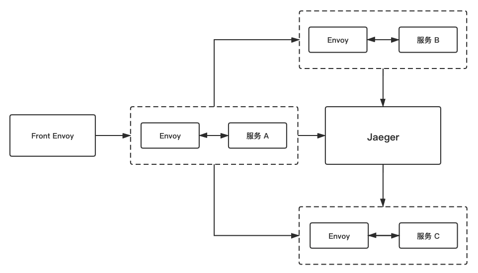
Jaeger 架构图
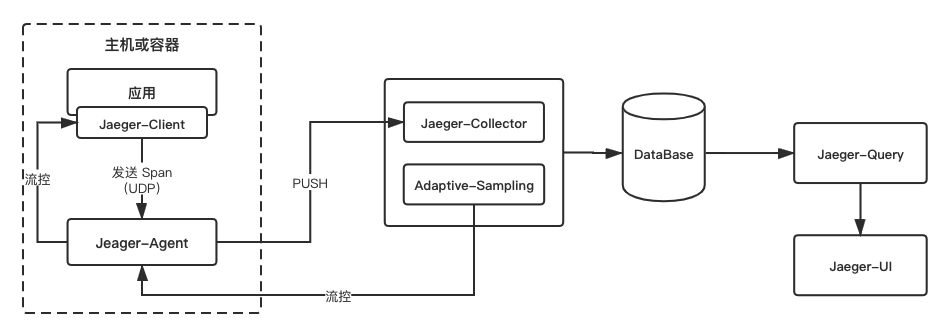

----------------

# 安装部署/卸载

部署方式: 使用 `istioctl` 安装.

版本: 
- 1.9.1
- 1.8.4
- 1.7.8
- 1.6.14
- 1.5.10


其他:
https://www.servicemesher.com/blog/istio-1-7-explanation/

## 1. 安装部署

从 Istio v1.5 版本开始，使用 helm 安装的方式已经废弃，需改用 istioctl 安装。

从 https://github.com/istio/istio/releases 下载安装包即可.

安装目录内容:

| 目录 |  包含内容 |
| -- | -- |
| bin | 包含 istioctl 的客户端文件 |
| install | 包含 Consul、GCP 和 Kubernetes 平台的 Istio 安装脚本和文件 |
| samples | 包含示例应用程序 |
| tools |   包含用于性能测试和在本地机器上进行测试的脚本 |

### 安装 Istio
```
# 版本检查
$ istioctl x pre-check

# 使用 demo 配置, 可以多次 apply.
$ istioctl manifest apply --set profile=demo

# 查看服务
$ kubectl get svc -n istio-system
    NAME                        TYPE           CLUSTER-IP       EXTERNAL-IP   PORT(S)                                                                             AGE
    grafana                     ClusterIP      10.108.112.31    <none>        3000/TCP                                                                             24s
    istio-egressgateway         ClusterIP      10.106.157.7     <none>        80/TCP,443/TCP,15443/TCP                                                                             26s
    istio-ingressgateway        LoadBalancer   10.110.57.34     <pending>     15020:31817/TCP,80:30733/TCP,443:31910/TCP,15029:32168/TCP,15030:31733/TCP,15031:31981/TCP,15032:30531/TCP,31400:31169/TCP,15443:31131/TCP   26s
    istio-pilot                 ClusterIP      10.110.196.147   <none>        15010/TCP,15011/TCP,15012/TCP,8080/TCP,15014/TCP,443/TCP                                                                             46s
    istiod                      ClusterIP      10.104.27.234    <none>        15012/TCP,443/TCP                                                                             46s
    jaeger-agent                ClusterIP      None             <none>        5775/UDP,6831/UDP,6832/UDP                                                                             24s
    jaeger-collector            ClusterIP      10.103.156.147   <none>        14267/TCP,14268/TCP,14250/TCP                                                                             24s
    jaeger-collector-headless   ClusterIP      None             <none>        14250/TCP                                                                             24s
    jaeger-query                ClusterIP      10.110.109.206   <none>        16686/TCP                                                                             24s
    kiali                       ClusterIP      10.96.182.125    <none>        20001/TCP                                                                             24s
    prometheus                  ClusterIP      10.104.167.86    <none>        9090/TCP                                                                             24s
    tracing                     ClusterIP      10.102.230.151   <none>        80/TCP                                                                             24s
    zipkin                      ClusterIP      10.111.66.10     <none>        9411/TCP       

# 查看容器
$ kubectl get pod -n istio-system
    NAME                                    READY   STATUS    RESTARTS   AGE
    grafana-5cc7f86765-jxdcn                1/1     Running   0          4m24s
    istio-egressgateway-598d7ffc49-bdmzw    1/1     Running   0          4m24s
    istio-ingressgateway-7bd5586b79-gnzqv   1/1     Running   0          4m25s
    istio-tracing-8584b4d7f9-tq6nq          1/1     Running   0          4m24s
    istiod-646b6fcc6-c27c7                  1/1     Running   0          4m45s
    kiali-696bb665-jmts2                    1/1     Running   0          4m24s
    prometheus-6c88c4cb8-xchzd              2/2     Running   0          4m24s

# 验证安装是否成功
$ istioctl verify-install

    Deployment: istio-ingressgateway.istio-system
    PodDisruptionBudget: istio-ingressgateway.istio-system
    Role: istio-ingressgateway-sds.istio-system
    RoleBinding: istio-ingressgateway-sds.istio-system
    Service: istio-ingressgateway.istio-system
    ServiceAccount: istio-ingressgateway-service-account.istio-system
    Deployment: istio-egressgateway.istio-system
    PodDisruptionBudget: istio-egressgateway.istio-system
    Service: istio-egressgateway.istio-system
    ServiceAccount: istio-egressgateway-service-account.istio-system
    ClusterRole: istiod-istio-system.default
    ClusterRole: istio-reader-istio-system.default
    ClusterRoleBinding: istio-reader-istio-system.default
    ClusterRoleBinding: istiod-pilot-istio-system.default
    ServiceAccount: istio-reader-service-account.istio-system
    ServiceAccount: istiod-service-account.istio-system
    ValidatingWebhookConfiguration: istiod-istio-system.default
    CustomResourceDefinition: httpapispecs.config.istio.io.default
    CustomResourceDefinition: httpapispecbindings.config.istio.io.default
    CustomResourceDefinition: quotaspecs.config.istio.io.default
    CustomResourceDefinition: quotaspecbindings.config.istio.io.default
    CustomResourceDefinition: destinationrules.networking.istio.io.default
    CustomResourceDefinition: envoyfilters.networking.istio.io.default
    CustomResourceDefinition: gateways.networking.istio.io.default
    CustomResourceDefinition: serviceentries.networking.istio.io.default
    CustomResourceDefinition: sidecars.networking.istio.io.default
    CustomResourceDefinition: virtualservices.networking.istio.io.default
    CustomResourceDefinition: workloadentries.networking.istio.io.default
    CustomResourceDefinition: attributemanifests.config.istio.io.default
    CustomResourceDefinition: handlers.config.istio.io.default
    CustomResourceDefinition: instances.config.istio.io.default
    CustomResourceDefinition: rules.config.istio.io.default
    CustomResourceDefinition: clusterrbacconfigs.rbac.istio.io.default
    CustomResourceDefinition: rbacconfigs.rbac.istio.io.default
    CustomResourceDefinition: serviceroles.rbac.istio.io.default
    CustomResourceDefinition: servicerolebindings.rbac.istio.io.default
    CustomResourceDefinition: authorizationpolicies.security.istio.io.default
    CustomResourceDefinition: peerauthentications.security.istio.io.default
    CustomResourceDefinition: requestauthentications.security.istio.io.default
    CustomResourceDefinition: adapters.config.istio.io.default
    CustomResourceDefinition: templates.config.istio.io.default
    CustomResourceDefinition: istiooperators.install.istio.io.default
    ConfigMap: istio-grafana-configuration-dashboards-istio-mesh-dashboard.istio-system
    ConfigMap: istio-grafana-configuration-dashboards-istio-performance-dashboard.istio-system
    ConfigMap: istio-grafana-configuration-dashboards-istio-service-dashboard.istio-system
    ConfigMap: istio-grafana-configuration-dashboards-istio-workload-dashboard.istio-system
    ConfigMap: istio-grafana-configuration-dashboards-mixer-dashboard.istio-system
    ConfigMap: istio-grafana-configuration-dashboards-pilot-dashboard.istio-system
    ConfigMap: istio-grafana.istio-system
    Deployment: grafana.istio-system
    PeerAuthentication: grafana-ports-mtls-disabled.istio-system
    Service: grafana.istio-system
    ClusterRole: kiali.default
    ClusterRole: kiali-viewer.default
    ClusterRoleBinding: kiali.default
    ConfigMap: kiali.istio-system
    Secret: kiali.istio-system
    Deployment: kiali.istio-system
    Service: kiali.istio-system
    ServiceAccount: kiali-service-account.istio-system
    ClusterRole: prometheus-istio-system.default
    ClusterRoleBinding: prometheus-istio-system.default
    ConfigMap: prometheus.istio-system
    Deployment: prometheus.istio-system
    Service: prometheus.istio-system
    ServiceAccount: prometheus.istio-system
    Deployment: istio-tracing.istio-system
    Service: jaeger-query.istio-system
    Service: jaeger-collector.istio-system
    Service: jaeger-collector-headless.istio-system
    Service: jaeger-agent.istio-system
    Service: zipkin.istio-system
    Service: tracing.istio-system
    ConfigMap: istio.istio-system
    Deployment: istiod.istio-system
    ConfigMap: istio-sidecar-injector.istio-system
    MutatingWebhookConfiguration: istio-sidecar-injector.default
    PodDisruptionBudget: istiod.istio-system
    Service: istiod.istio-system
    EnvoyFilter: metadata-exchange-1.4.istio-system
    EnvoyFilter: stats-filter-1.4.istio-system
    EnvoyFilter: metadata-exchange-1.5.istio-system
    EnvoyFilter: tcp-metadata-exchange-1.5.istio-system
    EnvoyFilter: stats-filter-1.5.istio-system
    EnvoyFilter: tcp-stats-filter-1.5.istio-system
    EnvoyFilter: metadata-exchange-1.6.istio-system
    EnvoyFilter: tcp-metadata-exchange-1.6.istio-system
    EnvoyFilter: stats-filter-1.6.istio-system
    EnvoyFilter: tcp-stats-filter-1.6.istio-system

``` 

### 升级
注意事项:
-  Istio 提供了降级方式，但是经过测试降级的体验并不好，并且出现了由于不支持的 CRD apiVersion 导致无法降级的情况，所以请谨慎升级
- Istio 不支持 跨版本升级。仅支持从 1.5 版本升级到 1.6 版本
- Istio 1.6 推出了渐进式的 Istio 升级方式 : **金丝雀升级**，可以让新老版本的 istiod 同时存在，并允许将所有流量在由新版 istiod 控制之前，先将一小部分工作负载交由新版本 istiod 控制，并进行监控，渐进式的完成升级。

#### 金丝雀升级

控制平面:
```
# 1. 下载新版本

# 2. 安装 canary 版本，将 revision 字段设置为 canary, 会看到部署了新的 istio-canary, 新的 istio-canary 不会对老的产生影响.
$ istioctl install --set revision=canary

$ kubectl get pods -n istio-system
    NAME                                        READY   STATUS    RESTARTS   AGE
    pod/istiod-85745c747b-knlwb                 1/1     Running   0          33m
    pod/istiod-canary-865f754fdd-gx7dh          1/1     Running   0          3m25s

# 查看新版本的 sidecar injector 配置
$ kubectl get mutatingwebhookconfigurations
    NAME                            CREATED AT
    istio-sidecar-injector          2020-07-07T08:39:37Z
    istio-sidecar-injector-canary   2020-07-07T09:06:24Z

```
数据平面: 只安装 canary 版本的控制平面并不会对现有的代理造成影响，要升级数据平面，将他们指向新的控制平面，需要在 namespace 中插入 `istio.io/rev` 标签。

例如, 如果升级 default namespace 的数据平面, 需要添加 `istio.io/rev` 标签指向 canary 版本的控制平面, 并删除 `istio-injection` 标签(istio-injection标签必须删除，因为该标签的优先级高于istio.io/rev 标签).
```
$ kubectl label namespace default istio-injection- istio.io/rev=canary

```
namespace 更新成功之后, 重启 pod 注入新的 sidecar:
```
$ kubectl rollout restart deployment -n default

# 验证
$ kubectl get pods -n default -l istio.io/rev=canary

$ istioctl proxy-config endpoints ${pod_name}.default --cluster xds-grpc -ojson | grep hostname
    "hostname": "istiod-canary.istio-system.svc"
```

## 2. 卸载
```
$ istioctl manifest generate --set profile=demo | kubectl delete -f -
```


## 生产安装

```
$ istioctl manifest apply --set profile=default

# 关闭 prometheus, 启动 kiali, tracing.
# ****每次更新, 必须全部带上配置. ****
$ istioctl manifest apply --set addonComponents.prometheus.enabled=false --set addonComponents.kiali.enabled=true --set addonComponents.tracing.enabled=true
```

prometheus 配置:

```
global:
  scrape_interval: 15s
  scrape_timeout: 10s
  evaluation_interval: 1m
scrape_configs:
- job_name: istio-mesh
  honor_timestamps: true
  scrape_interval: 15s
  scrape_timeout: 10s
  metrics_path: /metrics
  scheme: http
  kubernetes_sd_configs:
  - role: endpoints
    namespaces:
      names:
      - istio-system
  relabel_configs:
  - source_labels: [__meta_kubernetes_service_name, __meta_kubernetes_endpoint_port_name]
    separator: ;
    regex: istio-telemetry;prometheus
    replacement: $1
    action: keep
- job_name: envoy-stats
  honor_timestamps: true
  scrape_interval: 15s
  scrape_timeout: 10s
  metrics_path: /stats/prometheus
  scheme: http
  kubernetes_sd_configs:
  - role: pod
  relabel_configs:
  - source_labels: [__meta_kubernetes_pod_container_port_name]
    separator: ;
    regex: .*-envoy-prom
    replacement: $1
    action: keep
  - source_labels: [__address__, __meta_kubernetes_pod_annotation_prometheus_io_port]
    separator: ;
    regex: ([^:]+)(?::\d+)?;(\d+)
    target_label: __address__
    replacement: $1:15090
    action: replace
  - separator: ;
    regex: __meta_kubernetes_pod_label_(.+)
    replacement: $1
    action: labeldrop
  - source_labels: [__meta_kubernetes_namespace]
    separator: ;
    regex: (.*)
    target_label: namespace
    replacement: $1
    action: replace
  - source_labels: [__meta_kubernetes_pod_name]
    separator: ;
    regex: (.*)
    target_label: pod_name
    replacement: $1
    action: replace
- job_name: istio-policy
  honor_timestamps: true
  scrape_interval: 15s
  scrape_timeout: 10s
  metrics_path: /metrics
  scheme: http
  kubernetes_sd_configs:
  - role: endpoints
    namespaces:
      names:
      - istio-system
  relabel_configs:
  - source_labels: [__meta_kubernetes_service_name, __meta_kubernetes_endpoint_port_name]
    separator: ;
    regex: istio-policy;http-policy-monitoring
    replacement: $1
    action: keep
- job_name: istio-telemetry
  honor_timestamps: true
  scrape_interval: 15s
  scrape_timeout: 10s
  metrics_path: /metrics
  scheme: http
  kubernetes_sd_configs:
  - role: endpoints
    namespaces:
      names:
      - istio-system
  relabel_configs:
  - source_labels: [__meta_kubernetes_service_name, __meta_kubernetes_endpoint_port_name]
    separator: ;
    regex: istio-telemetry;http-monitoring
    replacement: $1
    action: keep
- job_name: pilot
  honor_timestamps: true
  scrape_interval: 15s
  scrape_timeout: 10s
  metrics_path: /metrics
  scheme: http
  kubernetes_sd_configs:
  - role: endpoints
    namespaces:
      names:
      - istio-system
  relabel_configs:
  - source_labels: [__meta_kubernetes_service_name, __meta_kubernetes_endpoint_port_name]
    separator: ;
    regex: istiod;http-monitoring
    replacement: $1
    action: keep
  - source_labels: [__meta_kubernetes_service_label_app]
    separator: ;
    regex: (.*)
    target_label: app
    replacement: $1
    action: replace
- job_name: galley
  honor_timestamps: true
  scrape_interval: 15s
  scrape_timeout: 10s
  metrics_path: /metrics
  scheme: http
  kubernetes_sd_configs:
  - role: endpoints
    namespaces:
      names:
      - istio-system
  relabel_configs:
  - source_labels: [__meta_kubernetes_service_name, __meta_kubernetes_endpoint_port_name]
    separator: ;
    regex: istio-galley;http-monitoring
    replacement: $1
    action: keep
- job_name: citadel
  honor_timestamps: true
  scrape_interval: 15s
  scrape_timeout: 10s
  metrics_path: /metrics
  scheme: http
  kubernetes_sd_configs:
  - role: endpoints
    namespaces:
      names:
      - istio-system
  relabel_configs:
  - source_labels: [__meta_kubernetes_service_name, __meta_kubernetes_endpoint_port_name]
    separator: ;
    regex: istio-citadel;http-monitoring
    replacement: $1
    action: keep
- job_name: sidecar-injector
  honor_timestamps: true
  scrape_interval: 15s
  scrape_timeout: 10s
  metrics_path: /metrics
  scheme: http
  kubernetes_sd_configs:
  - role: endpoints
    namespaces:
      names:
      - istio-system
  relabel_configs:
  - source_labels: [__meta_kubernetes_service_name, __meta_kubernetes_endpoint_port_name]
    separator: ;
    regex: istio-sidecar-injector;http-monitoring
    replacement: $1
    action: keep
- job_name: kubernetes-apiservers
  honor_timestamps: true
  scrape_interval: 15s
  scrape_timeout: 10s
  metrics_path: /metrics
  scheme: https
  kubernetes_sd_configs:
  - role: endpoints
    namespaces:
      names:
      - default
  bearer_token_file: /var/run/secrets/kubernetes.io/serviceaccount/token
  tls_config:
    ca_file: /var/run/secrets/kubernetes.io/serviceaccount/ca.crt
    insecure_skip_verify: false
  relabel_configs:
  - source_labels: [__meta_kubernetes_service_name, __meta_kubernetes_endpoint_port_name]
    separator: ;
    regex: kubernetes;https
    replacement: $1
    action: keep
- job_name: kubernetes-nodes
  honor_timestamps: true
  scrape_interval: 15s
  scrape_timeout: 10s
  metrics_path: /metrics
  scheme: https
  kubernetes_sd_configs:
  - role: node
  bearer_token_file: /var/run/secrets/kubernetes.io/serviceaccount/token
  tls_config:
    ca_file: /var/run/secrets/kubernetes.io/serviceaccount/ca.crt
    insecure_skip_verify: false
  relabel_configs:
  - separator: ;
    regex: __meta_kubernetes_node_label_(.+)
    replacement: $1
    action: labelmap
  - separator: ;
    regex: (.*)
    target_label: __address__
    replacement: kubernetes.default.svc:443
    action: replace
  - source_labels: [__meta_kubernetes_node_name]
    separator: ;
    regex: (.+)
    target_label: __metrics_path__
    replacement: /api/v1/nodes/${1}/proxy/metrics
    action: replace
- job_name: kubernetes-cadvisor
  honor_timestamps: true
  scrape_interval: 15s
  scrape_timeout: 10s
  metrics_path: /metrics
  scheme: https
  kubernetes_sd_configs:
  - role: node
  bearer_token_file: /var/run/secrets/kubernetes.io/serviceaccount/token
  tls_config:
    ca_file: /var/run/secrets/kubernetes.io/serviceaccount/ca.crt
    insecure_skip_verify: false
  relabel_configs:
  - separator: ;
    regex: __meta_kubernetes_node_label_(.+)
    replacement: $1
    action: labelmap
  - separator: ;
    regex: (.*)
    target_label: __address__
    replacement: kubernetes.default.svc:443
    action: replace
  - source_labels: [__meta_kubernetes_node_name]
    separator: ;
    regex: (.+)
    target_label: __metrics_path__
    replacement: /api/v1/nodes/${1}/proxy/metrics/cadvisor
    action: replace
- job_name: kubernetes-service-endpoints
  honor_timestamps: true
  scrape_interval: 15s
  scrape_timeout: 10s
  metrics_path: /metrics
  scheme: http
  kubernetes_sd_configs:
  - role: endpoints
  relabel_configs:
  - source_labels: [__meta_kubernetes_service_annotation_prometheus_io_scrape]
    separator: ;
    regex: "true"
    replacement: $1
    action: keep
  - source_labels: [__meta_kubernetes_service_annotation_prometheus_io_scheme]
    separator: ;
    regex: (https?)
    target_label: __scheme__
    replacement: $1
    action: replace
  - source_labels: [__meta_kubernetes_service_annotation_prometheus_io_path]
    separator: ;
    regex: (.+)
    target_label: __metrics_path__
    replacement: $1
    action: replace
  - source_labels: [__address__, __meta_kubernetes_service_annotation_prometheus_io_port]
    separator: ;
    regex: ([^:]+)(?::\d+)?;(\d+)
    target_label: __address__
    replacement: $1:$2
    action: replace
  - separator: ;
    regex: __meta_kubernetes_service_label_(.+)
    replacement: $1
    action: labelmap
  - source_labels: [__meta_kubernetes_namespace]
    separator: ;
    regex: (.*)
    target_label: kubernetes_namespace
    replacement: $1
    action: replace
  - source_labels: [__meta_kubernetes_service_name]
    separator: ;
    regex: (.*)
    target_label: kubernetes_name
    replacement: $1
    action: replace
- job_name: kubernetes-pods
  honor_timestamps: true
  scrape_interval: 15s
  scrape_timeout: 10s
  metrics_path: /metrics
  scheme: http
  kubernetes_sd_configs:
  - role: pod
  relabel_configs:
  - source_labels: [__meta_kubernetes_pod_annotation_prometheus_io_scrape]
    separator: ;
    regex: "true"
    replacement: $1
    action: keep
  - source_labels: [__meta_kubernetes_pod_annotation_sidecar_istio_io_status]
    separator: ;
    regex: (.+)
    replacement: $1
    action: drop
  - source_labels: [__meta_kubernetes_pod_annotation_istio_mtls]
    separator: ;
    regex: (true)
    replacement: $1
    action: drop
  - source_labels: [__meta_kubernetes_pod_annotation_prometheus_io_path]
    separator: ;
    regex: (.+)
    target_label: __metrics_path__
    replacement: $1
    action: replace
  - source_labels: [__address__, __meta_kubernetes_pod_annotation_prometheus_io_port]
    separator: ;
    regex: ([^:]+)(?::\d+)?;(\d+)
    target_label: __address__
    replacement: $1:$2
    action: replace
  - separator: ;
    regex: __meta_kubernetes_pod_label_(.+)
    replacement: $1
    action: labelmap
  - source_labels: [__meta_kubernetes_namespace]
    separator: ;
    regex: (.*)
    target_label: namespace
    replacement: $1
    action: replace
  - source_labels: [__meta_kubernetes_pod_name]
    separator: ;
    regex: (.*)
    target_label: pod_name
    replacement: $1
    action: replace
- job_name: kubernetes-pods-istio-secure
  honor_timestamps: true
  scrape_interval: 15s
  scrape_timeout: 10s
  metrics_path: /metrics
  scheme: https
  kubernetes_sd_configs:
  - role: pod
  tls_config:
    ca_file: /etc/istio-certs/root-cert.pem
    cert_file: /etc/istio-certs/cert-chain.pem
    key_file: /etc/istio-certs/key.pem
    insecure_skip_verify: true
  relabel_configs:
  - source_labels: [__meta_kubernetes_pod_annotation_prometheus_io_scrape]
    separator: ;
    regex: "true"
    replacement: $1
    action: keep
  - source_labels: [__meta_kubernetes_pod_annotation_sidecar_istio_io_status, __meta_kubernetes_pod_annotation_istio_mtls]
    separator: ;
    regex: (([^;]+);([^;]*))|(([^;]*);(true))
    replacement: $1
    action: keep
  - source_labels: [__meta_kubernetes_pod_annotation_prometheus_io_path]
    separator: ;
    regex: (.+)
    target_label: __metrics_path__
    replacement: $1
    action: replace
  - source_labels: [__address__]
    separator: ;
    regex: ([^:]+):(\d+)
    replacement: $1
    action: keep
  - source_labels: [__address__, __meta_kubernetes_pod_annotation_prometheus_io_port]
    separator: ;
    regex: ([^:]+)(?::\d+)?;(\d+)
    target_label: __address__
    replacement: $1:$2
    action: replace
  - separator: ;
    regex: __meta_kubernetes_pod_label_(.+)
    replacement: $1
    action: labelmap
  - source_labels: [__meta_kubernetes_namespace]
    separator: ;
    regex: (.*)
    target_label: namespace
    replacement: $1
    action: replace
  - source_labels: [__meta_kubernetes_pod_name]
    separator: ;
    regex: (.*)
    target_label: pod_name
    replacement: $1
    action: replace
```

```
$ kubectl get ns  --show-labels                         
    NAME              STATUS   AGE   LABELS
    default           Active   2d    istio-injection=enabled
    istio-system      Active   2d    istio-injection=disabled
```


# 实践篇

## 1. 流量控制

Istio Architecture:


Istio 有一个 `Service Registry` 用来存储网格内所有可以被路由的服务列表，如果您是 Kubernetes 用户，Istio 会自动从 Kubernetes 的 Etcd 中拉取可用 Service 列表并维护到自己的 `Service Registry` 中。

Istio 的流量控制是通过一系列的 CRD （Kubernetes 的自定义资源）来实现，它包括以下这些资源, 其中 `VirtualService` 与 `DestinationRule` 是流量控制**最关键**的两个自定义资源：
- `VirtualService`
- `DestinationRule`
- `Gateway`
- `ServiceEntry`
- `Sidecar`
 
### 1.1 `VirtualService`

VirtualService (虚拟服务) 在增强 Istio 流量管理的灵活性和有效性方面，发挥着至关重要的作用。

VirtualService 通过解耦客户端请求的目标地址和真实响应请求的目标工作负载为服务提供了合适的统一抽象层，而由此演化设计的配置模型为管理这方面提供了一致的环境。

VirtualService 由一组路由规则组成，用于对服务实体（在 Kubernetes 中对应为 Pod）进行寻址。如果有流量命中了某条路由规则，就会将其发送到对应的服务或者服务的一个版本/子集。

VirtualService 描述了用户可寻址目标到网格内实际工作负载之间的映射。可寻址的目标服务使用 `hosts` 字段来指定，而网格内的实际负载由每个 `route` 配置项中的 `destination` 字段指定，您将在本节的示例中看到详细的配置说明。

VirtualService 通过对客户端请求的目标地址与真实响应请求的目标工作负载进行解耦来实现。

在 `VirtualService` 中定义了一组路由规则，当流量进入时，逐个规则进行匹配，直到匹配成功后将流量转发给给定的路由地址。

```
# 当访问 reviews 服务时，如果请求标头中存在 `end-user:jason` 这样的键值对则转发到 v2 版本的 reviews 服务子集中，其他的请求则转发到 v3 版本的 reviews 服务子集中。

apiVersion: networking.istio.io/v1alpha3
kind: VirtualService
metadata:
  name: reviews
spec:
  hosts:
  - reviews
  http:     # 路由规则
  - match:  # 匹配条件
    - headers:
        end-user:
          exact: jason
    route:
    - destination:      # 流量目标地址
        host: reviews   # 此处 host 必须是存在于 Istio 服务注册中心的实际目标地址, 此处为 kubernetes 服务名. 这个目标地址可以是代理的网格服务或者作为服务入口加入的非网格服务。
        subset: v2
  - route:
    - destination:
        host: reviews
        subset: v3
```


- `hosts` : 用来配置**下游访问的可寻址地址**。

    目标主机格式:
    - FQDB/短域名(kubernetes 服务名)
    - 前缀匹配
    - ip 地址
    - DNS 域名

    VirtualService 的 hosts 实际上不必是 Istio 服务注册的一部分，它只是虚拟的目标地址。这让您可以为没有路由到网格内部的虚拟主机建模。

- `match` : 这部分用来配置路由规则，通常情况下配置一组路由规则，当请求到来时，**自上而下**依次进行匹配，直到匹配成功后跳出匹配。
    
    参考: [HTTPMatchRequest](https://istio.io/docs/reference/config/networking/virtual-service/#HTTPMatchRequest)

    匹配对象:
    - `uri`: 可以使用指定的 prefix 或者 正则匹配.
    - `method`
    - `authority`
    - `headers`
    - `port`
    - `queryParams`
    - 是否对 uri 大小写敏感

    逻辑运算:
    - AND
    - OR

- `route` : 用来配置**路由转发目标规则**，可以指定需要访问的 `subset （服务子集）`，同时可以对请求权重进行设置、对请求头、响应头中数据进行增删改等操作。
    
    参考: [HTTPRouteDestination](https://istio.io/latest/docs/reference/config/networking/virtual-service/#HTTPRouteDestination)

    `subset （服务子集）`是指同源服务而不同版本的 Pod，通常在 Deployment 资源中设置不同的 label 来标识。

    按权重分发:
    ```
    spec:
      hosts:
      - reviews
      http:
      - route:
        - destination:
            host: reviews
            subset: v1
          weight: 75
        - destination:
            host: reviews
            subset: v2
          weight: 25
    ```

    使用路由规则在流量上执行操作:
    - 扩展或者删除 headers
    - 重写 URL
    - 为调用这个目标地址设置**重试策略**

注意: 
- 在 Istio 1.5 中，VirtualService 资源之间是无法进行转发的，在 Istio 1.6版本中规划了 `VirtualService Chain` 机制，也就是说，我们可以通过 `delegate` 配置项将一个 VirtualService 代理到另外一个 VirtualService 中进行规则匹配。

VirtualService 也提供了如下功能。

- 通过单个 `VirtualService` 处理多个应用程序服务。
    
    例如，如果您的服务网格使用是 Kubernetes，您可以配置一个 VirtualService 来处理一个特定命名空间的所有服务。

    将单一的 VirtualService 映射为多个“真实”的服务特别有用，可以在不需要客户适应转换的情况下，将单体应用转换为微服务构建的复合应用系统。您的路由规则可以指定“请求到 monolith.com 的 URLs 跳转至 microservice A 中”。

- 和 `Gateway (网关)` 一起配置流量规则来控制**入口**和**出口**流量。
- 在一些应用场景中，由于指定服务子集，需要配置 `DestinationRule (目标规则)` 来使用这些功能。
    
    在不同的对象中指定服务子集以及其他特定的目标策略可以帮助您在不同的 VirtualService 中清晰地复用这些功能。


#### 1.1.2 路由规则的优先级

- 路由规则按从上到下的顺序选择，在服务中定义的第一条规则具有最高优先级。
- 推荐在每个 VirtualService 中配置一条默认“无条件的”或者基于权重的规则以确保 VirtualService 至少有一条匹配的路由。


### 1.2 `DestinationRule`

`DestinationRule` 是 Istio 流量**路由功能**的重要组成部分。一个 `VirtualService` 可以看作是如何将流量分发到给定的目标地址，然后调用 `DestinationRule` 来配置分发到该目标地址的流量。

`DestinationRule` 在 `VirtualService` 的路由规则之后起作用（即在 VirtualService 的 `match` -> `route` -> `destination`之后起作用，此时流量已经分发到真实的 service 上），应用于真实的目标地址。

可以使用 `DestinationRule` 来指定命名的**服务子集**，例如根据版本对服务的实例进行分组，然后通过 `VirtualService` 的路由规则中的服务子集将控制流量分发到不同服务的实例中。

`DestinationRule` 是 Istio 中定义的另外一个比较重要的资源，它定义了网格中某个 Service **对外提供服务的策略及规则**，这包括负载均衡策略、异常点检测、熔断控制、访问连接池等。

`DestinationRule` 也可以同 `VirtualService` 配合使用实现对同源服务不同子集服务的访问配置。


服务策略:
- 负载均衡策略 : 

    支持的负载均衡策略:
    - ROUND_ROBIN
    - LEAST_CONN
    - RANDOM
    - PASSTHROUGH
    - 一致性 Hash 策略
    - 区域性负载均衡策略
    - Weighted : 按照指定的百分比将请求转发到实例上
    - Least requests : 将请求转发到具有最少请求数目的实例上

- 异常点检测 : 
    
    异常点检测配置在服务**连续**返回了5xx的错误时进行及时的**熔断**保护，避免引起雪崩效应。

- 熔断控制 : 
- 访问连接池等 : 


```
apiVersion: networking.istio.io/v1alpha3
kind: DestinationRule
metadata:
  name: bookinfo-ratings    # 此处名称, 常备使用在 `VirtualService` 的 `destination` 配置中.
spec:
  host: ratings.prod.svc.cluster.local  # 表示流量将被转发到 ratings.prod 服务中.
  trafficPolicy:
    loadBalancer:
      simple: LEAST_CONN    # 指定路由的负载均衡策略.
```

```
# 使用不同的负载均衡策略为 my-svc 目的服务配置了3个不同的子集（subset）
apiVersion: networking.istio.io/v1alpha3
kind: DestinationRule
metadata:
  name: my-destination-rule
spec:
  host: my-svc
  trafficPolicy:     # 默认的负载均衡策略模型为随机
    loadBalancer:
      simple: RANDOM
  subsets:
  - name: v1  # subset1，将流量转发到具有标签 version:v1 的 deployment 对应的服务上
    labels:     # labels 定义，对应 Kubernetes 中的对象（如 pod）的 key/value 对。这些标签定义在 Kubernetes 服务的 deployment 的 metadata 中，用于标识不同的版本。
      version: v1
  - name: v2  # subset2，将流量转发到具有标签 version:v2 的 deployment 对应的服务上，指定负载均衡为轮询
    labels:
      version: v2
    trafficPolicy:
      loadBalancer:
        simple: ROUND_ROBIN
  - name: v3   # ubset3，将流量转发到具有标签 version:v3 的 deployment 对应的服务上
    labels:
      version: v3
```

### 1.3 `Gateway`

`Gateway` 配置应用于**网格边缘**的独立的 Envoy 代理上，而不是服务负载的 Envoy 代理上。

与其他控制进入系统的流量的机制(如 Kubernetes ingress API)不同，Istio gateway 允许利用 Istio 的流量路由的强大功能和灵活性。Istio 的 gateway 资源仅允许配置 **4-6 层**的负载属性，如暴露的端口，TLS 配置等等，但结合 Istio 的 Virtual service，就可以像管理 Istio 网格中的其他数据面流量一样管理 Gateway 的流量。

`Gateway` 定义了所有 HTTP/TCP 流量进入网格或者从网格中出站的统一入口和出口。它描述了一组**对外公开**的端口、协议、负载均衡、以及 SNI 配置。


`Istio Gateway` 有两种:
- `IngressGateway` : 用来配置网格的入口流量
    
    Ingress Gateway 使用 `istio-ingressgateway` 负载均衡器来代理流量, `istio-ingressgateway` 的本质是一个 `Envoy` 代理

    示例:
    ```
    apiVersion: networking.istio.io/v1alpha3
    kind: Gateway
    metadata:
      name: my-gateway
      namespace: some-config-namespace
    spec:
      selector:
        app: my-gateway-controller  # 选择部署的 pod
      servers:
      - port:
          number: 80
          name: http
          protocol: HTTP
        hosts:
        - uk.bookinfo.com
        - eu.bookinfo.com
        tls:
          httpsRedirect: true # sends 301 redirect for http requests
      - port:
          number: 443
          name: https-443
          protocol: HTTPS
        hosts:
        - uk.bookinfo.com
        - eu.bookinfo.com
        tls:
          mode: SIMPLE # enables HTTPS on this port, 单项 TLS
          serverCertificate: /etc/certs/servercert.pem
          privateKey: /etc/certs/privatekey.pem
      - port:
          number: 9443
          name: https-9443
          protocol: HTTPS
        hosts:
        - "bookinfo-namespace/*.bookinfo.com"
        tls:
          mode: SIMPLE # enables HTTPS on this port
          credentialName: bookinfo-secret # 从 kubernetes 证书管理中心拉取证书.
      - port:
          number: 9080
          name: http-wildcard
          protocol: HTTP
        hosts:
        - "ns1/*"       # ns1 表示 namespace ns1, 此处表示 ns2 namespace 下的所有 VirtualService .
        - "ns2/foo.bar.com"     # ns2 namespace 下的 foo.bao.com VirtualService.
      - port:
          number: 2379 # to expose internal service via external port 2379
          name: mongo
          protocol: MONGO   # 指定 MONGO 协议
        hosts:
        - "*"
    ```

- `EgressGateway` : 用来配置网格的出口流量, 提供了对网格的出口流量进行统一管控的功能.
    
    EgressGateway 在安装 Istio 时, 默认不开启, 可以使用如下命令查看是否开启:
    ```
    $ kubectl get pod -l istio=egressgateway -n istio-system

    # 开启 EgressGateway
    $ istioctl manifest apply --set values.global.istioNamespace=istio-system \
    --set values.gateways.istio-egressgateway.enabled=true
    ```
    
    示例:
    ```
    # 当网格内部需要访问 edition.cnn.com 这个地址时，流量将会统一先转发到 Egress Gateway 上，再由 Egress Gateway 将流量转发到 edition.cnn.com 上。

    apiVersion: networking.istio.io/v1alpha3
    kind: Gateway
    metadata:
      name: istio-egressgateway     # Egress Gateway 使用有 `istio: egressgateway` 标签的 Pod 来代理流量，实际上这也是一个 Envoy 代理。
    spec:
      selector:
        istio: egressgateway
      servers:
      - port:
          number: 80
          name: http
          protocol: HTTP
        hosts:
        - edition.cnn.com
    ```

istio (通过 istio-ingressgateway 和 istio-egressgateway 参数)提供了一些预配置的 Gateway 代理，`default` profile 下仅会部署 ingress gateway。Gateway 可以通过部署文件进行部署，也可以单独部署。

ingress 就是一个普通的 pod，该 pod 仅包含一个 `istio-proxy` 容器
```
$ kubectl get pod -n istio-system |grep ingress
istio-ingressgateway-64f6f9d5c6-qrnw2 1/1 Running 0 4d20h
```

```
#如下 Gateway 配置允许来自 ext-host.example.com 流量进入网格的 443 端口，但没有指定该流量的路由。(此时流量只能进入网格，但没有指定处理该流量的服务，因此需要与 Virtual service 进行绑定)

apiVersion: networking.istio.io/v1alpha3
kind: Gateway
metadata:
  name: ext-host-gwy
spec:
  selector:              #指定 gateway 配置下发的代理，如具有标签 app: my-gateway-controller 的 pod
    app: my-gateway-controller
  servers:
  - port:                #gateway pod 暴露的端口信息
      number: 443
      name: https
      protocol: HTTPS
    hosts:                #外部流量
    - ext-host.example.com
    tls:
      mode: SIMPLE
      serverCertificate: /tmp/tls.crt
      privateKey: /tmp/tls.key

#为 Gateway 指定路由，通过 Virtual service 的 `gateway` 字段，将 Gateway 绑定到一个 Virtual service 上，将来自 ext-host.example.com 流量引入一个 VirtualService，`hosts` 可以是通配符，表示引入匹配到的流量。

apiVersion: networking.istio.io/v1alpha3
kind: VirtualService
metadata:
  name: virtual-svc
spec:
  hosts:
  - ext-host.example.com
  gateways:        #将 gateway "ext-host-gwy" 绑定到 virtual service "virtual-svc"上
  - ext-host-gwy
```

### 1.4 `ServiceEntry`: 将网格外的服务注册到 Istio 中.

ServiceEntry 有两个目的:
1. 将外部服务注册到网格内部, 
2. 外部网络访问受控, 可以提升安全性.
3. 对到外部服务的流量进行管理: 结合 VirtualService 为对应的 ServiceEntry 配置外部服务访问规则，如请求超时、故障注入等，实现对指定服务的受控访问。

- Redirect and forward traffic for external destinations, such as APIs consumed from the web, or traffic to services in legacy infrastructure.
- Define retry, timeout, and fault injection policies for external destinations.
- Run a mesh service in a Virtual Machine (VM) by adding VMs to your mesh.
- Logically add services from a different cluster to the mesh to configure a multicluster Istio mesh on Kubernetes.

使用 ServiceEntry 可以将外部的服务条目添加到 Istio 内部的服务注册表中，以便让网格中的服务能够访问并路由到这些手动指定的服务。

ServiceEntry 描述了服务的属性（DNS 名称、VIP、端口、协议、端点）。
- 服务网格外的服务
- 服务网格内, 但不属于平台服务注册表中的服务, 如，需要和 Kubernetes 服务交互的一组虚拟机服务

`ServiceEntry` 可以将**网格外**的服务注册到 Istio 的注册表中去，这样就可以把外部服务当做网格内部的服务一样进行管理和操作。包括服务发现、路由控制等，在 `ServiceEntry` 中可以配置 `hosts` , `vips` , `ports` , `protocols` , `endpoints`等。

```
# 服务网格外的服务
apiVersion: networking.istio.io/v1alpha3
kind: ServiceEntry
metadata:
  name: external-svc-https
spec:
  hosts:
  - api.dropboxapi.com
  - www.googleapis.com
  - api.facebook.com
  location: MESH_EXTERNAL   # MESH_EXTERNAL 表示是网格外服务，该参数会影响到服务间调用的 mTLS 认证、策略执行等。
  ports:
  - number: 443
    name: https
    protocol: TLS
  resolution: DNS

# 在网格内部但不属于平台服务注册表的服务
apiVersion: networking.istio.io/v1alpha3
kind: ServiceEntry
metadata:
  name: external-svc-mongocluster
spec:
  hosts:
  - mymongodb.somedomain
  addresses:
  - 192.192.192.192/24 # VIPs
  ports:
  - number: 27018
    name: mongodb
    protocol: MONGO
  location: MESH_INTERNAL
  resolution: STATIC
  endpoints:
  - address: 2.2.2.2
  - address: 3.3.3.3
```

ServiceEntry 关键属性:
- `hosts` : 表示与该 ServiceEntry 相关的主机名，可以是带有通配符前缀的 DNS 名称。
- `addresses` : 与服务相关的虚拟 IP 地址，可以是 CIDR 前缀的形式。
- `ports` : 和外部服务相关的端口，如果外部服务的 endpoints 是 Unix socket 地址，这里必须只有一个端口。
- `location` : 用于指定该服务属于网格内部（MESH_INTERNAL）还是外部（MESH_EXTERNAL）。
    - `MESH_INTERNAL` : 服务网格内部
    - `MESH_EXTERNAL` : 服务网格外部
- `resolution` : 主机的服务发现模式，可以是 NONE、STATIC、DNS。
    发现模式:
    - NONE
    - STATIC
    - DNS
- `endpoints` : 与服务相关的一个或多个端点。
- `exportTo` : 用于控制 ServiceEntry 跨命名空间的可见性
    
    可以控制在一个命名空间下定义的资源对象是否可以被其他命名空间下的 Sidecar、Gateway 和 VirtualService 使用。

    ServiceEntry 跨命名空间的可见性:
    - `.` : 仅应用到当前命名空间
    - `*` : 应用到所有命名空间
    

在 ServiceEntry 测试时会发现，即使不用配置 ServiceEntry，也能正常的访问外部域名，这是因为 `global.outboundTrafficPolicy.mode` 配置了默认值为 `ALLOW_ANY` 。它有两个值：

- `ALLOW_ANY` : Istio 代理允许调用未知的服务。
- `REGISTRY_ONLY` : Istio 代理会阻止任何没有在网格中定义的 HTTP 服务或 ServiceEntry 的主机。

使用以下命令来查看该配置项：
```
$ kubectl get configmap istio -n istio-system -o yaml | grep -o 
"mode: ALLOW_ANY"
```
使用以下命令修改该配置项：
```
$ kubectl get configmap istio -n istio-system -o yaml  \
             | sed 's/mode: REGISTRY_ONLY/mode: ALLOW_ANY/g' | kubectl replace -n istio-system -f -
```
#### 1.4.2 管理外部流量

使用 ServiceEntry 可以使网格内部服务发现并访问外部服务，除此之外，还可以对这些到外部服务的流量进行管理。结合 VirtualService 为对应的 ServiceEntry 配置外部服务访问规则，如请求超时、故障注入等，实现对指定服务的受控访问。

```
apiVersion: networking.istio.io/v1alpha3
kind: ServiceEntry
metadata:
  name: httpbin-ext
spec:
  hosts:
  - httpbin.org
  ports:
  - number: 80
    name: http
    protocol: HTTP
  resolution: DNS
  location: MESH_EXTERNAL

# 管理外部服务流量, 设置超时时间. 
# 由于外部服务的稳定性通常无法管控和监测，这种超时机制对内部服务的正常运行具有重要意义。
apiVersion: networking.istio.io/v1alpha3
kind: VirtualService
metadata:
  name: httpbin-ext
spec:
  hosts:
  - httpbin.org
  http:
  - timeout: 3s
    route:
      - destination:
          host: httpbin.org
        weight: 100

# 故障注入: 为系统测试提供基础.
apiVersion: networking.istio.io/v1alpha3
kind: VirtualService
metadata:
 name: httpbin-service
spec:
 hosts:
 - httpbin.org
 http:
 - route:
   - destination:
       host: httpbin.org
   fault:               # 服务返回 403
     abort:
       percent: 100
       httpStatus: 403
```

### 1.5 `Sidecar`

在默认的情况下，Istio 中所有 Pod 中的 Envoy 代理都是可以被寻址的。然而在某些场景下，我们为了做资源隔离，希望只访问某些 Namespace 下的资源。这个时候，我们就可以使用 Sidecar 配置来实现。

```
# 位于 bookinfo namespace 下的服务, 只能访问本 namespace 下的服务及 istio-system 下的服务.
apiVersion: networking.istio.io/v1alpha3
kind: Sidecar
metadata:
  name: default
  namespace: bookinfo
spec:
  egress:
  - hosts:
    - "./*"
    - "istio-system/*"

```

### 镜像流量

流量镜像（Mirroring / traffic-shadow），也叫作影子流量，是指通过一定的配置将线上的真实流量复制一份到镜像服务中去，我们通过流量镜像转发以达到在不影响线上服务的情况下对流量或请求内容做具体分析的目的，它的设计思想是**只做转发而不接收响应（fire and forget）**。

Istio 作为 Service Mesh 优秀的落地架构，利用它本身使用 Envoy 代理转发流量的特性，轻松的支持了流量镜像的功能，再加上它的实现不需要任何代码的侵入，只需要在配置文件中简单加上几个配置节即可完成

测试本身就是一个样本化的行为，即使测试人员再完善它的测试样例，无法全面的表现出线上服务的一个真实流量形态。

流量镜像讲究的不再是使用少量样本去评估一个服务的健壮性，而是在不影响线上坏境的前提下将线上流量持续的镜像到我们的预发布坏境中去，让重构后的服务在上线之前就结结实实地接受一波真实流量的冲击与考验，让所有的风险全部暴露在上线前夕，通过不断的暴露问题，解决问题让服务在上线前夕就拥有跟线上服务一样的健壮性。由于测试坏境使用的是真实流量，所以不管从流量的多样性，真实性，还是复杂性上都将能够得以展现，同时预发布服务也将表现出其最真实的处理能力和对异常的处理能力。

流量镜像解决什么问题:
- 真实流量在 测试/预发布 环境运行, 可以让服务表现出真实的状态, 开发心里更有底.
- 当大量的流量流入重构服务之后，开发过程中难以评估的性能问题也将完完整整的暴露出来，此时开发人员将会考虑它服务的性能，测试人员将会更加完善他们的测试样例。通过暴露问题，解决问题，再暴露问题，再解决问题的方式循序渐进地完善预发布服务来增加我们上线的成功率。同时也变相的促进我们开发测试人员技能水平的提高。

- 上线后突然发现一个线上问题，而这个问题在测试坏境中始终不能复现。那么这个时候我们就能利用它将异常流量镜像到一个分支服务中去，然后我们可以随意在这个分支服务上进行分析调试，这里所说的分支服务，可以是原服务的只用于问题分析而不处理正式业务的副本服务，也可以是一个只收集镜像流量的组件类服务。
    
    这种操作是**不推荐**的:
    - 一方面原因是调试这样的动作本身就不应该在线上坏境进行
    - 况且操作线上 VirtualService 是非常敏感的，在VirtualService 更新的时候，很容易引起请求调用链的卡顿。
    - 另一方面，在调试完毕后，有时候有可能由于粗心会忘记删除调用链路中某处的镜像流量配置。那么可以想象一下，如果这些流量是商品详情页面的相关的，并且遇到了双11大促节日会发生什么样的后果。

- 需要收集某个时间段某些流量的特征数据做分析，像这种临时性的需求，使用流量镜像来处理非常合适，既不影响线上服务的正常运转，也达到了收集分析的目的。

    对于生产环境中一些比较有代表性的流量，我们使用流量镜像复制到其他集群之后，可以将这些流量通过文件或者日志的形式收集起来。

    这些数据既可以作为*自动化测试脚本的数据源*，也可以作为*大数据分析客户画像等功能的部分数据源*，通过对这些数据的提取以及二次开采，分析客户的使用习惯，行为等特征信息，将加工后的数据应用到推荐服务当中，可以有效帮助实现系统的千人千面，定向推荐等功能。


#### 镜像流量实现原理

在 Istio 中，服务间的通讯都是被 Envoy 代理拦截并处理的， Istio 流量镜像的设计也是基于 Envoy 特性实现的。当流量进入到`Service A`时，因为在`Service A`的 Envoy 代理上配置了流量镜像规则，那么它首先会将原始流量转发到`v1`版本的 `Service B`服务子集中去 。同时也会将相同的流量复制一份，**异步地**发送给`v2`版本的`Service B` 服务子集中去，可以明显的看到，**`Service A` 发送完镜像流量之后并不关心它的响应情况**。


为了区分镜像流量与真实流量，会修改请求属性:
- `host` : 在镜像流量中修改了请求标头中 `host` 值来标识，它的**修改规则**是 : **在原始流量请求标头中的 host 属性值拼接上`-shadow` 字样作为镜像流量的 `host` 请求标头**。
    
    镜像流量示例:
    

- `x-forwarded-for`: 当流量经过 Envoy 代理时`x-forwarded-for`协议头将会把代理服务的 IP 添加进去. 即, 镜像流量 由 `Envoy` 发起.
    
    

#### 配置: VirtualService.HTTPRoute mirror mirrorPercent

镜像流量是借助于 `VirtualService` 这个资源中的 `HTTPRoute` 配置项的`mirror`与`mirrorPercent`这两项子配置项来实现的:
- `mirror` : 配置一个 `Destination` 类型的对象，这里就是我们镜像流量转发的服务地址。
- `mirrorPercent` : 配置一个数值，这个配置项用来指定有多少的原始流量将被转发到镜像流量服务中去，它的有效值为`0~100`，如果配置成`0`则表示不发送镜像流量。
    
    `mirror_percent` 只表示一个大概的百分比, 并不精确.

##### 镜像流量到当前集群


```
apiVersion: networking.istio.io/v1alpha3
kind: VirtualService
metadata:
  name: serviceB
spec:
  hosts:
  - istio.gateway.xxxx.tech
  gateways:
  - ingressgateway.istio-system.svc.cluster.local
  http:
  - match:
    - uri:
        prefix: /serviceB
    rewrite:
      uri: /
    route:
    - destination:
        host: serviceB
        subset: v1
    mirror:
      host: serviceB    # 配置一个域名或者在Istio 注册表中注册过的服务名称
      subset: v2
    mirror_percent: 100 # 配置将100%的真实流量进行镜像发送

$ service B 服务对应的 `DestinationRule` 配置
apiVersion: networking.istio.io/v1alpha3
kind: DestinationRule
metadata:
  name: serviceB
  namespace: default
spec:
  host: serviceB
  subsets:
  - name: v2
    labels:
      version: v2
  - name: v1
    labels:
      version: v1
```


##### 镜像流量到其他集群


将某个服务的流量从一个 service mesh 网格中镜像到另外一个 service mesh ，也是修改v1版本httpbin服务的 VirtualService 资源。只需要替换`${OTHER_MESH_GATEWAY_URL}`为测试环境的真实主机地址即可:

```
$ kubectl apply -f - <<EOF
apiVersion: networking.istio.io/v1alpha3
kind: VirtualService
metadata:
  name: httpbin
spec:
  hosts:
    - '*'
  gateways:
    - istio-system/ingressgateway
  http:
  - match:
    - uri:
        prefix: /httpbin
    rewrite:
      uri: /
    route:
    - destination:
        host: httpbin
        subset: v1
      weight: 100
    mirror:
      host: ${OTHER_MESH_GATEWAY_URL}
    mirror_percent: 100
EOF
```

### Ingress/Egress

### 超时

参考: https://www.servicemesher.com/istio-handbook/practice/timeout.html


如果程序请求长时间无法返回结果，则需要设置超时机制，超过设置的时间则返回错误信息。这样做既可以节约等待时消耗的资源，也可以避免由于级联错误引起的一系列问题。

通过配置路由规则（HTTPRoute）的`timeout`字段来指定 http 请求的超时时间（默认情况下，超时是被禁用的）。

```
apiVersion: networking.istio.io/v1alpha3
kind: VirtualService
metadata:
  name: reviews
spec:
  hosts:
  - reviews
  http:
  - route:
    - destination:
        host: reviews
        subset: v2
    timeout: 0.5s
```


### 重试

在网络环境不稳定的情况下，会出现暂时的网络不可达现象，这时需要重试机制，通过多次尝试来获取正确的返回信息。


```
# 如果服务在 1 秒内没有返回正确的返回值，就进行重试，重试的条件为返回码为5xx，重试 3 次

apiVersion: networking.istio.io/v1alpha3
kind: VirtualService
metadata:
  name: httpbin-retries
spec:
  hosts:
  - httpbin
  http:
  - route:
    - destination:
        host: httpbin
    retries:
      attempts: 3
      perTryTimeout: 1s
      retryOn: 5xx
```

### 熔断

熔断（Circuit Breaker），原是指当电流超过规定值时断开电路，进行短路保护或严重过载保护的机制。后来熔断也广泛应用于金融领域，指当股指波幅达到规定的熔断点时，交易所为控制风险采取的暂停交易措施。

在软件系统领域，熔断则是指当服务到达**系统负载阈值**时，为避免整个软件系统不可用，而采取的一种**主动保护措施**。

对于微服务系统而言，熔断尤为重要，它可以使系统在遭遇某些模块故障时，通过服务降级等方式来提高系统核心功能的可用性，得以应对来自故障、潜在峰值或其他未知网络因素的影响。

```

#定义 maxConnections: 1 和 http1MaxPendingRequests: 1，当并发的连接和请求数超过 1 个，熔断功能将会生效

apiVersion: networking.istio.io/v1alpha3
kind: DestinationRule
metadata:
  name: httpbin
spec:
  host: httpbin
  trafficPolicy:
    connectionPool:
      tcp:
        maxConnections: 1
      http:
        http1MaxPendingRequests: 1
        maxRequestsPerConnection: 1
```

#### 熔断的实现

Istio 是通过设置 Envoy 的相关阈值，来实现系统的熔断功能。具体来说，Istio 是通过创建 CRD `DestinationRule`，设置 `connectionPool` 的各项阈值，分为 TCP 和 HTTP 两种：

- `TCP`
    - `MaxConnections`
    - `ConnectTimeout`
    - `TcpKeepalive`
- `HTTP`
    - `Http1MaxPendingRequests`
    - `Http2MaxRequests`
    - `MaxRequestsPerConnection`
    - `MaxRetries`
    - `IdleTimeout`
    - `H2UpgradePolicy`

Istio DestinationRule 与 Envoy 的熔断参数对照表:

| Envoy paramether  |  Envoy upon object  | Istio parameter | Istio upon ojbect |
| -- | -- | -- | -- |
| max_connections | cluster.circuit_breakers   | maxConnections | TCPSettings |
| max_pending_requests |    cluster.circuit_breakers   | http1MaxPendingRequests| HTTPSettings |
| max_requests |    cluster.circuit_breakers   | http2MaxRequests   | HTTPSettings |
| max_retries | cluster.circuit_breakers   | maxRetries | HTTPSettings |
| connect_timeout_ms |  cluster| connectTimeout | TCPSettings |
| max_requests_per_connection | cluster| maxRequestsPerConnection   | HTTPSettings |

Istio 熔断源码参考：
```
if settings.Http != nil {
  if settings.Http.Http2MaxRequests > 0 {
      // Envoy 只能控制 HTTP/2 后端的 MaxRequests
      threshold.MaxRequests = &wrappers.UInt32Value{Value: uint32(settings.Http.Http2MaxRequests)}
  }
  if settings.Http.Http1MaxPendingRequests > 0 {
      // Envoy 只能控制 HTTP/1.1 后端的 MaxPendingRequests
      threshold.MaxPendingRequests = &wrappers.UInt32Value{Value: uint32(settings.Http.Http1MaxPendingRequests)}
  }


  if settings.Http.MaxRequestsPerConnection > 0 {
      cluster.MaxRequestsPerConnection = &wrappers.UInt32Value{Value: uint32(settings.Http.MaxRequestsPerConnection)}
  }

  if settings.Http.MaxRetries > 0 {
      threshold.MaxRetries = &wrappers.UInt32Value{Value: uint32(settings.Http.MaxRetries)}
  }

  idleTimeout = settings.Http.IdleTimeout
}

if settings.Tcp != nil {
  if settings.Tcp.ConnectTimeout != nil {
      cluster.ConnectTimeout = gogo.DurationToProtoDuration(settings.Tcp.ConnectTimeout)
  }

  if settings.Tcp.MaxConnections > 0 {
      threshold.MaxConnections = &wrappers.UInt32Value{Value: uint32(settings.Tcp.MaxConnections)}
  }

  applyTCPKeepalive(push, cluster, settings)
}
```
### 故障注入

Istio 网络层故障 VS ChaoMonkey

在一个微服务架构的系统中，为了让系统达到较高的健壮性要求，通常需要对系统做定向错误测试。

故障注入是用来模拟上游服务请求响应异常行为的一种手段。通过人为模拟上游服务请求的一些故障信息来检测下游服务的故障策略是否能够承受这些故障并进行自我恢复。

Istio 提供了一种无侵入式的故障注入机制，让开发测试人员在不用调整服务程序的前提下，通过配置即可完成对服务的异常模拟。

故障注入一般适用在开发测试阶段，非常方便在该阶段对功能及接口进行测试。它依赖于 Envoy 的特性将故障注入与业务代码分离，使得业务代码更加的纯粹，故障注入测试时更加简洁方便，这个功能大大降低了模拟测试的复杂度。但需要注意的是，在上线前一定要对配置文件做检查校正，防止此类配置推送到生产坏境。

Istio 1.5 仅支持**网络层的故障模拟**，即支持模拟上游服务的处理时长、服务异常状态、自定义响应状态码等故障信息，暂不支持对于服务主机内存、CPU 等信息故障的模拟。他们都是通过配置上游主机的 VirtualService 来实现的。当我们在 VirtualService 中配置了故障注入时，上游服务的 Envoy 代理在拦截到请求之后就会做出相应的响应。

Istio 的故障注入基于 Envoy 的 **`config.filter.http.fault.v2.HTTPFault` 过滤器**实现的.

当系统中在多个地方配置了故障注入策略时，他们都是**独立**进行工作的，比如你在下游服务中配置了请求上游服务超时时间为2s, 而在上游服务的 VirtualService 的故障注入中配置了3秒的延迟，这时，下游服务中的配置将优先生效。

目前，Istio 提供两种类型的故障注入，`abort` 类型与 `delay` 类型:
- `abort` : 非必配项，配置一个 Abort 类型的对象。用来注入**请求异常类故障**。
    
    简单的说，就是用来模拟上游服务对请求返回指定异常码时，当前的服务是否具备处理能力。它对应于 Envoy 过滤器中的 `config.filter.http.fault.v2.FaultAbort`配置项，当 VirtualService 资源应用时，Envoy 将会该配置加载到**过滤器**中并处理接收到的流量。

    配置:

    - `httpStatus` : 必配项，是一个整型的值。表示注入 HTTP 请求的故障状态码。
    - `percentage` : 非必配项，是一个 Percent 类型的值。表示对多少请求进行故障注入。如果不指定该配置，那么所有请求都将会被注入故障。

    ```
    apiVersion: networking.istio.io/v1alpha3
    kind: VirtualService
    metadata:
      name: ratings-route
    spec:
      hosts:
      - ratings.prod.svc.cluster.local
      http:
      - route:
        - destination:
            host: ratings.prod.svc.cluster.local
            subset: v1
        fault:
          abort:
            percentage:
              value: 0.         # 有千分之一的请求被注入故障
            httpStatus: 400     # 该请求的 HTTP 响应码为 400
    ```

- `delay` : 非必配项，配置一个 Delay 类型的对象。用来注入**延时类故障**。
    
    通俗一点讲，就是人为模拟上游服务的响应时间，测试在高延迟的情况下，当前的服务是否具备容错容灾的能力。它对应于 Envoy 过滤器中的 `config.filter.fault.v2.FaultDelay` 配置型，同样也是在应用 Istio 的 VirtualService 资源时，Envoy 将该配置加入到**过滤器**中。

    配置:
    - `fixedDelay` : 必配项，表示请求响应的**模拟处理时间**。格式为 : `1h/1m/1s/1ms`， *不能小于 1ms*。
    - `percentage` : 非必配项，是一个 Percent 类型的值。表示对多少请求进行故障注入。如果不指定该配置，那么所有请求都将会被注入故障。

    ```
    apiVersion: networking.istio.io/v1alpha3
    kind: VirtualService
    metadata:
      name: reviews-route
    spec:
      hosts:
      - reviews.prod.svc.cluster.local
      http:
      - match:
        - sourceLabels:
            env: prod
        route:
        - destination:
            host: reviews.prod.svc.cluster.local
            subset: v1
        fault:
          delay:
            percentage:
              value: 0.1    # 有千分之一的请求被注入故障
            fixedDelay: 5s  # 延时 5s返回。
    ```

    可以通过观察 `x-envoy-upstream-service-time` 首部, 查看延迟处理时间:

    


## 2. 可观察性

### Prometheus
在 Istio 中，各个组件是通过暴露 HTTP 接口的方式让 Prometheus 定时抓取的（采用了 Exporters 的方式）。在 Kubernetes 集群中，Istio 安装完成后，会在 istio-system 的命名空间中部署 Prometheus，并将 Istio 组件各相关指标的数据源默认配置在 Prometheus 中。

### Mixer : 已废弃

从 Istio 1.5 开始，旧版本的 Mixer 已被废弃，对应的功能已迁移至 Envoy。

### EFK

日志采集: 开启 Envoy 的访问日志输出到 stdout ，以 DaemonSet 的方式在每一台集群节点部署 Fluentd ，并将日志目录挂载至 Fluentd Pod，实现对 Envoy 访问日志的采集。


日志收集 EFK:


使用 istioctl 修改配置，打开 Envoy 的访问日志，执行命令:
```

$ istioctl manifest apply --set profile=demo --set values.global.proxy.accessLogFile="/dev/stdout"

- Applying manifest for component Base...
✔ Finished applying manifest for component Base.
- Applying manifest for component Pilot...
✔ Finished applying manifest for component Pilot.
- Applying manifest for component IngressGateways...
- Applying manifest for component EgressGateways...
- Applying manifest for component AddonComponents...
✔ Finished applying manifest for component EgressGateways.
✔ Finished applying manifest for component IngressGateways.
✔ Finished applying manifest for component AddonComponents.

✔ Installation complete
```

支持修改如下参数:
- `values.global.proxy.accessLogFile`
- `values.global.proxy.accessLogEncoding`
- `values.global.proxy.accessLogFormat`

## 3. 分布式追踪

### 3.1 Jaeger

Jaeger 是由 Uber 开源的分布式追踪系统，它采用 Go 语言编写，主要借鉴了 `Google Dapper` 论文和 `Zipkin` 的设计，兼容 `OpenTracing` 以及 `Zipkin` 追踪格式，目前已成为 CNCF 基金会的开源项目。

#### 术语

- `Span` : Span 是 Jaeger 的逻辑工作单元，具有请求名称、请求开始时间、请求持续时间。Span 会被**嵌套**并**排序**以展示服务间的关系。

    Trace-Span 关系图:
    

- `Trace`: Jaeger 在微服务系统中记录的完整的请求执行过程，并显示为 `Trace`， `Trace` 是系统的数据/执行路径。一个端到端的 `Trace` 由一个或多个 `Span` 组成。


#### 架构及部署

Jaeger 目前已成为 Istio **默认**的分布式追踪工具。

Envoy 原生支持 Jaeger，追踪所需 `x-b3` 开头的 Header 和 `x-request-id` 在不同的服务之间由业务逻辑进行传递，并由 Envoy 上报给 Jaeger，最终 Jaeger 生成完整的追踪信息。

在 Istio 中，Envoy 和 Jaeger 的关系如下:


- `Front Envoy` 指的是第一个接收到请求的 Envoy Sidecar，它会负责创建 `Root Span` 并追加到请求 Header 内，请求到达不同的服务时，Envoy Sidecar 会将追踪信息进行上报。

Jaeger 架构图


- `Client` : Jaeger 客户端，是 OpenTracing API 的具体语言实现，可以为各种开源框架提供分布式追踪工具。
- `Agent` : 用于接收 Client 发送过来的追踪数据，并将数据批量发送至 Collector。
    监听在 UDP 端口的守护进程，以 Daemonset 的方式部署在宿主机或以 sidecar 方式注入容器内，屏蔽了 Client 和 Collector 之间的细节以及服务发现。
- `Collector` : 用来接收 Agent 发送的数据，验证追踪数据，并建立索引，最后异步地写入后端存储，Collector 是无状态的。
- `DataBase` : 后端存储组件，支持内存、Cassandra、Elasticsearch、Kafka 的存储方式。
- `Query` : 用于接收查询请求，从数据库检索数据并通过 UI 展示。
- `UI` : 使用 React 编写，用于 UI 界面展示。

在 Istio 提供“开箱即用”的追踪环境中，Jaeger 的部署方式是 `all-in-one` 的方式。该模式下部署的 Pod 为 `istio-tracing`，使用 jaegertracing/all-in-one 镜像，包含：Jaeger-agent、Jaeger-collector、Jaeger-query(UI) 几个组件。

不同的是，Bookinfo 的业务代码并没有集成 Jaeger-client ，而是由 Envoy 将追踪信息直接上报到 Jaeger-collector，另外，存储方式默认为内存，随着 Pod 销毁，追踪数据将会被删除。

Jaeger 的部署方式主要有以下几种：
- all-in-one 部署 : 适用于快速体验 Jaeger ，所有追踪数据存储在内存中，不适用于生产环境。
- Kubernetes 部署 : 通过在集群独立部署 Jaeger 各组件 manifest 完成，定制化程度高，可使用已有的 Elasticsearch、Kafka 服务，适用于生产环境。
- OpenTelemetry 部署 : 适用于使用 OpenTelemetry API 的部署方式。
- Windows 部署 : 适用于 Windows 环境的部署方式，通过运行 exe 可执行文件安装和配置。

istio 启动安装 jaeger
```
$ istioctl manifest apply 
    --set values.tracing.enabled=true   # 启用 采样
    --set values.pilot.traceSampling=<Value>  # 配置采样率。Value 范围在 0.0 到 100.0 之间，精度为 0.01 。
 ✔ Istio core installed
 ✔ Istiod installed
 ✔ Ingress gateways installed
 ✔ Addons installed
 ✔ Installation complete

```

如果已经部署 jaeger, 可以使用如下配置 istio 采集的 jaeger 上报地址:
```
#配置
$ istioctl manifest apply --set values.global.tracer.zipkin.address=<jaeger-collector-service>.<jaeger-collector-namespace>:9411

```

Jaeger 出生虽然较晚，相比较其他的分布式追踪工具，具有以下特性：

- 高可用性，Jaeger 的后端服务设计为**没有单点故障**，可以根据需要进行伸缩。
- 兼容 Zipkin 追踪格式。
- 完善的语言支持


对于生产环境，我们提供以下几点建议:
- Istio 提供“开箱即用”的 Jaeger 采用内存的存储方式，POD 被销毁后数据随即消失。在生产中需要单独配置**持久化存储**如：Cassandra ，具体可参阅 Jaeger 官方文档。
- Demo 中 Jaeger 默认**采样率**为 1%，在生产环境中建议根据业务系统的流量大小进行合理配置。
- Jaeger Collector  默认采用直接写入存储服务的方式，大规模的使用场景下建议**使用 Kafka 作为中间缓存区**。

### 3.2 Zipkin
### 3.3 Skywalking


