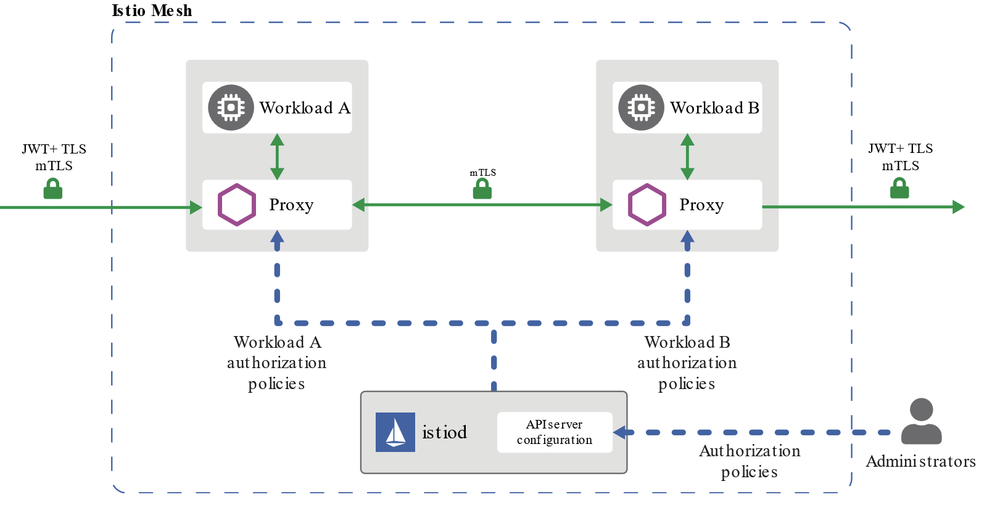
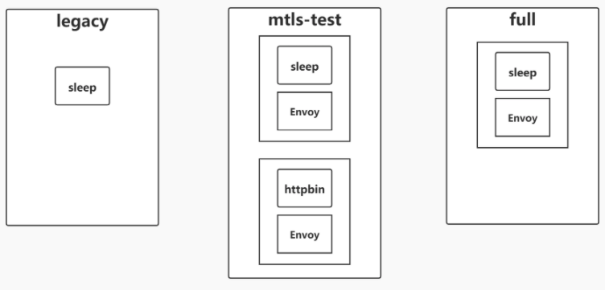

[toc]

# 图片区





----


# 安全

双向TLS（Two way TLS/Mutual TLS，后文均简称 mTLS）的主要使用场景是在 B2B 和 Server-to-Server 的场景中，以支持服务与服务之间身份认证与授权。

Istio 所希望的是在网格中能够使用 mTLS 进行授权，而在网格外使用 JWT+mTLS 进行授权。服务间身份认证是使用 mTLS，来源身份验证中则是使用 JWT。


Istio 中提供了 AuthorizationPolicy 用于对 trust domain 进行设置，能够对证书做到更加细粒度的验证。

## 认证

### 1. mTLS 身份认证原理与模式

mTLS 主要负责服务与服务之间**传输层**的认证，具体实现在 `sidecar` 中，在具体进行请求时，将经历如下的过程：

- 客户端发出的请求将被发送到客户端 sidecar 。
- 客户端 sidecar 与服务端 sidecar 开始 mTLS 握手，在握手的同时，客户端 sidecar 将进行 secure naming check 的额外操作，对服务端中的 server identity (存储在证书中的 SAN 中) 进行检查，以确保其能够运行服务，该操作能够防止一些常见 HTTP/TCP 的流量劫持攻击。
- 在完成身份认证以及之后要讲到的授权之后，客户端和服务端开始建立连接进行通信。


Istio 提供如下三种 mTLS 身份认证 模式，在不同的场景下进行使用。

- `PERMISSIVE` : 同时支持**密文传输**和**明文传输**，则不管是在 Istio 管理下的 Pod 还是在 Istio 管理外的 Pod，相互之间的通信畅通无阻。
    
    `PERMISSIVE` 模式的主要用途是在用户**迁移**的过程中，服务与服务之间也仍旧能够通信，例如部分 workload 并未注入 sidecar。

    `PERMISSIVE` 模式 是一种**过渡态**.

    对于刚接触 Istio 的用户而言非常友好，**官方建议在完成迁移之后调整为 STRICT 模式**。

- `STRICT` : workload 只支持**密文传输**。
- `DISABLE` : 关闭 Mutual TLS。从安全的角度而言，官方并不建议在没有其他安全措施的情况下使用该模式。
- `UNSET` : 具体的策略将**从父级配置中继承（命名空间或网格层面）**，如果父级没有进行相应的配置，则使用 **PERMISSIVE** 模式。

针对此我们需要重点关注的 CRD 为 `PeerAuthentication` 和 `DestinationRule`。
- `PeerAuthentication` 将会定义流量在 `sidecar` 之间如何进行传输。 
- `DestinationRule` 将定义在发生路由之后对于流量的相应策略，我们主要关注其中的 `TLSSettings`，需要与 `PeerAuthentication` 两者配合进行设置。

#### 实验

实验环境结构如图，共拥有 full，legacy，mtls-test 三个命名空间，对 full，mtls-test 设置为自动注入 sidecar。


**默认 PREMISSIVE 模式**

为简单辨识请求是否使用密文传输，我们将显示返回中的`SPIFFE URL` ，它来自X509证书的客户端标识，它指示通信是在相互的TLS中发送的。

```
#从输出内容可以发现 sleep.mtls-test 到 httpbin.mtls-test 能够找到 SPIFFE 的相关内容，SPIFFE URI 显示来自 X.509 证书的客户端标识，它表明流量是在 mTLS 中发送的。如果流量为明文，将不会显示客户端证书。可以验证 PERMISSIVE 模式既能支持明文传输，又能支持密文传输。


$ for from in "mtls-test" "legacy"; do for to in "mtls-test"; do echo "sleep.${from} to httpbin.${to}";kubectl exec $(kubectl get pod -l app=sleep -n ${from} -o jsonpath={.items..metadata.name}) -c sleep -n ${from} -- curl http://httpbin.${to}:8000/headers  -s  -w "response code: %{http_code}\n" | egrep -o 'URI\=spiffe.*sa/[a-z]*|response.*$';  echo -n "\n"; done; done

sleep.mtls-test to httpbin.mtls-test
URI=spiffe://cluster.local/ns/mtls-test/sa/sleep
response code: 200
sleep.legacy to httpbin.mtls-test
response code: 200
sleep.full to httpbin.mtls-test
URI=spiffe://cluster.local/ns/full/sa/sleep
response code: 200
```

**启动 STRICT 模式**
```
apiVersion: "networking.istio.io/v1alpha3"
kind: "DestinationRule"
metadata:
  name: "httpbin-mtls-test-mtls"
spec:
  host: httpbin.mtls-test.svc.cluster.local
  trafficPolicy:
    tls:
      mode: ISTIO_MUTUAL
---
apiVersion: "security.istio.io/v1beta1"
kind: "PeerAuthentication"
metadata:
  name: "httpbin"
  namespace: "mtls-test"
spec:
  selector:
    matchLabels:
      app: httpbin
  mtls:
    mode: STRICT
```
此时我们已经要求进入到 httpbin.mtls-test 的流量必须是密文传输，则 httpbin.legacy 没有办法获取到最终的结果，再次发送请求以验证：

```
sleep.mtls-test to httpbin.mtls-test
URI=spiffe://cluster.local/ns/mtls-test/sa/sleep
response code: 200
sleep.legacy to httpbin.mtls-test
response code: 000
command terminated with exit code 56
sleep.full to httpbin.mtls-test
URI=spiffe://cluster.local/ns/full/sa/sleep
response code: 200
```

**启用 DISABLE 模式**

此时，我们因为种种的原因不能将 sleep.legacy 迁移到网格中，但仍旧希望其可以与 httpbin.mtls-test 进行通信，因此我们针对 httpbin.mtls-test 启用 DISABLE 模式
```
apiVersion: "security.istio.io/v1beta1"
kind: "PeerAuthentication"
metadata:
  name: "httpbin"
  namespace: "mtls-test"
spec:
  selector:
    matchLabels:
      app: httpbin
  mtls:
    mode: DISABLE
---
apiVersion: "networking.istio.io/v1alpha3"
kind: "DestinationRule"
metadata:
  name: "httpbin-mtls-test-mtls"
spec:
  host: httpbin.mtls-test.svc.cluster.local
  trafficPolicy:
    tls:
      mode: DISABLE
```
```
sleep.mtls-test to httpbin.mtls-test
response code: 200
sleep.legacy to httpbin.mtls-test
response code: 200
sleep.full to httpbin.mtls-test
response code: 200
```

实验的结果上能体现相互之间的通讯是畅通的，但是没有展示 SPIFFE URI，因此所有的流量都是明文传输的。请一定注意这样的配置是**非常危险**的，在没有其他安全措施的情况下请避免这类情况的发生。

### 2. 使用 mTLS 实现服务间授权

身份认证主要解决的是证明“我是谁”的问题，授权则是列举出“我能做什么”，对于 mTLS 而言，则是需要回答该流量 `ALLOW` 还是 `DENY`，其中的主要依据是 `Identity`，通常，Trust Domain 指定身份所属的网格。

针对此我们需要重点关注的 CRD 为` AuthorizationPolicy`。AuthorizationPolicy 对网格中的 workload 访问控制负责，在不同的条件下判定是否准入。

Istio 在1.5版本**前**，会在每一个命名空间下创建一个 `istio.default` 的 secret，存储默认的 CA 文件，并会被挂载在 sidecar 中以供使用.

在1.5版本中，不会再存储在 secret 中，只能**通过 `rpc` 调用**才能获取到响应的内容，内容最终会被分配在内存中，但我们可以使用 `openssl s_client` 进行访问来获得证书。

```
kubectl exec <pod> -c istio-proxy -- openssl s_client -alpn istio -connect <service:port> # 获取到证书
openssl x509 -text -noout -in server.pem # 对上一个cmd返回内容中的server.pem 进行解析
Certificate:
  # Ignore something now is not important
        X509v3 extensions:
            X509v3 Subject Alternative Name: critical
                URI:spiffe://cluster.local/ns/default/sa/default
```

#### 使用授权策略拒绝请求

在我们的实验中，我们将拒绝 `sleep.full` 访问 `httpbin.mlts-test` 的任何 GET 请求。
```
apiVersion: security.istio.io/v1beta1
kind: AuthorizationPolicy
metadata:
  name: httpbin.mtls-test.svc.cluster.local
  namespace: mtls-test
spec:
  action: DENY
  rules:
  - from:
    - source:
        principals:
        - cluster.local/ns/full/sa/sleep
    to:
    - operation:
        methods:
        - GET
  selector:
    matchLabels:
      app: httpbin
```
我们再次进行测试，最终的结果如下：
```
sleep.mtls-test to httpbin.mtls-test
URI=spiffe://cluster.local/ns/mtls-test/sa/sleep
response code: 200
sleep.legacy to httpbin.mtls-test
response code: 000
command terminated with exit code 56
sleep.full to httpbin.mtls-test
response code: 403
```

我们看到当 `sleep.full` 请求 `httpbin.mtls-test` 时，此时返回403，说明其存在证书，但是证书的的 SAN 值域并不在 Trust Domain 中，因此返回403以表示访问权限不足。


#### 使用 mTLS 与网格外部服务通信
在许多情况下，服务网格中的微服务序并不是应用程序的全部。有时，网格内部的微服务需要使用在服务网格外部的服务，在网格外部署服务，有如下几种原由：

相关服务是第三方服务，无法被直接迁移到服务网格中。
从性能方面进行考量，认为相关服务不适合加入到网格中。
由于行政管理方面的原因，需要使用到其他团队的服务，但对方团队并没有服务网格的相关背景


```
apiVersion: apps/v1
kind: Deployment
metadata:
  namespace: mtls-test
  name: mongo-client
spec:
  replicas: 1
  selector:
    matchLabels:
      app: mongo-client
      version: v1
  template:
    metadata:
      labels:
        app: mongo-client
        version: v1
      annotations:  # 将客户端端的相关证书等内容挂载进入到 istio-proxy 容器中。
        sidecar.istio.io/userVolume: '[{"name":"client-ssl", "configMap":{"name":"mongo-client-pem"}}]'
        sidecar.istio.io/userVolumeMount: '[{"name":"client-ssl", "mountPath":"/pem"}]'

    spec:
      containers:
      - image: mongo:4.2
        imagePullPolicy: IfNotPresent
        name: mongo-client

#DestinationRule
apiVersion: networking.istio.io/v1alpha3
kind: DestinationRule
metadata:
  namespace: mtls-test
  name: db-mtls
spec:
  host: mongo.mongo.svc.cluster.local
  trafficPolicy:
    tls:
      mode: MUTUAL      # 此处 mode 为 MUTUAL, 而非 ISTIO_MUTUAL
      clientCertificate: /pem/client.pem  # 证书路径与 annotations 相同
      privateKey: /pem/client.key
      caCertificates: /pem/ca.pem
```

之后在 mongo client 容器中, 在创建连接时并没有使用设置相应 TLS 的内容，这就是因为**将 TLS 层的内容前移到了 istio-proxy 中**。

#### mTLS 与 Kubernetes 探针

我们常在 Kubernetes 集群中使用探针，用于检测服务的健康状态，而这样的探针，往往是一个 HTTP 请求，那么在我们使用探针时，如果开启 mTLS STRICT 模式，则会出现探针报错的情况，但实际上我们的服务应该是可以正常运行的。

因为探针的最终实施者是 kubelet，但是 kubelet 在执行探测时，并不会携带相应合法的证书，因此会被 sidecar 拒绝请求，返回一个非 2xx 的返回值，TCP 同理，因此需要在该方面上得到豁免。

Istio 官方文档也给出了相应的答案，通过添加注解的方式达成豁免。 修改 Deployment，在 `template.metadata` 中添加了 `sidecar.istio.io/rewriteAppHTTPProbers` 通过改写的方式保证探针能够正常工作。

```
spec:
  template:
    metadata:
      annotations:
        sidecar.istio.io/rewriteAppHTTPProbers: "true"
```

#### mTLS 的使用建议

微服务架构中，服务与服务之间的调用是非常频繁的，这也是 Istio 启用 mTLS 的一个原因，但是我们在实际的使用中，我们需要从**安全**和**性能**两者综合考虑。

- 安全: 从安全方面而言，mTLS 的使用最大限度的保障了网格内服务的安全。
    
    大多数用户会选择从一些基础的镜像开始构建，用户无法确保这些镜像是否包含恶意代码。假设用户在网格外部署了一个名为 Hack 的 Pod ，其注入的恶意代码将在容器启动时尝试连接网格中的 mysql 数据库，如果我们选择使用 `PERMISSIVE` 或 `DISABLE` 模式，则 Hack 的行为合法，将为其创造条件对数据库密码进行破解，如果使用 `STRICT` 模式，则 Hack 将无法访问到相应资源，返回状态码503，从根源上阻止了其行为。

- 性能: 从性能角度考虑，用户可以创建更少的连接来避免总的握手次数（多路复用），但是对称加密/解密本身是非常耗时和耗 CPU 资源的。

综上，如果是对性能较为敏感，且数据的敏感性不强，数据库也仅限集群内部访问，可以考虑使用明文传输。但如果数据敏感或业务逻辑需要安全方面的考量，建议使用 mTLS。


## 授权

为了保障集群中服务的安全，Istio 提供了一系列开箱即用的安全机制，对服务进行访问控制就是其中非常重要的一个部分，这个功能被称为 **授权**。

**授权**功能会按照预定义的*配置*针对特定的*请求*进行匹配，匹配成功之后会执行对应的*动作*，例如放行请求或者拒绝请求。

特点:
- Istio 中授权功能的实现也是非侵入式的
    
    可以在不影响现有业务逻辑的情况下，通过一系列自定义的 授权策略 在 Istio 集群中启用授权功能，实现业务的安全加固。
- 授权的**作用的对象是服务**，因此，授权功能主要适用于*四至七层*
    
    相比较而言，传统的防火墙主要用于二至四层

    Istio 授权适用于 gRPC , HTTP , HTTPS 和 HTTP2 以及 TCP 协议等，对基于这些协议的请求进行授权检测，Istio 都可以提供原生支持。

从数据流的角度来讲，授权功能可以用于多种场景:
- 从集群**外**部访问集群**内**部的服务
- 从集群**内**部的一个服务访问集群**内**部的另一个服务
- 以及从集群**内**部访问集群**外**部的服务


```
#针对 default 这个 namespace 中含有 `app: products` label 的 pod，针对**发送到**这些 pod 的请求进行匹配，如果这些请求使用 HTTP 协议，且请求方法为 "GET" 或者 "HEAD"，则放行这些请求。

apiVersion: security.istio.io/v1beta1
kind: AuthorizationPolicy
metadata:
  name: allow-read
  namespace: default
spec:
  selector:
    matchLabels:
      app: products
  action: ALLOW
  rules:
  - to:
    - operation:
         methods: ["GET", "HEAD"]
```

### 1. 授权策略 `AuthorizationPolicy`

授权功能可以近似地认为是一种*四层到七层的防火墙*，它会像传统防火墙一样，对数据流进行分析和匹配，然后执行相应的动作。

授权功能是通过授权策略 (AuthorizationPolicy) 来进行配置和使用

#### 配置说明

```
#选出 foo 这个 namespace 中含有 app: httpbin label 的 pod，对发送到这些 pod 的请求进行匹配，如果匹配成功，则放行当前请求，匹配规则如下：发起请求的 pod 的 Service Account 需要是 cluster.local/ns/default/sa/sleep ，请求使用 HTTP 协议，请求的具体方法类型是 GET ，请求的 URL 为 /info* ，并且请求中需要包含由 https://foo.com 签发的有效的 JWT Token。
apiVersion: security.istio.io/v1beta1
kind: AuthorizationPolicy
metadata:
 name: httpbin-policy
 namespace: foo
spec:
  selector:
    matchLabels:
      app: httpbin
  action: ALLOW
  rules:
  - from:
    - source:
        principals: ["cluster.local/ns/default/sa/sleep"]
    to:
    - operation:
        methods: ["GET"]
        paths: ["/info*"]
    when:
    - key: request.auth.claims[iss]
      values: ["https://foo.com"]
```

一个授权策略主要包含以下几个部分:
- `name` : 授权策略的名称，仅用于标识授权策略本身，不会影响规则的匹配和执行。
- `namespace` : 当前授权策略对象所在的 namespace ，可以使用这个字段配置不同**作用范围**的授权策略。
- `selector` : 使用 `label` 来选择当前授权策略作用于哪些 pod 上。
    
    注意，这里设置的是**服务端的 pod** ，因为最终这些规则会转换成 Envoy 规则由服务端的 Envoy Proxy 来具体执行。

    例如有 client 和 server 两个 service ，它们的 pod 对应的 label 分别为 app: client 和 app: server ，为了针对从 client 到 server 的请求进行配置授权策略，这里的 selector 应该设置为 app: server。

- `action` : 可以为 `ALLOW(默认值)`或者 `DENY`。
- `rules` : 匹配规则，如果匹配成功，就会执行对应的 action.

#### 授权策略的作用范围

授权策略可以按照作用域的大小分成三个不同的类型
- 全局策略
    
    授权策略位于 istio 的 root namespace `istio-system`，且匹配所有的 pod。这种规则会作用于整个集群中的所有 pod。

    ```
    ---
    #全局 ALLOW
    apiVersion: security.istio.io/v1beta1
    kind: AuthorizationPolicy
    metadata:
      name: global-allow
      namespace: istio-system
    spec:
      action: ALLOW
      rules:
      - {}

    ---
    #全局 DENY, 与下一个有区别
    apiVersion: security.istio.io/v1beta1
    kind: AuthorizationPolicy
    metadata:
      name: global-deny
      namespace: istio-system
    spec:
      action: DENY
      rules:
      - {}

    ---
    #全局 DENY, 与上一个有区别
    apiVersion: security.istio.io/v1beta1
    kind: AuthorizationPolicy
    metadata:
      name: global-deny
      namespace: istio-system
    spec:
      {}
    ```

- 某个 namespace 内的局部策略
    
    授权策略位于除了 root namespace 之外的任何一个 namespace 中，且匹配所有的 pod ，这种情况下，这个策略会作用于当前 namespace 中的所有 pod。

    ```
    ---
    #Namespace 级别 ALLOW
    apiVersion: security.istio.io/v1beta1
    kind: AuthorizationPolicy
    metadata:
      name: foo-namespace-allow
      namespace: foo
    spec:
      action: ALLOW
      rules:
      - {}

    ---
    #Namespace 级别 DENY, 与下一个不同
    apiVersion: security.istio.io/v1beta1
    kind: AuthorizationPolicy
    metadata:
      name: foo-namespace-deny
      namespace: foo
    spec:
      action: DENY
      rules:
      - {}

    ---
    #Namespace 级别 DENY, 与上一个不同
    apiVersion: security.istio.io/v1beta1
    kind: AuthorizationPolicy
    metadata:
      name: foo-namespace-deny
      namespace: foo
    spec:
      {}
    ```

- 具有明确 `match label` 的授权策略。
    
    仅作用于**当前 namespace 下**使用 **`selector` 字段匹配到**的 pod。

    ```
    apiVersion: security.istio.io/v1beta1
    kind: AuthorizationPolicy
    metadata:
      name: httpbin-allow
      namespace: foo
    spec:
      selector:
        matchLabels:
          app: httpbin
      action: ALLOW
      rules:
      - {}
    ```

#### 授权策略的匹配算法

针对某一个请求，会按照一定的匹配算法来执行相应的授权策略: 
- 如果有任何一条 `DENY` 授权策略匹配当前**请求**，则拒绝当前请求。
- 针对当前 **pod**，如果没有任何 `ALLOW` 授权策略，则放行当前请求。
- 如果有任何一条 `ALLOW` 授权策略匹配当前**请求**，则放行当前请求。
- 拒绝当前**请求**

注意这个**顺序**非常重要，有时又会比较隐晦: 例如, 如果同时有 ALLOW 和 DENY 策略作用于同一个 pod 上，则 DENY 策略会优先执行，其它的 ALLOW 规则就会被忽略。

```
spec:
  {}
```
这是一个 `DENY` 策略，作用于全局策略或者 namespace 级别（取决于策略所在 namespace 是否为 root namespace）。但是它并没有对当前请求进行匹配，也就意味着按照授权策略的匹配算法在匹配的时候并**不会优先匹配**到这条规则，因此可以将其作为一个“后备”策略，即全局或者 namespace 级别的一个**默认策略**。
```
spec:
  action: DENY
  rules:
  - {}
```
这条规则会真正地匹配当前的**请求**，又由于它是 `DENY` 规则，**按照授权策略的匹配算法，它会首先得到执行，也就意味着如果配置了一条这种全局或者 namespace 级别的规则，那么所有的其它 ALLOW 规则都*不会*得到执行**。因此*这条规则在实际中并没有什么价值*.
```
spec:
  action: ALLOW
  rules:
  - {}
```
这条规则和上一条规则类似，但是它是 ALLOW 规则，因此按照授权策略的匹配算法，它的**优先级会低一些**，因此也可以像第一条规则一样作为一个全局或者 namespace 级别的**默认策略**。

#### 授权策略规则详解 rule:

- 如果一个授权策略中指定了多条 rule 规则，则它们之间是**或**的关系，
    
    只要其中任意一条规则匹配成功，那么整个授权策略匹配成功，就会执行相应的 action .

- 每一条 rule 规则包括三部分： `from` , `to` 和 `when` .
    - `from` 当前请求从哪里来. 针对请求的发送方进行匹配

        主要包括以下四个部分:
        - `principals` : 匹配发送方的身份，在 Kubernetes 中可以认为是 pod 的 Service Account。

            使用这个字段时，首先需要**开启 mTLS 功能**，关于这部分内容可参见对等认证。

            例如，当前请求是从 default namespace 中的 pod 中发出，且 pod 使用的 Service Account 名为 `sleep`，针对这个请求进行匹配，可将 `principals` 配置为`cluster.local/ns/default/sa/sleep` .

        - `requestPrincipals` : 匹配请求中的 JWT Token 的 `<issuer>/<subject>` 字段组合.
        - `namespaces` : 匹配*发送方* pod 所在的 namespace。
        - `ipBlocks` : 匹配请求的源 IP 地址段

    - `to` 当前请求从哪里来到哪里去. 针对请求的接收方进行匹配, 还会对请求本身进行匹配.

        - `hosts` : 目的 host
        - `ports` : 目的 port
        - `methods` : 是指当前请求执行的 HTTP Method。
            **针对 gRPC 服务，这个字段需要设置为 POST**。

            注意这个字段必须在 HTTP 协议时才进行匹配，**如果请求不是 HTTP 协议，则认为匹配`失败`**。

        - `paths` : 当前请求执行的 HTTP URL Path。

            针对 gRPC 服务，需要配置为 `/package.service/method` 格式。

    - `when` : 一个 key/value 格式的 list 。这个字段会针对请求进行一些额外的检测，当这些检测**全部匹配**时才会认证当前规则匹配成功.

        示例: `key: request.headers[User-Agent]`

        参考: [Authorization Policy Conditions](https://istio.io/latest/docs/reference/config/security/conditions/)

    - 取反操作:
        - `notPrincipals`
        - `notNamespaces`
    - 针对 JWT Token 进行匹配的字段 : 见下一个标题

    - 当这些条件都满足时，就会认为当前规则匹配成功。
    - 如果其中某一部分**未进行配置**，则认为其可以*匹配成功*

- 所有的字符串类型都支持类似于通配符的匹配模式:
    - 单独的 `*` 匹配**非空的字符串**

示例:
```
apiVersion: security.istio.io/v1beta1
kind: AuthorizationPolicy
metadata:
 name: httpbin-policy
 namespace: foo
spec:
  selector:
    matchLabels:
      app: httpbin
  action: ALLOW
  rules:
  - from:
    - source:
        principals: ["cluster.local/ns/default/sa/sleep"]
    to:
    - operation:
        methods: ["GET"]
        paths: ["/info*"]
    when:
    - key: request.auth.claims[iss]
      values: ["https://foo.com"]
```

### 2. JWT 授权

JWT（ JSON Web Token ），是一种多方传递可信 JSON 数据的方案，一个 JWT token 由`.`分隔的三部分组成：`{Header}.{Payload}.{Signature}`，
- `Header` 是 *Base64 编码*的 JSON 数据，包含令牌类型`typ`、签名算法`alg`以及秘钥 ID `kid`等信息
- `Payload` 是需要传递的 `claims` 数据，也是 *Base64 编码*的 JSON 数据，其中有些字段是 JWT 标准已有的字段如：`exp`, `iat`, `iss`, `sub`和`aud`等，也可以根据需求添加自定义字段；
    
    Principal 由 JWT claims 的`iss`和`sub`用`/`拼接组成`{iss}/{sub}`.

- `Signature` 是对前两部分的签名，防止数据被篡改，以此确保 token 信息是可信的。


JWT 授权则是对**终端用户**的访问控制, 因此, 在流量授权操作阶段主要操作 `from` 和 `when` 字段.


默认 JWT 认证的 token 是以 `Bearer` 为前缀放在 `Authorization header` 中，如：`Authorization: Bearer token`。

#### 无授权策略情况下的 JWT 认证

Istio 中验签所需公钥由 `RequestAuthentication` 资源的 JWKS 配置提供。
```
apiVersion: "security.istio.io/v1beta1"
kind: "RequestAuthentication"
metadata:
  name: "jwt-example"
  namespace: $NS
spec:
  selector:
    matchLabels:
      app: httpbin
  jwtRules:
  - issuer: "testing@secure.istio.io"
    jwksUri: "https://raw.githubusercontent.com/istio/istio/release-1.5/security/tools/jwt/samples/jwks.json"
```

添加 `RequestAuthentication` 后，并不是要求所有请求都要带有 JWT token，因为 **RequestAuthentication 只负责验证 token 的有效性**，token 的有无以及是否授权访问由 `AuthorizationPolicy` 的 JWT 授权策略决定。所以在只有 RequestAuthentication 时，可以同时支持无 token 请求和带有有效 token 的请求，而带有无效 token 的请求将被拒绝，此时 JWT 认证是一个非必要条件。

example token:
- [JWKS](https://raw.githubusercontent.com/istio/istio/release-1.5/security/tools/jwt/samples/jwks.json)
- [demo token](https://raw.githubusercontent.com/istio/istio/release-1.5/security/tools/jwt/samples/demo.jwt)
    demo 是一个普通 token，claims 有 JWT 的基础属性
- [groups-scope token](https://raw.githubusercontent.com/istio/istio/release-1.5/security/tools/jwt/samples/groups-scope.jwt)
    groups-scope 是一个带有自定义属性的 token，claims 除了基础属性还包括 group 和 scope

#### 任意非空 JWT 授权

在只有 RequestAuthentication 时不带 token 的请求是可以正常访问的，而需求可能会要求全部请求必须经过认证才能访问，这就需要使用 JWT 授权策略。

`AuthorizationPolicy rule` 规则中与 JWT 相关的字段包括:


| field |  sub field  | JWT claims |
| -- | -- | -- |
| from.source | requestPrincipals  | iss/sub |
| from.source | notRequestPrincipals  | iss/sub |
| when.key | request.auth.principal  |  iss/sub |
| when.key | request.auth.audiences  |  aud |
| when.key | request.auth.presenter  |  azp |
| when.key | request.auth.claims[key] | JWT 全部属性(任意值) |


这些字段的匹配都遵循授权的四种匹配规则:
- 完全匹配
    JWT 认证成为**必要条件**.
- 前缀匹配
    JWT 认证成为**必要条件**.
- 后缀匹配
    JWT 认证成为**必要条件**.
- 存在匹配: 存在匹配（`*`）表示该字段可以**匹配任意内容**，但是**不能为空**, 使用存在匹配可以满足对任意非空的 JWT 授权的需求。
    JWT 认证成为**必要条件**.
- 不指定字段: 不指定是包括空在内的任意内容
    JWT 认证不是必要条件

```
#允许任意非空 Principal 请求
apiVersion: security.istio.io/v1beta1
kind: AuthorizationPolicy
metadata:
 name: require-jwt
 namespace: $NS
spec:
 selector:
   matchLabels:
     app: httpbin
 action: ALLOW
 rules:
 - from:
   - source:
       requestPrincipals: ["*"]
```

**测试 Principal 条件**

查看 JWT claims 结构如下:
```
$ echo $TOKEN | cut -d '.' -f2 - | base64 -d -
{
  "exp" : 4685989700,
  "foo" : "bar",
  "iss" : "testing@secure.istio.io",
  "sub" : "testing@secure.istio.io",
  "iat" : 1532389700
}
```

使用 `from.source.requestPrincipals` 测试:
```
$ kubectl patch AuthorizationPolicy require-jwt -n $NS --type merge -p '
spec:
  rules:
  - from:
    - source:
        requestPrincipals: ["testing@secure.istio.io/testing@secure.istio.io"]
'
```

也可以使用 `when` 条件的 `request.auth.principal` 测试:
```
$ kubectl patch AuthorizationPolicy require-jwt -n $NS --type merge -p '
spec:
  rules:
  - when:
    - key: request.auth.principal
      values: ["testing@secure.istio.io/testing@secure.istio.io"]
'
```

**Claims 条件**
测试 jwt token, 包括两个自定义 Claims `scope`, `groups`:
```
$ export TOKEN_GROUP=$(curl https://raw.githubusercontent.com/istio/istio/release-1.5/security/tools/jwt/samples/groups-scope.jwt -s) && echo $TOKEN_GROUP | cut -d '.' -f2 - | base64 -d -
{
  "exp" : 3537391104,
  "scope" : [
    "scope1",
    "scope2"
  ],
  "iss" : "testing@secure.istio.io",
  "groups" : [
    "group1",
    "group2"
  ],
  "sub" : "testing@secure.istio.io",
  "iat" : 1537391104
}
```

使用 groups 作为自定义条件:
```
$ kubectl patch AuthorizationPolicy require-jwt -n $NS --type merge -p '
spec:
  rules:
  - from:
    - source:
        requestPrincipals: ["testing@secure.istio.io/testing@secure.istio.io"]
    when:
    - key: request.auth.claims[groups]
      values: ["group1"]    # 仅允许 group1 
'
```

#### 分阶段认证和授权

具体是否需要分阶段验证，以及在什么位置验证，需要根据业务场景考虑，一般**越是顶层条件越靠前**如：`from.source.requestPrincipals`、`to.operation.hosts`，而`when.request.auth.claims[group/scope]`和`to.operation.methods/paths`组合可以在相关服务做详细的访问控制。

如果调用链路有**多次使用同一个 token**，则必须在 `RequestAuthentication` 的`jwtRules`中开启`forwardOriginalToken: true`以将 `Authorization header` 向下传递，也可以通过 `fromHeaders / fromParams` 携带多个不同场景的 token .

说到 token 的传递，`Authorization header` 也可以在服务与服务间调用时**添加**，所以终端用户的定义并不限定为客户端，任何一个发起调用的服务都是一个终端用户。

##### Ingress JWT 认证

为 Ingress 开启 JWT 认证: 
```
apiVersion: "security.istio.io/v1beta1"
kind: "RequestAuthentication"
metadata:
  name: "jwt-gateway"
  namespace: istio-system
spec:
  selector:
    matchLabels:
        app: istio-ingressgateway
  jwtRules:
  - issuer: "testing@secure.istio.io"
    jwksUri: "https://raw.githubusercontent.com/istio/istio/release-1.5/security/tools/jwt/samples/jwks.json"
    forwardOriginalToken: true
```

测试请求时, 在在响应的 header 中有上游主机处理请求消耗的时间`x-envoy-upstream-service-time: 1`，通过这个 header 的有无可以确定请求是否是被服务拒绝
- 有, 是被 httpbin 服务拒绝
- 没有, 则是被网关拒绝

```
$ curl -I -H "Authorization: Bearer invalidToken" -H "Host: authz-jwt.local" http://$INGRESS_IP:$INGRESS_PORT/headers
HTTP/1.1 401 Unauthorized
...
x-envoy-upstream-service-time: 1
```

##### Ingress jwt 授权

结合网关的入口特点可以添加根据 HOST 的不同限定scope的授权，如：访问`host=foo.bar`要求`scpoe=bar`。

```
apiVersion: security.istio.io/v1beta1
kind: AuthorizationPolicy
metadata:
  name: require-jwt
  namespace: istio-system
spec:
  selector:
    matchLabels:
      app: istio-ingressgateway
  action: ALLOW
  rules:
  - when:
    - key: request.auth.claims[scope]
      values: ["bar"]
    to:
    - operation:
        hosts:
        - foo.bar
```

