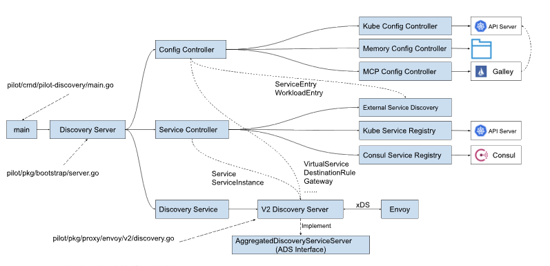

[toc]

---

TODO:
- 集成服务注册中心 : https://www.servicemesher.com/istio-handbook/practice/integration-registry.html
- 对接 API 网关 Envoy : https://www.servicemesher.com/istio-handbook/practice/envoy.html
- 分布式追踪
- 多集群部署: https://www.servicemesher.com/istio-handbook/practice/multiple-cluster.html

## 生态

### 工具类

- [Fortio](https://github.com/fortio/fortio) : Istio 负载测试工具.
- [GetIstio](https://github.com/tetratelabs/getistio): Istio 生命周期管理工具.
- [ControlZ]() : 自检工具

## 集成服务注册中心

Istio 对 Kubernetes 具有较强的依赖性，其**服务发现就是基于 Kubernetes 实现**的。如果要使用 Istio，首先需要迁移到 Kubernetes 上，并使用 Kubernetes 的服务注册发现机制。

在 Kubernetes 上 使用 Istio, 需要如下条件:
1. 将服务迁移到 kubernetes 上
2. 使用 Kubernetes 的服务注册发现机制

但是对于大量现存的微服务项目来说，这个前提条件并不成立。很多微服务项目要么还没有迁移到 Kubernetes 上；要么虽然采用了 Kubernetes 来进行部署和管理，但还是使用了 Consul，Eureka 等其他服务注册解决方案或者自建的服务注册中心。

在这种情况下，我们如何能够以最小的代价快速地将现有微服务项目和 Istio 进行集成，以享受 Istio 提供的各种服务治理能力呢？本节将分析 Istio 服务注册机制的原理，并提出几种 Istio 与第三方服务注册中心集成的可行方案，以供读者参考。

### Istio 服务模型
在 Istio 控制面中，Pilot 组件负责管理服务网格内部的服务和流量策略。Pilot 将服务信息和路由策略转换为 xDS 接口的标准数据结构，下发到数据面的 Envoy。但 Pilot 自身并不负责网格中的服务注册，而是通过集成其他服务注册表来获取网格中管理的服务。除此以外，Istio 还支持通过 API 向网格中添加注册表之外的独立服务。


Pilot 中管理的服务数据有两处数据来源:
- `Service Registry` : 来源于各个服务注册表，例如 Kubernetes 中的 Service 和 Consul Catalog 中注册的服务。Istio 通过特定的适配器连接这些服务注册表，由适配器将服务注册表中的私有服务模型转换为 Istio 内部支持的标准服务模型。
- `Config Storage` : 来源于各种配置数据源中的独立服务，通过 Istio 定义的 ServiceEntry 和 WorkloadEntry 资源类型加入到 Pilot 的内部服务模型中。


### Pilot 服务模型源码分析

Pilot 服务模型代码结构:




Pilot 的入口函数是 `pilot/cmd/pilot-discovery/main.go` 中的 `main` 方法。main方法中创建了 `Discovery Server`，`Discovery Server` 中和服务模型相关的主要包含三部分内容：

- `Config Controller` : 用于管理各种配置数据，包括用户创建的流量管理规则和策略。
    配置数据中有两个 API 对象和服务模型相关，`ServiceEntry` 和 `WorkloadEntry`。

    Istio 目前支持三种类型的 `Config Controller` : 
    - `Kubernetes` : 使用 Kubernetes 来作为配置数据的存储，该方式的直接依附于 Kubernetes 强大的 CRD 机制来存储配置数据，简单方便，是 Istio **缺省使用的配置存储方案**。
    - `Memory` : 一个在内存中的 Config Controller 实现，可以**监控一个文件目录**，加载该目录中的 yaml 文件中定义的 Istio API 配置对象，该方式主要用于测试。
    - `MCP` : 通过 `MCP(Mesh Configuration Protocol)` 协议，可以接入一个到多个 MCP Server。
        Pilot 从 MCP server 中获取网格的配置数据，包括 `ServiceEntry` 和 `WorkloadEntry` 定义的服务数据，以及 `VirtualService`，`DestinationRule` 等路由规则等其他配置。

        Istio 中有一个 Galley 组件，该组件实现为一个 MCP Server，从 Kubernetes API Server 中获取配置数据，然后通过 MCP 协议提供给 Pilot。

- `Service Controller` : 负责接入各种 Service Registry，从 Service Registry 同步需要在网格中进行管理的服务.
    
    目前 Istio 支持的 Service Registry 包括：
    - `Kubernetes` : 对接 Kubernetes Registry，可以将 Kubernetes 的 Service 和 Endpoint 采集到 Istio 中。
    - `Consul` :  对接 Consul Catalog，将注册到 Consul 中的服务数据采集到 Istio 中。
    - `External Service Discovery` : 该 Service Registry 比较特殊，后端并未对接到一个服务注册表，而是会监听 `Config Controller` 的配置变化消息，从 Config Controller 中获取 ServiceEntry 和 WorkloadEntry 资源，然后以 Service Registry 的形式提供给 Service Controller。
- `Discovery Service` : 将服务模型和控制面配置转换为数据面标准数据格式，通过 xDS 接口下发给数据面的代理。
    
    主要包含下述逻辑：
    - 启动 GRPC Server 并接收来自 Envoy 端的连接请求。
    - 接收 Envoy 端的 xDS 请求，从 Config Controller 和 Service Controller 中获取配置和服务信息，生成响应消息发送给 Envoy。
    - 监听来自 `Config Controller` 的配置变化消息和来自 `Service Controller` 的服务变化消息，并将配置和服务变化内容通过 xDS 接口推送到 Envoy。

#### 第三方服务注册集成


有以下三种将其他服务注册表集成到 Istio 的方式:

1. 自定义 Service Registry 适配器

    编写一个自定义的适配器来集成第三方服务注册表。该自定义适配器从第三方服务注册表中获取服务和服务实例，转换为 Pilot 内部的标准模型，集成到 Service Controller 中。自定义适配器需要实现 serviceregistry.Instance 接口。该方式的原理和 Consul Service Registry 的适配是类似的，可以参照 Consul Service Registry 的适配代码进行编写。

    实施该方案需要熟悉 Pilot 内部服务模型和 Service Registry 适配相关 Istio 源码，并且需要将自定义适配器代码和 Pilot 代码一起编译生成定制的 Pilotd 二进制执行文件。该方案的问题是和 Istio 代码耦合较强，后续 Istio 版本升级时可能需要修改适配器代码并重新编译。

2. 自定义 MCP Server
    
    该方案需要编写自定义的 MCP Server 从第三方注册表中获取服务和服务实例，然后转换为 ServiceEntry 和 WorkloadEntry 资源，通过 MCP 协议提供给 Pilot 中的 MCP config Controller。

    采用这种方式，需要在 Global Mesh Options 中通过 configSources 参数设置自定义 MCP Server 的地址。需要注意的是，目前版本中的 Config Controller 实现不允许同时使用不同类型的Config controller。这意味着如果采用自定义 MCP Server 来获取第三方注册表中的服务数据，也必须同时采用 Galley 来获取其他控制面的配置。

    ```
    configSources:
      - address:istio-galley.istio-system.svc:9901
      - address:${your-coustom-mcp-server}:9901
    ```
    而从1.5版本开始，Galley 的功能已经被合并到 Istiod 中，并且缺省被禁用。 从 Isito 控制面简化的趋势来看，Galley 后续很可能会被逐渐放弃，其自身功能的稳定性也值得怀疑。因此我不建议在产品中启用 Galley。

    除此以外，根据 Istio 社区中的这个 MCP over XDS proposal，社区正在讨论使用 XDSv3/UDPA 代替目前的 MCP 协议来传输配置数据，因此 MCP server 和 Pilot 的通信机制在 1.7 版本中很可能变化。

3. 向 API Server 写入 ServiceEntry 和 WorkloadEntry

    该集成方式只需要编写一个独立的服务，该服务从第三方法服务注册表中获取服务和服务实例数据，然后转换为 Istio 的 ServiceEntry 和 WorkloadEntry 资源，通过 K8s API Server 的接口写入到 API Server 中。

    Pilot 中自带的 Kube Config Controller 会监听 K8s API Server 中和 Istio 相关的资源对象的变化，并将 ServiceEntry 和 WorkloadEntry 转换为 Piolt 的内部服务模型。


## OpenTracing

https://www.servicemesher.com/istio-handbook/practice/opentracing.html

## 多集群部署

https://www.servicemesher.com/istio-handbook/practice/multiple-cluster.html

Istio 在 1.1 后提供了两类**多集群**的连通的部署模式：

- 多控制面
    
    多控制面模式，各网格之间服务实例**无法自动共享**，互相**访问不透明**。

    应用场景有限，实现相对简单。

- 单控制面, 也叫 共享控制面
    
    单控制面模式，根据**各集群是否属于同一个网络**，还可以细分为**单网络单控制面**和**多网络单控制面**:

    - **单网络单控制面模式**: 多集群融合为一个服务网格, 严格限制网络: 需要处于同一个扁平网络, Pod IP 互通, 且不重叠.

        支持多 Kubernetes 集群融合为一个服务网格，但是该种模式**对网络有严格的要求**: 需要所有集群处于同一个扁平网络，Pod IP 互通且不重叠，使用 VPN 连通多集群网络是常见的一个选项。不过这些网络需求在实际环境可能难以满足，也限制了该模式的应用场景。
    
    - **多网络单控制面模式**: 多集群融合为一个服务网格, 网络限制宽松, 要求服务开启 mTLS 通信.

        同样实现了多 Kubernetes 集群融合为一个服务网格，且在网络上没有上述限制，每个多 Kubernetes 集群是一个独立的网络，甚至可以分布于不同地域。但其实现也最复杂，且该模式要求开启服务间 mTLS 通信，通信效率上也有一定影响。


## 标准
### xDS

https://www.servicemesher.com/istio-handbook/ecosystem/xds.html

在 Istio 架构中，基于 xDS 协议提供了标准的控制面规范，并以此向数据面传递服务信息和治理规则

在 Envoy 中，xDS 被称为数据平面 API，并且担任控制平面 Pilot 和数据平面 Envoy 的通信协议，同时这些 API 在特定场景里也可以被其他代理所使用。

### SMI

https://www.servicemesher.com/istio-handbook/ecosystem/smi.html

SMI 规范目前涵盖的网格能力范围以及接口实现：

- `Traffic Policy（流量策略）` : 在不同的服务之间应用身份和传输加密等策略
    - `Traffic Access Control（流量访问控制）` : 根据客户端的身份标识来配置对特定 pod 的访问以及路由，以将应用的访问锁定在可被允许的用户和服务。
    - `Traffic Specs（流量规范）` : 定义了基于不同协议的流量表示方式，这些资源通过与访问控制和其它策略协同工作以在协议级别进行流量管理。
- `Traffic Telemetry（流量遥测）` : 捕获例如错误率、服务间调用延迟等关键指标。
    - `Traffic Metrics（流量指标）` : 为控制台和自动扩缩容工具暴露一些通用的流量指标。
- `Traffic Management（流量管理）` : 在不同服务之间进行流量切换。
    - `Traffic Split（流量分割）`: 通过在不同服务之间逐步调整流量百分比，以帮服务进行金丝雀发布。

### UDPA
### WebAssembly

https://www.servicemesher.com/istio-handbook/ecosystem/webassembly.html

## 工具与诊断: Istioctl/controlz

### istioctl

#### 对网格安装进行验证

```
$ istioctl verify-install             
```

- 安装前, 可以对集群进行预检, 通过它可以诊断出目标环境是否能够支持当前的网格安装
- 安装后, 可以验证组件的安装/健康状态.

#### 查看配置状态和详情
- 使用 `proxy-status` 查看配置状态
    
    `istioctl proxy-status` 为用户提供了获取网格集群内的所有被注入 sidecar 的 pod 配置同步状态.

    Istio 系统的核心是基于 envoy 来实现流量管理，其本质是通过控制面来生成和下发对应的配置给数据面，因此配置的下发在整个系统是非常重要的一环，这也是用户最为关心的内容，如果配置由于网络或者是控制面异常导致没有同步成功，数据面的流量控制将会产生一些不符合预期的问题。

    ```
    $ istioctl ps 
    NAME                                                   CDS        LDS        EDS        RDS          PILOT                       VERSION
    details-v1-745545f7d-vpb24.default                     SYNCED     SYNCED     SYNCED     SYNCED       istiod-5fd87d7fd6-mhgwj     1.6.14
    istio-egressgateway-f5d55d89-g66fc.istio-system        SYNCED     SYNCED     SYNCED     NOT SENT     istiod-5fd87d7fd6-mhgwj     1.6.14
    istio-ingressgateway-5b9896fdd6-8h6lg.istio-system     SYNCED     SYNCED     SYNCED     NOT SENT     istiod-5fd87d7fd6-mhgwj     1.6.14
    productpage-v1-58bfbc7c64-6f4tz.default                SYNCED     SYNCED     SYNCED     SYNCED       istiod-5fd87d7fd6-mhgwj     1.6.14
    prometheus-5b5c4ff65c-brb7x.istio-system               SYNCED     SYNCED     SYNCED     SYNCED       istiod-5fd87d7fd6-mhgwj     1.6.14
    ratings-v1-7fd8d6c558-tjtkh.default                    SYNCED     SYNCED     SYNCED     SYNCED       istiod-5fd87d7fd6-mhgwj     1.6.14
    reviews-v1-57b655849b-ztbkk.default                    SYNCED     SYNCED     SYNCED     SYNCED       istiod-5fd87d7fd6-mhgwj     1.6.14
    reviews-v2-685867965b-6k5g9.default                    SYNCED     SYNCED     SYNCED     SYNCED       istiod-5fd87d7fd6-mhgwj     1.6.14
    reviews-v3-5d6778fd88-qqs8m.default                    SYNCED     SYNCED     SYNCED     SYNCED       istiod-5fd87d7fd6-mhgwj     1.6.14
    ```

    说明:
    - 如果你没有在结果列表中找到某个特定 pod，那说明它还没有正常连接至 istiod 控制面，或者是可能根本就没有被注入 sidecar，需要检查下 pod 的 sidecar 注入状态
    - 状态说明:
        - SYNCED：正常状态，表明最后一次配置同步操作已经从 istiod 下发到了 envoy，并且收到了正确应答。

        - NOT SENT：表示 istiod 还**没有发送任何配置给 envoy**，这往往是因为没有配置可以下发

        - STALE：异常状态，它表示 istiod 已经发送了一个配置更新请求给 envoy，但是并没有收到任何的应答，这种情况往往是由于 envoy 和 istiod 之间的网络原因或者是 istio 本身存在的 bug 导致的。
    
    检查某个 pod 对应数据面和控制面之间的配置详细差异内容:
    ```
    $ istioctl ps reviews-v2-685867965b-6k5g9.default                       
    Clusters Match
    Listeners Match
    Routes Match (RDS last loaded at Mon, 15 Mar 2021 18:53:58 CST)
    ```

- 使用 `proxy-config` 命令检查配置详情
    
    ```
    $ istioctl pc -h

    A group of commands used to retrieve information about proxy configuration from the Envoy config dump

    Usage:
      istioctl proxy-config [command]

    Aliases:
      proxy-config, pc

    Examples:
      # Retrieve information about proxy configuration from an Envoy instance.
      istioctl proxy-config <clusters|listeners|routes|endpoints|bootstrap> <pod-name[.namespace]>

    Available Commands:
      bootstrap   Retrieves bootstrap configuration for the Envoy in the specified pod
      cluster     Retrieves cluster configuration for the Envoy in the specified pod
      endpoint    Retrieves endpoint configuration for the Envoy in the specified pod
      listener    Retrieves listener configuration for the Envoy in the specified pod
      log         (experimental) Retrieves logging levels of the Envoy in the specified pod
      route       Retrieves route configuration for the Envoy in the specified pod
      secret      (experimental) Retrieves secret configuration for the Envoy in the specified pod

    Flags:
      -h, --help            help for proxy-config
      -o, --output string   Output format: one of json|short (default "short")

    Global Flags:
          --context string          The name of the kubeconfig context to use
      -i, --istioNamespace string   Istio system namespace (default "istio-system")
      -c, --kubeconfig string       Kubernetes configuration file
      -n, --namespace string        Config namespace

    Use "istioctl proxy-config [command] --help" for more information about a command.
    ```

    **查看指定 pod 的网格配置详情**:
    ```
    $ istioctl proxy-config cluster PODNAME.NS -o json --port --direction

    #增加过滤条件
    $ istioctl pc cluster productpage-v1-77d9f9fcdf-psv2z.default --port 9080 --direction inbound -o json

    ```

#### 分析并诊断网格配置

`istioctl analyze` 是一个专用于分析和定位问题的命令，可以理解成这是一个基于配置的更加上层的诊断工具，帮助用户发现网格内存在的潜在问题.

```
Analyze Istio configuration and print validation messages

Usage:
  istioctl analyze <file>... [flags]

Examples:

#Analyze the current live cluster
istioctl analyze

#Analyze the current live cluster, simulating the effect of applying additional yaml files
istioctl analyze a.yaml b.yaml my-app-config/

#Analyze the current live cluster, simulating the effect of applying a directory of config recursively
istioctl analyze --recursive my-istio-config/

#Analyze yaml files without connecting to a live cluster
istioctl analyze --use-kube=false a.yaml b.yaml my-app-config/

#Analyze the current live cluster and suppress PodMissingProxy for pod mypod in namespace 'testing'.
istioctl analyze -S "IST0103=Pod mypod.testing"

#Analyze the current live cluster and suppress PodMissingProxy for all pods in namespace 'testing',
#and suppress MisplacedAnnotation on deployment foobar in namespace default.
istioctl analyze -S "IST0103=Pod *.testing" -S "IST0107=Deployment foobar.default"

#List available analyzers
istioctl analyze -L


Flags:
  -A, --all-namespaces            Analyze all namespaces
      --color                     Default true.  Disable with '=false' or set $TERM to dumb (default true)
      --failure-threshold Level   The severity level of analysis at which to set a non-zero exit code. Valid values: [Info Warn Error] (default Warn)
  -h, --help                      help for analyze
  -L, --list-analyzers            List the analyzers available to run. Suppresses normal execution.
      --meshConfigFile string     Overrides the mesh config values to use for analysis.
  -o, --output string             Output format: one of [json log yaml] (default "log")
      --output-threshold Level    The severity level of analysis at which to display messages. Valid values: [Info Warn Error] (default Info)
  -R, --recursive                 Process directory arguments recursively. Useful when you want to analyze related manifests organized within the same directory.
  -S, --suppress stringArray      Suppress reporting a message code on a specific resource. Values are supplied in the form <code>=<resource> (e.g. '--suppress "IST0102=DestinationRule primary-dr.default"'). Can be repeated. You can include the wildcard character '*' to support a partial match (e.g. '--suppress "IST0102=DestinationRule *.default" ).
      --timeout duration          the duration to wait before failing (default 30s)
  -k, --use-kube                  Use live Kubernetes cluster for analysis. Set --use-kube=false to analyze files only. (default true)
  -v, --verbose                   Enable verbose output

Global Flags:
      --context string          The name of the kubeconfig context to use
  -i, --istioNamespace string   Istio system namespace (default "istio-system")
  -c, --kubeconfig string       Kubernetes configuration file
  -n, --namespace string        Config namespace
```
该命令可以针对一个正在运行的集群，或者是一堆本地配置文件，甚至还可以针对多个文件和在线集群组合进行分析，以帮助用户在配置被应用到集群之前进行分析检查，从而预防一些潜在的配置问题。

- 使用 `analyze` 命令诊断网格配置
- 通过 `analyze` 命令诊断网格集群: `istioctl analyze`
- 通过 `analyze` 命令诊断配置文件: `$ istioctl analyze a.yaml b.yaml my-app-config/ --recursive` 
    `--use-kube=false` : 本次分析诊断是否需要组合当前集群内的 istio 配置，默认值是 ture，如果用户是想脱离集群仅对输入的文件配置进行分析，显式设定参数为 false 即可
- 忽略 `analyze` 特定的错误类型: `--suppress "IST0102=Namespace frod" --suppress "IST0107=Pod *.baz"`
    
    还可以通过在资源上设置**注释**来忽略特定的分析器错误消息。例如，忽略资源 deployment/my-deployment 上的代码为 IST0107（MisplacedAnnotation）的错误类型：
    ```
    $ kubectl annotate deployment my-deployment galley.istio.io/analyze-suppress=IST0107
    ```
    要忽略该资源上的多种错误类型，可以使用逗号分隔每处代码。
    ```
    $ kubectl annotate deployment my-deployment galley.istio.io/analyze-suppress=IST0107,IST0002
    ```

- 启用自动配置分析诊断
    
    可以通过设置 `values.global.istiod.enableAnalysis` 标志位让 istiod 在分发配置的时候自动执行分析检查

    ```
    $ istioctl manifest apply --set values.global.istiod.enableAnalysis=true
    ```

    配置之后, 分析器会自动把诊断的结果写入到出现问题的资源状态字段里.

    例如，如果用户在 ratings 虚拟服务上网关配置错误，运行 `kubectl get virtualservice ratings` 将会得到如下的信息：
    ```
    apiVersion: networking.istio.io/v1alpha3
    kind: VirtualService
    metadata:
      annotations:
        kubectl.kubernetes.io/last-applied-configuration: |
          {"apiVersion":"networking.istio.io/v1alpha3","kind":"VirtualService","metadata":{"annotations":{},"name":"ratings","namespace":"default"},"spec":{"hosts":["ratings"],"http":[{"route":[{"destination":{"host":"ratings","subset":"v1"}}]}]}}
      creationTimestamp: "2020-04-23T20:33:23Z"
      generation: 2
      name: ratings
      namespace: default
      resourceVersion: "12760031"
      selfLink: /apis/networking.istio.io/v1alpha3/namespaces/default/virtualservices/ratings
      uid: dec86702-cf39-11e9-b803-42010a8a014a
    spec:
      gateways:
      - bogus-gateway
      hosts:
      - ratings
      http:
      - route:
        - destination:
            host: ratings
            subset: v1
    status:
      validationMessages:
      - code: IST0101
        level: Error
        message: 'Referenced gateway not found: "bogus-gateway"'
    ```

参考:
- [istio analyze 错误码 列表](https://istio.io/latest/docs/reference/config/analysis/)


#### 验证并理解网格配置

`istioctl x describe pods PODNAME.NSNAME` 或 `istioctl experimental describe pods PODNAME.NSNAME`

```
$ istioctl experimental describe pod reviews-v3-5d6778fd88-qqs8m     

Pod: reviews-v3-5d6778fd88-qqs8m
   Pod Ports: 9080 (reviews), 15090 (istio-proxy)
--------------------
Service: reviews
   Port: http 9080/HTTP targets pod port 9080
```
`istioctl experimental` 输出内容, 可以验证:
- 验证 pods 是否加入网络
- 验证 destination rule 配置 
- 验证 virtual service 配置
- 验证 traffic routes 配置
- 验证 strict mutual TLS 配置

### controlz
启动:
```
$ istioctl dashboard controlz istiod-79f6bdd6c5-mvnq7.istio-system
```

支持如下操作:
- 查看/修改组件日志记录
- 内存使用详情
- 环境变量信息
- 进程信息
- 命令行参数
- 版本信息
- 监控指标


## QA

### 1. Kiali 无法登陆:

```
apiVersion: v1
kind: Secret
metadata:
  name: kiali
  namespace: istio-system
data:
  username: YWRtaW4=
  passphrase: YWRtaW4=

## echo -n admin |  base64
#YWRtaW4=
```

报错: 
```
The Kiali secret is missing. Users are prohibited from accessing Kiali until an administrator creates a valid secret. Please refer to the Kiali documentation for more details.
```


