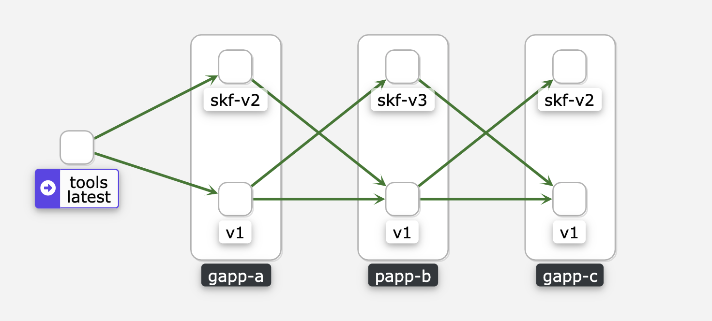

## 基于服务网格的发布泳道
发布泳道的层次: 
- 网络隔离    --> 基础
- 配置代码    --> 可以基于网络来做, 可以妥协
- 数据隔离    --> 可以基于网络来做, 可以妥协

---
## 泳道环境方案
- 基于**服务网格 Istio**的网络隔离/流量分发
- 基于 `Skafflod` 的本地开发流水线

---
## 基于服务网格的网络隔离
1. 每个应用伴随启动一个 Envoy Sidecar.
2. 应用入侵, 每个请求附带 `X-Lane-ID` 首部
   - X-Lane-ID 即 应用版本.
   - HTTP 首部
   - GRPC 首部
3. Envoy Sidecar 负责处理网络流量分发.
    - 启动**多版本**服务, 
    - 服务版本与 **泳道 ID** 对应.
    - 流量分发策略基于不同的 **泳道 ID** 分发到相应版本的服务.

---
## 本地开发流水线 Skafflod
- `Build` : build images with different builders    
- `Deploy` : deploy with kubectl, kustomize or helm .
- `Cleanup` : cleanup manifests and images

---
## Skaffold Pipeline Stages


---
## skafflod 配置
```
apiVersion: skaffold/v2beta14
kind: Config
build:
  artifacts:
  - image: registry.leyantech.com/infra/k8s/skf/skf-gapp-a
    context: .
  local:
    push: true
deploy:
  helm:
    releases:
    - name: skf-gapp-a
      chartPath: ../charts
      namespace: lane-http
      recreatePods: true
      valuesFiles:
      - values.app.yaml
      artifactOverrides:
        image: registry.leyantech.com/infra/k8s/skf/skf-gapp-a
    flags:
      install:
      - --replace
      - --insecure-skip-tls-verify
      upgrade:
      - --force
  kubectl:
    manifests:
    - "vs.yaml"
```

---



- a_v1 --> b_v1 --> c_v1 : 基线环境, 免维护
    - 同生产版本, 生产上线成功后, 自动发布基线版本.
- a_v1 --> b_v3 --> c_v1 : 单应用/多版本泳道
    - `Skafflod` 本地开发, 本地上线, 自动销毁
- a_v2 --> b_v1 --> c_v2 : 多应用/多版本泳道
    - 申请泳道, 上线应用版本.

---
## 演示 demo : http grpc 
为每个请求:
- http 注入 `X-Lane-ID` 首部
- grpc 注入 `X-Lane-ID` 首部

---
## TODO
1. 测试环境 服务网格 环境搭建
2. Virtualservice Operator 开发
3. 开发本地打镜像，去 lain build 改造
4. 发布系统支持，
    - 泳道申请及自动发布, 使用时长/定期回收.
    - 基线版本自动更新，与线上同步(前期可以手动发布)
5. 中间件侵入支持，传输 泳道ID
