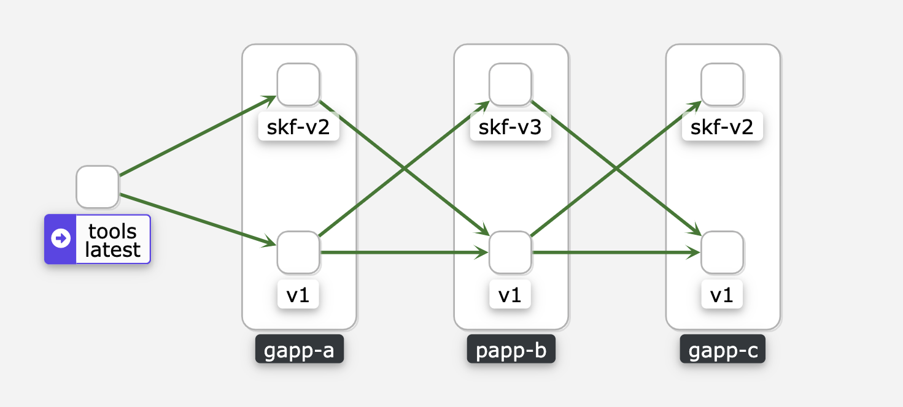

## 发布泳道 Roadmap (草稿)

**此方案为草稿**

发布泳道涉及到两个方面:
1. 应用侧隔离
2. 数据侧隔离

### 应用侧隔离

经过内部评估, 总结出两套可行方案:

1. 在服务注册的 的服务名称 和 tag 中增加泳道相关信息, 应用从 consul 拿到对应泳道中的应用信息, 应用之间 pod to pod 直接访问.

    >> 仅就grpc而言的方案, 需要修改 发布系统, ConsulNameResolver, ConsulRegister:
    >> 
    >> ### 支持 proc 级的个人版本发布
    >> 1. 改造发布系统, 支持每个 developer 在 dev 环境发布自己的个人版本, 区别于目前的一个 proc 只能发一个版本.
    >> 2. 个人版本发布到dev 环境后, 将把自己注册在 gaia-lane.<app>.<proc> service 下, 而不是目前的 gaia.<app>.<proc>  下, 同时通过特定 consul tag 标识该实例是谁发布的.
    >> 
    >> 以上两部将保证服务可以在同一环境并行发布多个版本, 但默认只有主版本(注册在 gaia.<app>.<proc> 下的)生效.
    >> 
    >> ### 支持手动将个人版本划拨到不同的泳道
    >> 这里的泳道, 可以视作和“分组”同义. 划分方式可以是: 通过 consul kv 或其他 consul api, 将一个泳道 id 和若干个 proc 个人版本进行关联.
    >> 
    >> ### 支持泳道相关的 gRPC header 透传
    >> 这和 opentracing header 的透传类似. 假设我们用 `X-Lane` 作为 header name, 那么一旦这个 header 的值确定, 中间件需要保证在服务发起 gRPC 调用时, 将该 header 传递到下游服务. 如果可行, 且没有大危害的话, 我们甚至可以直接基于 opentracing 的 propgation 机制做泳道 id 透传.
    >> 
    >> ### 支持客户端级泳道流量路由
    >> 这部分基于 ConsulNameResolver 和 自定义 grpc LB 实现:
    >> 
    >> 1. ConsulNameResolver 除了维护 gaia.<app>.<proc> 下的服务实例列表外, 还维护 gaia-lane.<app>.<proc> 下的实例列表
    >> 2. 对于不含泳道 id 的请求, 仅把流量发送到 `gaia.<app>.<proc>` 下的服务实例
    >> 3. 对于含泳道 id 的请求, 优先尝试把流量发送到 `gaia-lane.<app>.<proc>` 下的服务实例, 没有时则转发到 `gaia.<app>.<proc>` 下的服务实例. 也就是回退到基线泳道

    详情参考: https://git.leyantech.com/ep/team-tasks/-/issues/99#note_282971

2. 基于 Istio 服务网格做隔离:
    
    流程:
    1. 上线应用新版本, istio 自动注入 Envoy Sidecar
    2. 新版本上线, 会自动增加 VirtualService (执行应用服务所建立的 k8s service), DestinationRule(指定泳道版本) 配置, 来协调流量分发进入新泳道.
        - VirtualService 负责匹配 service name 及 请求头中的 泳道 id, 并转发到 DestinationRule
        - DestinationRule 将请求转发给 pod.
        
    需要做的改动:
    1. 引入 Istio 到测试环境: https://nta-rkube.infra.leyantech.com/c/c-lj64x/monitoring 
        环境已搭建完成.

    2. 应用侧: TODO
        每个请求附带 `X-Lane-ID` 首部, 即 应用版本, 并准发该请求头到下游服务.
        - HTTP 首部
        - GRPC 首部
        
    3. 服务发现有原来 consul 返回 pod ip, 修改为返回 service name : TODO
    
        此处, service name 与 `giai.app.proc` 对应, 其中 proc 名称与 service name 相同, app 与 namespace 相同, service 完整路径为 `serviceName.Namespace`

        因 Istio 本身 VirtualService 无法对多个 CRD 资源做合并 和 排序, 因此, 需要开发独立 Operator 完成此合并工作. 目前已完成 [Virtualservice Operator trafficLabel](https://git.leyantech.com/sre/trafficlabel) 的初步开发.

    4. 发布系统支持，
        - 应用发布模板 chart 更新, 适配 istio 需求, 并增加 VirtualService, DestinationRule 相关配置.
        - 泳道申请及自动发布, 使用时长/定期回收.
        - 基线版本自动更新，与线上同步(前期可以手动发布)

**Tips**:
1. 以上两种方案的可行性待定, **5.27日之前**, 会各自做出基于 Leyan 应用的 Demo, 并再次评估可行性及难易程度.
2. 以上方案, 可能需要结合 开发者本地 cli 或者 IDE 插件, 配合完成开发及发布, 可选方案待定.
    
    目前, 已调研方案:
    1. [NocalHost](https://github.com/nocalhost/nocalhost): 尚在初始阶段, 使用较复杂, 权限管理复杂 不能很好满足需求.
        
        与 IDE 结合的插件, 对开发工作更友好, 但依赖 IDE 生态, 同时需要的开发工作比较多.

    2. [Skaffold](https://github.com/GoogleContainerTools/skaffold)

        使用社区已有工具, 则需要对已有工具做整合或二开, 最好自研工具, 以组合 社区已有工具和功能, 在满足开发需求的同时, 减少开发工作量. 
        
        开发者使用时, 需要 IDE + Cli 端的工作方式, 可能会比较繁琐, 不是特别友好.
        如 Skaffold 组合 [kt-conn](https://github.com/alibaba/kt-connect) 等.

### 数据隔离

Leyan 所使用数据源包含如下中间件:
- Mysql
- Apollo: 如果是独立实例, 则依赖 Mysql.
- Redis
- Kafka

数据隔离需要完成两件事:
1. 数据源隔离
2. 数据迁移Workflow: 数据导入/导出/备份(配额), 以方便用户使用.

#### 数据源隔离

目前, 想到如下实现方案:

1. 基于 Apollo 配置中心的隔离
    
    原理: 在 Apollo 中配置独立的数据源实例, 应用从 Apollo 中拿到的即为 独立的数据实例.

    Apollo 本身 隔离有如下两种方式:
    1. 基于 Apollo cluster , 每个泳道建立独立的 cluster.
    2. 独立的 Apollo 实例, 依赖 Mysql, 隔离性更好.
    
    在 Apollo 完成隔离的前提下, 其他数据源隔离方案:
    - 方案 1: 每条泳道选择所需的数据源, 并生成独立 pod 实例. 
        优势:
        1. 隔离性更好, 以及更容易实现.
        2. 有现成方案 及 代码参考, 见 dwarf.
        
        成本:
        1. 独立数据源可能导致资源浪费.
        2. 整体方案比较笨重.

    - 方案 2: Apollo 中 Redis, MySQL Apollo 配置, 有开发者在独立页面填写, 经过中间程序转换之后, 生成新的地址.
        如: 开发者填写 redis 地址为: `redis://10.0.0.1/1` 经转换后为 `redis://10.0.0.1/2`

        优势:
        1. 无需创建太多数据源实例, 资源使用上更合理.

        成本:
        1. Apollo 中数据源配置需标准化.
        2. 中间转换需要 做独立开发工作.
        3. 可能会导致开发者疑惑, 因此, 最好将数据源呈现在页面上, 屏蔽掉开发者对数据源的感知.
        
    
2. 基于应用层协议侧的网络路由分发隔离.

    类似 Istio 对应用侧网络隔离.

    有如下两种方案:
    1. 开发基于 WASM 的 Istio 插件, 改写目标数据源地址或库地址. 
        开发语言支持 
        - AssemblyScript: 为 TypeScript 子集, 可选.
        - C++: 弃选.
        - Rust: 可选.
        - TinyGO: TinyGo 对 Go 支持不完善, 弃选.

    2. 社区方案 [aeraki](https://github.com/aeraki-framework/aeraki): 国人开源, 尚未成熟, 目前支持 redis, kafka 协议. **推荐**
 
        Aeraki 目标将所有 7 层协议在 Istio 侧支持, 其实现方案为增加 CRD , 在 7 层对目标地址做修改, 实现隔离.

        简易 DEMO: https://git.leyantech.com/ye.bi/lane-demo

#### 数据迁移 Workflow
当数据源隔离之后, 给开发空的数据源不利于开发工作展开 如 Apollo 需要应用相关配置, MySQL 需要数据库/表相关的 schema 及 基本的测试数据, 因此, 需要建立数据导入/导出/备份(配额) 的 Workflow.

**暂定**方案为:
1. Airflow Job 作为 Workflow Engine.
2. 在泳道创建前端, 做相关的封装 及 展示工作: 在开发者创建 泳道时, 配置 导入/出的数据源, 及 备份策略等.

Tips:
1. 此方案只是基于目前现状所做设想, 可能会有更改.
2. TODO:
    [ ] Airflow 环境搭建 及 数据导入导出 job. 
    [ ] 数据传输管道 发布系统封装.

## 汇总
- 应用侧隔离: 

    1. 5.27日前做出基于 Leyan 应用 DEMO, 评估两种方案可行性及难易程度.
    2. 基于 步骤一 方案, 做相关所需 环境建设及 开发改造工作.
    
- 数据侧隔离:

    **待 应用隔离稳定后, 再做相关方案选择与讨论**.

    就目前来看, 可以先基于 Apollo 做物理隔离, 并把相关数据导入导出备份工作流 框架搭建起来, 完善整个 泳道功能. 
    
    之后, 在调研相关 7 层协议相关路由和隔离方案, 目前看 [aeraki](https://github.com/aeraki-framework/aeraki) 较为合理 和 可扩展.

<!-- 
### 使用场景

- a_v1 --> b_v1 --> c_v1 : 基线环境, 免维护
    - 同生产版本, 生产上线成功后, 自动发布基线版本.
- a_v1 --> b_v3 --> c_v1 : 单应用/多版本泳道
    - 本地开发, 本地上线, 自动销毁
- a_v2 --> b_v1 --> c_v2 : 多应用/多版本泳道
    - 申请泳道, 上线应用版本. 

-->
