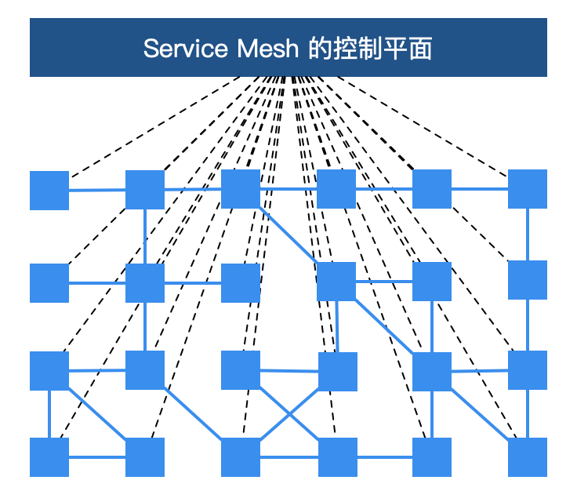

# Service Mesh


1. 什么是服务网格?
2. istio 架构与核心概念
3. istio 流量管理原理
4. 基于 istio 的开发泳道

---
<!-- 
云计算: 以资源为中心. 关注物理设备如何虚拟化,池化,多租化. 典型代表是 计算/存储/网络 三大基础设施的云化.

云原生: 以应用为中心. 基于云环境之上的, 如何让应用更好的适应云环境, 能够在云环境下快速开发和交付应用. 

微服务: 应用的设计和开发. 从设计, 开发的视角描述应用的一种架构或开发模式.

服务网格: 应用的交付与运行时. 服务网格是微服务之间通信的控制器.
-->

服务网格被称为**第二代微服务架构**。

> William Morgan，Buoyant CEO , Linkerd : 
> 
> A service mesh is a dedicated **infrastructure layer** for handling service-to-service communication. It’s responsible for the reliable **delivery of requests** through the complex topology of services that comprise a modern, cloud native application. In practice, the service mesh is typically implemented as an array of **lightweight network proxies** that are deployed alongside application code, **without the application needing to be aware**.
> 

---

传统微服务痛点:
- 侵入性强。想要集成 SDK 的能力，除了需要添加相关依赖，往往还需要在业务代码中增加一部分的代码、或注解、或配置；业务代码与治理层代码界限不清晰。
- 升级成本高, 版本碎片化严重。每次升级都需要业务应用修改 SDK 版本，重新进行功能回归测试，并且对每一台机器进行部署上线，而这对于业务方来说，与业务的快速迭代开发是有冲突的，大多不愿意停下来做这些与业务目标不太相关的事情。由于升级成本高，而中间件却不会停止向前发展的步伐，久而久之，就会导致线上不同服务引用的 SDK 版本不统一、能力参差不齐，造成很难统一治理。
- 中间件演变困难。由于版本碎片化严重，导致中间件向前演进的过程中就需要在代码中兼容各种各样的老版本逻辑，带着 “枷锁” 前行，无法实现快速迭代。
- 内容多、门槛高。Spring Cloud 被称为微服务治理的全家桶，包含大大小小几十个组件，内容相当之多，往往需要几年时间去熟悉其中的关键组件。而要想使用 Spring Cloud 作为完整的治理框架，则需要深入了解其中原理与实现，否则遇到问题还是很难定位。
- 治理功能不全。协议转换支持、多重授权机制、动态请求路由、故障注入、灰度发布等高级功能并没有覆盖到。而这些功能往往是企业大规模落地不可获缺的功能，因此公司往往还需要投入其它人力进行相关功能的自研或者调研其它组件作为补充。

---
服务网格变革:
- 微服务治理与业务逻辑的解耦。
    服务网格把 SDK 中的大部分能力从应用中剥离出来，拆解为独立进程，以 sidecar 的模式进行部署。服务网格通过将服务通信及相关管控功能从业务程序中分离并下沉到基础设施层，使其和业务系统完全解耦，使开发人员更加专注于业务本身

- 异构系统的统一治理。

    不同语言、不同框架的应用和服务，为了能够统一管控这些服务，以往的做法是为每种语言、每种框架都开发一套完整的 SDK，维护成本非常之高，而且给公司的中间件团队带来了很大的挑战。有了服务网格之后，通过将主体的服务治理能力下沉到基础设施，多语言的支持就轻松很多了。只需要提供一个非常轻量级的 SDK，甚至很多情况下都不需要一个单独的 SDK，就可以方便地实现多语言、多协议的统一流量管控、监控等需求。

---
服务网格相对于传统微服务框架，还拥有三大技术优势：
- 可观察性。因为服务网格是一个专用的基础设施层，所有的服务间通信都要通过它，所以它在技术堆栈中处于独特的位置，以便在服务调用级别上提供统一的遥测指标。服务网格捕获诸如来源、目的地、协议、URL、状态码、延迟、持续时间等线路数据。需要指出的是，收集数据仅仅是解决微服务应用程序中可观察性问题的一部分。
- 流量控制。通过 Service Mesh，可以为服务提供智能路由（蓝绿部署、金丝雀发布、A/B test）、超时重试、熔断、故障注入、流量镜像等各种控制能力。
- 安全。当单体架构应用被分解为多个微服务，更多的服务意味着更多的网络流量, 网络就会成为一个重要的攻击面。而服务网格恰恰提供了保护网络调用的能力和基础设施。服务网格的安全相关的好处主要体现在以下三个核心领域：服务的认证、服务间通讯的加密、安全相关策略的强制执行。

---
服务网格带来了巨大变革并且拥有其强大的技术优势，被称为第二代“微服务架构”。然而就像之前说的软件开发没有银弹，传统微服务架构有许多痛点，而服务网格也不例外，也有它的局限性: 
- 增加了复杂度。服务网格将 sidecar 代理和其它组件引入到已经很复杂的分布式环境中，会极大地增加整体链路和操作运维的复杂性。
- 运维人员需要更专业。在容器编排器（如 Kubernetes）上添加 Istio 之类的服务网格，通常需要运维人员成为这两种技术的专家，以便充分使用二者的功能以及定位环境中遇到的问题。
- 延迟。从链路层面来讲，服务网格是一种侵入性的、复杂的技术，可以为系统调用增加显著的延迟。这个延迟是毫秒级别的，但是在特殊业务场景下，这个延迟可能也是难以容忍的。
- 平台的适配。服务网格的侵入性迫使开发人员和运维人员适应高度自治的平台并遵守平台的规则。

---
Service Mesh 实现：
- Istio
- Linkerd
- AWS App Mesh
- SOFA mesh
- kuma
- Gloo Mesh
- OSM, open service mesh

---
# Service Mesh 架构

Service Mesh 的基础设施层主要分为两部分：
- 控制平面
- 数据平面

---



---
控制平面的特点：
- 不直接解析数据包。
- 与控制平面中的代理通信，下发策略和配置。
- 负责网络行为的可视化。
- 通常提供 API 或者命令行工具可用于配置版本化管理，便于持续集成和部署。

---
数据平面的特点：
- 通常是按照**无状态**目标设计的，但实际上为了提高流量转发性能，需要缓存一些数据，因此- 无状态也是有争议的。
- 直接处理入站和出站数据包，转发、路由、健康检查、负载均衡、认证、鉴权、产生监控数据等。
- 对应用来说**透明**，即可以做到无感知部署。

---


---
# Istio 服务网格实现原理

---
## 如何实现一个精简版的服务网格 ?

| 动态配置(控制平面) | 流量转发(数据平面) |
| -- | -- |
| consul + consul-template | Nginx + Iptables |
| Istio | Istio-Proxy(Envoy xDS) |

---
### Pod : 生命周期
- Init Container: 通过 iptables 劫持所有流量到 sidecar
- Sidecar: 讲流量转发到 后端服务.

---
### Admission Webhook: MutatingAdmissionWebhook


mutating webhooks 可以在返回准入响应之前通过创建补丁来修改对象.

---
###  CRD & Envoy xDS
- Virtual Service: 流量路由
- Destination Rule: 将流量路由到目标 pod, 流量策略, tls 等.
- Service Entry: 服务网格外的服务注册到服务网格内.
- Gateway: ingress/egress 控制出入服务网格的流量.

---
```
# 路由
apiVersion: networking.istio.io/v1alpha3
kind: VirtualService
metadata:
  name: reviews.bookinfo
spec:
  hosts:
    - reviews.bookinfo.com
  http:
  - route:
    timeout: 10s
    retries:
      attempts: 3
      perTryTimeout: 2s
    - destination:
        host: reviews
        subset: v1
      weight: 75
    - destination:
        host: reviews
        subset: v2
      weight: 25
```
---
```
# 故障注入: 网络层
  fault:
    delay:
      percentage:
        value: 0.1
      fixedDelay: 5s
```
```
# 流量镜像
  http:
  - route:
    - destination:
        host: httpbin
        subset: v1
      weight: 100
    mirror:
      host: httpbin
      subset: v2
    mirrorPercent: 100
```
---
```
# 负载均衡
apiVersion: networking.istio.io/v1alpha3
kind: DestinationRule
metadata:
  name: my-destination-rule
spec:
  host: my-svc
  trafficPolicy:
    loadBalancer:
      simple: RANDOM
  subsets:
  - name: v1
    labels:
      version: v1
  - name: v2
    labels:
      version: v2
    trafficPolicy:
      loadBalancer:
        simple: ROUND_ROBIN
  - name: v3
    labels:
      version: v3
```
---
```
apiVersion: networking.istio.io/v1alpha3
kind: Gateway
metadata:
  name: ext-host-gwy
spec:
  selector:
    app: my-gateway-controller
  servers:
  - port:
      number: 443
      name: https
      protocol: HTTPS
    hosts:
    - ext-host.example.com
    tls:
      mode: SIMPLE
      credentialName: ext-host-cert
```
---
```
apiVersion: networking.istio.io/v1alpha3
kind: ServiceEntry
metadata:
  name: ext-google
spec:
  hosts:
  - www.google.com
  ports:
  - number: 443
    name: https
    protocol: HTTPS
  location: MESH_EXTERNAL
  resolution: DNS
```

