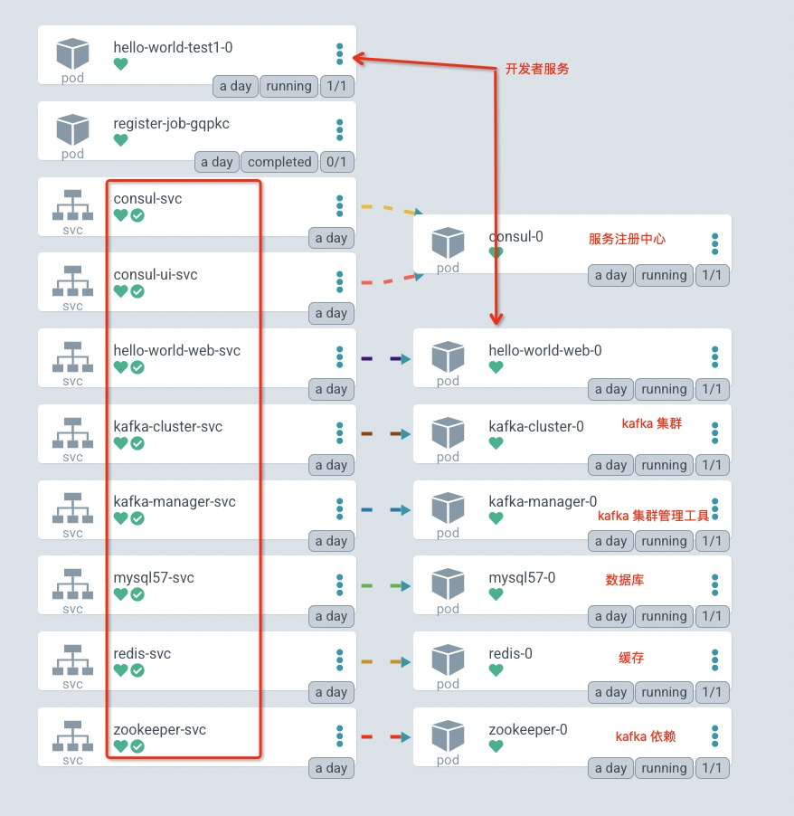
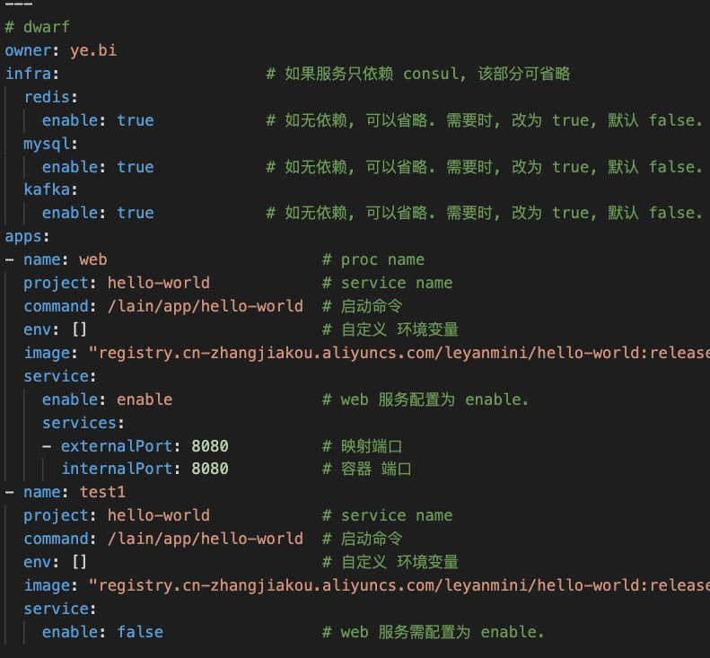
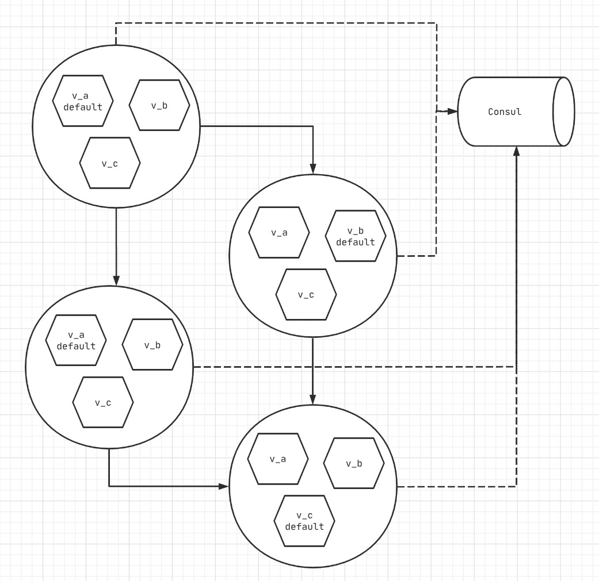

# 目标: 测试环境 的稳定性/可用性/便利性

- 发布泳道: 多版本 通信/发布/数据. 
- [dwarf](https://git.leyantech.com/sre/campion#dwarf) : 创建出一个完全干净的个人开发环境.
- [rancher + ktctl](https://phabricator.leyantech.com/w/infra/sre/rkube/#kt-ctl): 测试便利性. 

---
# Dwarf

依托 ArgoCD 的自动创建 Kubernetes 资源的能力, 通过 git review 流程, 可以创建出完全干净的 个人开发环境, 会创建如下组件:
- `consul`: 服务注册中心, 默认**开启**.
- `mysql`: 数据库, 默认**关闭**. 默认密码为 `123456`.
- `redis`: 缓存, 默认**关闭**. 默认没有密码.
- `kafka`: 消息队列, 默认**关闭**.
    - `kafka-manager`: kafka 集群管理工具, 会**自动**注册新创建的 kafka 集群, 与 kafka 并存. 
    - `zookeeper`: kafka 依赖, 作为服务注册中心, 与 kafka 并存.
- `leneo`: leyan 服务部署模板.

---

---

---
# kt-connect

- 需要 rancher 提供的权限控制, 以免错误的操作 dwarf project 之外的资源.
- 开发需要基本的 kubernetes 操作知识.
- 打通 开发机 与 kubernetes 容器环境的 vpn 网络, 可以在本机访问 podIP, serviceIP, serviceName
- [TODO] 将 dew 环境流量导流到本地, 无需发布, 即可调试程序.

---
# 发布泳道

TODO:
- grpc: 服务注册
- web 服务: 
- redis/mysql/kafka: apollo/本地 apollo
- 改造发布支持/参数/Dwarf

---

---

服务注册:
- 服务注册时, 带 env_id (从 环境变量获取, 方便注入).
  - 带有 env_id = default 标签的服务, 作为上下游访问的默认目标服务.

- 访问服务时, 默认访问具有相同 env_id 的目标服务, 如果没有, 则返回 default 服务.

  实质是获取目标服务 ip 时, 默认获取具有相同 env_id 的服务, 如果不存在则返回 default 服务.

---

发布支持:
- 支持同时发布不同版本的应用: 以 env_id 作为区分, 传参.
  - env_id 的转换.
- 与 dwarf 集合, 看是否能够解决 数据库/存储 相关问题.
